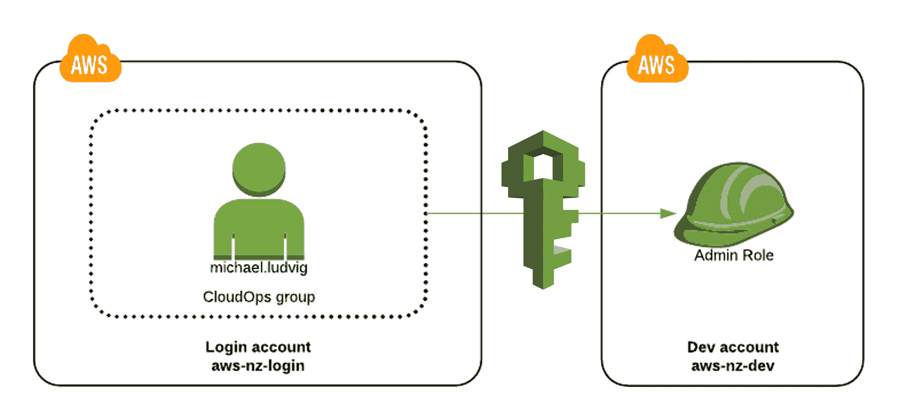
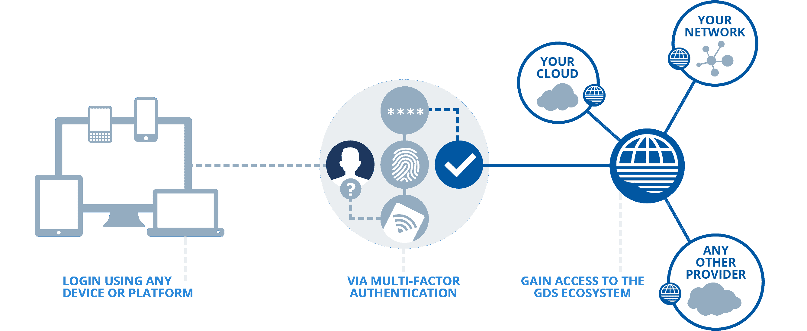

# AWS 中的身份和访问管理(IAM)是什么？

> 原文：<https://www.edureka.co/blog/identity-and-access-management/>

组织必须控制谁有权访问他们的 AWS 资源、哪些资源可用以及授权用户可以执行的操作。AWS IAM 的目的是帮助 IT 管理员管理 [AWS](https://www.edureka.co/aws-certification-training) 用户身份及其对 AWS 资源的不同访问级别。在本文中，我们将按以下顺序了解身份和访问管理(IAM)的功能和工作过程:

*   什么是身份和访问管理？
*   [IAM 特性](#features)
*   [IAM](#working)的工作
*   [身份和访问管理:示例](#example)

## 什么是身份和访问管理？

**AWS 身份和访问管理** (IAM)是一个 web 服务，帮助您安全地控制对 AWS 资源的访问。使用 IAM，您可以控制谁被验证和授权使用资源。

当您第一次创建 AWS 帐户时，您需要一个单一登录身份来访问所有的 [AWS 服务。](https://www.edureka.co/blog/videos/aws-tutorial/)这个身份称为 AWS 帐户 root 用户。您可以通过使用创建帐户时使用的电子邮件 ID 和密码登录来访问它。AWS IAM 有助于执行以下任务:

*   用于设置用户、权限和角色。它允许您**授予对 AWS 平台不同部分的访问权**
*   此外，它使 Amazon Web Services 客户能够在 AWS 中管理用户和用户权限
*   借助 IAM，组织可以集中管理用户、**安全凭证**如访问密钥和权限
*   IAM 使组织能够**创建多个用户**，每个用户都有自己的安全凭证，由单个 AWS 帐户控制和计费
*   IAM 允许用户只做他们工作中需要做的事情

现在你知道什么是 IAM 了，让我们来看看它的一些特性。

## **身份和访问管理功能**

IAM 的一些重要特性包括:

*   **共享访问您的 AWS 帐户**:您可以授予其他人管理和使用您的 AWS 帐户中的资源的权限，而无需共享您的密码或访问密钥。
*   **粒度权限**:您可以对不同的资源授予不同的权限给不同的人。
*   **安全访问 AWS 资源**:您可以使用 IAM 特性为运行在 EC2 实例上的应用程序安全地提供凭证。这些凭据为您的应用程序提供了访问其他 AWS 资源的权限。
*   **多因素认证(MFA)** :您可以为您的帐户和个人用户添加双因素认证，以获得额外的安全性。
*   **身份联盟**:您可以允许已经在其他地方拥有密码的用户
*   **用于保证的身份信息**:您会收到日志记录，其中包含基于 IAM 身份的资源请求者的信息。
*   **PCI DSS 合规性** : IAM 支持商家或服务提供商对信用卡数据的处理、存储和传输，并且已经过验证，符合支付卡行业(PCI)数据安全标准(DSS)。
*   **与许多 AWS 服务集成**:有许多 AWS 服务可以与 IAM 一起工作。
*   **最终一致** : IAM 通过在亚马逊全球数据中心内的多台服务器之间复制数据来实现高可用性。当您请求一些修改时，更改被提交并安全地存储。
*   **免费使用**:当您使用您的 IAM 用户或 AWS STS 临时安全凭证访问其他 AWS 服务时，只有在那时您才需要付费。

现在让我们继续，了解身份和访问管理的工作原理。

## **IAM 的工作**

身份访问和管理提供了控制您的 AWS 帐户的所有授权和认证所需的最佳基础设施。以下是 IAM 基础结构的一些元素:

### **原理**

AWS IAM 中的原则用于对 AWS 资源采取行动。管理 IAM 用户是第一个原则，它允许用户为特定的服务承担角色。您可以支持联合用户允许应用程序访问您当前的 AWS 帐户。

### **请求**

使用 AWS 管理控制台时，API 或 CLI 将自动向 AWS 发送请求。它将指定以下信息:

*   行动被认为是要执行的**原则**
*   基于**资源**执行动作
*   原则信息包括先前已经发出请求的**环境**

### **认证**

这是最常用的原则之一，用于在向 AWS 发送请求时登录 AWS。然而，它也包括像亚马逊 S3 这样的替代服务，允许未知用户的请求。为了从控制台进行身份验证，您需要使用您的登录凭据(如用户名和密码)登录。但是要进行身份验证，您需要向他们提供秘密和访问密钥，以及所需的附加安全信息。

### **授权**

在授权时，从请求中产生的 IAM 值将上下文检查所有匹配的策略，并评估是允许还是拒绝相应的请求。所有策略都作为 [JSON](https://www.edureka.co/blog/what-is-json) 文档存储在 IAM 中，并为其他资源提供指定的权限。 **AWS IAM** 自动检查所有与您所有请求的上下文特别匹配的策略。如果单个操作被拒绝，则 IAM 会拒绝整个请求，并后悔评估其余的操作，这被称为显式拒绝。以下是 IAM 的一些评估逻辑规则:

*   默认情况下，所有请求都会被拒绝
*   默认情况下，显式可以允许重写
*   显式也可以通过允许重写来拒绝重写

### **动作**

自动处理您的授权或未授权请求后，AWS 以请求的形式批准您的操作。这里所有的动作都是由服务定义的，事情可以由资源来完成，比如创建、编辑、删除和查看。为了实现行动原则，我们需要在不影响现有资源的情况下，将所有必需的行动纳入策略。

### **资源**

获得 AWS 批准后，您请求中的所有操作都可以基于您帐户中包含的相关资源来完成。通常，资源被称为实体，它特别存在于服务中。这些**资源服务**可以被定义为一组在每个资源上执行的活动。如果您想要创建一个请求，首先您需要执行不可拒绝的无关动作。

现在让我们举一个例子，更好地理解身份访问管理的概念。

## **身份和访问管理:示例**

为了理解**身份和访问管理(IAM)** 的概念，我们举个例子。假设一个人有一个 3-4 名成员的初创企业，并通过亚马逊托管应用程序。因为这是一个小组织，每个人都可以访问 Amazon，在那里他们可以用自己的 Amazon 帐户配置和执行其他活动。一旦团队规模扩大，每个部门都有一批人，他就不愿意完全访问[亚马逊网络服务](https://www.edureka.co/blog/videos/aws-tutorial/)，因为他们都是员工，数据需要得到保护。在这种情况下，建议创建几个名为 IAM users 的 Amazon web 服务帐户。这里的优势是我们可以控制他们可以在哪个领域工作。

现在，如果团队增长到**4000**人，有各种任务和部门。最好的解决方案是 Amazon 支持目录服务的单点登录。亚马逊提供由基于认证的 **SAML** 支持的服务。当组织中的某个人登录到组织机器时，它不会要求任何凭证。然后，它会连接到亚马逊门户网站，显示允许特定用户使用的服务。使用 IAM 的最大优点是不需要创建多个用户，只需要实现一个简单的登录。

说到这里，我们的文章就到此为止了。我希望您了解什么是 AWS 中的身份和访问管理，以及它是如何工作的。

*如果您已经决定准备 AWS 认证，您应该查看我们关于  [**AWS 认证** 的课程。](https://www.edureka.co/aws-certification-training) 有问题问我们吗？请在“身份和访问管理”的评论部分提到它，我们会回复您。*