# 信息转换:信息动力中心的心脏和灵魂

> 原文：<https://www.edureka.co/blog/informatica-transformations/>

信息转换是存储库对象，它可以读取、修改或传递数据到定义的目标结构，如表格、文件或任何其他需要的目标。一个转换基本上是用来表示一组规则的，这些规则定义了数据流以及数据是如何加载到目标中的。Informatica PowerCenter 提供了多种转换，每种转换服务于一种特定的功能。此外，随着 Informatica 在数据集成平台方面引领当今市场，Informatica 转换成为 ***[Informatica 认证](https://www.edureka.co/informatica)*** 所需的关键概念。

为了更好地理解信息转换，让我们首先理解什么是映射？映射是由一组转换链接在一起的源和目标对象的集合。因此，映射中的转换表示集成服务将在工作流执行期间对数据执行的操作。为了更好地了解工作流，你可以查看我们的博客 [信息教程:工作流管理](https://www.edureka.co/blog/informatica-tutorial)

## **各种 Informatica 变换有哪些？**

信息转换可以主要分为两类。第一个是基于转换之间的连接性(映射中的链接),第二个是基于源和目标之间的总行数的变化。让我们先来看看基于连通性的信息转换。

1)基于连通性的信息变换类型:

*   连接变换。
*   不相关的变换。

在信息学中，那些连接到一个或多个变换的变换称为**连通变换**。

对于每个输入行，当调用一个转换并期望其返回值时，使用连接转换。例如，通过在查找表达式中指定部门 ID，我们可以使用连接查找转换来了解在特定部门工作的每个员工的姓名。

一些主要的连接信息转换是聚合器、路由器、连接器、规格化器等。

那些不与任何其他变换相连的变换称为**不相连变换**。 它们的功能是通过在其他转换中调用它们来使用的，比如表达式转换。这些转换不是映射管道的一部分。

非连接转换仅在特定条件下需要其功能时使用。 例如，作为一名程序员，你希望对数据执行复杂的操作，然而 你不希望使用信息转换，如表达式或过滤转换来执行该操作。在这种情况下，您可以使用代码创建一个外部 DLL 或 UNIX 共享库来执行操作，并在外部过程转换中调用它们。

有 3 种信息转换，即在有效映射(集成服务可以执行的映射)中可以不连接的外部过程、查找和存储过程。

2)基于行数变化的信息转换类型

*   主动转换
*   被动转换

**主动变换**:–主动变换可以执行以下任何动作:

*   更改通过转换的行数:例如，过滤转换是活动的，因为它删除了不符合过滤条件的行。
*   改变事务边界:事务边界是在调用提交之前或两次提交调用之间包围所有事务的边界。例如，在事务操作期间，用户认为在某些事务之后需要提交，并调用提交命令来创建保存点，并且通过这样做，用户改变了默认的事务边界。默认情况下，事务边界位于文件开始到自动提交点或 EOF 之间。
*   更改 rowtype 属性:Rowtype 属性是一种记录类型，表示表中的一行。该记录可以存储从表中选择的整行数据，或者从指针或指针变量中提取的整行数据。例如，更新策略转换将 rowstype 标记为 0 表示插入值，1 表示更新，2 表示删除，3 表示拒绝。
*   聚合器、过滤器、连接器、规格化器等。是主动转型的几个例子。

**被动转换**:被动转换是满足所有这些条件的转换:

*   变换前后的行数相同。
*   维护交易边界。
*   维护行类型属性。
*   Expression，ExternalProcedure，HTTP 等。是被动转变的几个例子。

在被动转换中，不创建新行，或者删除现有行。

你一定想知道如果被动转换不改变行数，为什么要使用被动转换。它们通常用于更新值，从共享库中调用外部过程，以及定义 maplets 的输入和输出。maplet 是映射中仅有的转换的集合。例如，对于学生数据库，我们希望将 marks 列的值更新为 percentile 而不是 percentile，这可以通过使用表达式转换来完成，该转换将转换相同列中的值并进行更新，从而在转换后保持总行数相同。

如果一个转换被用作被动转换，那么它以后不能被用作主动转换，这没有限制。类似地，根据需要，未连接的转换可以用作连接的转换。所有可能的组合都可以在这些类别之间形成，这就是信息转换的魔力。在这篇博客的后面，你会对一个转换可能属于的类型有更好的了解。

现在我们已经了解了各种类型的信息转换，让我们开始探索它们。 以下是几种主要的信息转换类型:

| **变身** | **式** | **描述** |
| 聚合器 | 主动连接 | 执行聚合计算。 |
| 表情 | 无源连接 | 计算一个值。 |
| Java | 主动连接或被动连接 | 执行用 Java 编写的用户逻辑。用户逻辑的字节码存储在仓库中 |
| 细木工 | 主动连接 | 连接来自不同数据库或平面文件系统的数据。 |
| 查找 | 主动连接或被动连接或主动未连接或被动未连接 | 从平面文件、关系表、视图或同义词中查找并返回数据。 |
| 规格化器 | 主动连接 | 在管道中用于规范化来自关系或平面文件源的数据。 |
| 排名 | 主动连接 | 将记录限制在顶部或底部范围。 |
| 路由器 | 主动连接 | 根据组条件将数据路由到多个转换中。 |
| SQL | 主动连接或被动连接 | 对数据库执行 SQL 查询。 |
| 工会 | 主动连接 | 合并来自不同数据库或平面文件系统的数据。 |
| XML 生成器 | 主动连接 | 从一个或多个输入端口读取数据，并通过单个输出端口输出 XML。 |
| XML 解析器 | 主动连接 | 从一个输入端口读取 XML，并将数据输出到一个或多个输出端口。 |
| XML 源限定符 | 主动连接 | 表示集成服务在运行会话时从 XML 源读取的行。 |

现在让我们开始一个接一个地看这些转换。

## **聚合器转换**

聚合器转换是一种主动的连接转换。这种 Informatica 转换对于执行诸如平均值和总和之类的计算(主要是对多行或多组执行计算)非常有用。例如，计算每天的总销售额或计算月销售额或年销售额的平均值。聚合函数，如 AVG、FIRST、COUNT、PERCENTILE、MAX、SUM 等。，可用于聚合转换。

## **查找转换**

查找转换是最流行和最广泛使用的信息转换。根据用户的要求，查找转换可以用作连接或不连接的转换，也可以用作主动或被动转换。  I t 主要用于从一个源、源限定词或目标中查找详细信息，以获得相关的所需数据。您还可以查找“平面文件”、“关系表”、“视图”或“同义词”。一个映射中可以使用多个查找转换。

使用以下类型的端口(信息传输的逻辑点)创建查找转换:

*   输入端口(I)
*   输出端口(O)
*   查找端口(L)
*   返回端口(R)(仅在未连接查找的情况下)

**连通与未连通的区别查找转换:**

*   连接查找直接从映射管道接收输入值，而未连接查找从另一个转换的查找 表达式接收值。Informatica 中的映射可能包含连接在一起的源、转换和目标，它们被视为一个管道。
*   连接查找从同一行返回多列，因为它们有多个返回端口，而 s 未连接查找只有一个返回端口，从每行返回一列。例如，如果我们在员工数据库中使用一个特定部门 id 的关联查找作为参数，我们可以获得与该部门员工相关的所有详细信息，如他们的姓名、员工 ID 号、地址等。，而对于不相关的查找，我们只能获得雇员的一个属性，如他们的姓名或雇员 Id 号或用户指定的任何属性。
*   连接查找缓存所有查找列，而未连接查找仅缓存查找输出和查找条件。
*   连接查找支持用户定义的默认值，而非连接查找不支持用户定义的值。例如，如果您希望在查找后将某一列的所有值都更改为 NULL，则可以在查找表达式中将这些列的默认值设置为 NULL。然而，在未连接查找的情况下，该特征是不可能的。

假设从一个客户数据库中，我希望了解拥有一张以上未取消发票的客户的详细信息。为了获得这些数据，我们可以使用查找转换。

步骤如下。

1.  首先将发票表作为源加载到映射设计器中。如果您不清楚如何将源数据加载到设计器中，[单击此处](https://www.edureka.co/blog/informatica-tutorial)。 
2.  现在让我们过滤掉未取消的发票。为此，为源限定符创建一个名为 **fil_ODS_CUSTOMER_ACTIVE** 的新过滤器，其属性为 **NOT (ISNULL (DATE_CLOSED))和 CANCELED = 0。** 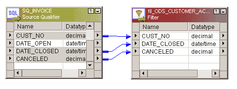
3.  现在在设计器中添加一个查找转换，如下所示，名称为**lkp _ CUSTOMER**: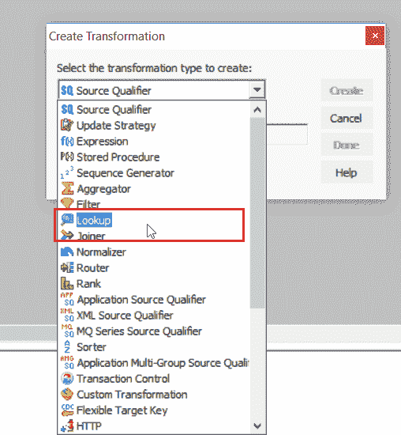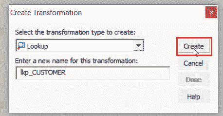
4.  将查找表指定为客户表。 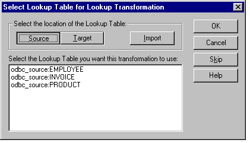 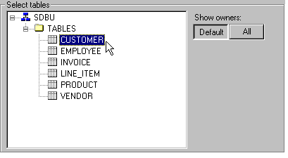
5.  双击  **lkp_CUSTOMER** 的标题，打开编辑菜单。在条件页签下设置查找条件为**CUST _ ID = CUST _ 编号** 
6.  在属性选项卡中的将连接信息更改为 **$Source** 并点击 **OK** 保存转换:
7.  将 **lkp_CUSTOMER** 端口链接到 **ODS_CUSTOMER_ACTIVE** 端口以完成所需的转换，其中 **ODS_CUSTOMER_ACTIVE** 是所需的目标文件: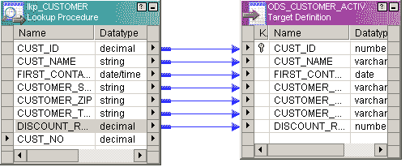
8.  包括查找转换的最终图标地图应该如下:

## **表情变换**

表达式转换是一种被动的、关联的信息转换。表达式转换用于按行操作。对于您希望在单个记录上执行的任何类型的操作，请使用表达式转换。表达式转换接受按行排列的数据，对其进行操作，并将其传递给目标。例如，计算每种产品的折扣，或者连接名字和姓氏，或者将日期转换为字符串字段。

## **细木工改造**

The Joiner transformation is an Active and Connected Informatica transformation used to join two heterogeneous sources. The joiner transformation joins sources based on a specified condition that matches one or more pairs of columns between the two sources. The two input pipelines include a master and a detail pipeline or branch. To join more than two sources, you need to join the output of the joiner transformation with another source. To join n number of sources in a mapping, you need n-1 joiner transformations. The Joiner transformation supports the following types of joins:

*   正常
*   主外
*   细节外部
*   全外

**Normal** join discards all the rows of data from the master and detail source that do not match, based on the condition.**Master outer** joins discards all the unmatched rows from the master source and keeps all the rows from the detail source and the matching rows from the master source.**Detail oute**r join keeps all rows of data from the master source and the matching rows from the detail source. It discards the unmatched rows from the detail source.**Full outer** join keeps all rows of data from both the master and detail sources.

我们不能用一个连接器连接两个以上的源。为了连接三个源，我们需要两个连接转换。

比方说，我们想使用 Joiner 连接三个表——员工、部门和地点。我们需要两个木匠。Joiner-1 将连接员工和部门，Joiner-2 将连接 Joiner-1 和 Locations 表的输出。

步骤如下:

1.  将三个源引入映射设计器。 
2.  使用 Department_ID 创建 Joiner -1 来连接员工和部门。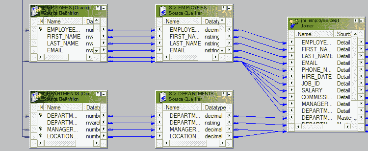
3.  创建下一个加入者，加入者-2。从 Joiner-1 获取输出，从 Locations 表获取端口，并将它们带到 Joiner-2。使用 Location_ID 连接这两个数据源。 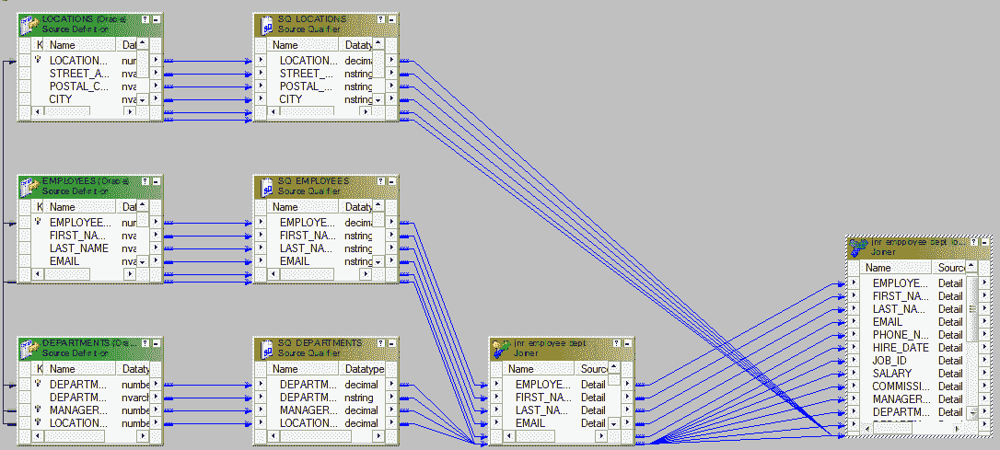
4.  最后一步是将所需的端口从 Joiner-2 发送到目标，或者通过表达式转换发送到目标表。 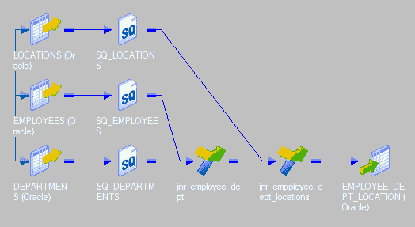

## **工会改造**

联合变换是一种主动的、关联的信息变换。它用于将来自各种流或管道的多个数据集合并成一个数据集。这种 Informatica 转换的工作方式类似于 SQL 中的 UNION ALL 命令，但是它不会删除任何重复的行。建议使用聚合器来删除目标中不需要的重复项。

## **规格化器变换**

规格化器 变换是一种主动的、关联的信息变换。它是使用最广泛的信息转换之一，主要用于 COBOL 数据源，其中大部分时间数据以非规范化格式存储。此外，规格化转换可用于从一行数据创建多行。

让我们尝试从平面文件/Cobol 源加载一个逗号分隔的数据平面文件。

步骤如下:

1.  首先加载商店名称和季度收入的商店(平面文件: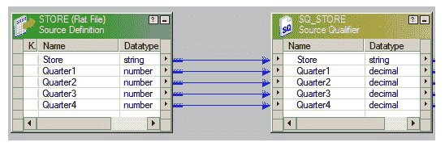
2.  创建一个名为**NRM _ 商店 _ 支出**的新规格化转换，具有两个端口商店和季度(重复 4 次，因为我们有 4 个季度的数据)，如下所示:
3.  端口选项卡应如下所示: 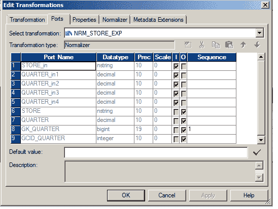
4.  复制/链接以下各列，并连接到规格化器转换。 存储 四分之一 1 四分之一 2 四分之一 3 四分之一 4 映射应该如下: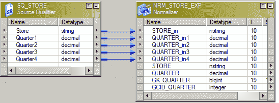
5.  用 **exp_STORE** 创建一个新的表达式转换。复制/链接以下列并连接到表达式转换，如下所示: 商店 季度GK _ 季度GCID _ 季度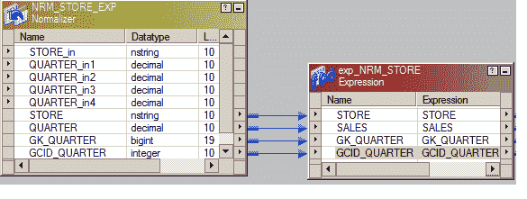
6.  将表达式链接到最终目标，使用标准化转换完成映射。

## **XML 转换**

XML 转换是一种主动的、相互关联的信息转换。在信息转换中，XML 转换主要用于源文件是 XML 类型或者数据是 XML 类型的情况。XML 转换主要可以分为三种类型:

*   XML 源限定符转换。
*   XML 解析器转换。
*   XML 生成器转换。

**XML 源限定符** **转换** : XML 源限定符是一个主动连接的转换。XML 源限定符仅用于 XML 源定义。它表示 Informatica 服务器在使用 XML 源执行会话时读取的数据元素。XML 源限定符对于源中的每一列都有一个输入或输出端口。如果从映射中删除 XML 源定义，设计器也会删除相应的 XML 源限定符转换。

**XML 解析器转换:** XML 解析器转换是一种主动连接的转换。XML 解析器转换用于提取管道中的 XML，然后将其传递给目标。XML 是从源系统(如文件或数据库)中提取的。XML 解析器转换从单个输入端口读取 XML 数据，并将数据写入一个或多个输出端口。

**XML Generator 转换:** XML Generator 是一种主动连接的转换。XML 生成器转换用于在管道内创建 XML。XML 生成器转换从一个或多个输入端口读取数据，并通过单个输出端口输出 XML。

## **等级转换**

秩变换是一种主动的、连通的变换。这是一个信息转换，帮助您选择数据的顶部或底部排序。例如，选择销售量非常高的前 10 个地区或选择 10 种价格最低的产品。

假设您希望将我的员工数据库中的第一条和最后一条记录加载到目标表中。这背后的想法是给记录添加一个序列号，然后从记录中取出前 1 个等级和后 1 个等级。

1.  将端口从源限定符拖放到两个等级转换中。
2.  创建起始值为 1 的可重用序列生成器，并将下一个值连接到两个等级转换。
3.  按如下方式设置等级属性。新添加的序列端口应该被选作秩端口。无需选择任何端口作为按端口分组。rank–1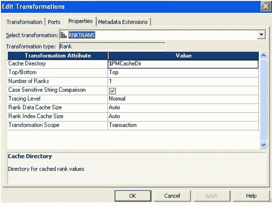
4.  Rank–2
5.  制作目标的两个实例。 连接输出端口到目标。

## **路由器改造**

路由器是一个主动连接的转变。它类似于过滤器转换。唯一的区别是，过滤转换会丢弃不符合条件的数据，而路由器可以选择捕获不符合条件的数据。测试多个条件是有用的。它有输入、输出和默认组。

假设您希望分离一个表的奇数和偶数记录，这可以通过使用路由器转换来实现。

这个想法是给记录添加一个序列号，然后将记录号除以 2。如果它是可分的，那么把它移到偶数目标，如果不是，那么把它移到奇数目标。

1.  拖动源并连接到表达式转换。
2.  将序列生成器的下一个值添加到表达式转换中。
3.  在表达式转换中制作两个端口，一个是“奇数”，另一个是“偶数”。
4.  写出如下表达式 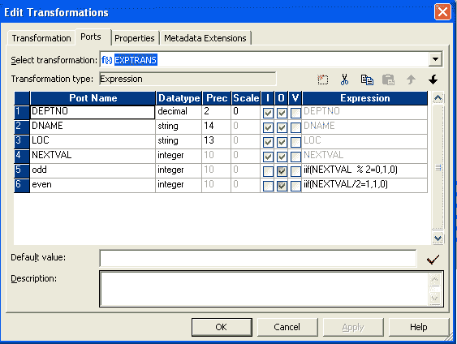
5.  连接路由器转换为表达式。
6.  使两个组在路由器下转换。
7.  给出条件如下图 
8.  然后把这两个小组派往不同的目标。这是整个流程。

我希望这个 Informatica 转换博客有助于您理解各种 Informatica 转换，并激发您学习更多 Informatica 知识的兴趣。

如果你觉得这个博客很有帮助，你也可以看看我们的 Informatica 教程博客系列[什么是 Informatica:Informatica power center 的初学者教程](https://www.edureka.co/blog/what-is-informatica/)和 [Informatica 教程:理解 Informatica‘Inside Out’](https://www.edureka.co/blog/informatica-tutorial)。如果你正在寻找 Informatica 认证的细节，你可以查看我们的博客 [Informatica 认证:所有需要知道的事情](https://www.edureka.co/blog/informatica-certification-all-there-is-to-know/)。

如果你已经决定以信息学为职业，我会推荐你为什么不看看我们的[信息学培训](https://www.edureka.co/informatica)课程页面。Edureka 的 Informatica 认证培训将通过现场讲师指导课程和使用真实案例的实践培训，使您成为 Informatica 专家。