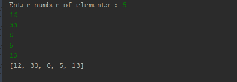

# 如何在 Python 中输入列表？

> 原文：<https://www.edureka.co/blog/input-a-list-in-python/>

有时在用 Python 编码时，您需要将一个列表作为输入。虽然这一开始听起来很简单，但对于初学者来说，这通常被认为是一项复杂的任务。本文将告诉你如何在 [Python](https://www.edureka.co/blog/python-tutorial/) 中输入列表。

本文将涉及以下几点:

*   [在 Python 中输入列表](#InputaListinPython)
*   [在 Python 中接受一列数字作为输入](#AcceptalistofnumberasaninputinPython)
*   [接受来自用户的字符串列表](#AcceptaListofStringsfromtheUser)
*   [例题](#Examples)

那么让我们开始吧，

## **在 Python 中输入列表**

您可能已经知道，为了在 Python 中接受来自用户的输入，我们可以使用 input()函数。使用时，它使程序员能够接受一个字符串、整数甚至一个字符作为用户的输入。但是在接受列表作为输入时，我们遵循的方法略有不同。

这篇如何在 Python 中输入列表的文章，将解决主要的关注点

**了解我们在顶级城市/国家的 Python 培训**

| **印度** | **美国** | **其他城市/国家** |
| [班加罗尔](https://www.edureka.co/python-programming-certification-training-bangalore) | [纽约](https://www.edureka.co/python-programming-certification-training-new-york-city) | [英国](https://www.edureka.co/python-programming-certification-training-uk) |
| [海德拉巴](https://www.edureka.co/python-programming-certification-training-hyderabad) | [芝加哥](https://www.edureka.co/python-programming-certification-training-chicago) | 伦敦 |
| [德里](https://www.edureka.co/python-programming-certification-training-delhi) | 亚特兰大 | [加拿大](https://www.edureka.co/python-programming-certification-training-canada) |
| [钦奈](https://www.edureka.co/python-programming-certification-training-chennai) | [休斯顿](https://www.edureka.co/python-programming-certification-training-houston) | [多伦多](https://www.edureka.co/python-programming-certification-training-toronto) |
| [孟买](https://www.edureka.co/python-programming-certification-training-mumbai) | 洛杉矶 | [澳大利亚](https://www.edureka.co/python-programming-certification-training-australia) |
| [浦那](https://www.edureka.co/python-programming-certification-training-pune) | [波士顿](https://www.edureka.co/python-programming-certification-training-boston) | 阿联酋 |
| 加尔各答 | [迈阿密](https://www.edureka.co/python-programming-certification-training-miami) | [迪拜](https://www.edureka.co/python-programming-certification-training-dubai) |
| 艾哈迈达巴德 | [旧金山](https://www.edureka.co/python-programming-certification-training-san-francisco) | [菲律宾](https://www.edureka.co/python-programming-certification-training-philippines) |

## **在 Python 中接受一列数字作为输入**

看看下面的示例程序，它接受一列数字作为 Python 中的输入。

```
input_string = input("Enter a list element separated by space ")
list  = input_string.split()
print("Calculating sum of element of input list")
sum = 0
for num in list:
    sum += int (num)
print("Sum = ",sum)
```

当上面的程序运行时，输出将如下所示。

**输出**

输入由空格 2 4 6 9 分隔的列表元素

计算输入列表元素的总和

总和= 20

**分析**

现在让我们分解这个程序，看看它背后的工作原理。

1.  正如您已经知道的，每当我们在 Python 中使用 input() [函数时，它都会将用户输入转换成一个字符串。因此，在上面的程序中，我们从用户那里接受了一个字符串形式的列表元素，用空格分隔。](https://www.edureka.co/blog/python-functions)
2.  这里需要注意的一点是，您也可以接受由逗号(，)分隔的字符串。但是在这种情况下，您需要使用 split()函数，以便在 Python 程序中传递参数和分隔符。
3.  如果仔细观察，您会发现我们使用了函数 input_string.split()来拆分用户输入的由空格分隔的字符串，并将它们转换为要添加到列表中的单个元素。
4.  我们还利用了循环的[并将每个元素转换成一个整数来计算其总和。](https://www.edureka.co/blog/loops-in-python/)

进入本文的下一个主题，让我们看看如何在 python 中输入一个包含字符串的列表，

## **接受来自用户的字符串列表**

与上面的程序类似，我们能够用 Python 创建一个程序来接受用户的字符串列表。为了更好地理解这一点，请看下面的例子。

```
input_string = input("Enter family members separated by comma ")
family_list  = input_string.split(",")
print("Printing all family member names")
for name in family_list:
    print(name)
```

当上面的程序运行时，**输出**看起来像这样。

输入用逗号分隔的家庭成员:朱利叶斯、马克、约翰

打印所有家庭成员的姓名

Juluis

标记

约翰

**分析**

让我们把上面的程序分解成指针，更好地理解它。

1.  与前面的例子类似，我们从用户那里接受一个输入列表，以逗号分隔的字符串的形式。
2.  我们使用了 input_string.split("，")函数来拆分由逗号分隔的字符串，并将其转换为程序中使用的字符串列表。
3.  我们使用了一个 for 循环，并按顺序打印出所有的姓氏，正如您在上面共享的输出中所看到的。

接下来让我们从编程的角度来看看这个概念是如何发展的，

**例题**

让我们看几个其他的例子来理解如何在 Python 中输入一个列表。

#### **例 1**

```
# creating an empty list
lst = []
# number of elemetns as input
n = int(input("Enter number of elements : "))
# iterating till the range
for i in range(0, n):
            ele = int(input())
            lst.append(ele) # adding the element
print(lst)
```

**输出**



让我们看下一个例子，

#### **例 2**

```
# try block to handle the exception 
try:
	my_list = [] 	
	while True: 
		my_list.append(int(input())) 		
# if input is not-integer, just print the list 
except: 
	print(my_list)
```

**输出**

****

#### **例 3**

```
# number of elements
n = int(input("Enter number of elements : "))
# Below line read inputs from user using map() function
a = list(map(int,input("nEnter the numbers : ").strip().split()))[:n]
print("nList is - ", a)
```

这将是本文的最后一个例子，

#### **例 4**

```
lst = [ ]
n = int(input("Enter number of elements : "))
for i in range(0, n):
ele = [input(), int(input())]
lst.append(ele)
print(lst)
```

**输出**

****

伙计们，这就把我们带到了这篇关于如何用 Python 输入列表的文章的结尾。

*要深入了解 Python 及其各种应用，您可以立即注册参加在线直播的 [Python 培训](https://www.edureka.co/python-programming-certification-training)，该培训提供全天候支持和终身访问。*

*有问题吗？在文章的评论部分提到它们，我们会回复你或者加入我们的 [Python 大师课程](https://www.edureka.co/masters-program/python-developer-training)。*