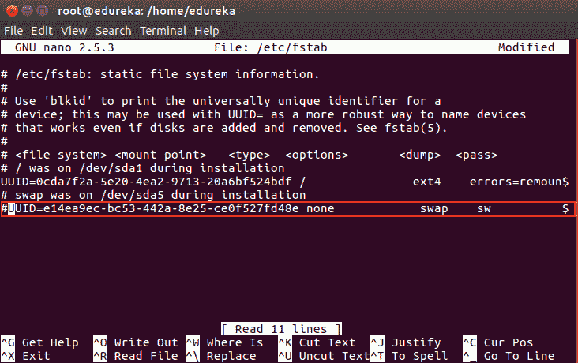
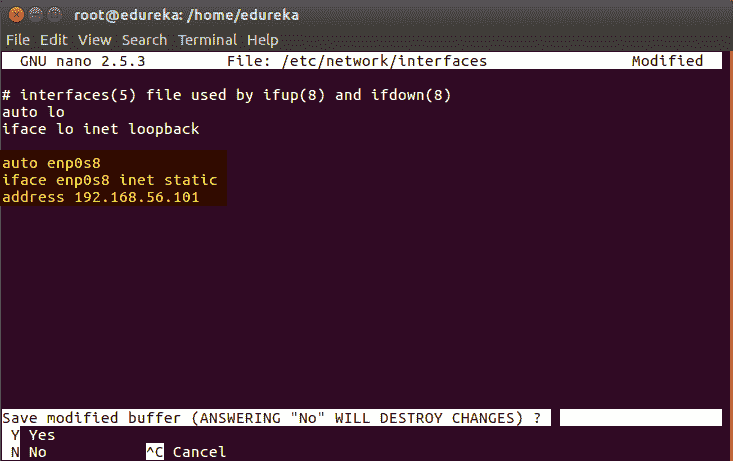
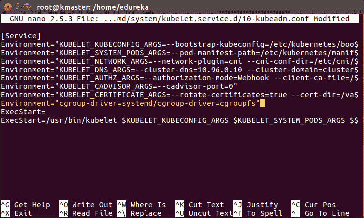
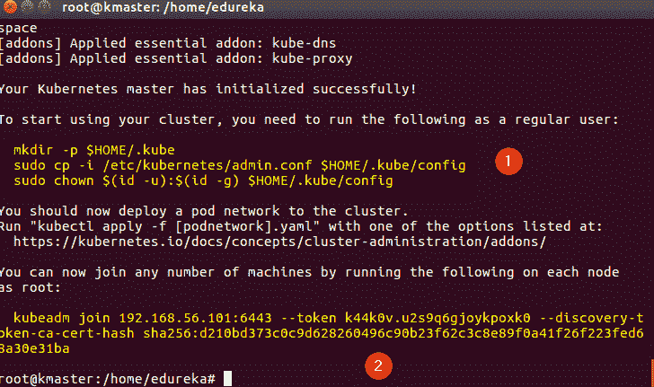
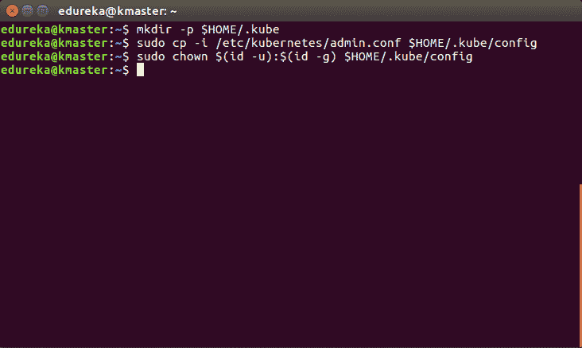
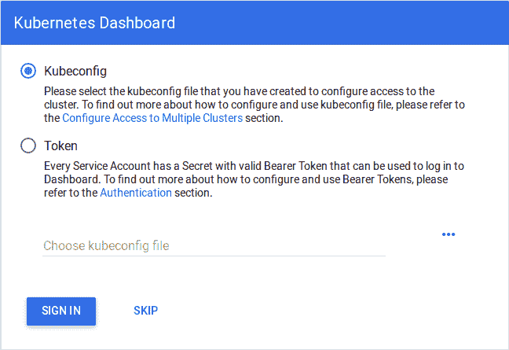
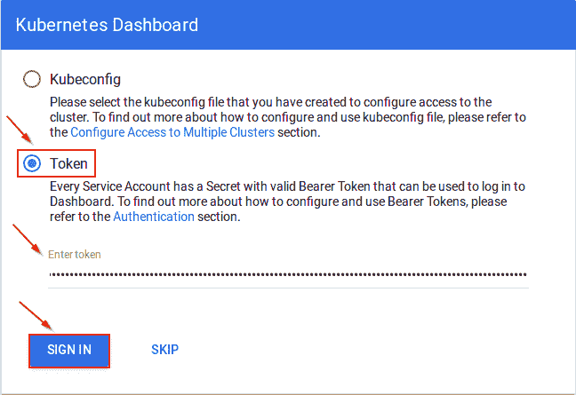
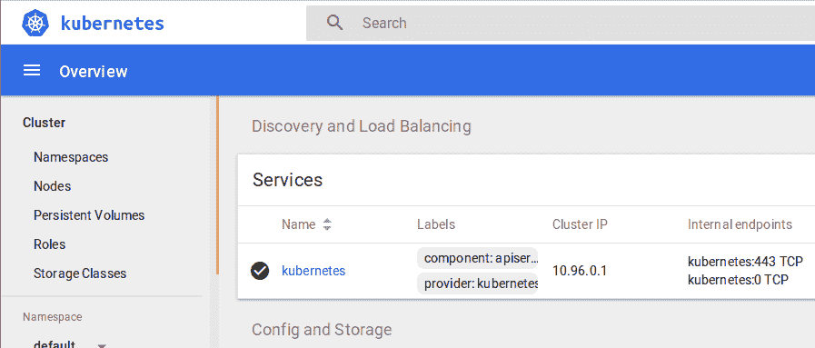
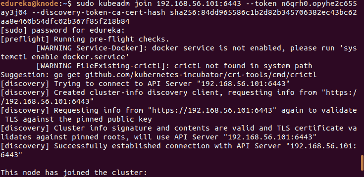

# 如何在 Ubuntu 16.04 上安装 Kubernetes 集群

> 原文：<https://www.edureka.co/blog/install-kubernetes-on-ubuntu>

迈向 ***[Kubernetes 课程的第一步](https://www.edureka.co/kubernetes-certification)*** 就是安装 Kubernetes。这篇博客是在 Ubuntu 虚拟机上安装 Kubernetes 的分步指南。这里，一个虚拟机将作为主虚拟机，另一个虚拟机将作为节点。然后，您可以复制相同的步骤，将 Kubernetes 集群部署到您的 prod 上。

***注*** *:对于此次安装，我们推荐一个新鲜的 Ubuntu 16.04 镜像，因为 Kubernetes 会占用大量资源。如果您的 **安装在任何时候** 失败，请在一个新的虚拟机中从头执行所有提到的步骤，因为调试会花费更长的时间。*

要安装 Kubernetes，您必须努力遵循安装过程中的三个阶段:

1.  [安装 Kubernetes](#KubernetesInstallationPreRequisites) 的先决条件
2.  [设置 Kubernetes 环境](#SetupKubernetesEnvironment)
3.  [安装 Kubeadm，Kubelet，kube CTL](#InstallingKubeadmKubeletKubectl)
4.  [从主](#StartingKubernetesCluster)启动 Kubernetes 集群
5.  [获取节点加入集群](#NodesJoiningKubeCluster)

## **安装必备**

由于我们正在处理虚拟机，我们建议对虚拟机进行以下设置:-

*主人* :

*   2 GB 内存
*   2 个 CPU 核心

*/节点* :

*   1 GB 内存
*   1 个 CPU 核心

到目前为止，我假设您有 2 个普通的 Ubuntu 虚拟机导入到您的 Oracle Virtual Box 中。所以，我会继续安装程序。

## **预安装步骤&从机(安装 Kubernetes)**

以下步骤必须在主机器和节点机器上执行。让我们称主人为“ *kmaster* ，称节点为“ *knode* ”。

首先，以“sudo”用户身份登录，因为以下命令需要使用“sudo”权限来执行。然后，更新您的“apt-get”存储库。

```
$ sudo su
# apt-get update
```

**注意**:以‘sudo’用户身份登录后，注意你的 shell 符号会从“$”变成“#”。

### **关闭交换空间**

接下来，我们必须关闭交换空间，否则 Kubernetes 会开始抛出随机错误。之后，您需要打开“fstab”文件并注释掉提到交换分区的那一行。

```
# swapoff -a
# nano /etc/fstab
```



然后按“Ctrl+X”，再按“Y”，然后按“Enter”保存文件。

### **更新主机名**

要更改两台机器的主机名，运行下面的命令打开文件，然后将主机器重命名为‘kmaster’，将节点机器重命名为‘knode’。

```
# nano /etc/hostname
```


然后按“Ctrl+X”，再按“Y”，然后按“Enter”保存文件。

### **用主机的 IP 更新主机文件&节点**

在两台机器上运行以下命令，记下每台机器的 IP 地址。

```
# ifconfig
```

从上述命令的输出中记下 IP 地址。要复制的 IP 地址应该在“enp0s8”下，如下图所示。


现在转到主节点和节点上的“hosts”文件，添加一个条目，指定它们各自的 IP 地址以及它们的名称“kmaster”和“knode”。这用于在集群中引用它们。在两台机器上，它应该看起来像下面的截图。

```
# nano /etc/hosts
```


然后按“Ctrl+X”，再按“Y”，然后按“Enter”保存文件。

### **设置静态 IP 地址**

接下来，我们将把上面使用的 IP 地址设为虚拟机的静态地址。我们可以通过修改网络接口文件来做到这一点。运行以下命令打开文件:

```
# nano /etc/network/interfaces
```

现在在文件中输入以下几行。

```
auto enp0s8
iface enp0s8 inet static
address <*IP-Address-Of-VM*>
```

它看起来会像下面的截图。



然后按“Ctrl+X”，再按“Y”，然后按“Enter”保存文件。

之后，重启你的机器。

### **安装 OpenSSH-服务器**

现在我们必须安装 openshh-server。运行以下命令:

```
# sudo apt-get install openssh-server  
```

### **安装码头工人**

现在我们必须安装 Docker，因为 Docker 映像将用于管理集群中的容器。运行以下命令:

```
# sudo su
# apt-get update 
# apt-get install -y docker.io
```

接下来我们必须安装这三个基本组件来建立 Kubernetes 环境:kubeadm、kubectl 和 kubelet。

在安装 Kubernetes 环境之前，运行以下命令。

```
# apt-get update && apt-get install -y apt-transport-https curl
# curl -s https://packages.cloud.google.com/apt/doc/apt-key.gpg | apt-key add -
# cat <<EOF >/etc/apt/sources.list.d/kubernetes.list
deb http://apt.kubernetes.io/ kubernetes-xenial main
EOF
# apt-get update
```

## **安装 kubeadm、Kubelet 和 Kubectl**

现在是安装 3 个基本组件的时候了。 ***Kubelet*** 是 Kubernetes 中最低级的组件。它负责在一台单独的机器上运行什么。 ***Kuebadm*** 用于管理 Kubernetes 集群。 ***Kubectl*** 用于控制集群内部各个节点上的配置。

```
# apt-get install -y kubelet kubeadm kubectl 
```

### **更新 Kubernetes 配置**

接下来，我们将更改 Kubernetes 的配置文件。运行以下命令:

```
# nano /etc/systemd/system/kubelet.service.d/10-kubeadm.conf
```

这将打开一个文本编辑器，在最后一个“环境变量”后输入下面一行:

```
Environment=”cgroup-driver=systemd/cgroup-driver=cgroupfs” 
```



现在按 Ctrl+X，再按 Y，再按回车键保存。

***瞧！*** 您现在已经成功地在两台机器上安装了 Kubernetes！

到目前为止，只设置了 Kubernetes 环境。但是现在，是时候完全安装 Kubernetes 了，进入接下来的两个阶段，我们将在两台机器上分别设置配置。

## **步骤仅针对 Kubernetes 大师 VM (kmaster)**

***注意*** :这些步骤只会在主节点(kmaster VM)上执行。

**步骤 1** :我们现在将从主机器上启动我们的 Kubernetes 集群。运行以下命令:

```
# kubeadm init --apiserver-advertise-address=<ip-address-of-kmaster-vm> --pod-network-cidr=192.168.0.0/16
```

1.  您将得到下面的输出。标记为(1)的命令以非 root 用户身份执行。这将使您能够从 CLI 使用 kubectl
2.  标记为(2)的命令也应保存以备将来使用。这将用于将节点加入您的集群

****

**第二步**:如前所述，以非 root 用户的身份运行上面输出的命令

```
$ mkdir -p $HOME/.kube
$ sudo cp -i /etc/kubernetes/admin.conf $HOME/.kube/config
$ sudo chown $(id -u):$(id -g) $HOME/.kube/config
```

应该是这样的:



要验证 kubectl 是否在工作，运行以下命令:

```
$ kubectl get pods -o wide --all-namespaces
```

****

**第三步**:你会从前面的命令中注意到，所有的 pod 都在运行，只有一个除外:“kube-dns”。为了解决这个问题，我们将安装一个 pod 网络。要安装 CALICO pod 网络，请运行以下命令:

```
$ kubectl apply -f https://docs.projectcalico.org/v3.0/getting-started/kubernetes/installation/hosted/kubeadm/1.7/calico.yaml 
```

一段时间后，您会注意到所有 pod 都转换到运行状态

****

**第四步**:接下来，我们将安装仪表板。要安装仪表板，请运行以下命令:

```
$ kubectl create -f https://raw.githubusercontent.com/kubernetes/dashboard/master/src/deploy/recommended/kubernetes-dashboard.yaml
```

它看起来会像这样:

****

**第 5 步**:你的仪表板现在已经准备好了，它的面板处于运行状态。

****

**第 6 步**:默认情况下，仪表板在主虚拟机上不可见。在命令行中运行以下命令:

```
$ kubectl proxy
```

然后你会得到这样的东西:


要在浏览器中查看仪表板，请在主虚拟机的浏览器中导航到以下地址:http://localhost:8001/API/v1/namespaces/kube-system/services/https:kubernetes-dashboard:/proxy/

该页面将提示您输入凭证:

****

**第 7 步**:在这一步中，我们将为仪表板创建服务帐户并获取它的凭证。 **注意**:在新的终端中运行所有这些命令，否则你的 kubectl 代理命令会停止。

运行以下命令:

1。该命令将在默认名称空间中为 dashboard 创建一个服务帐户

```
$ kubectl create serviceaccount dashboard -n default
```

2。此命令会将集群绑定规则添加到您的仪表板帐户

```
$ kubectl create clusterrolebinding dashboard-admin -n default 
  --clusterrole=cluster-admin 
  --serviceaccount=default:dashboard
```

3。该命令将为您提供登录仪表板所需的令牌

```
$ kubectl get secret $(kubectl get serviceaccount dashboard -o jsonpath="{.secrets[0].name}") -o jsonpath="{.data.token}" | base64 --decode
```

您应该得到这样的令牌:


4。通过选择令牌选项，复制此令牌并将其粘贴到仪表板登录页面



5。您已成功登录您的仪表板！

****

## **步骤仅针对 Kubernetes 节点 VM (knode)**

是时候获得您的节点，加入集群了！在节点上安装 kubernetes 之后，这可能是您将在节点上执行的唯一步骤。

在主服务器上运行“kubeadm init”命令时，运行您保存的 join 命令。

**注意**:用“sudo”运行这个命令。

```
sudo kubeadm join --apiserver-advertise-address=<ip-address-of-the master> --pod-network-cidr=192.168.0.0/16
```

******

***宾果** **！如果您得到类似于上面截图的内容，那么您的 Kubernetes 集群就准备好了。***

关于如何在 Ubuntu 16.04 上安装 Kubernetes 的博客到此结束。请留意本系列中的其他博客，它们将解释 Kubernetes 的各个方面，或者参加我们在丹佛的 [Kubernetes 培训](https://www.edureka.co/kubernetes-certification-training-course-denver)