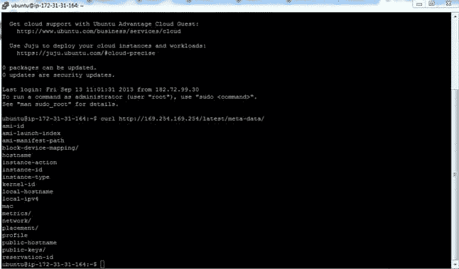
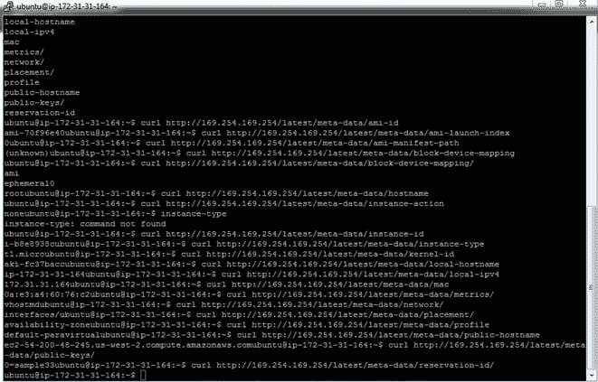

# 弹性计算云中的实例元数据

> 原文：<https://www.edureka.co/blog/instance-metadata-in-the-elastic-compute-cloud/>

这篇文章将告诉你如何从弹性计算云中访问实例的元数据。

### **弹性计算云中的实例元数据:**

*弹性计算云中的实例元数据*是与您的数据相关的信息。元数据可以根据一个*实例*特有的数据和 *EC2* 上所有实例共有的数据进行分类。

#### **常用元数据包括:**

*   **实例****–类型**:可以是 *Linux、Ubuntu、windows* 等。基于你选择的 *AMI* 。
*   **安全组**:可以相应修改，对于多个实例可以相同。
*   **Key-Pair** :你所有的实例都可以通过一个 Key-Pair 来访问。

#### **唯一元数据包括:**

*   **实例–Id**
*   **公共主机名**
*   **公共 IP 地址**

我们继续进行*启动*和*连接*到实例。

当您启动 Ec2 实例时，它会出现在 **Ec2 仪表板**中，如下所示:

我们用的是 **Ubuntu AMI** 。

在您进入 SSH 并建立了与实例的连接之后，您可以发出以下命令:

**curl http://169 . 254 . 169 . 254/最新/元数据**

这个命令列出了实例的元数据。 **169.254.169.254** 是用于访问服务器元数据的 *IP* ，在*云*上虚拟呈现*。与其他 IP 地址不同，它不是路由，而是为您获取服务器的元数据。*

上面的快照列出了我们的 **Ubuntu 实例**的元数据，这有助于提取实例细节和区分实例。

**Instance-ID** :它是一个*唯一标识符*，是基于特定实例的资源分配的数字和字母数字值的组合。这个组合是怎么决定的，这个只有 AWS 知道。

尽管从观察中可以清楚地看出:

*   **I**–实例
*   **r**–预订
*   **vol**–EBS 音量
*   **快照**–EBS 快照
*   **ami**–亚马逊机器镜像
*   **aki**–亚马逊内核映像
*   **ari**–亚马逊 ramdisk 图片

**实例类型**:这告诉实例拥有什么*类型的内存、存储*和*计算能力*，例如这是一台 615 Mb 的 ubuntu 机器。

**Kernal- Id** :

**本地主机名**可以理解为:

**本地 ipv4** :

**公钥**:显示*密钥对*的名称。

从 *EC2 实例*可知 *AMI-id* 为:

**AMI-启动-索引**:

**块设备映射** : *ami，短命，根。*

类似地，各种其他数据可以被称为:

