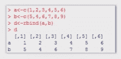
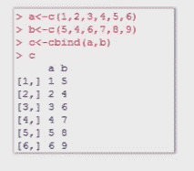

# R 中的函数介绍

> 原文：<https://www.edureka.co/blog/introduction-to-functions-in-r/>

[//www.youtube.com/embed/6-Iks-_HYxs](//www.youtube.com/embed/6-Iks-_HYxs)

## **功能在 R**

R 中的函数可以是用户定义的和内置的函数。要定义一个函数，需要指定一个名称，并使用关键字 function 来表示函数及其参数列表的开始。函数是使用 function()指令创建的，并像其他任何东西一样存储为 R 对象。特别是，它们是类函数的 R 对象。函数可以作为参数传递给其他函数。函数可以嵌套，这样就可以在另一个函数中定义一个函数。

## **用户自定义功能**

用户定义的函数是由程序或环境的用户在通常假设函数内置于程序或环境的上下文中提供的函数。

变量 x 是函数的形参。当函数被调用时，它作为一个实参传递，为形参提供一个值。

## **内置功能**

有一个函数叫做 repeat 函数，意思是将一个值重复多次。重复系列是重复 1:6 两次，如您在图像中所见。所有这些数据都可以在任何需要的时候创建，并且该系列的元素也可以重复。

## ** cbind 函数和 rbind 函数**

cbind 函数按列组合向量、矩阵或数据帧。rbind 函数按行组合向量、矩阵或数据帧。

 

有问题要问我们吗？？请在评论区提及它们，我们将会回复您。

**相关帖子:**

[监督学习简介](https://www.edureka.co/blog/introduction-to-supervised-learning/)

[什么是 R？](https://www.edureka.co/blog/what-is-r/)

[数据科学入门](https://www.edureka.co/data-science)