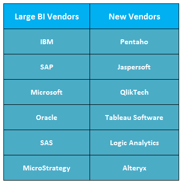
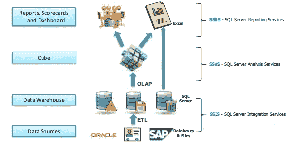
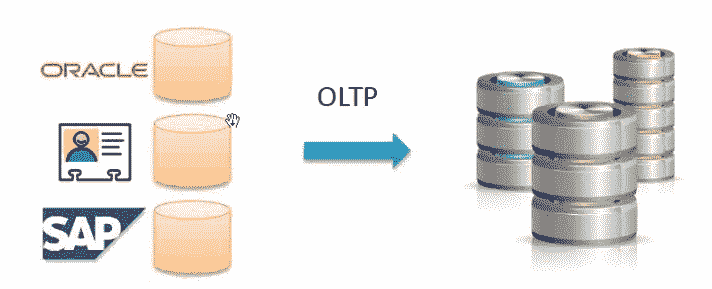
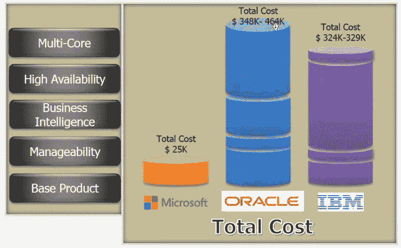
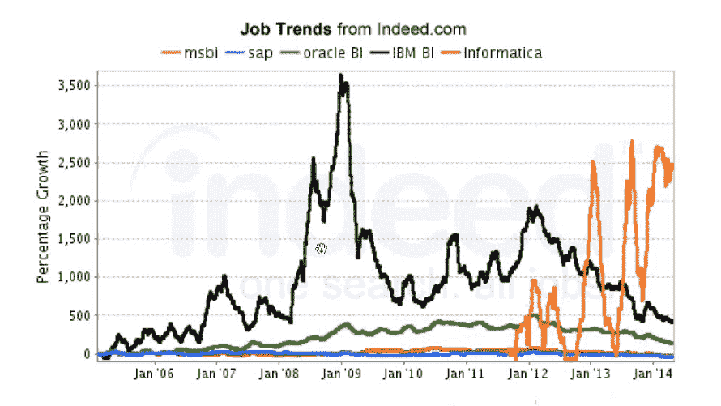

# 微软商务智能简介

> 原文：<https://www.edureka.co/blog/introduction-to-microsoft-bi/>

[//www.youtube.com/embed/7dqArG1Kh5M](//www.youtube.com/embed/7dqArG1Kh5M)

这是 2014 年 9 月 25 日举行的名为“MSBI 介绍”的网络研讨会的视频记录。

数据对于分析至关重要，但有时数据并不容易获得，因为数据分散在网络上，或者需要专家来分析这些数据。这种对数据的分析以获得有用的见解是商业智能的全部内容。

## **用户在数据中寻找什么？**

*   数据应该完全整合到整个网络中。
*   汇总的数据应该对组织有真正的价值。
*   历史数据开启了了解组织健康状况的途径。
*   数据中必须有“假设”功能。
*   这就是商业智能发挥作用的地方。

## **那么，什么是商业智能呢？**

商业智能是使用基于计算机的技术将商业数据转化为信息或知识的过程，从而使用户能够做出有效的、基于事实的决策。

## **商业智能-现有解决方案:**

市场上有各种提供端到端解决方案的 BI 供应商，传统上可以分为:大型 BI 供应商和新供应商。以下公司属于这两类。

## **微软商业智能 BI:**

MSBI 代表“微软商业智能”。它由一些工具组成，这些工具有助于为商业智能和数据挖掘查询提供优化的解决方案。MSBI 将 Visual studio 与 SQL server 结合使用，使用户能够获得准确的最新信息，从而做出明智的决策。

MSBI 允许用户使用 Excel 中强大的自助式 BI 发现、分析和可视化数据，还支持使用 SharePoint 协作和共享报告和数据。

**MSBI 的特色:**

*   为做出有效决策提供“单一版本的真相”
*   消除或减少“本能决定”
*   为企业提供快速及时的答案，使其对动态的业务趋势更加敏感
*   最大限度地减少容易出错的手动和日常工作
*   对高级分析的强大支持
*   支持历史数据
*   支持汇总数据

**MSDN 图书馆:**

MSDN 在“msdn.microsoft.com”上的主要网站是为开发团队提供文档、信息和讨论的站点集合，这些站点由微软和整个团队提供。目前，微软已经将重点放在了论坛、博客、图书馆注释和社会书签的整合上，以使 MSDN 成为与开发者团队的开放对话，而不是单向服务。

您将发现 MSDN 上所有可用功能的详细步骤供参考，以及商业智能上的几个博客，这些博客让您了解最新的更新和改进。

## **MSBI 建筑:**

MSBI 分为三类:

*   SQL Server 集成服务(SSIS)–集成工具
*   SQL Server 分析服务(SSAS)–分析工具
*   SQL Server Reporting Services(SSRS)–报告工具

**MSBI 举例——芒果:**

Mango 是全球最受欢迎的服装和配饰品牌之一。芒果的每个分店都在各自的数据库中存储客户数据。一些商店可能使用 SAP 作为数据库，一些商店可能使用 Oracle，一些商店更喜欢将数据存储在简单的文本文件中。

**第一阶段:SSIS(集成服务)**

在存储了访问各个商店的顾客的每日数据之后，这些数据被整合并保存在一个中央数据库中。这是通过 MS SQL Server 的 OLTP 组件完成的。在这里，“集成”意味着合并来自不同数据存储的数据，刷新仓库中的数据，并在加载数据之前清理数据。

第二阶段:SSAS(分析服务)

下一步是分析存储的数据。数据被划分到数据集市中，在这些数据集市上进行数据分析。Analysis Services 使用 OLAP(在线分析处理)组件和数据挖掘功能，因此提供了称为多维数据集的多维结构，用于预先计算和存储复杂的聚合，还用于构建挖掘模型来执行数据分析，以识别最近的趋势模式、客户不喜欢的内容等。

然后，业务分析师对多维数据集结构执行数据挖掘功能，从不同的角度查看数据。

**第三阶段:SSRS(报告服务)**

为了深入了解数据，我们必须将数据图形化，以便公司可以做出有效的决策来增加收入、获得最大利润并减少时间浪费。这是以报告、记分卡、计划、仪表板、Excel 等形式完成的。

这些报告将清楚地显示芒果在特定时间和地点的收入。这将向他们显示哪个渠道表现良好或不佳，如何改进以及关于用户的其他有用信息。

## **微软商务智能平台:**

分析数据并生成报告后，可以在 Excel 或 Performance Point 中查看，最终报告将保存在 Share Point 服务器或任何内容管理软件中。

## **MSBI——最可靠的解决方案:**

对于微软来说，可管理性、商业智能、高可用性和多核等附加功能的总成本仅为 2.5 万美元，而 Oracle 和 IBM 的总成本分别为 34.8 万至 46.4 万美元和 32.4 万至 32.9 万美元。

## **MSBI 就业趋势:**

就 MSBI 的就业趋势而言，有一个巨大而稳定的增长。这表明 MSBI 作为商业智能工具的受欢迎程度和使用率正在上升。

以下是网上研讨会的演示文稿:

[//www.slideshare.net/slideshow/embed_code/39557164](//www.slideshare.net/slideshow/embed_code/39557164)

[//www.slideshare.net/slideshow/embed_code/39557164](//www.slideshare.net/slideshow/embed_code/39557164)With its features, growing popularity and zooming job trends, Microsoft BI is all set to take on the world of Business Intelligence.

有问题要问我们吗？请在评论区提及它们，我们将会回复您。

**相关帖子:**

[微软商务智能培训](https://www.edureka.co/microsoft-bi)