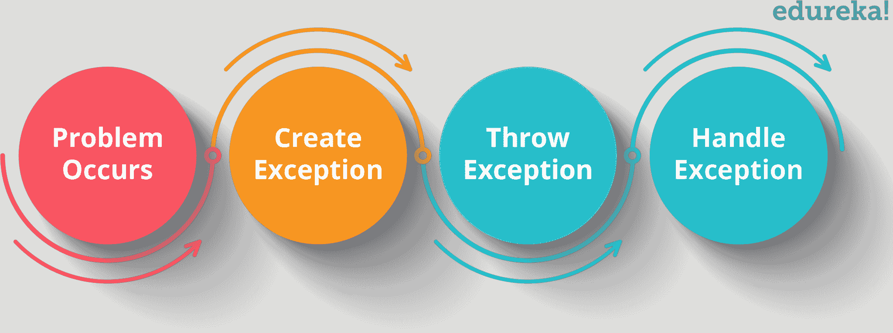

# Java 异常处理——Java 异常的完整参考

> 原文：<https://www.edureka.co/blog/java-exception-handling>

## 什么是异常处理？

意外出现的错误会导致正常的执行流程中断。这是每个程序员在编码时都会面临的问题。 **[、Java、](https://www.edureka.co/blog/java-tutorial/)** 作为最突出的 **[、](https://www.edureka.co/blog/object-oriented-programming/)** 面向对象语言，提供了处理这些错误/异常的强大机制。

## 如果不处理异常，会发生什么？

当异常发生时，如果您不处理它，程序将突然终止(导致异常的代码行后面的代码段将不会被执行)。

通过这篇关于 Java 异常处理的文章，我将让您全面了解异常处理的基础和各种方法。

在这篇文章中，我将涉及以下主题。

## **异常处理简介**

异常是在程序执行过程中出现的问题。它可能因为各种原因发生，比如-

*   用户输入了无效数据
*   找不到文件
*   网络连接在通信过程中丢失
*   JVM 已耗尽内存

异常处理机制遵循下图所示的流程。但是如果不处理异常，可能会导致系统故障。这就是处理异常非常重要的原因。

 *你也可以浏览一下这段 Java 异常处理的录音，通过例子你可以更详细地理解主题。*

[//www.youtube.com/embed/W-N2ltgU-X4](//www.youtube.com/embed/W-N2ltgU-X4)

接下来，从理解异常层次结构开始。

## **异常等级**

所有异常和错误类型都是类 ***Throwable*** 的子类，是层次结构的基类。一个分支以运行时发生的 ***错误*** 为首，另一个分支以编译时或运行时可能发生的 ***异常*** 为首。

基本上，Java 运行时系统(JVM)使用**错误**来指示与运行时环境(JRE)相关的错误。 *StackOverflowError 就是这种错误的一个例子。而***E****exception***用于用户程序应该捕捉的异常情况。NullPointerException 就是这种异常的一个例子。*

现在你知道了什么是错误和异常，让我们找出它们之间的基本区别。看看下面的表格，这两者之间有一条清晰的界限。

| **错误** | **异常** |
| 1.不可能从错误中恢复 | 1.可能从异常中恢复 |
| 2.错误属于“未检查”类型 | 2.例外可以是“选中”或“未选中” |
| 3.在运行时发生 | 3.可以在编译时或运行时发生 |
| 4.由应用程序运行环境引起 | 4.由应用程序本身引起的 |

现在，我们将深入研究异常，看看如何处理它们。首先，让我们看看不同类型的异常。

*   **检查异常** 它是发生在编译时的异常，也叫编译时异常。如果一个方法中的一些代码抛出了一个检查过的异常，那么这个方法要么必须处理这个异常，要么必须使用 *throws* 关键字指定这个异常。
*   **未检查的异常** 它是在执行时发生的异常。这些也称为*运行时异常。*在 C++中，所有的异常都是不检查的，所以编译器不会强制处理或指定异常。由程序员来指定或捕捉异常。

## **例外** 的基本例子

```
class Exception{
public static void main(String args[]){
try{
//code that may raise exception
}
catch(Exception e){
// rest of the program
  }
 }
}

```

上面代码代表了一个异常，其中在 try 块中，我们将编写一个可能引发异常的代码，然后在 catch 块中处理该异常。

## **异常类型**

1.  ### **Built-in exception**

    [T11 Description

    | **Built-in exception** |
    | ***Arithmetic abnormality*** | Thrown when an abnormality occurs in arithmetic operation. |
    | ***ArrayIndexOutofBoundsException*** | It is thrown to indicate that the array is accessed by illegal indexes. The index is negative, or greater than or equal to the size of the array. |
    | ***ClassNotFoundException*** | This exception will be thrown when we try to access a class whose definition is not found. |
    | ***[FileNotFounException]*** | Exception caused when the file cannot be accessed or opened. |
    | ***[ioexception]*** | is thrown when the input and output operation fails or is interrupted. |
    | ***Interrupt exception*** | is thrown when a thread is waiting, sleeping or doing some processing, and is interrupted. |
    | ***[Our Search Target Index]*** | Thrown when the class does not contain the specified field (or variable). |

2.  ### **用户自定义异常**

    有时，Java 中的内置异常不能描述特定的情况。在这种情况下，用户也可以创建被称为“用户定义的例外”的例外。 **注意要点:**

    1.  用户定义的异常必须扩展异常类。
    2.  使用 *throw* 关键字抛出异常。

**举例:**

```
class MyException extends Exception{ 
 String str1;
 MyException(String str2) {str1=str2;}
  public String toString(){
   return ("MyException Occurred: "+str1);
 }
}
class Example1{
public static void main(String args[]){
 try{
      System.out.println("Start of try block");
      throw new MyException(“Error Message");
    }
    catch(MyException exp){System.out.println("Catch Block");
    System.out.println(exp);
 }
}

```

#### 订阅我们的 youtube 频道获取新的更新..！