# 面向初学者的 Java 教程——让 Java 编程变得简单！

> 原文：<https://www.edureka.co/blog/java-tutorial/>

如今，在使用中的通用计算机有十亿台，支持 java 的手机、智能手机和平板电脑等手持设备也有十亿多台。由此，我们可以了解到 java 编程语言是当今世界上广阔的新兴语言。由我们的 [**Java 培训**](https://www.edureka.co/java-j2ee-training-course) 专家撰写的这个 Java 教程系列的其他博客将深入涵盖 Java & J2EE 的所有重要话题。

现在，让我们继续这个 Java 教程博客，我们将按以下顺序理解 Java 的各个方面。

*   [安装 Java](#install)
*   [你好世界节目](#hello)
*   [Java 中的成员变量](#variables)
*   [数据类型](#datatype)和[运算符](#operator)
*   [控制语句](#control)
*   [阶级&对象](#obj)
*   [一个程序的结构](#structure)
*   [文件输入/输出处理](#file)
*   [阵列](#array)
*   [OOPs 概念](#oop)——继承、封装、多态、抽象
*   [异常处理](#exception)

## **Java 是什么？****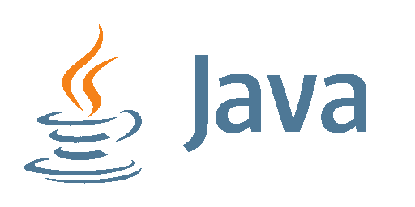**

Java 是一种面向对象的编程语言。它现在是世界上广泛使用的计算机编程语言，用于构建 web 和桌面应用程序。它是满足许多组织的企业编程需求的首选语言，也已成为实现基于 Internet 的应用程序和设备软件的首选语言。

## **Java 应用的类型**

1) **单机应用** 又称桌面应用或基于窗口的应用。这些是我们需要安装在每台机器上的传统软件。媒体播放器、防病毒软件等。AWT 和 Swing 是一些需要 Java 来创建独立应用程序的独立应用程序的例子。 2) **Web 应用**Web 应用运行在服务器端，创建动态页面。许多技术需要 java 编程语言来用 Java 创建 web 应用程序。

3) **企业应用** 企业应用在自然界是分布式的，例如，银行应用。它在许多方面都很有优势，比如高级安全性、负载平衡和集群。 4) **移动应用** 为移动设备创建的移动应用称为 a，目前 Android 和 Java ME 满足了创建移动应用的要求。

## **Java 平台/版本**

Java 编程语言的平台如下:

1.  Java 平台，标准版(Java SE)
2.  Java 平台企业版(Java EE)
3.  Java 平台，微型版(Java ME)
4.  Java FX。

## **Java 的历史**

Java 是由被称为 Java 之父的**詹姆斯·高斯林**T4 在 1995 年发明的。带领太阳微系统公司的一组研究人员，**詹姆斯·高斯林**努力创造一种新的编程语言，这种语言将允许消费者通过设备进行电子交流。 有趣的事实:Java 的旧称是 Oak。Oak 是詹姆斯·高斯林在 1989 年创造的一种编程语言，后来发展成为 Java。

## **Java 的特性**

Java 的显著特点如下:

**面向对象:**

Java 是一种面向对象的编程语言，因为它允许作为工作系统实现面向对象的设计。

**平台无关:**

与其他编程语言不同，java 不是编译到特定的机器上，而是编译成独立于平台的字节码，然后通过 web 分发并由 Java 虚拟机(JVM)解释。

**安全:**

Java 的安全特性使得开发无病毒、无篡改的系统成为可能。像 Macafee，Norton 这样的软件都是内置 Java 编程的。

**健壮:** Java 努力把重点放在处理意外终止和意外动作的错误检查和运行时。正在检查。

**多线程:** Java 的多线程特性允许编写可以同时执行许多任务的程序。这个特性允许开发人员构建可以流畅运行的交互式应用程序。

## **为什么要学习 Java 编程？**

学习 Java 编程语言的好处:

1.  Java 很好学。
2.  Java 开发人员很吃香
3.  找一份 Java 程序员的工作很容易。
4.  它收集了大量的开源库。
5.  Java 是免费的。

**Java–Object&class****Object:**

对象是一个类的实例。它是具有状态和行为的实体，可以是物理的或逻辑的。

**类:**

类是具有共同属性的对象的集合。它是创建对象的模板或蓝图。它是一个逻辑实体，不可能是物理的。它包括:

*   菲尔茨
*   方法
*   构造器
*   阻碍
*   嵌套类和接口

**Java 程序有哪些类型？**

**Java 小程序:**

Java applet 是一个图形用户界面，您可以在上面放置 GUI 组件或使用技术绘图。它嵌入在一个 HTML 页面中，通过使用支持 Java 的 web 浏览器来执行。

语法:

*   `import java.awt.Graphics;`

要使 applet 能够绘制图形

*   `import javax.swing.JApplet;`

用于创建小程序。

## **安装 Java**

学习 Java 的第一步是安装和设置 Java 环境。我会把你重定向到 Java 的 **[下载链接。](https://www.oracle.com/technetwork/java/javase/downloads/jdk13-downloads-5672538.html)**一旦你进入下载网页，你将会看到如下所示的内容。

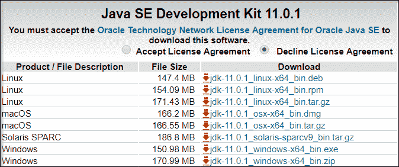

下载了所需的 JDK 文件后，继续为 Java 设置环境。转到 windows 高级设置并选择环境变量。您应该能够看到如下所示的对话框。

定位环境变量的步骤。

*   转到开始并搜索“系统”
*   点击‘系统’
*   点击“高级系统设置”
*   点击“高级”选项卡下的“环境变量”,如下图所示


接下来，在“系统变量”下选择“新建”,输入变量名“JAVA_HOME”以及您的系统的 JAVA 安装目录的完整路径，如下图所示


下图描述了环境变量名和值的配置。


接下来你要做的是配置你的环境变量。让我们看看如何做到这一点。 在这里，你要编辑系统变量的路径如下所示。

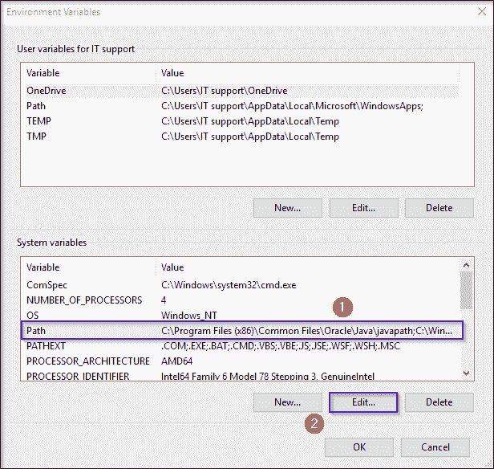

在“变量值”下，在该行的末尾，输入以下路径-***% JAVA _ HOME % bin；*** 现在，你可以点击‘确定’就大功告成了。

现在要交叉检查安装，只需在 cmd 中运行下面的命令—***Java-version***。它应该显示您系统中已安装的 Java 版本。

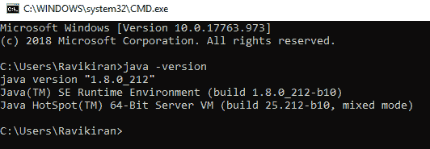

现在，您已经成功地将 Java 安装到了本地系统中。

## **Java 示例**

让我们用其中一个编程代码来理解 java:

下面的例子说明了 Java 编程语言及其一些特性:

________________________________________________

```

 	public class Edureka
           { 
 	public static void main(String args[])
 	{ 
 System.out.println("Welcome to Edureka!!");
 	} 
 	}

```

________________________________________________

**输出:**欢迎来到 Edureka！！ **解释:**

第 1 行:我们声明一个类。class 关键字引入了一个类声明，紧接着是类名。

第 2 行:声明类声明的主体

第 3 行:这是 java 应用程序的起点

第 4 行:开始方法声明的主体

第 5 行:指示计算机执行一个动作，即打印双引号之间的字符串。

第 6&7 行:表示主方法和类声明的结束

## **Java 的特性**


**开源**

Java 自诞生以来，直到今天，一直是一个开源产品，它拥有所有的公共访问权。程序员可以自由发布完整的源代码，供任何人下载、复制、重新发布，这通常是 GPL(通用公共许可证)的一部分，GPL 通常是开源软件附带的许可证。

**高性能**

Java 是一种解释语言，所以它永远不会像 C 或 C++这样的编译语言那样快。但是，Java 通过使用实时编译器实现了高性能。

**多线程**

Java 的多线程特性使得编写一个可以同时执行多项任务的程序成为可能。多线程的好处是，它利用相同的内存和其他资源来同时执行多个线程，就像在打字时，语法错误会被检查出来。

**安全**

谈到安全性，Java 永远是第一选择。有了 java 安全特性，它使我们能够开发无病毒、无恶意的系统。Java 程序总是运行在 Java 运行时环境中，与系统操作系统的交互几乎为零，因此更安全。

**平台独立**

不同于其他编程语言，如 C、C++等被编译成特定于平台的机器。Java 被保证是一种只写一次，可以在任何地方运行的语言。编译时，Java 程序被编译成字节码。这种字节码是独立于平台的，可以在任何机器上运行，而且这种字节码格式还提供了安全性。任何具有 Java 运行时环境的机器都可以运行 Java 程序。

**便携性**

跨平台特性使得 Java 代码具有高度的可移植性。程序员可以在 windows 中编写代码，在 Linux 操作系统中执行相同的代码。

**面向对象**

在 java 中，一切都是有一些数据和行为的对象。Java 很容易扩展，因为它是基于对象模型的。

**健壮**

Java 致力于通过强调编译时错误检查和运行时检查来消除容易出错的代码。但是 Java 改进的主要领域是内存管理和通过引入自动垃圾收集器和异常处理来错误处理异常。

让我们从 Java 教程博客的第一个话题开始，即 Hello World 程序。

## **你好世界节目**

我将简单介绍一下 Java 程序的样子。在下面的代码中，我创建了一个类——MyFirstJavaProgram 并打印了“Hello World”。继续并尝试在您的 Eclipse IDE 中执行下面的示例。不要担心，我们稍后将讨论 Java 类。

```

public class FirstProgram { 
      public static void main(String[] args){ 
              System.out.println("Hello World"); 
      } 
} 

```

**//输出:**

`Hello World`

接下来让我们了解一下 Java 中不同的成员变量。

**Java–基本语法** **区分大小写**—Java 区分大小写

**类名**——所有类名的首字母都应该大写。

**方法名**——所有方法名都应以小写字母开头。

**程序文件名**—程序文件名应与类名完全匹配。

**public static void main(String args[])**—Java 程序处理从 main()方法开始，这是每个 Java 程序的强制部分。

## **Java 教程:成员变量**

成员变量在类中扮演着重要的角色，因为它被用来存储数据值。当我们定义一个类时，我们可以声明一个成员变量。这些变量是一个类的成员。成员变量进一步分为三种:

*   局部变量
*   实例变量
*   类/静态变量

让我逐一讨论一下:

**局部变量**:这些是在类的方法中声明的变量。让我们通过一个编程示例来理解这一点:

```
public class Car {
      public void display(int m){  // Method
           int model=m;  // Created a local variable model
           System.out.println("Model of the car is" +model);
     }
}

```

在上面的代码中，我的局部变量是“model ”,我在一个包含参数“m”的方法“display”中声明了它。

**实例变量** : 实例变量在类中声明，但在方法、构造函数或任何块之外。让我们通过一个编程示例来理解这一点。

```
public class Car {
      public String color;     // Created an instance variable color
      Car(String c){
            color=c;
      }
      public void display() {  // Method 
            System.out.println("color of the car is"+color);
      }
public static void main(String args[]){
           Car obj=new Car("black");
                  obj.display();
      }
}

```

在上面的代码中，“colour”是我的实例变量，它有一个与之相关的值“black”。

**类变量**:类变量也称为静态变量。这些变量只有一个副本，由一个类中的所有不同对象共享。让我们通过一个编程示例来理解这一点。

```
public class Car {
      public static int tyres;   // Created a class variable tyres
      public static void main(String args[]){
           tyres=4;
           System.out.println("Number of tyres are"+tyres);
      }
}

```

所有的汽车都必须有 4 个轮胎，对吗？所以在我上面的代码中，我声明了一个静态变量为' tyre ',它的值在整个类中保持不变。

让我们继续这个 Java 教程博客，看看我们的下一个主题，即 Java 中的数据类型和操作符。

## **Java 教程:数据类型**

一个数据类型用 来表示存储在一个变量中的不同值。它们是 主要分为 4 个不同的方面——整型、浮点型、字符型和布尔型。您可以参考下图来了解  不同的数据类型与分配给它们的内存的关系。


如上图所示，数据类型有 4 种主要类型。

*   第一种数据类型是存储数值的 *整数* 。
*   现在，如果一个数值包含小数部分，就会被称为 *浮点* 数据类型。
*   接下来，如果您希望存储一个字符，则使用第三种数据类型，即 *字符* 。在 char 中，可以存储任何字母字符以及特殊字符。
*   最后一个数据类型是*布尔型* ，其中只存储‘真’或‘假’值。

让我们向前看，看看可以在 Java 中执行的各种数据操作。

## **Java 教程:数据运算符**

主要有 4 种不同类型的操作员，列举如下:

*   **算术运算符:** 进行加、减、乘、除、模等算术运算。
*   **一元运算符:** 一元运算符用于递增或递减某一特定值。例如:++代表递增，––代表递减。
*   **关系运算符:** 它定义了两个实体之间的某种关系。比如:<、>、< =、> =、！=, ==.
*   **逻辑运算符:** 逻辑运算符一般与 b oolean (逻辑)值一起使用。

想了解更多关于 Java 中运算符的知识，请浏览这篇 [**文章链接**](https://www.edureka.co/blog/operators-in-java/)

与此同时，你可以浏览一下这个 Java 教程视频，视频中用一个例子清楚地解释了所有与 Java 相关的概念:

## **Java 初学者教程| Java 编程教程| edu reka**

[//www.youtube.com/embed/aqHhpahguVY?rel=0&showinfo=0](//www.youtube.com/embed/aqHhpahguVY?rel=0&showinfo=0)

接下来，让我们在 Java 教程博客中继续前进，理解控制语句的概念。

## **Java 教程:控制语句**

控制语句是定义程序流程的语句。Java 中有以下几种类型的控制语句


他们建议计算机执行特定的代码段，给定的条件是  *【真】* 和  *有效。* 条件语句的分类如下图所示

**如果条件**

**If 语句** 是一个编程条件语句，它在一个条件上执行一个代码段，前提是该条件为真且有效。下面是一个 If 语句的例子。

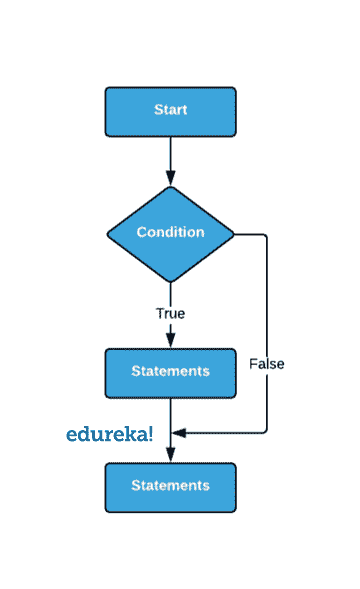

//查找数字是正数还是负数。

```
Package ifloop;
public class ifloop {
public static void main(String[] args) {
        int number = -10;
        if (number &amp;amp;gt; 0) {
              System.out.println("Number is positive.");
        }
        System.out.println("The number is negative.");
    }
}
```

**//输出:**

`The number is negative.`

**Else-If 条件**

**Else If 条件语句** 用于执行两条语句中的一条。条件语句执行的代码段提供的是  *真和有效的*。下面是一个 If 语句的例子。

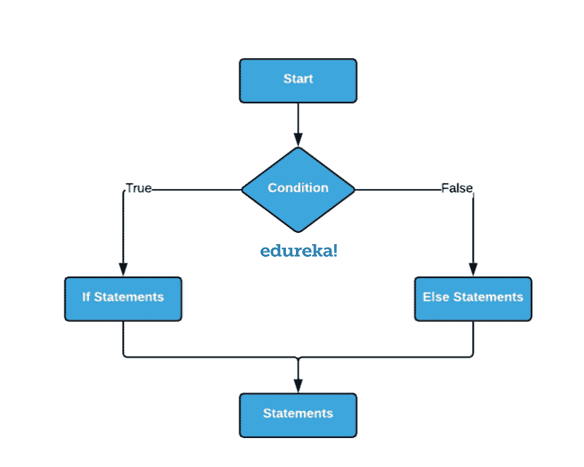

//查找数字是偶数还是奇数

```
package Esleifloop;
import java.util.Scanner;
public class elseifloop {
     public static void main(String[] args) {
          Scanner kb = new Scanner(System.in);
          System.out.println("Enter any integer value");
          int a=kb.nextInt();
          if(a%2==0){
                System.out.println("even number");
         } 
         else{
                System.out.println("odd number");
         }
     }
}
```

**//输出:**

`Enter any integer value``21`

**Else-If 阶梯**

**Else if 梯** 是一组连续的 Else-If 语句，用于  *执行给定语句集合中的一条真实有效的语句* 。下面是 Else-If 阶梯的一个例子。

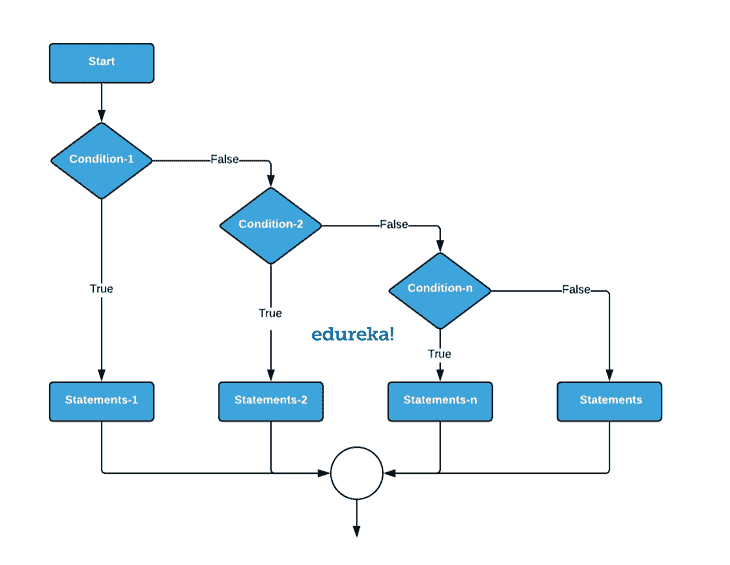

//选择您喜欢的交通工具。

```
package elseifladder;
import java.util.Scanner;
public class ladder {
public static void main(String[] args) {
      Scanner kb = new Scanner(System.in);
      System.out.println("Enter your chioce, 1 for the Sedan, 2 for SUV, 3 for Sports, 4 Cross Breed");
      int choice=kb.nextInt();
      if(choice==1){
            System.out.println("Sedan Class");
      }
      else if(choice==2){
            System.out.println("SUV Class");
      }
      else if(choice==3){
            System.out.println("Sports Class");
      }
      else if(choice==4){
            System.out.println("Cross-Breed Segment");
      }  
      else {
            System.out.println("Invalid Choice");
      }
   }
}
```

**//输出:**

`Enter your choice, 1 for the Sedan, 2 for SUV, 3 for Sports, 4 Cross-Breed`

`3`

**嵌套 If 条件**

**嵌套 If** 是一个条件语句，其中一个 Else-If 语句嵌入另一个 If 语句。以下程序是嵌套 If 条件的一个示例。


//从给定的三个数中找出最大的数

```
package nestedif;
public class nested {
      public static void main(String[] args) {
            int n1 = 20, n2 = 30, n3 = 10, greatest;
            if (n1 &amp;amp;gt;= n2) {
                 if (n1 &amp;amp;gt;= n3) {
                      greatest = n1;
                 }  
                 else {
                      greatest = n3;
                 }
            } 
            else {
                 if (n2 &amp;amp;gt;= n3) {
                     greatest = n2;
                 } 
                 else {
                     greatest = n3;
                 }
            }
            System.out.println("Largest number is " + greatest);
      }
}
```

**//输出:**

`Largest number is 30`

**Te****RNA 操作员**

**三元运算符** 是一个有三个自变量的条件语句。第一个是  *条件变元* 和  第二个是*真比较的结果，*第三个是*假比较的结果。*

//找出两个数字中最大的一个

```
package Ternary;
import java.util.Scanner;
public class Ternaryoperators {
     public static void main(String[] args) {
          Scanner kb = new Scanner(System.in);
          System.out.println("Enter any integer value to a");
          int a=kb.nextInt();
          System.out.println("Enter any integer value to b");
          int b=kb.nextInt();
          int greater = (a &amp;amp;lt; b) ? a : b;
          System.out.println(greater);
     }
}
```

**//输出:**

`Enter any integer value to a``10``Enter any integer value to b``25`

现在，我们将理解 Java 中的迭代。Java 中有 3 个迭代循环

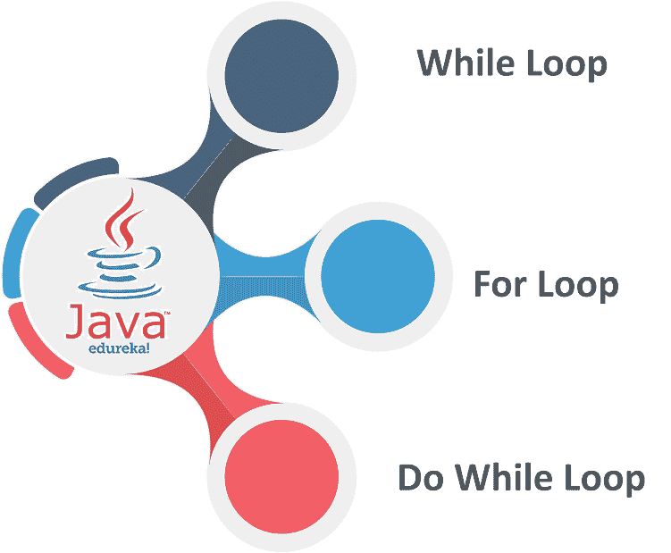

**为循环**

**For 循环** 是一个控制流语句，允许你执行特定代码段进行有限次迭代。一个 for 循环有三个自变量，即  *初始化变量、* 和  *递增/递减变量。*

下面是与 For 循环相关的流程图。


以下代码是 for 循环的示例。

//使用普通 For 循环打印数组中的元素

```
package forloop;
public class forloop {
      public static void main(String[] args) {
            String[] arrData = {"JOHN", "JERRY", "RALPH", "JIM", "TOM"};
            System.out.println("Using normal For Loop:");
            for(int i=0; i&amp;amp;lt; arrData.length; i++){
                    System.out.println(arrData[i]);
             }
      }
}
```

**//输出:**

`Using normal For Loop:``JOHN``JERRY``RALPH``JIM`

**回路增强**

**增强/高级 for 循环** 类似于 For 循环，但是，它 *最小化了代码长度* 和  *不包括计数器变量* 和  *初始化变量*。控制直接流入数组/集合，并通过访问元素的索引对元素执行操作。

下面是与增强 For 循环相关的流程图。

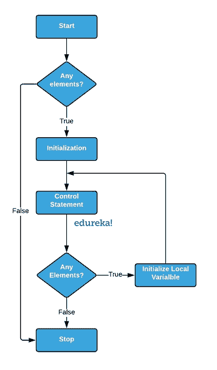

以下代码是增强 for 循环的示例。

//使用增强/高级 For 循环打印数组中的元素

```
package advforloop;
public class advforloop {
       public static void main(String[] args) {
             String[] arrData = {"JOHN", "JERRY", "RALPH", "JIM", "TOM"};
             System.out.println("Using Enhanced For Loop:");
             for (String strTemp : arrData){
                    System.out.println(strTemp);
             }
        }
}
```

**//输出:**

`Using Enhanced for loop:``JOHN``JERRY``RALPH``JIM`

**嵌套 For 循环**

**嵌套 for 循环** 在自身内部嵌入另一个 For 循环。 *外环触发内环*。内部循环完全执行，然后触发外部循环来更新迭代。这个过程一直持续到外部循环执行完毕。

下面是与嵌套 For 循环相关的流程图。

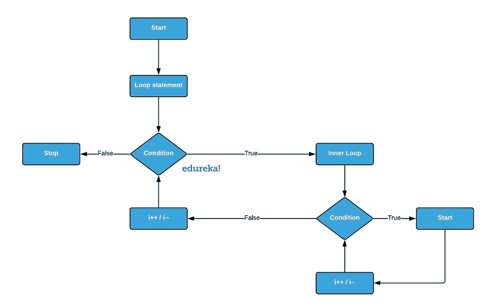

以下代码是嵌套 for 循环的示例。

//使用普通 For 循环打印二维数组中的元素

```
package nestedforloop;
public class nested {
      public static void main(String[] args){
            int[][] arr = { { 1, 2 }, { 3, 4 } };
                   for (int i = 0; i &amp;amp;lt; 2; i++)
                         System.out.println("Row" + i + " - ");
                         for (int j = 0; j &amp;amp;lt; 2; j++)
                               System.out.println(arr[i][j]);
                         }
                   System.out.println("");
                   }
           }
}
```

**//输出:**

`Row 0 - 12`

**While 循环**

**While 循环** 是一个控制流语句，它重复执行自身，直到满足给定的布尔条件。While 循环可以认为是一个  *重复 If 语句。*

下面是 While 循环的流程图。

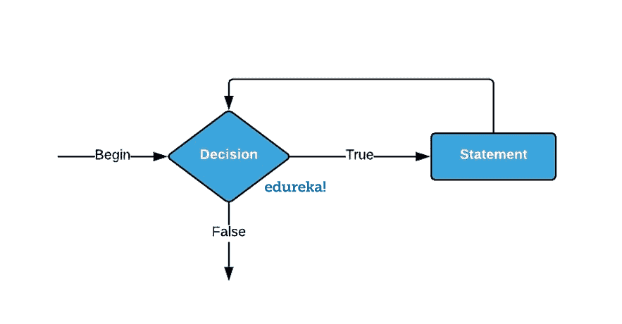

以下代码是 While 循环的示例。

//使用 While 循环查找数字是否是质数

```
package whileloop;
import java.util.Scanner;
public class whiledemo {
      public static void main(String[] args) {
           Scanner kb = new Scanner(System.in);
           System.out.println("Enter any number");
           int num=kb.nextInt();
           int i = 2;
           boolean flag = false;
           while(i &amp;amp;lt;= num/2)
          {
                if(num % i == 0)
                {
                      flag = true;
                      break;
                }
               ++i;
          }
          if (!flag)
               System.out.println(num + " is a prime number.");
          else
               System.out.println(num + " is not a prime number.");
          }
}
```

**//输出:**

`Enter any number``5`

**Do While 循环**

**Do While 循环** 被认为是完全类似于普通 While 循环的条件语句。唯一的区别是 Do While 循环将布尔/条件语句放在循环的末尾。这使得 *Do While 循环至少要执行一次。*

下面是 Do While 循环的流程图。

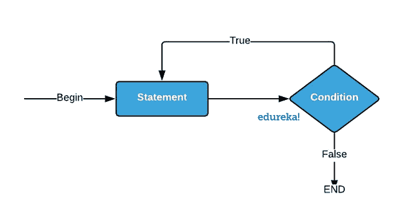

以下代码是 Do While 循环的示例。

//在数组中插入元素，并使用普通 While 循环添加它们

```
package dowhileloop;
import java.util.Scanner;
public class dowhile {
    public static void main(String[] args) {
        Double a, Summation = 0.0;
        Scanner kb = new Scanner(System.in);
        do {
                   System.out.print("Enter a number to perform addition and zero to exit: ");
                   a = kb.nextDouble();
                   Summation += a;
       } 
       while (a != 0.0);
       System.out.println("Sum of the numbers = " + Summation);
    }
}
```

**//输出:**

`Enter a number to perform addition and zero to exit: 10``Enter a number to perform addition and zero to exit: 20``Enter a number to perform addition and zero to exit: 30``Enter a number to perform addition and zero to exit: 40``Enter a number to perform addition and zero to exit: 0`

**无限循环**

**无限循环** 实际上并不是实际设计的循环。相反，在这种情况下，循环的条件会失败，执行会持续，直到您手动停止它。


下面的代码是一个无限循环的例子。

//生成无限循环

```
package infiniteloop; 
public class infinity { 
       public static void main(String[] args) { 
             int i=0; 
             while(true) { 
                     System.out.println("Edureka"); 
                     i++;
             } 
        } 
}
```

**//输出:**

`Edureka` `Edureka` `Edureka`

接下来，我们来看看 Java 中的类和对象是什么。

## **Java 教程:类和对象**

Java 中的一个类是一张蓝图，包含了你所有的数据。一个类包含描述对象行为的字段(变量)和方法。让我们来看看类的语法。

```
class Abc {
      member variables // class body
        methods
 }

```

但是如何访问这些成员变量和方法呢？这里就出现了*的概念**的对象**的*。

对象是具有状态和行为的类中的主要元素。它是一个可以访问你的数据的类的实例。让我们看看在 Java: 中创建对象的语法

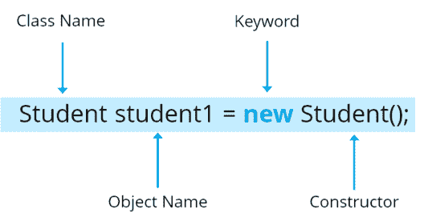  H   ere，Student 是你的类名后跟对象名。然后有一个“新”关键字，用于分配内存。最后，调用构造函数。这个调用初始化新的对象。 现在让我们看看如何在 Java 中使用对象调用方法:

```
class Student()
      void display(); {                      // Method
     ------                                         // logic of method
}
public static void main(String args[]){
      Student obj=new Student();    // Created an object
      obj.display();                           // Method called
}   

```

想知道更多关于他们的事情吗？我建议你看这个 Java 类视频，它将带你深入了解 Java 类的细节和 Java 中不同的关键组件。继续，欣赏视频，告诉我你的想法。

## **Java 类| Java 类和对象| Java 培训| edu reka**

[//www.youtube.com/embed/cXj1hHdMNk4?rel=0&showinfo=0](//www.youtube.com/embed/cXj1hHdMNk4?rel=0&showinfo=0)

接下来，让我们继续我们的 Java 教程博客，在这里我们将讨论另一个关键概念，即数组。

## **Java 教程:数组**

Java 中的数组类似于 C++或其他任何编程语言。 数组是保存相同类型的顺序元素的数据结构。

假设您想要存储 50 个号码。而不是声明单个变量，比如 number0，number1，… 和等等。您可以声明一个数组变量——“numbers”，并使用数字 [ 0]，数字 [ 1]来表示单个变量。这将减轻您的任务，并最大限度地减少冗余。

每个数组都有两个组成部分:索引和值。为了更好的理解 ng: ，请参考下图

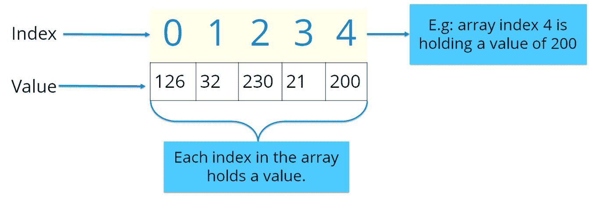

这里的 索引从零开始，一直到(n-1) w 这里 n=数组的大小。假设你想存储 10 个数字，那么索引从 0 开始，一直到 9。

Java 中有两种类型的数组:

*   单维 阵列
*   Mul ti 维数组

**一维数组:** 在一维数组中， 同类型的变量列表可以通过一个通用名称访问。您可以使用以下语法初始化数组:

int a[]= new int[12]；

你可以参考下面的图片，我已经在 索引中存储了关于给定 的数据。

****

**M****ul****ti****—** **数组:** 在多维数组中，你的数据是以矩阵形式存储的。 这里，您可以使用以下语法初始化数组:

int table[][]= new int[4][5]；

它与我们在数学中使用的矩阵非常相似。参考下图，我已经存储了不同维度的数据。

因此，数组帮助你优化代码，你可以在任何位置插入数据。

让我们看下面的代码来理解 Java 中数组的概念。

```
import java.util.*;
public class ArrayExample {
      public static void main( String args[])
     {
     double invoice[][]= new double[10][2];  // Initializing array
          Scanner obj= new Scanner(System.in);    // creating a scanner object to take input from user
          for(i=0;i<10;i++){                       // nested for loops
              for(j=0;j<2;j++);
               {
               System.out.println("Enter the value");
               invoice[i][j]=obj.nextDouble();         // store values to array    
          for(i=0;i<10;i++){
              for(j=0;j<2;j++)
               {
                System.out.println(invoice[i][j]);
               }
         }
     }
}

```

在上面的代码中，我已经解释了如何获取数组的输入并打印出来。我希望你们清楚数组是什么样子的，以及如何初始化一个数组。 现在，让我们总结一下上面的主题，看看一个 Java 程序的整体结构。

## **Java 教程:程序的结构**

到目前为止，我们已经了解了成员变量、数据类型、控制语句、类和对象。让我们看看它们是如何在 Java 的一个类中组织在一起的。

```
public class Car{                    // Class creation
       String color;                        // Member variables   
       String model;
       public void SpeedCheck(int s)        // Method 
         {
         int speed=s;
           if(speed>100)                        // Control statement
           {
           System.out.println(" You are driving very fast");
           }
           else
           {
            System.out.println("You are driving at normal speed");
           }
public static void main ( String args[]) 
         {
         Car obj= new Car();                  // Object creation
         obj.speed(60);
         }

```

最后，我们来到 Java 教程博客的最后一个主题，即面向对象编程概念。

## **文件输入/输出处理**

Java 有一个专用的库来处理所有的输入和输出功能。java.io 包/库处理 java 中的所有输入/输出流。Java 有两种类型的流，它们是:

*   输入流
*   输出流

**输入流**

它负责从所有来源读取数据。

**输出流**

它负责将数据写入目的地。

//示例:

```
package edureka;

import java.io.*;
public class fileStreamTest {
         public static void main(String args[]) {
                try {
                      byte bWrite[] = { 1, 2, 3, 4, 5 };
                      OutputStream os = new FileOutputStream("Edureka.txt");
                      for (int x = 0; x < bWrite.length; x++) {
                            os.write(bWrite[x]);
                      }
                      os.close();
                      InputStream is = new FileInputStream("Edureka.txt");
                      int size = is.available();
                      for (int i = 0; i < size; i++) {
                            System.out.print((char) is.read() + " ");
                      }
                      is.close();
                      } 
                catch (IOException e) {
                       System.out.print("Exception");
                 }
         }
}

```

现在，我们将进入 Java 中面向对象编程的概念。

## **Java 教程:OOPs 概念**

我们已经讨论了 Java 中的类和对象。让我们讨论一下面向对象编程的 4 个主要概念——继承、封装、多态和抽象。

让我们从第一个概念开始，即继承。

**传承:** M 你们当中的 ost 一定很熟悉传承。继承是一个类获得另一个类的属性的过程。 但是谁的属性是遗传的？这里我们有两个类，一个*chil*d 类，它继承了一个*基类*的属性。 一个继承了该属性的类称为 **子类。**也称为派生类或子类。接下来，其属性被继承的 c 类被称为 **父类**或基类。让我们通过看这个现实生活中动物的例子来了解这些类。

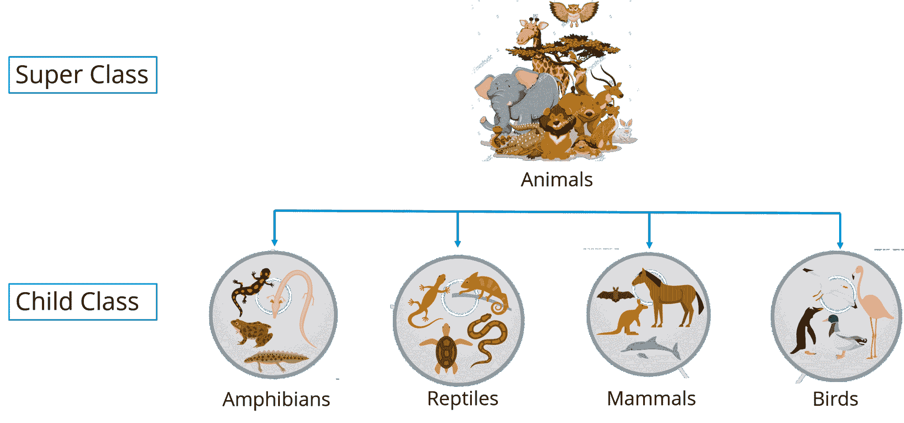

在上图中，动物是超类，而两栖动物、爬行动物、哺乳动物和鸟类是子类，它们继承了动物类的属性。

在 Java 中，继承用于 避免 代码冗余。此外，In 继承有许多类型，不要担心，我们将在我的下一篇关于*面向对象编程*的博客中进行更深入的讨论。

**封装:**Java 中的封装是一种将数据和代码打包成一个单元的机制。 参考下图，其中所有的 方法、变量都被绑定在一个类中。


在封装中，一个类的变量对其他类是隐藏的，只能通过当前类的 方法 来访问。

**多态性:** 多态性是变量、函数或对象采取多种形式的能力。OOPs 中多态性最常见的用法是当父类被用来引用子类对象时。多态性也是通过函数重载实现的。放心吧！我将在下一篇博客中解释整个概念。现在，让我们来看一个现实生活中的场景，老师告诉学生画出具有不同功能的不同形状/图形。


假设我想画一个特定的形状，它已经有了多种功能，作为我程序的一部分。所以处理形状的函数，我称之为 draw()。现在基于我传递给这些函数的值，它会画出不同的形状。假设是一个矩形，我要传递两个值——长度和宽度。同样，对于一个圆，我正在传递一个半径。基于您传递的值，将调用不同的函数来服务于不同的目的。 所以这可以通过函数重载来实现。请继续关注，函数重载的概念将在我的下一篇博客中详细讨论。

**抽象:** 基本上是处理观念而不是事件的品质。 抽象是对用户隐藏实现细节，只向用户提供功能的方法论。让我们看看这个汽车的真实例子，我将帮助你理解抽象到底是什么。


如果考虑这辆车的情况，这里机械师正在修理一辆车的某项功能。但是用户或者你可以说司机不想知道这些事情，他只是想让他的车回到工作状态。所以在这里，你基本上分离了实现，并向其他人展示了他真正想看到的，确切地说是指 **抽象** 。

这是 Java 教程博客系列的第二篇博客的结尾。 我希望你们都清楚我上面讨论的每一个方面。在我的下一篇博客中，我将通过例子详细解释 Java 的面向对象编程概念。

要更好地学习 java 面向对象编程，请通过此 [**文章**](https://www.edureka.co/blog/object-oriented-programming/) 链接。

## **异常处理**

异常可以定义为程序执行过程中出现的意外问题。异常中断程序的顺序和正常流程。因此，必须解决这些异常以避免任何问题。

异常可以是任何类型的，例如，

*   用户提供的数据无效
*   无法访问的文件位置
*   网络中断或其他硬件问题

让我们检查数组索引越界异常的例子。

```
package edureka;
public class Edureka {
    public static void main(String args[]) {
          try {
                 int a[] = new int[21];
                 System.out.println("Accessing element:" + a[22]);
          } 
          catch (ArrayIndexOutOfBoundsException e) {
                 System.out.println("Exception thrown :" + e);
          }
          System.out.println("Out of the block");
    }
}

```

**//输出:**

`Exception thrown :java.lang.ArrayIndexOutOfBoundsException: 22`

*既然您已经了解了 Java 的基础知识，那么就来看看 Edureka 的 [**Java 课程**](https://www.edureka.co/java-j2ee-training-course) 培训* *吧，edu reka 是一家值得信赖的在线学习公司，在全球拥有超过 250，000 名满意的学习者。Edureka 的 Java J2EE 和 SOA 培训和认证课程是为想成为 Java 开发人员的学生和专业人士设计的。该课程旨在为您提供 Java 编程的开端，并训练您掌握核心和高级 Java 概念以及各种 Java 框架，如 Hibernate & Spring。*

有问题要问我们吗？请在这个“Java 教程”博客的评论部分提到它，我们会尽快回复您。