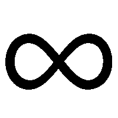

# JavaScript 中的 forEach 循环:初学者的一站式解决方案

> 原文：<https://www.edureka.co/blog/javascript-foreach/>

JavaScript 提供了多种方法来实现遍历数组的循环。今天我们将讨论一个特别的循环，它很快成为开发人员的最爱；JavaScript 中的 *forEach* 循环。以下是我们将要探讨的主题:

*   [什么是循环和数组？](#loops%20and%20array)
*   [JavaScript 语法中的 forEach](#syntax)
*   [JavaScript 中 forEach 的参数](#parameters)
*   [JavaScript 中 forEach 的返回值](#return%20value)

## **什么是循环和数组？**

循环是实现迭代器过程的术语，也就是重复完成的事情。因此，如果您要从 1 数到 10，您将实现一个循环，循环十次，并将计数值增加 1。 [数组](https://www.edureka.co/blog/array-sort-in-javascript/)简单来说就是相似物体的集合。一般来说，这对于维护一个事物列表非常有用，例如，学生信息，可以作为一个学生对象存储在一个数组中。遍历数组的一个很好的方法是 for 循环，这正是 forEach 循环所改进的。让我们进一步了解 forEach 循环。

## **JavaScript 语法中的 forEach**

```

student_names = [ 'Rob', 'Van', 'Dam']
studentNames.forEach((student) => {
//You can perform your desired function out here
print(student)
}

```

上面的片段是 [JavaScript](https://www.edureka.co/blog/what-is-javascript/) 中一个 **forEach** 循环的语法。让我们仔细看看这一切是如何执行的。我们首先声明一个学生姓名数组，并适当地命名它。然后我们用点号*调用 forEach 函数。)运算符。*该函数返回的数据存储在 student 中。数据由回调函数返回。在这个例子中，我们简单地打印学生的名字，这将给出输出*‘罗伯·范·丹姆’*

## **JavaScript 中 forEach 的参数**

参数在回调函数中传递，它们是-

*   currentValue —回调中传递的当前值。在这个截图中，当前值是*学生*。该参数是必需的。
*   index —数组中当前元素的索引。这是一个可选参数。
*   this —这是指调用堆栈中的当前对象。

## **JavaScript 中 forEach 的返回值**

*未定义*。**总**。

Filter，Map 返回一个数组，  forEach 返回 undefined。这是这些循环之间的主要区别。


既然基本的工作已经完成，让我们回顾一下使用  forEach **时需要记住的一些规则。**

*   forEach 对每个数组元素执行一次回调函数。
*   它总是返回 undefined。
*   它不会改变数组，但是回调可以这样做，如果编程的话。
*   forEach 不像 map、reduce 或 filter 那样是可链接的。
*   由  *forEach* 循环处理的元素范围是在第一次调用回调函数之前设置的。
*   循环不会访问追加到 forEach 开始的  之后的数组的元素。
*   在被循环访问之前被删除的元素不会被访问。
*   如果已经访问过的元素在迭代过程中从数组中删除，后面的元素将被跳过。
*   forEach 循环一旦开始，就无法在不终止进程线程的情况下停止。就当是订阅吧。你必须取消订阅才能停止。
*   forEach 不会对没有值的数组元素执行回调。

当使用  forEach 循环时，这些是必须记住的规则。

现在您已经了解了 forEach 循环，请查看 Edureka 的 Web 开发认证培训。Web 开发认证培训将帮助您学习如何使用 HTML5、CSS3、Twitter Bootstrap 3、jQuery 和 Google APIs 创建令人印象深刻的网站，并将其部署到亚马逊简单存储服务(S3)。

有问题吗？请在“JavaScript 中的 forEach”的评论部分提到它，我们会回复您。

