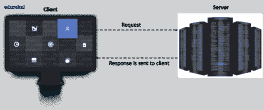
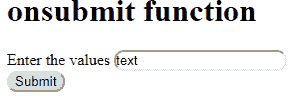
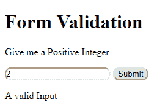

# 如何用 JavaScript 提交表单？

> 原文：<https://www.edureka.co/blog/javascript-form-submission/>

对于 web 应用程序和网站来说，表单提交是一个关键事件。web 表单是指用户应该输入一些细节并提交以供进一步处理的东西。因为在实时提交中保持验证检查几乎是不可能的，并且使用人力不是处理这种事情的最佳方式。这里，我们将按以下顺序讨论 JavaScript 表单提交:

*   [JavaScript 表单提交](#form)
*   [基本提交事件](#event)
*   [基本表单验证](#validate)
*   [验证电子邮件的 JavaScript 代码](#email)
*   [用于验证电子邮件的可视部分](#visiblesection)
*   [添加 CSS 口味](#css)

## **JavaScript 表单提交**

当表单被提交时，submit 事件被触发。因为这是客户端的事情，所以通常在将细节发送到服务器之前进行验证。[方法](https://www.edureka.co/blog/javascript-array/) form.submit()用于动态创建并将细节发送到服务器。JavaScript 表单提交可以用于对象创建，也可以使用各种属性。



属性可以是类别、id、标签等。通过属性调用非常简单，我们只需要正确放置符号。正如我们所知道的，当我们在名字前面加上句号和带井号的 id 时，就选择了类。

## **基本提交事件**

对于表单的 submit 事件，输入类型可以是 submit 或 image 类型。这里，我们将使用 alert()弹出我们的消息" [Edureka](https://www.edureka.co) "。此外，重要的是，我们添加了一个吸引人的外观 CSS。这里，只考虑边界半径属性。如果需要，可以添加更多的内容。为了使用 onsubmit 函数，下面提到了代码:

```

<html>
<head>
<style>
input
{
border-radius:20px;}
</style>
</head>
<body>
<h1> onsubmit function </h1>
<form onsubmit="alert('edureka!');return false">
Enter the values <input type="text" value="text"><br>
<input type="submit" value="Submit">
</form>
</body>
</html>

```

**输出:**



## **基本表单验证**

此外，为了进一步验证我们的 JavaScript 表单，我们需要应用某些约束。为了给出一个关于表单验证的整体概念，这里给出了一个例子。这里，我们的目标是检查用户的输入是否是一个真正的正数。因此，我们将约束与 if-else 消息一起放置在正确和不正确的输入中。

```

<!DOCTYPE html>
<html>
<style>
button{
border-radius: 10px;
}
input{
border-radius: 10px;
}
</style>
<body>
<h1>Form Validation</h1>
<p>Give me a Positive Integer</p>
<input id="edu">
<button type="button" onclick="myFunction()">Submit</button>
<p id="eduform"></p>
<script>
function myFunction() {
var x, text;
//Getting the value of the input field with id="edu"
x = document.getElementById("edu").value;
// If x is less than 0, input is invalid
//otherwise input is valid
if (isNaN(x) || x < 0) {
text = "Input invalid";
} else {
text = "A valid Input";
}
document.getElementById("eduform").innerHTML = text;
}
</script>
</body>
</html>

```

**输出:**



通常，表单验证步骤用于实时终端用户输入，通常包括姓名、密码、电子邮件等。

现在让我们仅以[电子邮件验证](https://www.edureka.co/blog/javascript-email-validation/)字段为例。为了验证 JavaScript 形式的电子邮件，可以用数字和符号来检查约束。电子邮件 id 的几种通用格式:

1.edureka@sample.com

2.edureka.website@domain.com

3.edureka.sample@domain.co.in

因此，一些有效的检查可以是:

“@”、@前无字符、TLD(顶级域名)不能以点开头，不允许使用双点。

## **验证电子邮件的 JavaScript 代码**

```

function ValidateEmail(inputText)
{
var mailformat = /^w+([.-]?w+)*@w+([.-]?w+)*(.w{2,3})+$/;
if(inputText.value.match(mailformat))
{
document.form1.text1.focus();
return true;
}
else
{
alert("Entered Email address is invalid!");
document.form1.text1.focus();
return false;
}
}

```

## **用于验证电子邮件的可视部分**

我们需要一个样式表和一个 JavaScript 文件来链接我们的 HTML 文件。首先，CSS 和 JavaScript 文件应该直接放在根文件夹中。这里，CSS 文件是“form-style.css”，JavaScript 文件是“edureka-email-validation.js”。为了将这些文件与我们的 HTML 文件链接起来，我们需要放置以下标签:

<link rel="’stylesheet’" href="’form-style.css’" type="’text/css’"> <脚本 src = " edu reka-email-validation . js "></脚本>

在这里，我们不需要实际制作一个登陆页面，在提交后页面会重定向。因此，我们用井号“#”保持表单操作空白。

用于验证电子邮件的 HTML 代码:

```

<!DOCTYPE html>
<html lang="en">
<head>
<meta charset="utf-8">
<title>JavaScript form validation | Email | Edureka</title>
<link rel='stylesheet' href='form-style.css' type='text/css' />
</head>
<body onload='document.form1.text1.focus()'>
<div class="mail">
<h2>Give me your email id</h2>
<form name="form1" action="#">
<ul>
<li><input type='text' name='text1'/></li>
<li>&nbsp;</li>
<li class="submit"><input type="submit" name="submit" value="Submit" onclick="ValidateEmail(document.form1.text1)"/></li>
<li>&nbsp;</li>
</ul>
</form>
</div>
<script src="edureka-email-validation.js"></script>
</body>
</html>

```

## **添加 CSS 风格|验证电子邮件**

1.  列表可以设置合适的字体大小和字体系列
2.  背景的 RGB 颜色:#D8F1F8
3.  可以根据需要定义输入焦点和提交区域。

```

li {list-style-type: none;
font-size: 16pt;
font-family: serif;
}
.mail {
padding-bottom: 10px;
width: 400px;
margin: auto;
padding-top: 10px;
border: 1px soild silver;
font-family: serif;
background-color:#9bf542;}
.mail h2 {
margin-left: 38px;
text-align: center;
font-family: serif;
}
input {
font-size: 20pt;
font-family: serif;
border-radius: 10px;
}
input:focus, textarea:focus{
font-family: serif;
}
input submit {
font-size: 12pt;
font-family: serif;
}
.rq {
color: #FF0000;
font-size: 10pt;
}

```

**输出:**


同样，我们可以对密码、年龄、出生日期和其他信息进行验证。正如我们注意到的，JavaScript 使得客户端验证变得很容易。有时，用户输入需要通过服务器端的某些算法检查。

*既然你已经了解了 JavaScript 表单提交，那就来看看 Edureka 的 **[Web 开发认证培训](https://www.edureka.co/complete-web-developer)** 。* *Web 开发认证培训将帮助您学习如何使用 HTML5、CSS3、Twitter Bootstrap 3、jQuery 和 Google APIs 创建令人印象深刻的网站，并将其部署到亚马逊简单存储服务(S3)。*

*有问题吗？请在“JavaScript 表单提交”的评论部分提到它，我们会给你回复。*