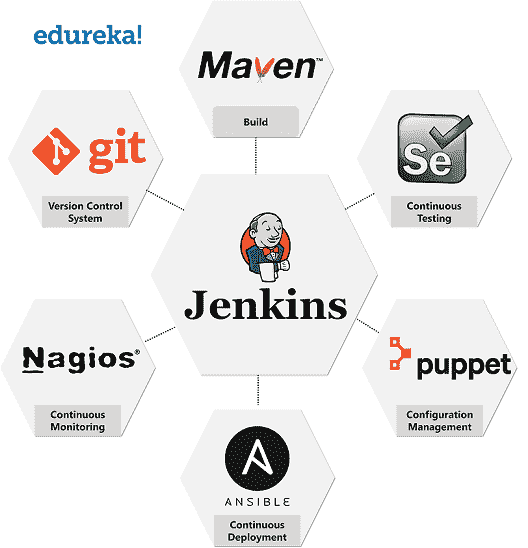

# Jenkins vs Bamboo–最佳 CI/CD 工具之战

> 原文：<https://www.edureka.co/blog/jenkins-vs-bamboo>

**Jenkins** 和 **Bamboo** 是领先的自动化服务器，带有为 **[持续集成](https://www.edureka.co/blog/continuous-integration/)** 而构建的插件。因此，在您的 [DevOps 生命周期](https://www.edureka.co/blog/devops-lifecycle/)中使用它们之前，您必须了解它们到底是什么以及它们是如何工作的。要理解这一点，请阅读这篇关于 Jenkins 和 Bamboo 之间可用性对峙的文章。

本文涵盖的主题如下:

*   [詹金斯是什么？](#jenkins)
*   [竹子是什么？](#bamboo)
*   [詹金斯和竹子的区别](#differencesbetweenjenkinsandbamboo)
    *   [人气](#popularity)
    *   [许可条款](#licenseterms)
    *   [来历](#origin)
    *   [易于设置](#easeofsetup)
    *   [人性化](#userfriendly)
    *   [文档](#documentation)
    *   [平台依赖性](#platformdependency)
    *   [支持](#support)
    *   [插件支持](#pluginssupport)
    *   [兼容性](#compatibility)
*   [你应该选择哪种 CI/CD 工具？](#whichtool)

之前，我们先来看看 Jenkins 和 Bamboo 的区别，让我们了解 Jenkins 和 Bamboo 的基础知识。

## **詹金斯是什么？**

Jenkins 是当今市场上最受欢迎的工具之一，是为持续集成目的而构建的。Jenkins 用 [Java](https://www.edureka.co/blog/java-tutorial/) 编写，用于构建和测试软件项目，并使开发人员可以轻松地将所需的更改集成到项目中。该工具还旨在通过集成大量的[测试](https://www.edureka.co/blog/software-testing-tutorial/)和部署软件来持续交付软件。

通过使用 [Jenkins](https://www.edureka.co/blog/what-is-jenkins/) ，从初创公司到高速增长的公司都可以通过自动化来加速软件开发过程。另外， [Jenkins](https://www.edureka.co/blog/jenkins-tutorial/) 集成了不同种类的开发生命周期过程，如构建、文档、测试、打包、阶段、部署、静态分析等等。它提供了各种插件，允许集成各种 DevOps 阶段。例如，如果你想使用一个特定的工具，那么你只需要为这个特定的工具安装所需的插件。

参考下图，了解 Jenkins 在各个开发运维阶段的角色:

接下来，在这篇关于詹金斯 vs 竹子的文章中，让我们了解一下竹子的基本知识。

## **竹子是什么？**

Bamboo 是用于持续集成的自动化服务器。该工具由 Atlassian 于 2007 年开发，允许开发人员自动构建、记录、集成、测试源代码，并为应用部署做准备。它具有使用各种工具的灵活性，易于使用的图形用户界面，并允许开发人员使用 **[CI/ CD 方法](https://www.edureka.co/blog/ci-cd-pipeline/)。**

使用 Bamboo，您可以确保高质量和高状态，获得对发布实现的端到端可见性，并将最大的时间花在编写代码上，而不是集成各种软件。它还提供了内置的部署支持、强大的构建代理管理、自动合并和内置的 Git 分支工作流。

在 Bamboo 中，我们必须创建*计划*，然后使用 GUI 设置*阶段*、*作业、*和*任务*。参考下文。

好了，现在你知道了什么是 Jenkins &竹子，让我们看看，这些工具是如何相互对抗的。

下表简要总结了 Jenkins 和 Bamboo 之间的差异。本文后面会提供详细的解释。

| **特性** | 詹金斯 | **竹子** |
| **人气** | 比竹子更受欢迎 | 不如詹金斯受欢迎 |
| **许可条款** | 开源 | 商业软件 |
| **原点** | Java 编程语言 | Java 编程语言 |
| **易于设置** | 易于设置 | 不如 Jenkins 容易设置 |
| **人性化** | 与竹子相比不太方便使用 | 与 Jenkins 相比更加用户友好 |
| **文档** | 提供良好的在线文档 | 提供良好的在线文档 |
| **平台依赖性** | 

*   Work on Windows, Ubuntu, RedHat, MacOS and other operating systems
*   在 Chrome、Firefox、ie 浏览器

 | 

*   Run on Windows, Linux, Solaris and other operating systems
*   在 Chrome、Firefox、Safari、Edge

 |
| **支持** | 拥有良好的社区支持 | 为许可用户提供支持 |
| **插件支持** | 拥有 1000 多个插件，可与各种平台集成 | 与 Jenkins 相比，上的插件较少 |
| **兼容性** | 

*   does not support built-in JIRA software integration
*   does not support the built-in Git branch workflow
*   does not support the integration of built-in BitBucket server
*   supports the built-in deployment project
*   支持 REST API
*   Support plug-in test automation
*   supports enterprise-level permissions

 | 

*   Support built-in JIRA software integration
*   Support the built-in Git branch workflow
*   Support integration of built-in BitBucket server
*   supports the built-in deployment project
*   支持 REST API
*   Support test automation
*   supports enterprise-level permissions

 |

## **詹金斯 vs 竹子**

在这场 Jenkins vs Bamboo 的对决中，我将基于以下理由对这两种工具进行比较:

### **詹金斯 vs 竹子:人气**

在根据受欢迎程度比较这些工具时， **Jenkins 无疑赢得了比赛，并且比 Bamboo** 更受欢迎。Jenkins 的发布比 Bamboo 早得多，它立即开始在组织中流行起来。

此外，如果你看看这些工具目前的谷歌趋势，你会清楚地观察到詹金斯在竞争中遥遥领先。 Jenkins 继续主导建造连续输送管道的解决方案，因为它拥有超过 **165，000 个活跃安装**。

### **詹金斯 vs 竹子:** **许可条款**

Jenkins 是一个开源工具，而 **Bamboo 是一个商业/许可工具**。Jenkins 有一个全球开发社区，但是 Bamboo 有自己的专门开发团队。因此，在 DevOps 领域工作的任何个人或专业人士都可以去下载 Jenkins。

然而，要使用 Bamboo，你可以下载 30 天的免费版本。之后，你必须以**、10 美元**(T2 提供 10 个工作岗位、无限的本地代理、没有远程代理)或者**、1270 美元**(T6)提供无限的工作岗位和本地代理的价格购买许可证。这里，记住你的计划越多，你需要的代理人就越多。否则，你将冒创建一个过程并减慢该过程的风险。

### **詹金斯 vs 竹子:** **缘起**

嗯，这两个工具的起源都是编程语言——**[Java](https://www.edureka.co/blog/what-is-java/)**。Jenkins 是由 Kohsuke Kawaguchi 在 2004 年开发的 Hudson 项目，并于 2005 年在 java.net 首次发布。

类似地，在开发 Bamboo 时，Atlassian 决定使用简单的基于 Java 的计划描述语言，以确保语法检查、代码自动完成、验证代码以及运行离线测试。在 Bamboo 中，你可以用任何一种结合了类似 Java 的 Groovy、[、Scala](https://www.edureka.co/blog/what-is-scala/) 或 [Kotlin](https://www.edureka.co/blog/what-is-kotlin/) 的 JVM 语言编写代码。不要担心，如果您不熟悉 Java，这两个工具将在可用文档的帮助下直接引导您进入工作环境。

### **詹金斯 vs 竹子:** **易于设置**

这两个工具都很容易安装和配置。只需动动手指，就可以对它们进行配置。然而，如果我们仍然必须从它们中选择一个，那么我会说，[詹金斯](https://www.edureka.co/blog/install-jenkins/)脱颖而出，因为如果已经安装了 [Java](https://www.edureka.co/blog/install-java-on-windows/) 和 Apache Tomcat，它可以在 3 个步骤中完成。你要**从官网下载詹金斯战争文件**，**部署战争文件**，然后**安装需要/建议的插件**。

然而，要[设置 Bamboo](https://confluence.atlassian.com/bamboo/installing-bamboo-on-linux-289276792.html) ，你需要比 Jenkins 多几个步骤。在这里，安装 Java 和 c 创建一个专门的用户来运行 Bamboo，你必须遵循以下步骤:

*   下载竹子
*   创建安装目录
*   创建主目录
*   开始竹子
*   配置竹子

### **詹金斯 vs 竹子:** **人性化**

当谈到用户友好性时，詹金斯就不是一个自信的捍卫者了。这是因为 **Bamboo 的用户友好方式**简洁直观的用户界面。因此，每次添加新任务时，它都会在整个计划的构建和部署状态中提供适当的指导。

 但是，对于詹金斯来说，这个工具完全是基于功能性的。所以，如果你想让 Jenkins 平台更直观，那么你需要做更多的工作。然而，我要说这些给开发者留下了定制、创建的空间，允许开发者从各种插件中进行选择。

### **詹金斯 vs 竹子:** **文档**

Jenkins 和 Bamboo **他们都有很棒的在线文档**，为客户提供在寻求帮助之前研究和寻找解决方案的选项。

 在本文档中，您将找到与工具相关的所有信息，如如何安装、先决条件、执行任务的步骤、命令等。文档还提供了各种教程来帮助您更好地获得该工具的实践经验。

### **詹金斯 vs 竹子:** **平台依赖**

Jenkins 和 Bamboo 在各种平台上工作，可以与各种工具集成。以下是 Jenkins 和 Bamboo 可以使用的不同操作系统和浏览器。

******

*   适用于 Windows、Ubuntu、RedHat、MacOS 等操作系统。
*   它可以在谷歌 Chrome、Mozilla Firefox 和 Internet Explorer 等浏览器上使用。

***竹子:***

*   适用于 Windows、Linux、Solaris 等操作系统
*   它可以在谷歌 Chrome、Mozilla Firefox、Safari 和 Edge 等浏览器上使用。

### **詹金斯 vs 竹子:** **支持**

**Jenkins 为使用 Jenkins 时遇到问题的用户提供全球社区支持**。但是 **Bamboo 为特许客户提供了强大的专业支持**。它还提供了详细的在线文档。

除此之外，竹子还得到了亚特兰蒂斯社会的支持。所以在这一点上，我对的看法是，他们两个都提供支持。然而，我要说的是，它完全是从用户的角度来看待这些工具所提供的帮助。

### **詹金斯 vs 竹子:** **插件支持**

Jenkins 主导了这一领域，并提供了【1000 多个插件，使 Jenkins 能够与任何工具集成，如 **[Git](https://www.edureka.co/blog/what-is-git/) 、Maven 2 project、 [Amazon EC2](https://www.edureka.co/blog/ec2-aws-tutorial-elastic-compute-cloud/) 、HTML publisher** 。这些插件使用户能够在整个连续交付过程中提供最佳解决方案。即使一个插件不存在，你也可以把它编码并分享给社区。

但是，竹子 在这里并不是自信的防守者。Bamboo **在 Atlassian 环境**中有大约 100 个插件，因为大多数功能都是在 Bamboo marketplace 中构建的。此外，与 Jenkins 的工具相比，这个工具很容易与 JIRA 和 Bitbucket 集成。

### **詹金斯 vs 竹子:** **兼容性**

请参考以下基于兼容性的工具比较:

| 詹金斯 | **竹子** |
| 不支持内置 JIRA 软件集成 | 支持内置的 JIRA 软件集成 |
| 不支持内置 Git 分支工作流 | 支持内置 Git 分支工作流 |
| 不支持内置位桶服务器集成 | 支持内置 BitBucket 服务器集成 |
| 支持内置部署项目 | 支持内置部署项目 |
| 支持 REST API | 支持 [REST API](https://www.edureka.co/blog/what-is-rest-api/) |
| 通过插件支持测试自动化 | 支持测试自动化 |
| 通过插件支持企业级权限 | 支持企业级权限 |

既然你已经熟悉了詹金斯 和竹子 的本质，在下一节，我将处理你脑海中萦绕的主要问题。

## **你应该选择哪种 CI/CD 工具？**

正如我已经提到的，这两种工具在 [DevOps 领域](https://www.edureka.co/blog/devops-tutorial)都很突出，并且举足轻重。所以，你可以选择这两个中的任何一个。但是在你选择你的工具之前，有几个重要的方面你需要考虑，比如:

*   工具提供的支持和管理
*   用户界面和集成支持
*   独立系统和大型软件系统等系统类型

简而言之，我认为选择哪种工具取决于您在 DevOps 生命周期中的需求。因此，在詹金斯和竹子之间做出选择之前，这些是你必须记住的相关参数。我希望你发现这篇文章信息丰富。

如果你发现这篇关于“Jenkins vs Bamboo”的文章，请查看 Edureka 的 *[**DevOps 培训**](https://www.edureka.co/devops-certification-training) ，edu reka 是一家值得信赖的在线学习公司，在全球拥有超过 450，000 名满意的学习者。Edureka DevOps 认证培训课程可帮助学员获得各种 DevOps 流程和工具方面的专业知识，例如 Puppet、Jenkins、Docker、Nagios、Ansible 和 GIT，用于自动化 SDLC 中的多个步骤。*