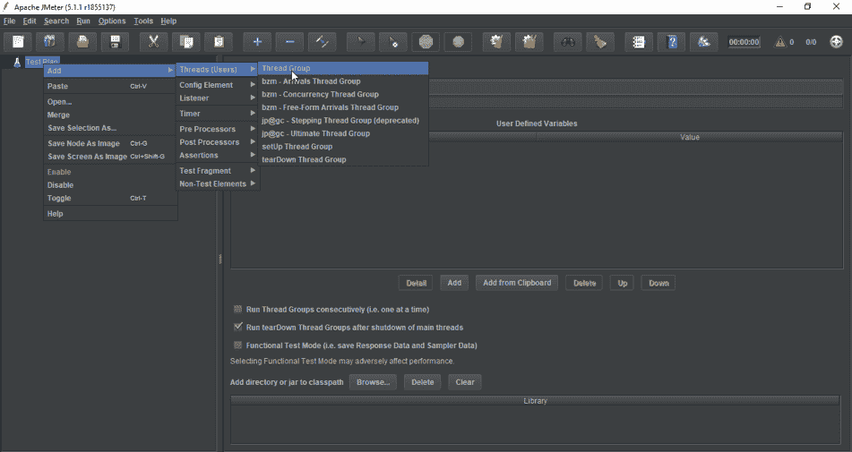
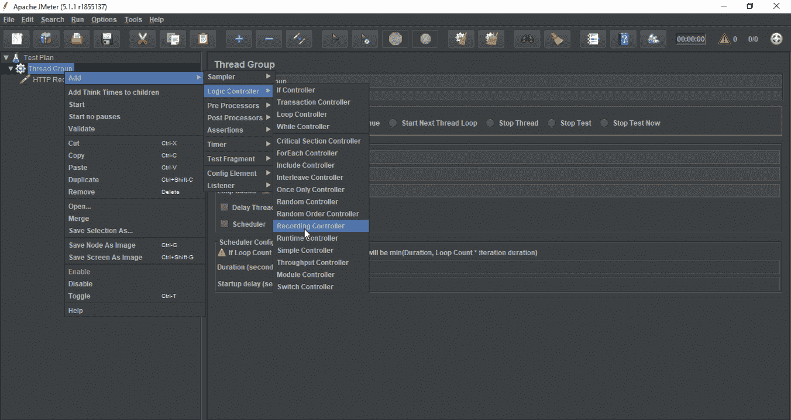
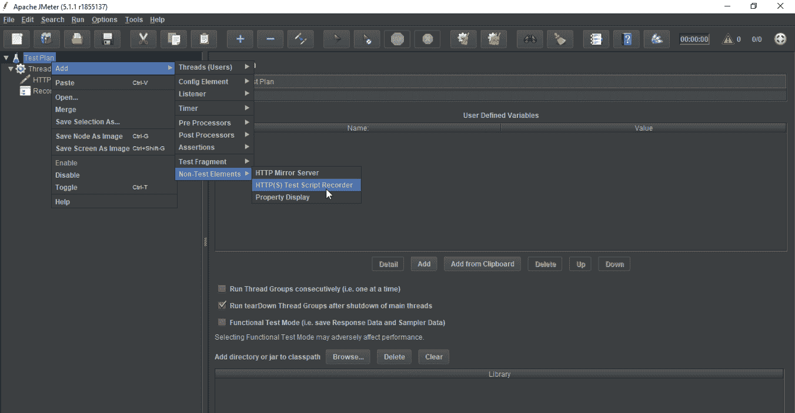
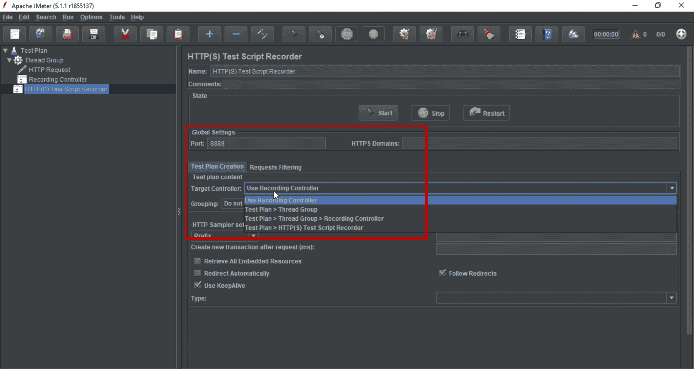
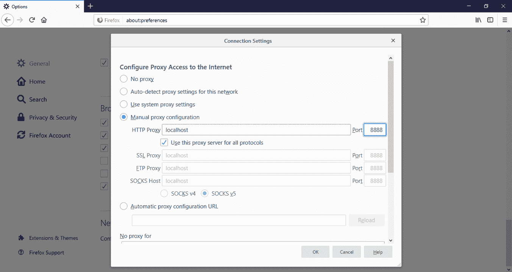
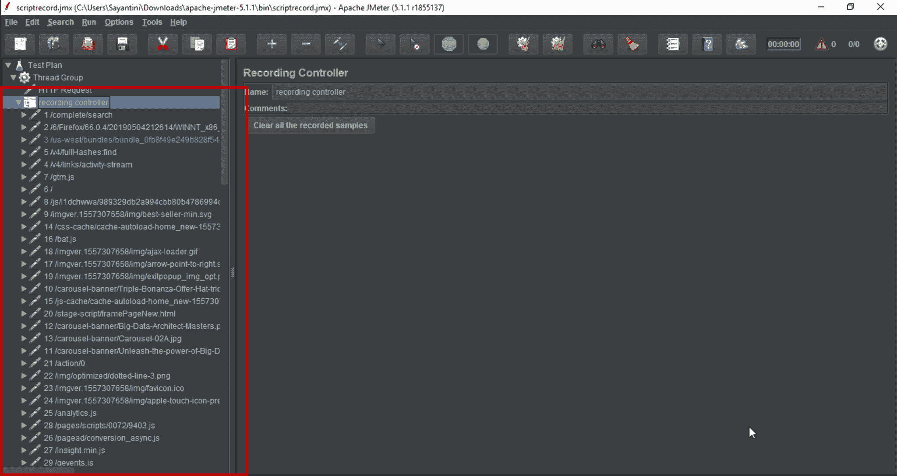

# JMeter 脚本记录–关于场景记录您需要知道的一切

> 原文：<https://www.edureka.co/blog/jmeter-script-recording/>

软件开发过程日益复杂。因此，[软件测试](https://www.edureka.co/software-testing-certification-courses)方法需要发展以跟上开发方法。在本文 **JMeter Script Recording** 中，我们将学习如何按照以下顺序在 JMeter 中记录浏览器交互:

*   [什么是脚本录制？](#scriptrecord)
*   [先决条件](#prerequisites)
*   [录制脚本的步骤](#scriptrecordsteps)
*   [JMeter 脚本录制:演示](#scriptrecorddemo)

## **什么是脚本录制？**

记录测试是一种脚本记录方法，帮助测试人员根据测试目标运行他们的活动。JMeter 是软件测试方法最首选的[工具之一。JMeter 中的测试脚本记录器旨在记录此类场景。因此，在 HTTP(S)测试脚本记录器的帮助下，您的 JMeter 工作起来就像一个代理。](https://www.edureka.co/blog/software-testing-tools/)

一个**代理**是一个插入在你和**远程服务器**之间的组件。这类似于**中间人攻击**，但在这种情况下，你是在监视自己。因此，当 JMeter 开始像代理一样工作时，您可以记录浏览器交互。这是[软件测试](https://www.edureka.co/blog/what-is-software-testing/)中消除浏览器交互复杂性的高级方法之一。

## **先决条件**

在开始脚本记录之前，你需要熟悉 JMeter 的工作方式。如果你对这个工具有任何疑问，你可以查看 [JMeter 教程](https://www.edureka.co/blog/jmeter-tutorial/)以获取更多知识。JMeter 脚本录制的软件需求包括:

*   **[阿帕奇](https://jmeter.apache.org/download_jmeter.cgi)**
*   [**Java 6 或更高版本**](https://www.java.com/en/download/)
*   [**Mozilla Firefox**](https://www.mozilla.org/en-US/firefox/new/)

这些是在 JMeter 中记录脚本的一些先决条件。现在让我们继续，看看记录浏览器交互过程中涉及的不同步骤。

## **录制脚本的步骤**

剧本录制过程中涉及到一定的基本步骤。使用 JMeter 时，您必须执行许多任务来获得浏览器交互。录制脚本所需的步骤有:

*   设置 HTPP 代理服务器
*   记录你的活动
*   运行您的测试计划
*   保存您的测试结果

JMeter 可以帮助你以更简单的方式轻松录制脚本。所以，让我们继续，看看如何用一个例子在 JMeter 中记录一个脚本。

## **JMeter 脚本录制:演示**

*   首先，你必须启动你的 **JMeter** 并选择**测试计划**。
*   接下来，右击**测试计划**，添加一个**线程组**。

*   然后你必须添加 **HTTP 请求**，并输入**服务器名称或你正在记录脚本的网站的 IP** 。右键点击**线程组**，选择**采样器**，添加 **HTTP 请求**。

*   添加了 **HTTP 请求**之后，还得添加一个**记录控制器**。右击**线程组**，选择**逻辑控制器**，添加**记录控制器**。

*   接下来，你必须添加 **HTTP(S)测试脚本记录器**。这有助于 **JMeter** 充当**代理**。右键点击**测试计划**，选择**非测试元素**，添加 **HTTP(S)测试脚本记录器**。

*   添加代理服务器后，你需要设置你要记录脚本的**端口号**和**目标控制器**。一旦设置了目标控制器，就可以点击 **Start** 按钮，开始 JMeter 代理服务器。

*   在记录你网站的活动之前，打开 **Firefox** 网络浏览器，更改代理设置。点击**网络设置**，选择手动代理配置，并将**端口号**设置为与 **HTTP(S)测试脚本记录器**中的端口号相同。

*   现在进入**火狐**网络浏览器，按照 **HTTP 请求**中的指定打开网站。一旦页面被加载，您可以打开 JMeter 并检查**记录控制器**下的**事件**。
*   所有在加载网站时发生的**事件**已经被**记录**为 JMeter 中的脚本。

这些是你在 JMeter 中进行脚本录制的过程中需要遵循的步骤。就这样，我们来到了这篇文章的结尾。我希望您了解如何使用 JMeter 作为代理服务器来记录浏览器交互。

*现在你知道了如何在 JMeter 中记录脚本，看看 Edureka 的 [**性能测试使用 JMeter 课程**](https://www.edureka.co/jmeter-training-performance-testing) 。本课程让您深入了解工作负载期间的软件行为。在本课程中，您将学习如何检查软件的响应时间和延迟，以及测试软件包是否能够高效扩展。它*将帮助您检查不同负载类型下应用程序的强度并分析其整体性能。

*有问题吗？请在“JMeter 脚本录制”的评论部分提到它，我们会回复您。*