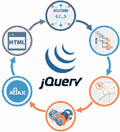
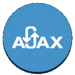
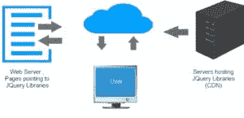

# 2023 年你需要知道的前 45 个 jQuery 面试问题及答案

> 原文：<https://www.edureka.co/blog/interview-questions/jquery-interview-questions/>

所有好的东西都是小包装的，jQuery 也是如此。它是一个用于 web 开发的小型 JavaScript 库，提供了一个有趣的 web 体验。jQuery 是最流行的 JavaScript 库之一。 **jQuery** **面试问题** 将为你提供深度知识，帮助你准备面试。

## **jQuery 面试问题**

### **Q1。提及 JavaScript 和 jQuery 之间的区别。**

| **JavaScript** | **jQuery** |
| 它是一种弱类型的动态编程语言 | jQuery 是一个简洁快速的 JavaScript 库 |
| 它是一种解释性语言 | 它使用 JavaScript 资源来简化任务 |
| 你需要编写自己的脚本，这可能是一个耗时的过程 | 您只需编写现有的 JQuery 脚本，这样可以节省时间 |
| 不需要添加任何额外的插件，因为所有的浏览器都支持 JavaScript | 您可能需要在页面标题中包含 jQuery 库 URL |
| 代码行太多 | 较少的代码行 |

### **Q2。什么是 jQuery？**

jQuery 是一个高效的&快速 JavaScript 库，由 John Resig 于 2006 年创建。jQuery 的座右铭是——写得更少，做得更多。它旨在简化 HTML 的客户端脚本。jQuery 的主要目的是提供一种在网站上使用 JavaScript 的简单方法，使网站更具交互性和吸引力。


它通过一个跨多种浏览器工作的易于使用的 API，使 HTML 文档遍历和操作、事件处理、动画和 Ajax 变得更加简单。

### **Q3。jQuery 有什么特点？**

jQuery 的一些关键特性是:

****

*   **DOM 操作**—jQuery 通过使用跨浏览器的开源选择器引擎，简化了 DOM 元素的选择、遍历和内容修改。

*   **事件处理**——它提供了一种优雅的方式来捕获各种各样的事件，比如用户点击一个链接，而不需要将 HTML 代码本身与事件处理程序混杂在一起。

*   **AJAX 支持**—jQuery 帮助您使用 AJAX 技术开发一个响应迅速、功能丰富的网站。

*   这个框架带有大量内置的动画效果，你可以在你的网站上使用。

*   这是一个非常轻量级的库——大约 19KB 大小。

*   **跨浏览器支持**—jQuery 具有跨浏览器支持，在 IE 6.0+、Safari 3.0+、Chrome 和 Opera 9.0+中运行良好。

### **Q4。提到 jQuery 的一些优点。**

使用 jQuery 有很多好处。其中一些包括:

*   它就像是 [**JavaScript**](https://www.edureka.co/blog/javascript-tutorial/) 的**增强版**，所以学习一种新的语法没有任何开销。

*   jQuery 有能力保持代码**简单、可读、清晰**和**可重用。**

*   它有**跨浏览器**支持。

*   这将消除编写复杂循环和 **DOM 脚本**库调用的需求。

*   jQuery 帮助进行**事件检测**和**处理**。

*   它提供了大量的**插件**来满足各种需求。

### **Q5。jQuery 中的选择器是什么？**

jQuery **选择器**是一个函数，它使用表达式根据给定的标准从 **DOM** 中找出**匹配元素**。在一种简单的语言中，选择器用于使用 jQuery 选择一个或多个 HTML 元素。一旦选择了一个元素，我们就可以对该元素执行各种操作。

在 DOM 中选择一个元素是通过使用一个包含任何 **CSS** 选择器表达式的字符串参数的 **$()** 构造来完成的。$()将返回零个或多个 DOM 元素，您可以在这些元素上应用任何效果或样式。

### **Q6。选择器有哪些不同的类型？**

jQuery 中使用了三种主要类型的选择器:

| **选择器** | **jQuery 语法** | **描述** |
| **标签名称** | $('div ') | 文档中的所有 div 标签 |
| **ID** | $(#“textid”) | 选择 ID 为 TextId 的元素。 |
| **类** | $(. my class)的缩写形式 | 选择 class 为 myclass 的所有元素。 |

### **Q7。什么是 jQuery.noConflict？**

**jQuery 无冲突**是 jQuery 提供的一个选项，用于克服不同 javascript 框架或库之间的冲突。当您使用 jQuery 无冲突模式时，您可以将 **$** 替换为一个新变量，并为 jQuery 分配一些其他的 JavaScript 库。此外，$被用作 jQuery 的函数名或变量名。

### **Q8。区分。jQuery 中的 empty() vs .remove() vs .detach()。**

• .**empty()**–该方法用于从匹配的元素中移除所有子元素。

**语法-**

```
$(selector).empty();

```

• .**remove()**–该方法用于删除所有匹配的元素。它将删除与匹配元素相关联的所有 jQuery 数据。

**语法-**

```
$(selector).remove();

```

**。detach()**–该方法与。remove()方法不同之处在于。detach()方法不会删除与匹配元素相关联的 jQuery 数据。

**语法-**

```
$(selector).detach();

```

### **Q9。jQuery 中用来提供效果的方法有哪些？**

jQuery 提供了惊人的效果，您可以通过简单的配置快速应用它们。效果可以是隐藏，显示，切换，淡出，淡入，淡入等等。其他一些提供效果的方法包括:

*   **animate( params，[duration，easing，callback] )** 这个函数为你的 HTML 元素制作自定义动画。

*   **fadeIn( speed，[callback] )** 该函数通过调整元素的不透明度并在完成后触发可选的回调来淡入所有匹配的元素。

*   **fadeOut( speed，[callback] )** 该函数用于淡出所有匹配的元素，方法是将它们的不透明度调整为 0，然后将显示设置为“none”，并在完成后触发一个可选的回调。

*   **fadeTo(速度，不透明度，回调)**该函数将所有匹配元素的不透明度渐变到指定的不透明度，并在完成后触发一个可选的回调。

*   **stop( [clearQueue，gotoEnd ])** 该功能停止当前所有正在运行的动画。

### **Q10。jQuery 中有哪些不同的 Ajax 函数？**

Ajax 允许用户与服务器交换数据，并更新页面的部分内容，而无需重新加载整个页面。ajax 的一些功能包括:

****

*   **$。Ajax()–**这被认为是最底层和最基本的功能。它用于发送请求。该功能可以在没有选择器的情况下执行。

*   **$。ajax setup()–**这个函数用于定义和设置各种 Ajax 调用的选项。

*   **$。get JSON()–**这是一种特殊类型的速记函数，用于接受请求发送到的 url。在这些函数中，可选数据和可选回调函数也是可能的。

### **Q11。在 jQuery** 中区分 width()和 CSS(‘width’)

jQuery 中有两种不同的方法来改变元素的宽度。第一种方式是使用**。css('width')** 和其他方式是使用**。宽度()**。

**例如-**

```
$('#mydiv').css('width','300px');
$('#mydiv').width(100);

```

**的区别。css('宽度')**和**。width()** 是我们指定或从两个函数返回的值的数据类型。英寸 css('width ')我们必须在宽度值中添加 px，而在。width()我们不用加 px。

### **Q12。区分 jQuery 中的 bind()与 live()和 delegate()方法。**

bind() 方法不会将事件附加到那些在 DOM 加载后添加的元素上。然而， **live()** 和 **delegate()** 方法也将事件附加到未来元素上。

**live()** 和 **delegate()** 方法的区别在于 **live()** 函数在链接中不起作用。它只对选择器或元素有效。但是 **delegate()** 方法在链接中起作用。

**例如**

```
$(document).ready(function(){
$("#myTable").find("tr").live("click",function(){
alert($(this).text());
});
});

```

使用 **live()** 方法，上面的代码将不起作用。但是我们可以用 **delegate()** 方法来完成。

```
$(document).ready(function(){
$("#dvContainer")children("table").delegate("tr","click",function(){
alert($(this).text());
});
});

```

### **Q13。jQuery 中 param()方法有什么用？**

**param()** 方法用于以**序列化**的方式表示数组或对象。在发出 ajax 请求时，我们可以在 URL 的查询字符串中使用这些序列化值。

**语法:**

```
$.param(object | array, boolValue)

```

*   “object | array”指定要序列化的数组或对象。

*   “boolValue”指定是否使用传统样式的参数序列化。

### **Q14。jQuery 中$(this)和 this 有什么区别？**

**this** 和 **$(this)** 指的是同一个元素，但不同的是,“this”在传统方法中使用，但通过$()它变成了一个 jQuery 对象，我们可以在其上使用 jQuery 的函数。

```
$(document).ready(function(){
$('#clickme').click(function(){
alert($(this).text());
alert(this.innerText);
});
});

```

在上面的例子中，当只使用“this”关键字时，我们可以使用 jQuery text()函数来获取元素的文本。一旦用$()编写了“this”关键字，我们就可以使用 jQuery 函数 text()来获取元素的文本。

### **Q15。如何在 jQuery 中读写删除 cookies？**

要在 jQuery 中处理 cookie，你必须使用 **Dough** cookie 插件。面团很容易使用，并有一些强大的功能。

*   **创建 cookie:**

```
$.dough(“cookie_name”, “cookie_value”);

```

*   **读取 Cookie:**

```
$.dough(“cookie_name”);

```

*   **删除 cookie:**

```
$.dough(“cookie_name”, “remove”);

```

### **Q16。什么是 jQuery connect，如何使用？**

一个 **jQuery connect** 是一个**插件**，用于连接或绑定一个函数和另一个函数。Connect 用于执行任何其他函数或插件中的函数。

它可以通过从 jQuery.com 下载 jQuery connect 文件来使用，然后将该文件包含在 HTML 文件中。你必须使用美元。连接将一个函数连接到另一个函数。

### **Q17。jquery.size()和 jquery.length 有什么区别？**


jQuery。size()方法给出了对象中元素的总数。但是 **size()** 方法并不是首选，因为 jQuery 有**。长度**属性。除了**，它做同样的事情。长度属性**没有**函数调用**的开销。

### **Q18。如何防止 ajax 请求后事件停止工作？**

有两种方法可以处理这个问题:

*   **事件委托的使用—**事件委托技术的工作原理是利用事件冒泡。它使用事件冒泡来捕获出现在域对象模型中任何地方的元素上的事件。在 jQuery 中，用户可以使用 **live** 和 **die** 方法来进行包含事件类型子集的事件委托。

**例如:**

```
$('#mydiv').click(function(e){
if( $(e.target).is('a') )
fn.call(e.target,e);
});
$('#mydiv').load('my.html')

```

*   **事件重新绑定用法—**使用该方法时，需要用户调用 bind 方法和添加的新元素。

**例如:**

```
$('a').click(fn);
$('#mydiv').load('my.html',function(){
$('#mydiv a').click(fn);
});

```

### **Q19。解释下面的代码将做什么:**

```
$( "div#first, div.first, ol#items > [name$='first']" )

```

这段代码首先执行一个查询来检索任何具有 *id* 的

元素。它还包括所有具有第一个*类*的< div >元素，以及所有 name 属性以字符串“first”结尾的< ol id="items" >元素的子元素。这展示了如何同时使用多个选择器。该函数将返回一个包含查询结果的 jQuery 对象。

### **Q20。$(窗口)有什么区别。load 和$(文档)。jQuery 中的 ready 函数？**

**$(窗口)。load** 是当页面上的 **DOM** 和其他内容完全加载时触发的事件。该事件在 ready 事件之后触发。在大多数情况下，脚本可以在 DOM 完全加载后立即执行。ready() 通常是编写 JavaScript 代码的最佳地方。但是在某些情况下，您可能需要在 load()函数中编写脚本。例如，获取图像的实际宽度和高度。

$(窗口)。一旦 DOM 和所有 CSS、图像和框架完全加载完毕，就会触发 load 事件。因此，这是编写 jQuery 代码以获取实际图像大小或获取在 load 事件引发之前加载的任何内容的详细信息的最佳位置。

### **Q21。什么是 CDN？使用 CDN 有什么好处？**

内容交付网络或内容分发网络( **CDN** )是部署在互联网上多个数据中心的大型分布式服务器系统。它以更高的带宽提供来自服务器的文件，从而加快加载速度。这是几家提供免费公共 cdn 的公司:

*   谷歌

*   微软

*   美国 Yahoo 公司(提供互联网的信息检索服务)

****

**使用 CDN 的优势:**

*   它减少了服务器的负载。

*   CDN 还节省带宽。jQuery 框架从这些 CDN 加载速度更快。

*   如果用户经常从这些 CDN 中的任何一个访问使用 jQuery framework 的站点，它将被缓存。

### **Q22。如何在项目中添加 jQuery 库？**

通过从[jQuery.com](https://jquery.com/)下载最新的 jQuery 库，并在 HTML/PHP/JSP/Aspx 页面中包含对 jQuery 库文件的引用，可以在 ASP.Net 项目中使用 jQuery 库。

**例如-**

```
<script src="_scripts/jQuery-1.2.6.js" type="text/javascript"</script>
<script language="javascript">
$(document).ready(function() {
alert('test');
});

```

### **Q23。JQuery 中 serialize()方法有什么用？**

jQuery **serialize()** 方法用于以标准的 **URL 编码的**符号创建文本字符串。它序列化表单值，以便在发出 **AJAX 请求**时，可以在 URL 查询字符串中使用它的序列化值。

**语法:**

```
$(document).ready(function(){
$("button").click(function(){
$("div").text($("form").serialize());
});
});

```

### **Q24。JQuery 中 val()方法有什么用？**

使用 jQuery **val()** 方法:

*   获取匹配元素集中第一个元素的当前值。

*   设置每个匹配元素的值。

**语法:**

```
$(document).ready(function(){
$("button").click(function(){
$("div").text($("form").serialize());
});
});

```

### **Q25。什么是 jQuery UI？**

jQuery UI 是建立在 jQuery JavaScript 库之上的一组用户界面交互、效果、小部件和主题。jQuery UI 适用于具有不同控件的高度**交互性**的 web 应用程序或具有日期选择器控件的简单页面。

### **Q26。jQuery Ajax 方法使用的四个参数是什么？**

jQuery Ajax 方法使用的四个参数是:

*   **URL**–您需要指定发送请求的 URL。

*   **Type**–这指定了请求的类型，比如 Get 或 Post。

*   **数据**–指定要发送给服务器的数据。

*   **缓存**–这决定了浏览器是否应该缓存请求的页面。

### **Q27。在页面中包含 jQuery 的所有方法是什么？**

在页面中包含 jQuery 的不同方法有:

*   本地副本在**脚本**标签内

*   jQuery.com 的远程副本

*   Ajax API 的远程拷贝

*   **脚本管理器**控件的本地副本

*   使用**客户端脚本**对象的嵌入式脚本

### **Q28。JQuery 中 html()方法有什么用？**

jQuery html()方法用于更改所选元素的全部内容。它用新内容替换选定的元素内容。

**语法:**

```
$(document).ready(function(){
$("button").click(function(){
$("p").html("Hello <b>edureka</b>");
});
});

```

### **Q29。JQuery 中 css()方法有什么用？**

jQuery **CSS()** 方法用于设置所选元素的**样式**属性或值。它便于您获取一个或多个样式属性。有两种方法可以完成以下操作:

**返回一个 CSS 属性**

它用于获取指定 CSS 属性的值。

```
$(document).ready(function(){
$("button").click(function(){
alert("Background color = " + $("p").css("background-color"));
});
});

```

**设置一个 CSS 属性**

该属性用于为所有匹配的元素设置一个特定的值。

```
$(document).ready(function(){
$("button").click(function(){
$("p").css("background-color", "blue");
});
});

```

### **Q30。jQuery 中的 jQuery Datepicker 是什么？**

jQuery UI Datepicker 是一个高度可配置的插件，它为您的页面添加了 Datepicker 功能。您可以自定义日期格式和语言，限制可选择的日期范围，并轻松添加按钮和其他导航选项。

默认情况下，当关联的文本字段获得焦点时，datepicker 日历会在一个小的覆盖区域中打开。对于内嵌日历，只需将 datepicker 附加到 div 或 span。您必须在您的 [**HTML**](https://www.edureka.co/blog/html-vs-html5/) 代码中使用 jQuery 引用来使其工作:

```
<head>
<link rel="stylesheet" href="//code.jquery.com/ui/1.11.4/themes/smoothness/jquery-ui.css">
<script src="//code.jquery.com/jquery-1.10.2.js"></script>
<script src="//code.jquery.com/ui/1.11.4/jquery-ui.js"></script>
</head>

```

### **Q31。定义 slideToggle()效果？**

slide 方法执行 up 和 down 元素。要在元素 jQuery 上实现上下滑动，有三种方法:

*   向下滑动()

*   slideUp()

*   slideToggle()

**slideDown()方法** 该函数用于滑动和隐藏下侧的元素:

```
<script type="text/javascript">
$(document).ready(function() {
$("#btnSlideDown").click(function() {
$("#login_wrapper").slideDown();
return false;
});
});
</script>

```

**slideUp()方法**

此功能用于向上滑动和显示元素:

```
<script type="text/javascript"
$(document).ready(function() {
$("#btnSlideUp").click(function() {
$("#login_wrapper").slideUp();
return false;
});
});
</script>

```

**slideToggle()方法**

这个方法介于 slideUp()方法和 slideDown()方法之间。它用于显示或隐藏上方或下方的元素:

```
<script type="text/javascript">
$(document).ready(function() {
$("#btnSlideToggle").click(function() {
$("#login_wrapper").slideToggle();
return false;
});
});
</script>

```

### **Q32。jQuery 中的 slice()方法是什么？**

slice()方法通过给出一个索引范围来选择匹配元素的子集。它根据一个参数给出 DOM 元素集。

**语法:**

```
.slice( start, end[Optional] )

```

*   **Start:** 这是切片方法的第一个强制参数。这指定了从哪里开始选择元素。

*   **End:** 这是可选参数。它指定了选择的范围。这指示在何处停止元素的选择，不包括结束元素。

### **Q33。Jquery 中的 queue()是什么？jquery 中 queue()的使用？**

在 jQuery 中，延迟属于自定义效果类别。它唯一的用途是延迟执行队列中后续项目的执行。 ***队列名称*** 是要插入延迟时间的队列的名称。默认情况下，它是一个" **fx** "队列。“fx”队列也被称为**效果队列**。

```
delay( duration [, queueName ] )

```

### **Q34。如何在 jQuery 中使用 array？**

数组是零索引的有序值列表。它们对于存储一组相同数据类型的值非常方便。


```
var names = [“Name1”,”Name2”]

```

前面的两种方法都是静态声明。现在让我们用数组做一些动态编程。

```
var namearray = [];
namearray.push(“Name1”) //Index 0
namearray.push(“Name2”) //Index 1
namearray.push(“Name3”) //Index 2

```

这里，**。push()** 是一个与数组结合使用的 jQuery 函数，它在数组末尾添加一个元素。

### **Q35。什么是 jQuery 插件？**

**插件**是一段**代码**。jQuery 插件是用标准 JavaScript 文件编写的代码。这些 JavaScript 文件提供了有用的 jQuery 方法，可以与 jQuery 库方法一起使用。

 你在插件中使用的任何方法都必须有一个**分号(；)**结束。除非明确指出，否则方法必须返回对象。它以这种方式产生干净和兼容的代码。您必须在文件名前面加上 jQuery，后面加上插件名，最后加上. js。

### **Q36。jQuery 中 Map 和 Grep 函数的区别？**

在**美元。map()** 你需要**循环**数组中的每个元素并修改它的值，同时 **$。Grep()** 方法使用现有数组中的一些过滤条件返回过滤后的数组。Map()的基本结构是:

```
$.map ( array, callback(elementOfArray, indexInArray) )

```

**语法为$。Grep():**

```

jQuery $.grep() Method

```

### **Q37。jQuery 如何与另一个同样使用$命名的 JavaScript 库结合使用？**

**$** 在 JavaScript 中没有特殊含义。它可以用于对象命名。在 jQuery 中，它只是用作 jQuery 对象和 jQuery()函数的**别名**。然而，jQuery 并不垄断$的使用，这可能会导致您希望将它与另一个也使用$的 JS 库结合使用。这将导致命名冲突。正是出于这个原因，jQuery 提供了 **jQuery.noConflict()** 方法。调用此方法需要在后续对 jQuery 及其函数的引用中使用基础名称 jQuery。

### **Q38。给定以下 HTML:**

```
<div id="expander"></div>
and the following CSS:
div#expander{
width: 100px;
height: 100px;
background-color: green;
}

```

在 jQuery 中编写代码来激活#expander div，在三秒钟内将它从 100 x 100 像素扩展到 200 x 200 像素。

这可以用 jQuery 编写，如下所示:

```
$( "#expander" ).animate(
{
width: "200px",
height: "200px",
},
3000 );</p>

```

### **Q39。jQuery 中的方法链是什么，有什么优势？**

方法链接是 jQuery 的一个特性，它允许在一条代码语句中对序列中的 jQuery 选择**执行多个方法。例如，以下代码片段是等效的:**

**无链接:**

```
$( "button#play-movie" ).on( "click", playMovie );
$( "button#play-movie" ).css( "background-color", "red" );
$( "button#play-movie" ).show();

```

**带链接:**

```
$( "button#play-movie" ).on( "click", playMovie )
.css( "background-color", "red" )
.show();

```

通过链接，只需选择按钮一次。然而，如果没有链接，jQuery 必须在应用每个方法之前搜索整个 DOM 并找到按钮。

### **Q40。jQuery.get()和 jQuery.ajax()有什么区别？**

| **jQuery.get()** | **jQuery.ajax()** |
| **jQuery.get()** 是一种快捷方法，它使用 jQuery.ajax()创建一个典型的用于简单信息检索的 **Ajax 请求**。其他预构建的 Ajax 请求由 jQuery 提供，如 jQuery.post()、jQuery.getScript()和 jQuery.getJSON()。 | **jQuery.ajax()** 是 jQuery 提供的包罗万象的 ajax 请求方法。它允许创建**高度定制的 Ajax 请求**，具有如何处理失败、请求是同步还是异步、请求响应的格式以及许多其他选项。 |

### **Q41。jQuery 有什么用。each()函数？**

" **jQuery.each()** "函数是一个通用函数，它将**遍历集合**(对象类型或数组类型)。具有长度属性的类似数组的对象通过它们的索引位置和值进行迭代。其他对象在其键值属性上迭代。然而,“jQuery.each()”函数的工作方式与$(选择器)不同。使用选择器处理 DOM 元素的每个()函数。但是两者都迭代一个 jQuery 对象。

如果我们向每个函数传递一个数组，它将遍历数组中的项，并访问当前项及其索引位置。

**语法-**

```
jQuery.each(collection, callback(indexInArray, valueOfElement))
< script type = "text/javascript" >
$(document).ready(function() {
var arr = ["Mary", "John", "Garry", "Tina", "Daisy"];
$.each(arr, function(index, value) {
alert('Position is : ' + index + ' And Value is : ' + value);
});
});
< /script>

```

### **Q42。prop 和 attr 有什么区别？**

**jQuery.attr()-** 它获取匹配元素集中第一个元素的属性值。

**jQuery。prop()**–获取匹配元素集中第一个元素的属性值。

属性携带关于 HTML 元素的附加信息，并且以 name="value "对的形式出现。您可以为 HTML 元素设置一个属性，并在编写源代码时定义它。

**例如-**

```
<input id="txtBox" value="Jquery" type="text" readonly="readonly" />

```

这里，“id”、“类型”和“值”是输入元素的属性。

### **Q43。jQuery 中的链接是什么？**

链接是 jQuery 的一个强大特性。这意味着为一个元素指定多个函数和/或选择器。链接减少了代码段，并使其非常干净和易于理解。一般来说，链接使用 jQuery 内置函数来加快编译速度。

**例如:**

```
$(document).ready(function() {
$("#div2").html($("#txtBox").prop("readonly")) + '</br>';
$("#div3").html($("#txtBox").attr("readonly"));
});

```

### **Q44。解释以下代码的作用:**

```
$( "div" ).css( "width", "300px" ).add( "p" ).css( "background-color", "blue" );

```

这段代码使用**方法链接**来完成几件事情。首先，它选择所有的< div >元素，并将它们的 CSS 宽度改为 300px。然后，它将所有的< p >元素添加到当前选择中，这样它最终可以将< div >和< p >元素的 CSS 背景色都更改为蓝色。

### **Q45。web 应用中使用的 jQuery 有哪些特性？**

jQuery 有一些在 web 应用程序中使用的重要特性，例如:

****

**1。** **HTML/DOM 操纵:** JavaScript 没有任何与 DOM 相关的特性，但是浏览器中的 JavaScript 确实包含了一些关于 DOM 的智能。

**2。事件处理:** jQuery 引入了一个叫做事件处理的特性。您可以编写当用户单击页面的某个部分，或者当鼠标移动到表单元素上时运行的代码。jQuery 包含许多事件，比如用户点击按钮，将鼠标移动到元素上，等等。

**3。Ajax 支持:**当你从 DropDownList 或同一页面上的其他控件中选择一个项目时，会导致数据丢失。Ajax 用于更新网页的一部分，而无需重新加载页面。

**4。jQuery 中的动画:**jQuery 提供了大量内置的动画效果，您可以在自己的网站中使用。比如动画，显示，隐藏等等。在 jQuery 中，animate()方法用于执行这样的任务。

到此，jQuery 面试问题博客到此结束。希望这些 **jQuery 面试问题**能对你的面试有所帮助。如果你最近参加过这样的面试，请把这些面试问题贴在评论区，我们会回答。如果你在 jQuery 面试中有任何问题，你也可以在下面评论。

*查看我们的 **[全栈 Web 开发人员硕士课程](https://www.edureka.co/masters-program/full-stack-developer-training)** ，该课程包含讲师指导的现场培训和真实项目经验。本培训使您精通使用后端和前端 web 技术的技能。包括 Web 开发、jQuery、Angular、NodeJS、ExpressJS 和 MongoDB 方面的培训。*

*有问题吗？请在“jQuery 面试问题”博客的评论部分提到它，我们会给你回复。*