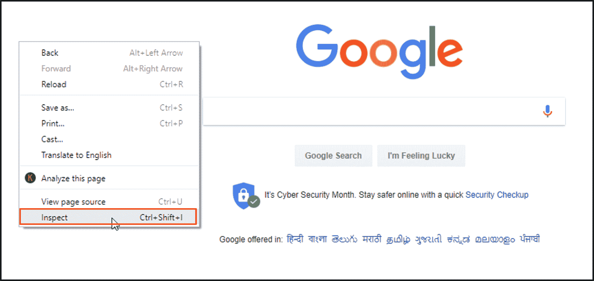
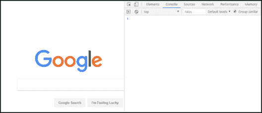
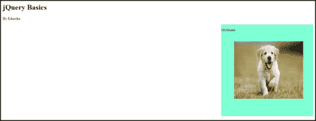

# jQuery 教程——jQuery 是什么，如何学习？

> 原文：<https://www.edureka.co/blog/jquery-tutorial/>

所有的好东西都是小包装的，jQuery 也是如此。jQuery 是一个小型的 JavaScript T2 库，它将网络变成了一种娱乐体验。它是最流行的 JavaScript 库之一。在这个 jQuery 教程博客中，您将了解 jQuery 的重要性和基本原理。

我将讲述以下主题:

1.  [JavaScript 是什么？](#one)
2.  [为什么要用 jQuery？](#two)
3.  [什么是 jQuery？](#three)
4.  [安装 jQuery](#four)
5.  [【文档对象模型】](#five)
6.  [jQuery 选择器](#six)
7.  [jQuery 基本面](#seven)
    1.  [jQuery 方法](#eight)
    2.  [jQuery 事件](#eve)
    3.  [jQuery 特效](#effects)
    4.  [jQuery UI](#uii)

## **什么是 JavaScript？**

[更准确地说，它是一种脚本语言，让你在网页上实现复杂而美丽的东西/设计。当你注意到一个网页不只是坐在那里呆呆地看着你，你可以打赌这个网页正在使用 JavaScript。](https://www.edureka.co/blog/what-is-javascript/)

*什么是 JavaScript–jQuery 教程* 

**JavaScript 的特性:**

*   它通过添加动作和图形使网页更具互动性
*   它是一种解释语言，这意味着你不需要编译器来运行 JavaScript
*   JavaScript 主要是一种客户端脚本语言

如果你想了解更多关于 JavaScript 的知识，请看这个视频:

## **JavaScript 初学者教程| Edureka**


[//www.youtube.com/embed/J4UKL355sUo?rel=0&showinfo=0](//www.youtube.com/embed/J4UKL355sUo?rel=0&showinfo=0)

本视频通过相关示例解释了 JavaScript 的基础知识。

## **为什么要用 jQuery？**

我们都知道有上百种 JavaScript 框架和库，但是 jQuery 为什么有用呢？

*jQuery 的特点–jQuery 教程*

这里有一个让 jQuery 如此有效的特性列表:

*   首先，jQuery 使得操作 DOM 变得非常容易。为了让 web 应用程序更具交互性，web 开发人员操纵 DOM & jQuery 让这变得非常容易
*   它的用户群体比其他任何 JavaScript 库都更加多样化。它提供了一个开发者所需要的详细文档
*   jQuery 有 1000 个免费的插件，改善了用户体验。一个这样的例子是 AJAX(异步 JavaScript 和 XML ),它开发了一个响应迅速、功能丰富的网站
*   jQuery 提供跨浏览器支持，让你可以在不同的浏览器上运行代码，而不用担心依赖问题

## **什么是 jQuery？**

jQuery 是由 John Resig 在 2006 年创建的一个高效的&快速 JavaScript 库。jQuery 的座右铭是少写多做，这非常贴切，因为它的功能围绕着简化每一行代码。下面是 jQuery 主要特性的列表:

*什么是 jQuery–jQuery 教程*

*   **简化了 JavaScript** :它简化了 DOM 操作和事件处理，用于快速 web 开发
*   **事件处理** : jQuery 提供了一种有效的方式来捕获各种各样的事件，比如用户点击一个链接，而不需要弄乱 HTML 代码
*   **轻量级** : jQuery 是一个紧凑的轻量级库，大小约为 19KB

如果你想获得关于 jQuery 的深入解释，可以看看我们的 [jQuery 专家](https://www.edureka.co/jquery-ui-development)录制的这个视频。

## **jQuery 初学者教程| Edureka**


[//www.youtube.com/embed/2OMzGhlIZpg?rel=0&showinfo=0](//www.youtube.com/embed/2OMzGhlIZpg?rel=0&showinfo=0)

这段视频将帮助你理解 jQuery 的基础知识，你将能够使用 jQuery 创建自己的程序。

## **安装 jQuery**

本质上没有安装，更像是下载 jQuery。安装 jQuery 有两种方式:

1.  **本地安装:**你可以直接从他们官网下载 jQuery 库，包含在你的 HTML 代码里
2.  **链接到 CDN:** 您可以从内容交付网络将 jQuery 库添加到您的 HTML 代码中

在这篇博客中，我将使用第二种方法。这里有一个 CDN 的链接，只需将它复制并粘贴到 HTML 文件的<脚本>标签中:

```


<link href="https://code.jquery.com/ui/1.10.4/themes/ui-lightness/jquery-ui.css" rel="stylesheet">

```

在我们继续之前，我想提一下，我正在使用 [Visual Studio Code](https://code.visualstudio.com/) 编辑器编写我的代码，我将在谷歌 Chrome 浏览器上运行我的所有代码。谷歌 Chrome 有一个嵌入式 JavaScript 引擎，可以运行所有的基本命令。你所要做的就是打开一个浏览器，右键点击空白处并选择 Inspect。



*谷歌 Chrome 浏览器–jQuery 教程*

这将打开一个 JavaScript 控制台，让您运行您的命令。

* JavaScript 控制台–jQuery 教程*

## **【文档对象模型】**

DOM 是各种 HTML 元素的树形结构。

*DOM–jQuery 教程*

在上图中:

*   < html >是所有其他 DOM 元素 的祖先
*   <头>和<体>元素都是<html>的后代
*   <头衔>是<头的孩子>
*   <h1>&<p>元素是< body >和<html>T3 的子元素

为了操作 DOM 元素，理解 DOM 背后的概念是很重要的。

## **jQuery 选择器**

jQuery 选择器通过使用“$()”函数来选择和操作 HTML 元素。在常规的 JavaScript 中，我们有像 document.getElementById、querySelectorAll、getElementByClass 这样的函数和许多其他复杂的函数来完成这个任务。但是在 jQuery 中，“$()”函数取代了所有这些函数。参考下面的语法:

***$(选择器)。*动作()**

我们来看一个例子:

```
<!DOCTYPE html>
<html>
    <head>
        <title> jQuery Tutorial</title>
        
        
        <link href="https://code.jquery.com/ui/1.10.4/themes/ui-lightness/jquery-ui.css" rel="stylesheet">  
    </head>

<body>

<h1>jQuery Basics</h1>

By Edureka

</body>
</html>

```

运行上述代码后，打开 JavaScript 控制台，输入“$”(选择器函数)检查是否成功安装了 jQuery。这将返回如下所示的函数:

* jQuery 安装–jQuery 教程*

现在您已经安装了 jQuery，让我们在浏览器控制台上运行以下命令:

```
$("h1").css("color", "red")

```

该命令选择< h1 >标签，并向其添加一个 css()方法，该方法用于样式化< h1 >标签，在本例中< h1 >颜色设置为红色。

这是最后的结果:

 jQuery 选择器输出–jQuery 教程

## **jQuery 基础**

既然你已经对 jQuery 有了基本的了解，那就让我们深入探究 jQuery 编程吧。我将涵盖以下基本要素:

1.  jQuery 方法
2.  jQuery 事件
3.  jQuery 效果
4.  jquery ui

### **jQuery 方法**

jQuery 有几种方法，我将介绍最常用的方法。这里有一个你将要学习的方法列表:

1.  [jQuery Methods–before()](#bef)
2.  [jQuery Methods–after()](#aft)
3.  [jQuery Methods–text()](#txxt)
4.  [jQuery 方法–html()](#htt)
5.  [jQuery 方法–CSS()](#csss)
6.  [jQuery 方法–attr()](#attrr)
7.  [jQuery 方法–val()](#vall)
8.  [jQuery 方法–addClass()](#ac)
9.  [jQuery 方法–remove class()](#rc)
10.  [jQuery 方法–toggle class()](#togg)

### **jQuery Methods–before()**

jQuery before()方法用于在所选元素前插入指定内容。参考下面的语法:

***$(选择器)。之前(内容)；***

我们来看一个例子:

```
<!DOCTYPE html>
<html>
    <head>
        <title> jQuery Tutorial</title>
        
        
        <link href="https://code.jquery.com/ui/1.10.4/themes/ui-lightness/jquery-ui.css" rel="stylesheet">  
    </head>

<body>

<h1>jQuery Basics</h1>

By Edureka

<ul>

<li>Golden Retriever</li>

<li>Syberian Husky</li>

<li>Boxer</li>

    </ul>

</body>
</html>

```

运行上述代码后，打开 JavaScript 控制台，输入以下命令:

```
$("ul").before("

<h2>My favourite dogs!!</h2>

")

```

这个命令选择了< ul >(无序列表)并添加了一个< h2 >标签，上面写着“我最喜欢的狗！!"就在< ul >标签之前。

这是最终的结果:

* jQuery 方法 before()输出-jQuery 教程*

### **jQuery Methods–after()**

jQuery after()方法用于在选中的元素后插入指定的内容。参考下面的语法:

***$(选择器)。(内容)之后；***

### 

引用用于 before()方法的相同代码，打开 JavaScript 控制台，键入以下命令:

```
$("ul").after("

<h2>All dogs are adorable!!</h2>

")

```

这个命令选择了< ul >(无序列表)并添加了一个< h2 >标签，上面写着“所有的狗都是可爱的！!"就在< ul >标签之后。

这是最终的结果:

* jQuery 方法–after()输出–jQuery 教程*

### **jQuery Methods–text()**

jQuery text()方法用于设置或返回所选元素的文本内容。参考下面的语法:

***$(选择器)。*正文()**

***$(选择器)。*正文(内容)**

### 

引用用于 before()方法和 的相同代码，打开 JavaScript 控制台，键入以下命令:

```
$("li").text()
$("p").text("Welcome to this fun jQuery Tutorial")

```

第一条命令选择<李>(列表)并使用 text()方法返回<李>的内容。第二个命令选择唯一的< p >标记，并将< p >标记的内容设置为“欢迎使用这个有趣的 jQuery 教程”。

这是最终的结果:

* jQuery 方法–text()输出–jQuery 教程*

### **jQuery 方法–html()**

jQuery html()方法用于设置或返回所选元素的全部内容。 参考下面的语法:

***$(选择器)。*html()**

***$(选择器)。【html(内容)T3***

### 

引用用于 before()方法的相同代码，打开 JavaScript 控制台，键入以下命令:

```
$("li:first").html()
$("li:last").html("

<li> German shepherd</li>

")

```

第一条命令选择<李>(列表)的第一个元素，使用 html()方法返回<李>的全部内容。第二个命令选择< li >标签的最后一个元素，并用“German Shepherd”设置或替换它的内容。

这是最终结果:

* jQuery 方法–html()输出–jQuery 教程*

我知道你们都在想，text()和 html()方法有什么不同？那么，运行下面的命令，自己看看:

```
$("ul").text()
$("ul").html()

```

### **jQuery 方法–CSS()**

jQuery css()方法用于获取或设置所选元素的样式属性。参考下面的语法:

***$(选择器)。CSS(property name)；***

***$(选择器)。css(propertyname，value)；***

### 

引用用于 before()方法的相同代码，打开 JavaScript 控制台，键入以下命令:

```
$("h1").css("background-color", "blue")
$("ul li").css("color", "green")

```

第一个命令选择< h1 >并对其应用背景色。第二个命令选择了< ul >标签的所有元素，并将它们的颜色设置为绿色。

这是最终的结果:

* jQuery 方法–CSS()输出–jQuery 教程*

### **jQuery 方法–attr()**

jQuery attr()方法用于设置或返回所选元素的属性和值。 参考下面的语法:

***$(选择器)。【T2 属性】【T3 属性】***

***$(选择器)。【attr(属性，值)***

### 

让我们来看一个例子，但是在你运行下面的代码之前，这里要注意的一点是，我加载了三张小狗的图片，我把它们保存在 jQuery 文件夹中一个名为“puppie”的文件夹中(包含 index.html 文件和 css 文件)。

```
<!DOCTYPE html>
<html>
<head>
<title> jQuery Tutorial</title>
<link rel="stylesheet" type="text/css" href="index.css">


        <link href="https://code.jquery.com/ui/1.10.4/themes/ui-lightness/jquery-ui.css" rel="stylesheet">  
    </head>

<body>

<h1>jQuery Basics</h1>

By Edureka

<div class="puppers">

        

        

        

    </div>

</body>
</html>

```

运行上述代码后，打开 JavaScript 控制台并输入以下命令:

```
$("img").attr("border","5px solid black")

```

该命令选择所有图像(img ),并使用 attr()方法为每个图像添加一个名为 border 的属性，并将其设置为纯黑色。

这里需要注意的一点是，我在代码中链接了一个 index.css 文件，它将所有图像并排对齐，并设置图像的宽度和高度。下面是 index.css 文件:

```
.puppers {
float:left;
}

img {
width: 300px;
height: 250px;
}

```

这是最终的结果:

* jQuery 方法–attr()输出–jQuery 教程*

### **jQuery 方法–val()**

jQuery val()方法用于设置或返回所选元素的当前值。参考下面的语法:

***$(选择器)。*val()**

***$(选择器)。*val(值)T3**

### 

我们来看一个例子:

```
<!DOCTYPE html>
<html>
    <head>
        <title> jQuery Tutorial</title>
        
        
        <link href="https://code.jquery.com/ui/1.10.4/themes/ui-lightness/jquery-ui.css" rel="stylesheet">  
    </head>

<body>

<h1>jQuery Basics</h1>

By Edureka

    
    <input type="text" id="sometext" value=" ">

    <button>Submit</button>    
</body>
</html>

```

运行上面的代码后，打开 JavaScript 控制台，在输入框中输入一些值，这个值通过 val()方法作为警告返回。

这是最终的结果:

 jQuery 方法–val()输出–jQuery 教程

### **jQuery 方法–addClass()**

add class()方法用于将一个或多个类添加到选中的元素中。 参考下面的语法:

***$(选择器)。addClass(类名)***

### 

我们来看一个例子:

```
<!DOCTYPE html>
<html>
    <head>
        <title> jQuery Tutorial</title>
        <link rel="stylesheet" type="text/css" href="index.css">
        
        
        <link href="https://code.jquery.com/ui/1.10.4/themes/ui-lightness/jquery-ui.css" rel="stylesheet">  
    </head>

<body>

<h1>jQuery Basics</h1>

By Edureka

<div class="puppers">

        

        

        

    </div>

      


    <button>Try addClass() function</button>
</body>
</html>

```

运行上述代码后，打开 JavaScript 控制台，点击“尝试添加类”按钮，这将为所有图片添加一个样式类。

这是最终的结果:

* jQuery 方法–addClass()输出–jQuery 教程*

### **jQuery 方法–remove class()**

jQuery remove class()方法将一个或多个类移除到选中的元素中。参考下面的语法:

***$(选择器)。removeClass(类名)***

### 

这个方法类似于 addClass，只不过它将删除已添加的类。运行您为 addClass 执行的相同代码，打开控制台，尝试下面的命令，看看您会得到什么！

### 

```
$("img").removeClass("styleclass")

```

### **jQuery 方法–toggle class()**

该方法在添加和删除一个或多个类到所选元素之间切换。参考下面的语法:

***$(选择器)。toggle class(class name)***

### 

toggleClass()是 addClass()和 removeClass()的组合。运行您为 addClass 执行的相同代码，打开控制台，尝试下面的命令，看看您会得到什么！

```
$("img").toggleClass("styleclass")

```

## **jQuery 事件**

有几个 jQuery 事件，我将介绍最常用的事件。以下是您将要学习的事件列表:

1.  [jQuery 事件–点击()](#clc)
2.  [【jQuery 事件-on()】](#onn)
3.  [【jQuery 事件-按键()】](#kp)

### **jQuery 事件–点击()**

当你点击一个元素时，点击事件通过执行一个函数或者一组语句而发生。参考下面的语法:

***$(选择器)。点击*(功能)**

### 

我们来看一个例子:

```
<!DOCTYPE html>
<html>
    <head>
        <title> jQuery Tutorial</title>
        <link rel="stylesheet" type="text/css" href="index.css">
        
        
        <link href="https://code.jquery.com/ui/1.10.4/themes/ui-lightness/jquery-ui.css" rel="stylesheet">  
    </head>

<body>

<h1>jQuery Basics</h1>

By Edureka

       

<div class="puppers">

        

        

        
    </div>

</body>
</html>

```

运行上述代码后，打开 JavaScript 控制台，在输入框中输入任意字符。在一个字符的按键上，写着“开始输入…”的< p >标签被隐藏。因此，在本例中，我们使用 on()事件来添加另一个事件侦听器，即 keypress()。

这是最终的结果:

* jQuery 事件——按键( )和 on()输出——jQuery 教程*

### **jQuery 事件–按键()**

jQuery keypress()事件在输入字符时执行。参考下面的语法:

***$(选择器)。*按键(功能)**

### 

参考 click()方法理解 keypress()方法。

## **jQuery 特效**

jQuery 有几种效果，我将介绍最常用的效果。下面是你将要学习的效果列表:

1.  [【jQuery 特效-隐藏()】](#hid)
2.  [【jQuery 特效-展示()】](#shs)
3.  [【jQuery 特效-toggle()】](#gle)
4.  [【jQuery Effects-fadeOut()】](#fo)
5.  [jQuery Effects-fade in()](#fi)
6.  [jQuery Effects-fade toggle()](#ft)
7.  [【jQuery 特效-slide down()】](#sd)
8.  [【jQuery Effects-slide up()】](#su)
9.  [jQuery Effects-slide toggle()](#st)

### **jQuery Effects–hide()**

jQuery hide()方法用于隐藏选中的元素。参考下面的语法:

***$(选择器)。隐藏(速度，回调)；***

### 

我们来看一个例子:

```
<!DOCTYPE html>
<html>
    <head>
        <title> jQuery Tutorial</title>
        <link rel="stylesheet" type="text/css" href="index.css">
        
        
        <link href="https://code.jquery.com/ui/1.10.4/themes/ui-lightness/jquery-ui.css" rel="stylesheet">  
    </head>

<body>

<h1>jQuery Basics</h1>

By Edureka

<button class="buttons" id="hide">Hide</button>
<button class="buttons" id="show">Show</button> 

<div class="puppers">
             
    </div>


</body>
</html>

```

运行上述代码后，打开 JavaScript 控制台，点击 hide 按钮。这将隐藏图像，因为我们在图像上使用了 hide()方法。

* jQuery 效果–隐藏( )输出–jQuery 教程*

### **jQuery Effects–show()**

jQuery show()方法用于显示选中的元素。参考下面的语法:

***$(选择器)。秀(速度，回调)；***

### 

参考用于 hide()方法的相同代码，我已经在其中提到了 show()方法。

运行代码后，打开 JavaScript 控制台，点击 show 按钮。这将显示隐藏的图像，因为我们在图像上使用了 show()方法。

* jQuery 效果–show()输出–jQuery 教程*

### **jQuery Effects–toggle()**

jQuery toggle()方法用于在 hide()和 show()方法之间切换。它显示隐藏的元素并隐藏可见的元素。参考下面的语法:

***$(选择器)。toggle(速度，回调)；***

### 

切换()效果是隐藏()和显示()的组合。运行与 hide()效果相同的代码，打开控制台，尝试下面的命令，看看会得到什么！

```

$("img").toggle()

```

### **jQuery Effects–fadeOut()**

jQuery fadeOut()方法用于淡出选中的元素。参考下面的语法:

***$(选择器)。fadeOut(速度，回调)；***

我们来看一个例子:

```
<!DOCTYPE html>
<html>
    <head>
        <title> jQuery Tutorial</title>
        <link rel="stylesheet" type="text/css" href="index.css">
        
        
        <link href="https://code.jquery.com/ui/1.10.4/themes/ui-lightness/jquery-ui.css" rel="stylesheet">  
    </head>

<body>

<h1>jQuery Basics</h1>

By Edureka

    <button>BYEEEEE</button>

<div class="puppers">
        
        
        
     </div>


</body>
</html>

```

运行上述代码后，打开 JavaScript 控制台，点击“BYEEE”按钮。这将淡出()每个图像一个接一个。

这是最终的结果:

* jQuery 效果–fadeOut()输出–jQuery 教程*

### **jQuery Effects–fade in()**

jQuery fadeIn()方法用于淡入选中的元素。参考下面的语法:

***$(选择器)。fadeIn(速度，回调)；***

### 

我们来看一个例子:

```
<!DOCTYPE html>
<html>
    <head>
        <title> jQuery Tutorial</title>
        <link rel="stylesheet" type="text/css" href="index.css">
        
        
        <link href="https://code.jquery.com/ui/1.10.4/themes/ui-lightness/jquery-ui.css" rel="stylesheet">  
    </head>

<body>

<h1>jQuery Basics</h1>

By Edureka


<button>Namaste</button>

<div class="fade">

<div id="one" style="width:2200px;height:60px;display:none;background-color:orange;"></div>

<div id="two" style="width:2200px;height:60px;display:none;background-color:white;"></div>

<div id="three" style="width:2200px;height:60px;display:none;background-color:green;"></div>

</div>

</body>
</html>

```

运行上述代码后，打开 JavaScript 控制台，点击“Namaste”按钮。这将 fadeInOut()三个矩形排序看起来像印度国旗。

这是最终的结果:

* jQuery 效果–fade in()输出–jQuery 教程*

### **jQuery Effects–fade toggle()**

jQuery fadeToggle()方法用于在 fadeIn()和 fadeOut()方法之间切换。参考下面的语法:

***$(选择器)。fadeToggle(速度，回调)；【T2***

### 

fade toggle()效果是 fadeOut() 和 fadeIn()的组合。运行与 fadeIn()效果相同的代码，打开控制台，尝试下面的命令，看看会得到什么！

```
$("#one").fadeToggle()
$("#two").fadeToggle()
$("#three").fadeToggle()

```

### **【jQuery Effects–slidown()】**

jQuery slideDown()方法用于向下滑动选中的元素。参考下面的语法:

***$(选择器)。下滑(速度，回调)；***

### 

我们来看一个例子:

```
<!DOCTYPE html>
<html>
    <head>
        <title> jQuery Tutorial</title>
        
        
        <link href="https://code.jquery.com/ui/1.10.4/themes/ui-lightness/jquery-ui.css" rel="stylesheet">  
    </head>

<body>

<h1>jQuery Basics</h1>

By Edureka

<button id="one">Slide</button>

<div id="div1" style="width:90px;height:60px;display:none;background-color:orange;"></div>

    
</body>
</html>

```

运行上述代码后，打开 JavaScript 控制台，点击“滑动”按钮。这将向下滑动()一个小盒子。

这是最终的结果:

* jQuery 效果–slide down()输出–jQuery 教程*

### **jQuery Effects–slide up()**

jQuery slideUp()方法用于向上滑动选中的元素。参考下面的语法:

***$(选择器)。slideUp(速度，回调)；***

### 

我们来看一个例子:

```
<!DOCTYPE html>
<html>
    <head>
        <title> jQuery Tutorial</title>
        
        
        <link href="https://code.jquery.com/ui/1.10.4/themes/ui-lightness/jquery-ui.css" rel="stylesheet">  
    </head>

<body>

<h1>jQuery Basics</h1>

By Edureka

<button id="one">Slide</button>

<div id="div1" style="width:90px;height:60px;background-color:orange;"></div>

    
</body>
</html>

```

运行上述代码后，打开 JavaScript 控制台，点击“滑动”按钮。这将向上滑动()盒子。

这是最终的结果:

* jQuery 效果–slide up()输出–jQuery 教程*

### **jQuery Effects–slide toggle()**

jQuery 使用 slideToggle()方法在 slideDown()和 slideUp()方法之间切换。参考下面的语法:

***$(选择器)。slideToggle(速度，回调)；***

### 

slide toggle()效果是 slideDown()和 slideUp()的组合。运行与您为 slideUp()效果执行的代码相同的代码，打开控制台，尝试下面的命令，看看您会得到什么！

```
$("#div1").slideToggle("slow")

```

## **jQ****uery U****I**

有几个 jQuery 小部件和效果，我将介绍最常用的效果。我将在 jQuery UI 下介绍以下内容:

1.  [jQuery UI-draggable()](#drr)
2.  [jQuery UI-drop able()](#rop)
3.  [【jquery ui-date picker()](#dpr)

### **jQuery UI–draggable()**

jQuery UI draggable()方法用于使任何 DOM 元素可拖动。一旦元素是可拖动的，你可以把它拖动到 html 页面的任何地方。参考下面的语法:

***$(选择器)。draggable()；***

### 

我们来看一个例子:

```
<!DOCTYPE html>
<html>
    <head>
        <title> jQuery Tutorial</title>
        
        
        <link href="https://code.jquery.com/ui/1.10.4/themes/ui-lightness/jquery-ui.css" rel="stylesheet">  
    </head>

<body>

<h1>jQuery Basics</h1>

By Edureka


  

<div id="drag">

 Drag me around with you

</div>

</body>
</html>

```

运行上述代码后，打开 JavaScript 控制台，点击并按住矩形，尝试移动矩形。这是由 draggable() UI 造成的。你自己试试，很好玩的！

这是最终的结果:

*jQuery UI–draggable()output–jQuery 教程*

### **jQuery UI–drop able()**

jQuery UI 方便您使用 drop able()方法，使任意 DOM 元素可拖放到指定的目标。参考下面的语法:

***$(选择器)。drop able()；***

### 

我们来看一个例子:

```
<!DOCTYPE html>
<html>
    <head>
        <title> jQuery Tutorial</title>
        <link rel="stylesheet" type="text/css" href="index.css">
        
        
        <link href="https://code.jquery.com/ui/1.10.4/themes/ui-lightness/jquery-ui.css" rel="stylesheet">  
    </head>

<body>

<h1>jQuery Basics</h1>

By Edureka


   

<div id="drop">

MyHome

</div>

</body>
</html>
</html>

```

运行上述代码后，打开 JavaScript 控制台，点击并按住图片，然后将其放在 MyHome 图标上，尝试移动图片。这是由于 drop able()UI 造成的。你自己试试，很好玩的！

这是最终的结果:

*jQuery UI–drop able()output–jQuery 教程*

### jquery ui–date picker()

jQuery UI datepicker 小部件使用户能够轻松、直观地输入日期。参考下面的语法:

***$(选择器)。date picker()；***

我们来看一个例子:

```
<!DOCTYPE html>
<html>
    <head>
        <title> jQuery Tutorial</title>
        <link rel="stylesheet" type="text/css" href="index.css">
        
        
        <link href="https://code.jquery.com/ui/1.10.4/themes/ui-lightness/jquery-ui.css" rel="stylesheet">  
    </head>

<body>

<h1>jQuery Basics</h1>

By Edureka

<input id="date" type="text" size="10">
          
</body>
</html>

```

运行上述代码后，打开 JavaScript 控制台并输入日期，它将出现在日历上，如下所示。

这是最终结果:

*jQuery UI–date picker()输出–jQuery 教程*

至此，我们结束了这篇博客。我希望你能发现这些信息并有所帮助，请继续关注更多关于 web 开发的教程。

*要深入了解 jQuery 及其各种应用程序，您可以注册 Edureka 的[全栈开发课程](https://www.edureka.co/masters-program/full-stack-developer-training)或 [Web 开发课程](https://www.edureka.co/complete-web-developer)进行实时在线培训，24/7 全天候支持，终身访问。*

有问题要问我们吗？请在“jQuery 教程”的评论部分提及它们，我们会尽快回复您。