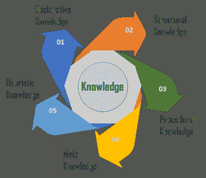
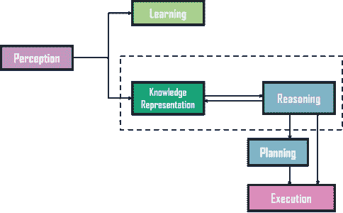
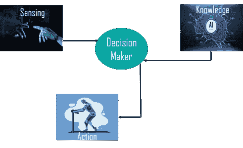
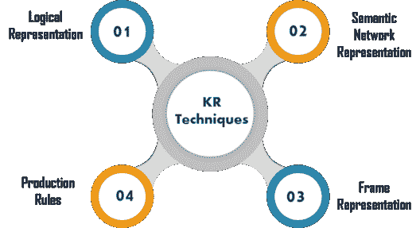
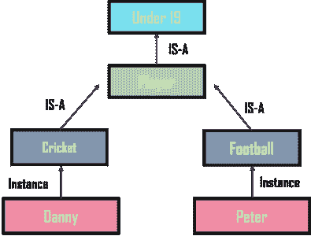

# AI 中的知识表示是什么？你需要知道的技巧

> 原文：<https://www.edureka.co/blog/knowledge-representation-in-ai/>

人类善于理解、推理和解释知识。利用这些知识，他们能够在现实世界中执行各种动作。但是机器是如何做到同样的呢？在本文中，我们将按以下顺序学习人工智能中的知识表示，以及它如何帮助机器使用[人工智能](https://www.edureka.co/ai-deep-learning-with-tensorflow)执行推理和解释:

*   [什么是知识表征？](#knowledge)
*   [不同类型的知识](#types)
*   [知识表示的循环](#cycle)
*   [知识&智力有什么关系？](#relation)
*   [知识表示技术](#techniques)
*   [表现要求](#requirements)
*   [知识表示方法示例](#approaches)

## **什么是知识表征？**

**知识表示**在 AI 中描述了知识的表示。基本上，它是一门研究如何将**智能代理**的**信念、意图**和**判断**恰当地表达为自动推理的学科。知识表示的主要目的之一包括为代理人的智能行为建模。

知识表示和推理( **KR，KRR** )表示来自真实世界的信息，供计算机理解，然后利用这些知识解决**复杂的现实生活问题**，比如用自然语言与人类交流。人工智能中的知识表示不仅仅是在数据库中存储数据，它允许机器从这些知识中学习，并像人类一样智能地行为。

需要在人工智能中表现的不同种类的知识包括:

*   **物体**
*   **事件**
*   **性能**
*   **事实**
*   **元知识**
*   **知识库**

现在你已经知道了人工智能中的知识表示，让我们继续了解不同类型的知识。

## **不同类型的知识**

有 5 种类型的知识，例如:

*   **陈述性知识**——它包括概念、事实和对象，并用陈述句表达。

*   **结构知识**——是描述概念与对象关系的基本解题知识。

*   **程序知识**–这是知道如何做某事的职责，包括规则、策略、程序等。

*   **元知识**–元知识定义了关于其他类型知识的知识。

*   **启发式知识**–这代表该领域或主题中的一些专家知识。

这些是人工智能中重要的知识表示类型。现在，让我们来看看知识表示的循环以及它是如何工作的。

## **人工智能中知识表示的循环**

人工智能系统通常由各种组件组成，以显示其智能行为。这些组件包括:

*   **感知**
*   **学习**
*   **知识表示&推理**
*   **策划**
*   **执行**

下面的示例展示了系统的不同组件及其工作原理:

### **例子**

上图显示了一个人工智能系统与**真实世界**以及参与显示智能的**组件**的交互。

*   **感知组件**从环境中检索数据或信息。在这个组件的帮助下，你可以从环境中检索数据，找出噪音的来源，并检查 AI 是否被任何东西损坏。此外，它还定义了当检测到任何感觉时如何响应。
*   然后是**学习组件**，它从感知组件捕获的数据中学习。目标是建造可以被教授的计算机，而不是给它们编程。学习重在自我提升的过程。为了学习新事物，系统需要知识获取、推理、启发式获取、更快的搜索等。
*   循环中的主要组成部分是**知识表示和推理**，它显示了机器中类似人类的智能。知识表示都是关于理解智能的。它的目标不是试图自下而上地理解或构建大脑，而是自上而下地理解和构建智能行为，并专注于代理需要知道什么才能智能地行为。此外，它还定义了自动推理过程如何根据需要提供这些知识。
*   **计划和执行**组件依赖于对知识表示和推理的分析。在这里，规划包括给出一个初始状态，找到它们的前提条件和效果，以及一系列的行动，以达到一个特定目标的状态。现在，一旦计划完成，最后一个阶段就是整个过程的执行。

所以，这些是人工智能中知识表现循环的不同组成部分。现在，让我们来理解知识和智力的关系。

## **知识&智力有什么关系？**

在现实世界中，知识在智能中扮演着至关重要的角色，同时也创造了人工智能。它展示了**人工智能代理或系统**的智能行为。只有当代理或系统具有关于输入的知识或经验时，它才有可能对某些输入做出准确的动作。

让我们举个例子来理解这种关系:

在这个例子中，有一个**决策者**，他的行动通过感知环境和使用知识来证明是合理的。但是，如果我们在这里去掉知识部分，它将不能显示任何智能行为。

既然你知道了知识和智能之间的关系，让我们继续讨论人工智能中的知识表示技术。

## **人工智能中的知识表示技术**

有四种表示知识的技术，例如:

现在，让我们详细讨论这些技术。

### **逻辑表示**

逻辑表示是一种有一些**明确规则**的语言，这些规则处理命题，在表示上没有歧义。它代表了基于各种条件的结论，并制定了一些重要的**沟通规则**。此外，它由精确定义的语法和语义组成，支持合理的推理。每个句子都可以用语法和语义翻译成逻辑。

| **语法** | **语义** |
| 

*   It determines how we construct legitimate sentences in logic.
*   It determines which symbol we can use in knowledge representation.
*   Also, how to write those symbols.

 | 

*   Semantics are the rules by which we interpret sentences in logic.
*   It gives each sentence a meaning.

 |

**优点:**

*   逻辑表示有助于执行逻辑推理。
*   这种表示是编程语言的基础。

**缺点:**

*   逻辑表示有一些限制，很难使用。
*   这种技术可能不是很自然，推理可能不是很高效。

### **语义网络表示**

语义网络作为知识表示的**谓词逻辑**的**替代**。在语义网络中，你可以用图形网络的形式来表示你的知识。这个网络由代表对象的节点和描述这些对象之间关系的弧线组成。此外，它以不同的形式对对象进行分类，并链接这些对象。

这种表示由两种类型关系组成:

*   **IS-A 关系(继承)**
*   **关系类型**

****

**优点:**

*   语义网络是知识的自然表示。
*   此外，它以透明的方式传达意义。
*   这些网络简单易懂。

**缺点:**

*   语义网络在运行时需要更多的计算时间。
*   此外，这些是不够的，因为它们没有任何等价的量词。
*   这些网络不是智能的，并且依赖于系统的创建者。

。

### **帧表示**

一个帧是一个类似于记录的结构，它由描述世界上一个实体的属性和值的 T2 集合组成。这些是人工智能数据结构，它通过表示原型情况将知识分成子结构。基本上，它由任意类型和大小的槽和槽值的集合组成。槽有名字和值，叫做刻面。

**优点:**

*   通过对相关数据进行分组，编程变得更加容易。
*   框架表示易于理解和可视化。
*   为新的属性和关系添加槽是非常容易的。
*   此外，包含默认数据和搜索缺失值也很容易。

**缺点:**

*   在框架系统推理中，该机制不容易处理。
*   框架表示不能顺利地进行推理机制。
*   它有一个非常通用的方法。

### **生产规则**

在产生式规则中，代理检查**条件**，如果条件存在，则产生式规则触发，并执行相应的操作。规则的条件部分决定了哪个规则可以应用于某个问题。然而，行动部分执行相关的问题解决步骤。这个完整的过程被称为认知-行动循环。

产生式规则系统由三个主要部分组成:

*   **产生式规则的集合**
*   **工作记忆**
*   **识别-行动-循环**

**优点:**

*   产生式规则用自然语言表达。

*   产生式规则是高度模块化的，可以很容易地删除或修改。

**缺点:**

*   它不显示任何学习能力，也不存储问题的结果以备将来使用。

*   在程序执行期间，许多规则可能是活动的。因此，基于规则的生产系统效率低下。

因此，这些是人工智能中知识表示的重要技术。现在，让我们看看对这些表示的要求。

## **表现要求**

一个好的知识表示系统必须具有如下特性:

*   **表示准确性:**应该表示各种需要的知识。

*   **推理充分性**:应该能够操纵表征结构，产生与现有结构相对应的新知识。

*   **推理效率**:通过存储适当的指南，将推理知识机制引向最有生产力的方向的能力。

*   **获取效率**:使用自动化方法轻松获取新知识的能力。

现在，让我们看看人工智能中知识表示的一些方法和不同的例子。

## **人工智能中的知识表示方法**

知识表示有不同的方法，例如:

### **1。简单的关系知识**

使用关系方法是**存储事实**的最简单方式。在这里，关于一组物体的所有事实都被系统地列了出来。此外，这种知识表示方法在 **[数据库](https://www.edureka.co/blog/what-is-a-database/)系统**中也很有名，其中不同实体之间的关系被表示出来。因此，几乎没有推断的机会。

**举例:**

| **名称** | **年龄** | **员工 ID** |
| 约翰 | Twenty-five | One hundred thousand and seventy-one |
| 阿曼达 | Twenty-three | One hundred thousand and fifty-six |
| 萨姆（男子名） | Twenty-seven | One hundred thousand and forty-two |

这是一个表示简单关系知识的例子。

### **2。可继承的知识**

在可继承知识方法中，所有数据必须存储到类的**层次结构中，并且应该以通用形式或层次方式排列。此外，这种方法包含了表示实例和类之间关系的可继承知识，称为实例关系。在这种方法中，对象和值在装箱的节点中表示。**

**举例:**

### **3。推理知识**

推理知识方法以**形式逻辑**的形式表示**知识**。因此，它可以用来推导更多的事实。而且，它保证了正确性。

**举例:**

约翰是一名板球运动员。

**说法二**:所有板球运动员都是运动员。

那么可以表示为；

**板球运动员(约翰)** **∀x =板球运动员(x)————>运动员(x)s**

这些是人工智能中知识表示的一些方法和例子。说到这里，我们的文章就到此为止了。我希望你明白什么是人工智能中的知识表示及其不同类型。

*另外，请查看 TensorFlow 的  [**AI 和深度学习**](https://www.edureka.co/ai-deep-learning-with-tensorflow) 课程由行业专业人士根据行业要求&需求策划。因此，您将掌握 SoftMax 函数、自动编码器神经网络、受限玻尔兹曼机(RBM)等概念，并使用 Keras & TFLearn 等库。该课程由行业专家通过实时案例研究特别策划。*

有问题要问我们吗？请在“人工智能中的知识表示”的评论部分提到它，我们会给你回复。