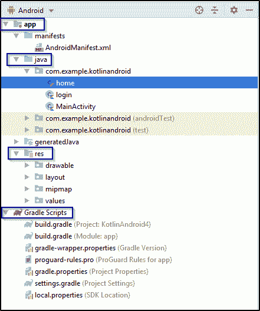
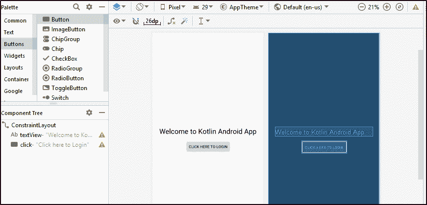
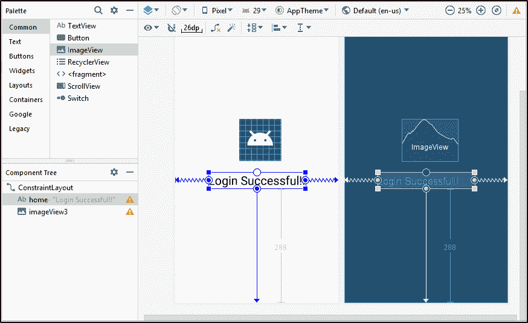

# 如何使用 Kotlin 开发 Android App？

> 原文：<https://www.edureka.co/blog/kotlin-android-tutorial/>

[Kotlin](https://www.edureka.co/blog/kotlin-programming-language/) 是一种可以在 JVM 上运行的语言。谷歌已经宣布 Kotlin 作为 Android Studio 中官方支持的编程语言之一，Android 社区正在以很高的速度从 [Java](https://www.edureka.co/blog/java-tutorial/) 迁移到 Kotlin。在这篇 Kotlin Android 教程中，我将告诉你如何使用 Kotlin 创建一个 [Android](https://www.edureka.co/blog/android-tutorial/) 应用程序。

本文涵盖以下主题:

*   [kot Lin 是什么？](#WhatisKotlin?)
*   [安卓简介](#IntroductiontoAndroid)
*   [Android Studio 简介](#IntroductiontoAndroidStudio)
*   [使用 Kotlin 创建第一个 Android 应用](#CreatingafirstAndroidApplicationusingKotlin)

我们开始吧！

## **kot Lin 是什么？**

Kotlin 是一种静态类型的通用编程语言，具有类型推断功能。它被广泛用于开发  [安卓](https://www.edureka.co/blog/android-tutorial/) 应用。Kotlin 被设计为完全与 Java 互操作，其标准库的 J VM 版本依赖于  [Java 类](https://www.edureka.co/blog/java-objects-and-classes/) 库，但类型推断允许其语法更加简洁。 Kotlin 主要针对 JVM，但也编译成[JavaScript](https://www.edureka.co/blog/javascript-tutorial/)或原生代码。Kotlin 由 JetBrains 和 Google 通过 Kotlin 基金会赞助。如果你希望了解更多关于科特林的知识，可以参考这篇关于 **[科特林教程](https://www.edureka.co/blog/kotlin-programming-language/)** 的文章。

现在我们来了解一下 Android 的基本基本面。

## **安卓简介**

Android 是谷歌开发的一款移动操作系统。它基于 Linux 内核，主要为智能手机和平板电脑等触摸屏移动设备设计。

 Android 是当今市场上最成功、最强大的移动操作系统。所以在开始之前，让我们先来回答一下为什么选择 Android？

*   开源
*   可定制的操作系统
*   R 降低开发成本和整体复杂度
*   更大的社区和开发者到达

*   成功率更高
*   丰富的开发环境——可以开发多种应用程序

可以借助 [Android 教程](https://www.edureka.co/blog/android-tutorial)了解更多 Android 架构及其特性。有了这些，我们来看看如何在你的系统上设置 Android Studio。

## **Android Studio 简介**

Android studio 是为 **Android** 平台开发应用的官方 IDE(集成开发环境)或工具之一。它拥有强大的编辑器工具，用于开发不同版本的创意 UI 和仿真器，以测试和模拟传感器，而无需实际的 **Android** 设备。

也可以用 IntelliJ 开发 Android 应用，但 Android Studio 更适合 app 开发。现在让我们看看如何在您的系统上安装它。

**第一步:**从[下载 Android Studio 这个链接](https://developer.android.com/studio)。

**第二步:**下载完成后，打开 Android Studio，在欢迎界面点击  **开始一个新的 Android Studio 项目** 或者  **文件|新建|新建项目**。

**步骤 3:** 选择一个  [活动](https://developer.android.com/guide/components/activities/intro-activities) ，它定义了您的应用程序的行为。你的第一次申请。选择刚刚显示屏幕的  **空活动** ，点击  **下一个**。

**第四步:**之后，你需要选择首选的编程语言，点击下一步按钮。如果你想知道更多关于安装的信息，请查看这篇关于 [Android Studio 安装](https://www.edureka.co/blog/android-tutorial/#installation)的文章。

**步骤 5:** 一旦一切都设置好了，并且您的项目也配置好了，您的项目结构看起来如下所示。



这不过是对 Android 应用程序的剖析，它由一个应用程序、Java、res、T2 和 T4 组成。借助[安卓应用剖析教程](https://www.edureka.co/blog/android-tutorial/#anatomy)了解详情。

现在让我们编写一个程序，创建一个简单的登录 Android 应用程序。

## **使用 Kotlin 创建第一个 Android 应用**

在这里，我将创建一个*登录 android 应用程序。*在这里，第一个屏幕是欢迎页面，如下所示。


为了创建和设计这个屏幕，您需要配置您的布局。为此，您需要打开布局文件夹并双击 *activity_main.xml* ，如下所示。


打开 XML 文件后，您需要根据您希望屏幕显示的结构创建元素。在创建元素之前，我将打开 design 选项卡，将按钮拖放到我的屏幕上，如下所示。



之后，我将返回并配置 *activity_main.xml* 文件，并创建所有元素。您的代码看起来像:

```
<?xml version="1.0" encoding="utf-8"?>
<androidx.constraintlayout.widget.ConstraintLayout
xmlns:android="http://schemas.android.com/apk/res/android"
xmlns:tools="http://schemas.android.com/tools"
xmlns:app="http://schemas.android.com/apk/res-auto"
android:layout_width="match_parent"
android:layout_height="match_parent"
tools:context=".MainActivity">

<TextView
android:layout_width="wrap_content"
android:layout_height="wrap_content"
android:text="Welcome to Kotlin Android App"
android:textSize="26sp"
android:textColor="#000000"
app:layout_constraintBottom_toBottomOf="parent"
app:layout_constraintLeft_toLeftOf="parent"
app:layout_constraintRight_toRightOf="parent"
app:layout_constraintTop_toTopOf="parent" android:id="@+id/textView"/>
<Button
android:text="Click here to Login"
android:layout_width="wrap_content"
android:layout_height="wrap_content"
android:id="@+id/click" android:layout_marginTop="16dp"
app:layout_constraintTop_toBottomOf="@+id/textView" android:layout_marginEnd="96dp"
android:layout_marginRight="96dp" app:layout_constraintEnd_toEndOf="@+id/textView"/>

</androidx.constraintlayout.widget.ConstraintLayout>
```

**注意:**如果第一次打开项目时 Gradle 项目同步失败，点击“消息”窗口中的“安装缺失的平台并同步项目”链接，缺失的组件将由 Android Studio 下载并安装。

在此之后，您需要创建一个 Kotlin 类文件来添加侦听器，以便从 XML 文件中调用操作。所以在这里，我将添加侦听器来调用我在 XML 文件中创建的按钮和文本视图的操作。

```
package com.example.kotlinandroid

import android.content.Intent
import androidx.appcompat.app.AppCompatActivity
import android.os.Bundle
import android.widget.Button
import android.widget.Toast

class MainActivity : AppCompatActivity() {

override fun onCreate(savedInstanceState: Bundle?) {
super.onCreate(savedInstanceState)
setContentView(R.layout.activity_main)

val but_click=findViewById<Button>(R.id.click)
but_click.setOnClickListener{
val intent = Intent(this, login::class.java)
startActivity(intent)
}
}
}
```

这样，您的第一个欢迎页面屏幕就完全创建好了。接下来，您将看到登录屏幕，您需要输入电子邮件地址和密码，然后点击登录按钮，如下图所示。


现在，我将根据第二个活动的“设计”选项卡中的上图创建设计，即 *activity_login.xml* 文件，如下所示。


之后，我将配置我的 XML 文件，如上图所示。

```
<?xml version="1.0" encoding="utf-8"?>
<androidx.constraintlayout.widget.ConstraintLayout
xmlns:android="http://schemas.android.com/apk/res/android"
xmlns:tools="http://schemas.android.com/tools"
xmlns:app="http://schemas.android.com/apk/res-auto"
android:layout_width="match_parent"
android:layout_height="match_parent"
tools:context=".login">

<TextView
android:text="Edureka!"
android:textSize="26sp"
android:textColor="#3677d1"
android:layout_width="wrap_content"
android:layout_height="wrap_content"
android:id="@+id/textView2" app:layout_constraintTop_toTopOf="parent"
app:layout_constraintStart_toStartOf="parent" android:layout_marginTop="101dp"
app:layout_constraintEnd_toEndOf="parent"/>
<ImageView
android:layout_width="100sp"
android:layout_height="100sp" app:srcCompat="@mipmap/edureka"
android:id="@+id/imageView"
app:layout_constraintTop_toBottomOf="@+id/textView2"
app:layout_constraintEnd_toEndOf="@+id/textView2"/>
<TextView
android:text="Email: "
android:textSize="20sp"
android:textColor="#000000"
android:layout_width="wrap_content"
android:layout_height="wrap_content"
app:layout_constraintStart_toStartOf="parent" android:layout_marginTop="69dp"
android:layout_marginLeft="6dp" android:layout_marginStart="6dp"
app:layout_constraintTop_toBottomOf="@+id/imageView" android:id="@+id/textView5"
app:layout_constraintHorizontal_chainStyle="packed" app:layout_constraintEnd_toStartOf="@+id/email"
android:layout_marginEnd="24dp" android:layout_marginRight="24dp"/>
<TextView
android:text="Password: "
android:textSize="20sp"
android:textColor="#000000"
android:layout_width="wrap_content"
android:layout_height="wrap_content"
app:layout_constraintStart_toStartOf="parent" android:layout_marginTop="144dp"
android:layout_marginLeft="6dp" android:layout_marginStart="6dp"
app:layout_constraintTop_toBottomOf="@+id/imageView" android:id="@+id/textView6"
app:layout_constraintHorizontal_chainStyle="packed" app:layout_constraintEnd_toStartOf="@+id/pass"
android:layout_marginEnd="24dp" android:layout_marginRight="24dp"
app:layout_constraintHorizontal_bias="1.0"/>
<EditText
android:layout_width="wrap_content"
android:layout_height="wrap_content"
android:inputType="textEmailAddress"
android:ems="10"
android:id="@+id/email"
app:layout_constraintBaseline_toBaselineOf="@+id/textView5"
app:layout_constraintStart_toEndOf="@+id/textView5" app:layout_constraintEnd_toEndOf="parent"/>
<EditText
android:layout_width="wrap_content"
android:layout_height="wrap_content"
android:inputType="textPassword"
android:ems="10"
android:id="@+id/pass"
app:layout_constraintStart_toStartOf="@+id/email" android:layout_marginTop="29dp"
app:layout_constraintTop_toBottomOf="@+id/email"/>
<Button
android:text="Login"
android:layout_width="wrap_content"
android:layout_height="wrap_content"
android:id="@+id/login"
app:layout_constraintStart_toStartOf="@+id/pass" android:layout_marginTop="29dp"
android:layout_marginLeft="23dp" android:layout_marginStart="23dp"
app:layout_constraintTop_toBottomOf="@+id/pass"/>
</androidx.constraintlayout.widget.ConstraintLayout>
```

在此之后，您需要创建一个 Kotlin 类文件来添加侦听器，以便从 XML 文件中调用操作。所以在这里，我将添加侦听器来调用电子邮件和密码字段的操作，以及我在 XML 文件中创建的按钮的操作。

```
package com.example.kotlinandroid

import android.content.Intent
import androidx.appcompat.app.AppCompatActivity
import android.os.Bundle
import android.widget.Button
import android.widget.EditText
import android.widget.Toast

class login : AppCompatActivity() {

override fun onCreate(savedInstanceState: Bundle?) {
super.onCreate(savedInstanceState)
setContentView(R.layout.activity_login)
val email = findViewById(R.id.email) as EditText
val pass = findViewById(R.id.pass) as EditText

val btnLogin = findViewById(R.id.login) as Button
btnLogin.setOnClickListener {
//read value from EditText to a String variable
val ema: String = email.text.toString()
val pas: String = pass.text.toString()
//check if the EditText have values or not
if (ema.trim().length == 0) {
Toast.makeText(applicationContext, "Email field cannot be empty", Toast.LENGTH_SHORT).show()
}
if (pas.trim().length == 0) {
Toast.makeText(applicationContext, "Password field cannot be empty", Toast.LENGTH_SHORT).show()
}

if (ema.equals("abc@xyz.com")&&(pas.equals("123456"))){
val intent = Intent(this, home::class.java)
startActivity(intent)
} else{
Toast.makeText(applicationContext, "Wrong Email or Password!!", Toast.LENGTH_SHORT).show()
}
}
}
}
```

现在，您只剩下最后一个屏幕。那是你的主屏幕。输入有效的用户名和密码后，您将进入下一个屏幕，如下所示。


我还必须配置这个屏幕。现在，我将根据第二个活动的“设计”选项卡中的上图创建设计，即 *activity_home.xml* 文件，如下所示。



现在让我们为创建的相同设计编写代码。

```
<?xml version="1.0" encoding="utf-8"?>
<androidx.constraintlayout.widget.ConstraintLayout
xmlns:android="http://schemas.android.com/apk/res/android"
xmlns:tools="http://schemas.android.com/tools"
xmlns:app="http://schemas.android.com/apk/res-auto"
android:layout_width="match_parent"
android:layout_height="match_parent"
tools:context=".home">

<TextView
android:text="Login Successful!!"
android:textColor="#000000"
android:textSize="30sp"
android:layout_width="wrap_content"
android:layout_height="wrap_content"
android:id="@+id/home"
app:layout_constraintStart_toStartOf="parent"
app:layout_constraintEnd_toEndOf="parent" app:layout_constraintBottom_toBottomOf="parent"
android:layout_marginBottom="288dp"/>
<ImageView
android:layout_width="142dp"
android:layout_height="106dp" app:srcCompat="@android:drawable/sym_def_app_icon"
android:id="@+id/imageView3"
app:layout_constraintStart_toStartOf="@+id/home" android:layout_marginLeft="60dp"
android:layout_marginStart="60dp" android:layout_marginBottom="28dp"
app:layout_constraintBottom_toTopOf="@+id/home"/>
</androidx.constraintlayout.widget.ConstraintLayout>
```

在此之后，您需要创建一个 Kotlin 类文件来添加侦听器，以便从 XML 文件中调用操作。所以在这里，我将添加侦听器，用于调用我在 XML 文件中创建的文本视图和图像的操作。

```
package com.example.kotlinandroid

import androidx.appcompat.app.AppCompatActivity
import android.os.Bundle
class home : AppCompatActivity() {
override fun onCreate(savedInstanceState: Bundle?) {
super.onCreate(savedInstanceState)
setContentView(R.layout.activity_home)
}
}
```

配置完所有 3 个屏幕后，你必须检查 gradle build，然后运行项目。当你这样做时，它会要求你选择虚拟设备，你需要选择一个你喜欢的，并运行代码。您的第一个移动应用程序将会启动。

这就是你需要如何使用 Kotlin 编程语言创建你的第一个 Android 应用程序。如果你想了解 Android 的基础知识，请查看这篇关于 Android 教程的文章。

这就把我们带到了这篇关于 Kotlin Android 教程 的文章的结尾。希望你清楚这篇文章中与你分享的所有内容。

*现在你已经看完了我们的 Kotlin Android 教程，可以查看一下 Edureka 的  [Android App 开发认证培训](https://www.edureka.co/android-development-certification-course)* *有问题要问我们吗？请在“Kotlin Android 教程”博客部分的评论中提到它，我们将会回复您。*