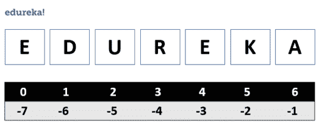

# Python 中的列表:关于 Python 列表你需要知道的一切

> 原文：<https://www.edureka.co/blog/lists-in-python/>

Python 编程语言已经成为时下最热门的编程语言。开发人员已经意识到高效实现的重要性，而不是编写复杂的程序。 [Python](https://www.edureka.co/data-science-python-certification-course) 为开发者提供开箱即用的特性和应用，其中一个概念就是 Python 中的列表。它是一个数据类型为的集合[,通常用来存储 python 中的有序数据。以下是本博客讨论的概念](https://www.edureka.co/blog/variables-and-data-types-in-python/) :

*   [Python 中什么是列表？](#1)
*   [为什么要用列表？](#2)
*   [Python 中的列表操作](#3)
    *   [在 Python 中对列表进行切片](#4)
    *   [在 Python 中设置列表](#5)

## **Python 中什么是列表？**

List 是 python 中[数据类型](https://www.edureka.co/blog/variables-and-data-types-in-python/)的集合。它是有序的，也允许重复条目。python 中的列表不必是同构的，这意味着它可以包含不同的数据类型，如整数、字符串和其他集合数据类型。它本质上是可变的，允许索引访问列表中的成员。

为了声明一个列表，我们使用方括号。

List 就像我们在其他编程语言中声明的任何其他数组一样。python 中的列表通常用于实现堆栈和队列。这些列表本质上是可变的。因此，即使在声明了列表之后，这些值也可以更改。

```

mylist = [0,1,2,3,4,5,6]

```

**索引:**



为了从列表中访问一个值，我们使用索引值。下面是从包含单词“EDUREKA”的字母列表中获取字母“A”的代码。

```

a = ['E', 'D', 'U', 'R', 'E', 'K', 'A']

print(a[6])

print(a[-1])

```

两条打印语句都将从列表中提取字母‘A’。

## **为什么要用列表？**

在选择存储数据的数据类型时，我们必须牢记数据类型的属性和特征。如果我们首先做出正确的选择，它将变得更加高效和安全。

列表是首选，因为它可以同时存储多个数据。替换和修改列表中的值变得很容易。我们可以将序列存储在一个列表中，并使用循环执行多次迭代。我们还可以对列表执行许多操作，让我们来理解 python 中对列表的各种操作。

## **Python 中的列表操作**

以下是我们可以对列表执行的操作。

*   追加
*   清除
*   复制
*   计数
*   延长
*   插入
*   索引
*   砰然一声
*   移除
*   反转
*   排序

**追加**

```

a = [1,2,3,4,5]
a.append(6)
print(a)
#the output will have 6 at the end of the list.

```

**清除**

```

a = [1,2,3,4,5]

a.clear()
#this will clear the list or empty the list.

```

**复制**

```

a = [1,2,3,4,5]
b = a.copy()

print(b)
#it makes the copy of the list.

```

**计数**

```

a = [1,1,1,3,3,3,4,4,4,4,5,5,5,5,5]

a.count(5)
#this will give the number of times 5 is present in the list.

```

**延长**

```

a = [1,2,3,4,5]

a.extend(range(6,11))
#this will add the values in this list from the iterable object range.

```

**插入**

```

a = ['edureka', 'python', 'data science']

a.insert(2,'artificial intelligence')
#this will add the string at the index value 2

```

**指标**

```

a = ['edureka', 'python', 'programming', 'data science', 'AI', 'machine learning']

a.index('data science')
#this will get the index value at the string 'data science' which is 3.

```

**天王**

```

a = [1,2,3,4,5]

a.pop()
#this will pop the value from the  end of the list i.e 5\. the list will no longer have 5 after this.

```

**去掉**

```

a = [1,2,3,4,11,5]

a.remove(11)
#this will remove 11 from the list.

```

**反转**

```

a = [5,4,3,2,1]

a.reverse()
#this will reverse the list.

#another statement to reverse the list
a = a[: :-1]

```

**排序**

```

a = [3,1,2,6,4,5,9,6,7,8]

a.sort()
#you will get a sorted list as a result.

```

**替换列表中的一个值**

```

a = ['edureka', 'python', 'data science', 'tennis', 'machine learning']

a[3] = 'artificial intelligence'
#this will replace the value at the given index with the mentioned value.

```

**遍历列表**

列表也可以用于[次迭代](https://www.edureka.co/blog/loops-in-python/)。下面是使用控制语句迭代列表和打印值的代码。

```

a = [1,2,3,4,5]

for x in a:
    if x == 4:
         break
print(x)
#this will iterate through the list and print the values until it encounters 4.

```

list 构造函数用于创建/声明一个列表。

```

a = list((1,2,3,4,5))

print(a)
#you will get a list with the values declared in the constructor.

```

如你所见，list 构造函数以元组为自变量。类似地，您也可以在 list 构造函数中声明任何其他数据类型，如字典或集合。

## **切片列表**

假设你有一个从 0 到 10 的列表。但是您只想获取 5-10 之间的数字，您不能访问所有元素，键入所有这些数字的索引值。相反，您可以遵循下面代码中的方法。

```

a = [1,2,3,4,5,6,7,8,9,10]

a[4:11]
#this will get all the numbers starting from index 4 to index 11.

a[-1:-6]
#this will get all the numbers from the index 11 to index 6.

a[4:]
#this will print all the numbers starting from index 4 until the end of the list.

a[:6]
#this will print all the numbers from index 0 until the index 6.

```

## **用 Python 子集化列表**

列表子集化是指在现有列表中声明一个列表。

```

a = list(range(5,11)

b = [1,2,3,4, a ]

#to access a value in the list

b[4]

#this will print the list a.

b[4][4]

#this will get the value at the index value 4 in the list a.

b[4][4] = 19

#we can change the values  as well, replace, delete modify etc.

```

除了列表，我们还可以使用任何其他数据类型。但是，由于集合是无索引的，因此不可能使用索引值单独访问集合项目。

在这篇博客中，我们讨论了 python 中的列表以及我们可以执行的所有操作。python 中的列表是一个非常重要的概念，在学习 python 编程的基础时扮演着重要的角色。Python 编程语言有许多开箱即用的特性，随着[应用和实现](https://www.edureka.co/blog/how-to-become-a-python-developer/)它已经成为当今最流行的编程语言之一。你也可以报名参加 [python 编程认证](https://www.edureka.co/data-science-python-certification-course)来启动你的学习。

*有问题吗？在评论中提到他们，我们会回复你。*