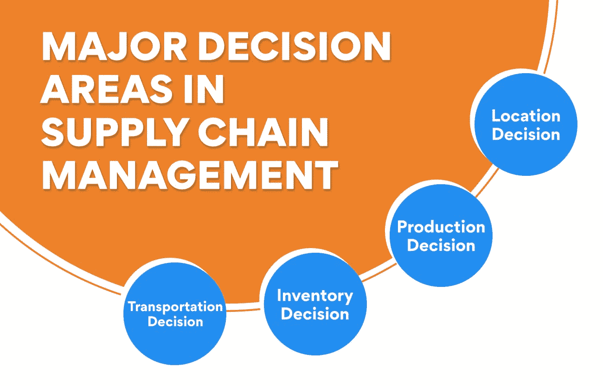

# 供应链管理的主要决策领域

> 原文：<https://www.edureka.co/blog/major-decision-areas-in-supply-chain-management/>

供应链是一个包含将产品或服务从源头运送到客户手中的各个步骤的过程。供应链管理旨在确保正确的产品在正确的时间交付给客户，同时最大限度地提高效率和成本。供应链管理有很多方面，每一方面都在将产品送到客户手中的过程中扮演着重要的角色。供应链管理中的主要决策领域是 1)选址，2)生产，3)库存，4)运输(配送)。

这篇博文将讨论供应链管理中的主要决策领域，它们如何影响供应链管理，并举例说明。

## 什么是供应链管理，为什么它很重要？

供应链管理(SCM)是从整体上计划、执行和控制供应链的[运作。它包括管理原材料、半成品和成品从产地到消费地的移动和储存。](https://www.edureka.co/blog/what-is-operations-and-supply-chain-management-oscm/)

供应链管理还包括协调和整合这些活动与组织内其他部门的活动，如会计、财务、营销和制造。此外，供应链管理需要与供应商和外部服务提供商密切合作和协调。

供应链管理的目标是通过降低成本、提高服务水平和客户满意度来优化供应链的整体绩效。许多组织将供应链管理视为一种战略差异，这种战略差异可以使他们在市场中获得竞争优势。

## **什么是供应链战略？**

任何供应链战略的目标都应该是制定一个计划，概述公司将如何将其[产品](https://www.edureka.co/blog/what-are-the-stages-and-examples-of-a-product-lifecycle/)或服务推向市场。主要目标是最大限度地降低成本和优化客户服务水平。供应链战略中的决策应该与未来的商业目标相一致。战略计划还将考虑任何公司的竞争优势。

**供应链战略的关键要素**

供应链策略有很多，但大多数都可以归结为几个关键要素。

**成本**

供应链是昂贵的，任何好的战略的目标都是在提供期望的服务水平的同时将成本最小化。这通常意味着找到简化供应链的方法，或者使用更便宜的材料或劳动力。

**交货时间**

顾客总是希望他们的订单准时到达，因此减少交货时间是供应链管理的一个重要目标。这可能包括改善供应商和客户之间的沟通或提高生产过程的效率。

**质量**

当然，客户也期望他们的产品是高质量的，因此保持良好的质量控制水平是至关重要的。这可能意味着在供应链的不同环节投资更高质量的材料或更严格的测试。

**灵活性**

在当今快节奏的世界中，企业必须快速响应客户需求的变化。这意味着拥有一个足够灵活的供应链，可以根据需要做出改变。这可能包括储备更全面的产品，或者采用即时制造，只在需要时生产产品。

**可持续性**

越来越多的企业也在寻找方法，让他们的供应链因环保原因变得更可持续，并提高他们在客户中的声誉。这可能意味着使用回收材料，投资可再生能源，或者找到减少整个供应链浪费的方法。

**可达性**

任何企业的目标都是接触尽可能多的潜在客户。但为了实现这一点，供应链需要能够向他们交付产品。这可能意味着向新市场扩张或战略性地建立配送中心。

**客户满意度**

归根结底，任何供应链的目标都是让客户满意。这可能意味着确保产品按时交付，提供良好的客户服务，或提供广泛的产品。

如你所见，在制定供应链战略时，需要考虑许多因素。创建成功战略的理想方法是与经验丰富的供应链管理顾问合作，他们可以帮助您确定具体目标，并找到实现这些目标的最佳方式。

想要了解供应链管理的更多信息并开始职业生涯吗？看看我们的[Ops、SCM 和 PM](https://www.edureka.co/highered/advanced-program-in-operations-supply-chain-project-management-iitg) 高级证书，让你深入了解供应链管理。

## **供应链管理的主要决策领域**

供应链管理中的决策领域基本上包括对货物从供应商到客户的整个运输过程做出决策。主要目标是在确保及时交付的同时，最大限度地降低成本和优化资源。

**位置决定**

供应链管理的首要决策是决定制造工厂、仓库和配送中心的位置。各种因素都会影响这一决策，如客户需求、供应商位置、运输成本等。主要目标是在确保及时交货的同时，最大限度地降低总运输成本。

正确确定制造工厂、仓库和配送中心的位置后，就有可能开发出最佳的货物运输路线。这将进一步有助于降低总成本和交付所需的时间。

**选址决策如何影响供应链管理？**

选址决策直接影响供应链管理，因为它有助于将运输所需的总成本和时间降至最低。除此之外，适当的选址规划也有助于减少库存水平，这是供应链管理中的另一个关键因素。

它有助于供应经理跟踪货物的流动，也有助于降低库存成本。选址决策通常使货物配送无缝衔接，有助于实现客户满意度。必须认识到顾客满意是供应链管理最重要的目标之一。

检查资源的可用性是另一个必须考虑的重要因素。制造工厂、仓库和配送中心的位置应该便于他们获得原材料、劳动力和其他资源。这将有助于降低生产和交付所需的总成本和时间。

**生产决策**

生产决策是供应链中的关键决策，因为它决定了产品的生产流程、数量和质量。这一决策的目标是在满足客户需求的同时最大限度地降低成本。为了做出有效的生产决策，公司需要考虑各种因素，如产品类型、需求预测、制造流程、产能利用率和库存水平。

生产决策的第一步是预测。一家公司需要预测对其产品或服务的需求，以生产正确的数量。销售和营销在为这一决策提供信息方面至关重要。

第二阶段是容量规划。公司应该检查他们是否有足够的能力来满足预测的需求。它还需要考虑生产产品所需的交付周期。

第三阶段是库存计划。为了满足客户的需求，公司必须确定手头应该有多少库存。它还需要考虑持有库存的成本，比如存储和机会成本。

在考虑了所有这些因素后，公司可以决定生产过程的类型、产品的数量和质量。生产决策是复杂的，需要大量的经验和知识来做出有效的决策。

**生产决策如何帮助供应链管理？**

生产决策是公司必须做出的最重要的决策之一。它直接影响产品的成本、质量和交付。一个公司必须决定生产多少，什么时候，在哪里生产。

生产决策是一项复杂的决策，它与供应链管理中的另外两个主要决策领域直接相关，即库存决策和产能决策。所有这三个决策都是相互关联的，一个决策领域的变化会影响其他两个领域。

库存决策包括决定保留多少库存以及存放在哪里。容量决策包括决定需要多少容量以及何时添加或扩展容量。

生产决策也与营销决策相关联。营销决策包括决定生产什么产品以及如何定价。生产决策必须考虑产品的需求和公司生产产品的能力。

**库存决策**

库存决策是供应链管理的另一个重要方面。它基本上包括决定必须一直保持的正确库存水平。客户需求、交付周期、生产率等。。是必须考虑的各种因素。主要目标是在确保及时交货的同时，最大限度地降低库存成本。

库存决策对供应链管理有直接影响，因为它有助于将库存的总成本降至最低。此外，适当的库存计划也有助于减少缺货的数量，这是供应链管理中的另一个重要因素。

缺乏适当的库存决策流程通常会导致缺货，从而导致销售损失和客户满意度下降。为了避免这种情况，必须有一个适当的库存决策过程。这将有助于降低生产和交付所需的总成本和时间。

库存决策对供应链管理有何益处？

库存决策是供应链管理中最关键的领域之一。通过保持准确的库存，企业可以确保他们有合适的库存产品来满足客户需求。它有助于提高客户满意度，降低与缺货相关的成本。有效的库存管理系统还可以帮助企业避免库存过多，因为库存过多会占用宝贵的资本。

企业可以使用几种不同的库存管理策略，最合适的方法将根据组织的具体需求而有所不同。一些常见的库存管理策略包括准时制(JIT)库存、经济订货量(EOQ)和库存周转率。

有效使用时，库存管理可以成为提高供应链整体效率的有力工具。通过花时间了解供应链管理中的不同决策领域，企业可以制定更适合其特定需求和目标的策略。

**运输决策**

为了优化供应链，公司必须做出几种类型的运输决策。

第一个是模式选择，包括决定使用哪种运输方式(如空运、陆运或水运)。第二是路线，包括选择货物的具体路线。第三是调度，包括决定货物何时运输。最后是运力规划，包括确保有足够的运力来满足公司的运输需求。

为了优化供应链和降低成本，必须做出每一项决策。例如，如果 A 公司将货物从印度运往中国，它必须首先决定使用何种运输方式。如果他们选择空运，他们将需要考虑货物的具体路线和运输时间表。他们还需要确保足够的飞机容量来容纳货物。

做出这些决定可能很复杂，但考虑所有因素以优化供应链和降低成本至关重要。通过了解供应链管理中的主要决策领域，公司可以做出更好的决策并提高整体效率。

**运输决策如何帮助供应链管理？**

运输决策通过提供必要的数据来帮助供应链管理，从而对运输路线、承运商和运输方式做出明智的决策。这些信息有助于优化供应链和降低成本。

有几种类型的交通决策支持可用，包括软件程序、顾问和在线资源。正确的援助将取决于公司和供应链的具体需求。

软件程序提供关于运输路线、承运商选择和费用的详细信息。他们还可以帮助计划和跟踪运输。顾问还可以就运输问题提供专家建议，包括如何优化供应链。

**底线**

供应链管理是任何企业成功的基石。通过了解供应链管理中的不同决策领域，公司可以制定策略来优化供应链并提高整体绩效。

现在开始供应链管理的职业生涯可能会很有成效。我们可以帮助您通过我们的[Ops、SCM 和 PM](https://www.edureka.co/highered/advanced-program-in-operations-supply-chain-project-management-iitg) 高级证书取得良好的开端，在那里您可以了解关于 SCM 和更多的一切。