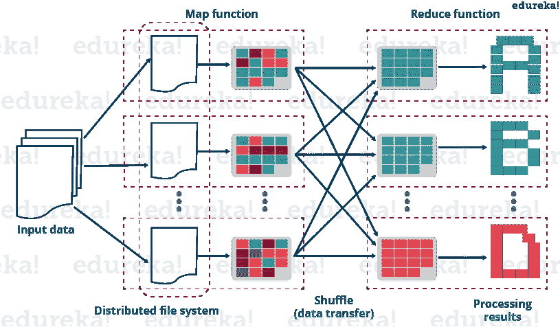

# MapReduce 示例:在 Hadoop MapReduce 中减少边连接

> 原文：<https://www.edureka.co/blog/mapreduce-example-reduce-side-join/>

## **MapReduce 示例:Hadoop MapReduce 中的 Reduce 边连接**

## **简介:**

在这篇博客中，我将使用一个 MapReduce 示例向您解释如何在 Hadoop MapReduce 中执行 reduce 边连接。这里，我假设你已经熟悉 MapReduce 框架，并且知道如何编写一个基本的 MapReduce 程序。如果你不知道，我建议你浏览一下我以前的博客 ***[MapReduce 教程](https://www.edureka.co/blog/mapreduce-tutorial/)*** ，这样你就可以毫不费力地掌握这里讨论的概念。本博客讨论的主题如下:

*   什么是联接？
*   加入 MapReduce
*   什么是缩减边连接？
*   Reduce 端连接的 MapReduce 示例
*   结论

## **什么是 加入 ？**

连接操作用于根据外键组合两个或多个数据库表。一般来说，公司在数据库中为客户和 交易 记录维护单独的表。而且，很多时候这些公司需要使用这些单独表格中的数据生成分析报告。因此，他们使用一个公共列(外键)对这些独立的表执行连接操作，如客户 id 等。，以生成组合表。然后，他们分析这个组合表，以获得所需的分析报告。

## **加入 MapReduce**

就像 SQL join 一样，我们也可以在 MapReduce 中对不同的数据集进行 join 操作。MapReduce 中有两种类型的连接操作:

*   **地图端连接:**顾名思义，连接操作是在地图端本身执行的。因此，在映射端连接中，映射器执行连接，每个映射的输入必须根据键进行分区和排序。

地图端连接 已经在一个单独的博客中用一个例子介绍过了。 [***点击此处***](https://www.edureka.co/blog/map-side-join-vs-join/) 浏览该博客，了解地图端连接如何工作及其优势。

*   **异径边联接:**顾名思义，在异径边联接中，减速器 就是负责执行联接操作的 。它比 map side join 实现起来相对简单和容易，因为排序和改组阶段将具有相同键的值发送到同一个 reducer，因此，默认情况下，数据是为我们组织的。

现在，让我们详细了解一下 reduce side join。

## **什么是减边连接？**



如前所述，reduce 端连接是一个在 reducer 阶段执行连接操作的过程。基本上，reduce 侧连接以如下方式发生:

*   映射器读取输入数据，这些数据将根据公共列或连接键进行组合。
*   映射器处理输入，并向输入添加标签，以区分来自不同源、数据集或数据库的输入。
*   映射器输出中间的键-值对，其中的键是连接键。
*   在排序和混洗阶段之后，为缩减器生成一个关键字和值列表。
*   现在，reducer 将列表中的值与键连接起来，给出最终的聚合输出。

*与此同时，你可以浏览这个 MapReduce 教程视频，视频中对各种 MapReduce 用例进行了清晰的解释和实际演示:*

## **MapReduce 示例| MapReduce 编程| Hadoop MapReduce 教程| Edureka**

现在，让我们以 MapReduce 为例来理解 Reduce 端连接中的上述步骤。

##  **  MapReduce 减少边连接的例子**

假设我有两个独立的体育场馆数据集:

*   **cust_details:** 它包含了客户的详细信息。
*   **交易 _ 明细:**包含客户的交易记录。

使用这两个数据集，我想知道每个客户的终身价值。在 这样做，我将需要以下东西:

*   此人的姓名以及此人访问的频率。
*   他/她购买设备所花费的总金额。


上图只是向您展示我们将对其执行 reduce 端连接操作的两个数据集的模式。点击下面的按钮下载整个项目，其中包含这个 MapReduce 示例的源代码和输入文件:

在将上面 Reduce 端 join 上的 MapReduce 示例项目导入 Eclipse 时，请记住以下几点:

*   输入文件在项目的 input_files 目录下。把这些装进你的 HDFS。
*   不要忘记根据您的系统或 VM 构建 Hadoop 引用 jar 的路径(存在于 reduce side join 项目 lib 目录中)。

现在，让我们来了解一下在这个 MapReduce 例子中，Reduce 边连接的 map 和 reduce 阶段内部发生了什么:

### **1。地图阶段:**

我将为两个数据集分别设置一个映射器，即一个映射器用于 cust_details 输入，另一个用于 transaction_details 输入。

***映射器为 cust _ details******:***

```
public static class CustsMapper extends Mapper <Object, Text, Text, Text>
{
public void map(Object key, Text value, Context context) throws IOException, InterruptedException
{String record = value.toString();
String[] parts = record.split(",");
context.write(new Text(parts[0]), new Text("cust	" + parts[1]));
}
} 
```

*   我将一次读取一个元组的输入。
*   然后，我将对元组中的每个单词进行标记化，并获取 cust ID 以及person的名称。
*   ThecustID 将是我的映射器最终将生成的键-值对的键。
*   我还将添加一个标签“cust”来表明这个输入元组属于 cust_details 类型。
*   因此，我的 cust_details 映射器将产生以下中间键值对:

**键-值对:[客户 ID，客户名称]**

例:【4000001，custKristina】，【4000002，cust Paige】等。

***用于交易的映射器 _ 详情:***

```
public static class TxnsMapper extends Mapper <Object, Text, Text, Text>
{
public void map(Object key, Text value, Context context) throws IOException, InterruptedException
{
String record = value.toString();
String[] parts = record.split(",");
context.write(new Text(parts[2]), new Text("tnxn	" + parts[3]));
}
}

```

*   与 cust_details 的 mapper 一样，我将遵循类似的步骤。虽然，还是会有一些不同:
    *   我将获取金额值，而不是人名。
    *   在这种情况下，我们将使用“tnxn”作为标签。
*   因此，客户 ID 将是映射器最终生成的键-值对的键。
*   最后，我的 transaction_details 映射器的输出将采用以下格式:

**键，值对:[客户 ID，交易金额]**

*举例:*【4000001，tnxn 40.33】，【4000002，tnxn 198.44】等。

### **2。**排序和洗牌阶段

排序和混洗阶段将生成对应于每个键的值的数组列表。换句话说，它将把对应于中间键-值对中每个唯一键的所有值放在一起。排序和混洗阶段的输出将具有以下格式:

**键–值列表:**

*   {客户 id 1-[(客户 名称 1)，(tnxn 数量 1)，(tnxn 数量 2)，(tnxn 数量 3)，……..]}
*   {客户 id 2-[(客户名称 2)，(tnxn 数量 1)，(tnxn 数量 2)，(tnxn 数量 3)，……..]}
*   ……

**例如:**

*   { 4000001—[(cust kristina)，(tnxn 40.33)，(tnxn 47.05)，…]}；
*   { 4000002-[(cust Paige)，(tnxn 198.44)，(tnxn 5.58)，…]}；
*   ……

现在，框架将调用 reduce()方法( *reduce(Text key，Iterable < Text > values，Context context)* )，用于每个唯一的连接键(cust id)和相应的值列表。  然后，reducer 将对各个值列表中的值执行 join 操作，最终计算出期望的输出。因此，执行的 reducer 任务的数量将等于唯一客户 ID 的数量。

现在让我们了解一下在这个 MapReduce 示例中，reducer 是如何执行 join 操作的。

### **3。减速阶段**

如果您还记得的话，执行这个 reduce-side join 操作的主要目标是找出某个特定的客户访问过体育馆的次数以及该客户在不同体育项目上花费的总金额。因此，我的最终输出应该是以下格式:

**键-值对:【客户名称】(键)–【总金额，访问频率】(值)**

### *减速器代码:*

```
 public static class ReduceJoinReducer extends Reducer <Text, Text, Text, Text>
 {
 public void reduce(Text key, Iterable<Text> values, Context context)
 throws IOException, InterruptedException 
 {
 String name = "";
 double total = 0.0;
 int count = 0;
 for (Text t : values) 
 { 
 String parts[] = t.toString().split("	");
 if (parts[0].equals("tnxn")) 
 {
 count++;
 total += Float.parseFloat(parts[1]);
 } 
 else if (parts[0].equals("cust")) 
 {
 name = parts[1];
 }
 }
 String str = String.format("%d	%f", count, total);
 context.write(new Text(name), new Text(str));
 }
 }

```

因此，将在每个减速器中采取以下步骤，以实现期望的输出:

*   在每个 reducer 中，我将有一个键&值列表，其中的键只是客户 ID。值列表将包含来自两个数据集的输入，即来自 transaction_details 的 Amount 和来自 cust_details 的 name。
*   现在，我将遍历 reducer 中值列表中的值。
*   然后，我将拆分值列表，并检查值是属于 transaction_details 类型还是 cust_details 类型。
*   如果是 transaction_details 类型，我将执行以下步骤:
    *   我将把计数器值加 1 来计算这个人的访问频率。
    *   我将累计更新金额值，以计算该人的总消费金额。
*   另一方面，如果值是 cust_details 类型，我将把它存储在一个字符串变量中。稍后，我将在我的输出键-值对中指定这个名称作为我的键。
*   最后，我将在我的 HDFS 的输出文件夹中写入输出键值对。

因此，我的减速器将产生的最终输出如下:

**克里斯蒂娜，651.05 8**

**佩奇，706.97 6**

**……..**

并且，我们上面做的这个全过程在 MapReduce 中叫做 ***Reduce 边连接*** 。

### **源代码:**

下面给出了上述 Reduce 边连接的 MapReduce 示例的源代码:

```
import java.io.IOException;
import org.apache.hadoop.conf.Configuration;
import org.apache.hadoop.fs.Path;
import org.apache.hadoop.io.Text;
import org.apache.hadoop.mapreduce.Job;
import org.apache.hadoop.mapreduce.Mapper;
import org.apache.hadoop.mapreduce.Reducer;
import org.apache.hadoop.mapreduce.lib.input.MultipleInputs;
import org.apache.hadoop.mapreduce.lib.input.TextInputFormat;
import org.apache.hadoop.mapreduce.lib.output.FileOutputFormat;

 public class ReduceJoin {
 public static class CustsMapper extends Mapper <Object, Text, Text, Text>
 {
 public void map(Object key, Text value, Context context)
 throws IOException, InterruptedException 
 {
 String record = value.toString();
 String[] parts = record.split(",");
 context.write(new Text(parts[0]), new Text("cust	" + parts[1]));
 }
 }

 public static class TxnsMapper extends Mapper <Object, Text, Text, Text>
 {
 public void map(Object key, Text value, Context context) 
 throws IOException, InterruptedException 
 {
 String record = value.toString();
 String[] parts = record.split(",");
 context.write(new Text(parts[2]), new Text("tnxn	" + parts[3]));
 }
 }

 public static class ReduceJoinReducer extends Reducer <Text, Text, Text, Text>
 {
 public void reduce(Text key, Iterable<Text> values, Context context)
 throws IOException, InterruptedException 
 {
 String name = "";
 double total = 0.0;
 int count = 0;
 for (Text t : values) 
 { 
 String parts[] = t.toString().split("	");
 if (parts[0].equals("tnxn")) 
 {
 count++;
 total += Float.parseFloat(parts[1]);
 } 
 else if (parts[0].equals("cust")) 
 {
 name = parts[1];
 }
 }
 String str = String.format("%d	%f", count, total);
 context.write(new Text(name), new Text(str));
 }
 }

 public static void main(String[] args) throws Exception {
 Configuration conf = new Configuration();
 Job job = new Job(conf, "Reduce-side join");
 job.setJarByClass(ReduceJoin.class);
 job.setReducerClass(ReduceJoinReducer.class);
 job.setOutputKeyClass(Text.class);
 job.setOutputValueClass(Text.class);

 MultipleInputs.addInputPath(job, new Path(args[0]),TextInputFormat.class, CustsMapper.class);
 MultipleInputs.addInputPath(job, new Path(args[1]),TextInputFormat.class, TxnsMapper.class);
 Path outputPath = new Path(args[2]);

 FileOutputFormat.setOutputPath(job, outputPath);
 outputPath.getFileSystem(conf).delete(outputPath);
 System.exit(job.waitForCompletion(true) ? 0 : 1);
 }
 }

```

**Ru** **n 本程序**

最后，在 Reduce 端连接 上运行上述 MapReduce 示例程序的命令如下:

*Hadoop jar reduce join . jar reduce join/sample/input/cust _ details/sample/input/transaction _ details/sample/output*

## **结论:**

reduce side join 过程在排序和 reducer 阶段产生了巨大的网络 I/O 流量，在此阶段，同一个键值被集合在一起。因此，如果您有大量不同的数据集，包含数百万个值，那么您很有可能会遇到内存不足异常，即您的 RAM 已满，因此会溢出。在我看来，使用 reduce 侧连接的优点是:

*   这很容易实现，因为我们利用了 MapReduce 框架中内置的排序和洗牌算法，该算法将同一关键字的值组合起来，并将其发送到同一个 reducer。
*   在 reduce side join 中，您的输入不需要遵循任何严格的格式，因此，您也可以对非结构化数据执行连接操作。

一般来说，人们更喜欢使用 Apache Hive 来执行 join 操作，Apache Hive 是 Hadoop 生态系统的一部分。因此，如果您来自 SQL 后台，就不需要担心编写 MapReduce Java 代码来执行 join 操作。可以使用 Hive 作为替代。

*现在，您已经通过 MapReduce 示例了解了 Reduce 端连接，请查看 Edureka 的 **[Hadoop 培训](https://www.edureka.co/big-data-and-hadoop/)*** *，edu reka 是一家值得信赖的在线学习公司，拥有遍布全球的 250，000 多名满意的学习者。Edureka 大数据 Hadoop 认证培训课程使用零售、社交媒体、航空、旅游和金融领域的实时用例，帮助学员成为 HDFS、Yarn、MapReduce、Pig、Hive、HBase、Oozie、Flume 和 Sqoop 领域的专家。*

*有问题吗？请在评论区提到它，我们会给你回复。*