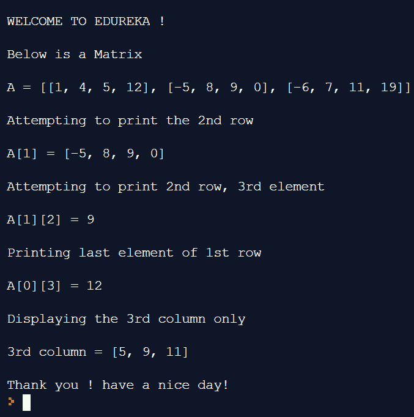
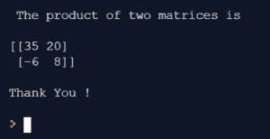

# 关于 Python 中的 Matrix，您需要了解的一切

> 原文：<https://www.edureka.co/blog/matrix-in-python/>

本文将通过编程演示向您介绍用 [Python](https://www.edureka.co/blog/python-tutorial/) 编写的 Matrix 以及与主题相关的每个操作。本文将涉及以下几点:

*   [Python 中的矩阵](#MatrixInPython)
*   [Python 中矩阵的 NumPy 包](#NumPyPackageForMatricesInPython)
*   [矩阵乘法](#MultiplicationOfMatrices)
*   [矩阵的转置](#TransposeOfAMatrix)

让我们开始吧，

**Python 中的矩阵**

矩阵只不过是数字的矩形阵列或任何其他形式的数据。在 python 编程语言的范围内对矩阵进行操作之前，应该清楚矩阵的基本概念。数据的水平排列是行，垂直排列是列。任何矩阵的大小，或者换句话说，矩阵中元素的数量是(R) X (C ),其中 R 是行，C 是列。Python 没有内置的矩阵类型，所以我们把两个或更多的列表看作一个矩阵。

现在，让我们来看看矩阵的查看元素及其功能。考虑下图所示的 python 代码。

```
print("nWELCOME TO EDUREKA !n")
print("Below is a Matrixn")
A= [[1,4,5,12],
[-5,8,9,0]
[-6,7,11,19]]
print("A=", A)
print("nAttempting to print the 2nd rown")
print("A[1] =",  A[1])
print("nAttempting to print the 2nd row, 3rd elementn")
print("A[1][2]=", A[1][2])
print("nPriting last element of the 1st rown")
print("A[0][3] =", A[0][3])
column = [];
for row in A:
column.append(row[2])
print("n Displaying the 3rd column onlyn")
print("3rd column=", column)
print("n Thank you ! Have a nice day!")
```

**输出**

 继续这篇文章

**Python 中矩阵的 NumPy 包**

Numpy 是一个 python 库，支持科学计算。Numpy 可以帮助用户处理多维数组。

```
/Addition of Matrices
print("nWELCOME TO EDUREKA!n")
import numpy as np
A= np.array([[24,41],[35,-9]])
B= np.array([[19,-36],[37,68]])
C=A+B
print("Summing a matrix using Numpy is simplen")
print(C)
print("nThank You!")
```

**输出**

/

继续这篇文章

**矩阵乘法**

如下图所示，使用 Numpy 库可以找到两个矩阵的乘积。

```
//
Import numpy as np
A= np.array([[7,1,3],[6,-2,0]])
B= np.array([[2,3],[9,5],[4,-2]])
C=A.dot(B)
print("nThe product of two matrices is n")
print(C)
print("nThank you !n")
```

**输出**



继续这篇关于 Python 中矩阵的文章，

**矩阵的转置**

转置是指形成一个新的矩阵，其行现在是列，其列现在是初始矩阵的行。

```
//
Import numpy as np
A=np.array([[1,1],[2,1],[3,-3]])
print(“n This is your original matrixn”)
print(A)
print(“this is your transpose”)
print(A.transpose())
print(“nThank You”)
```

**输出**

这就把我们带到了本文的结尾。

*要深入了解 Python 及其各种应用，您可以 [**在此**](https://www.edureka.co/python/) 注册参加在线直播培训，全天候支持，终身访问。*

*有问题吗？在文章的评论部分提到它们，我们会给你回复。*