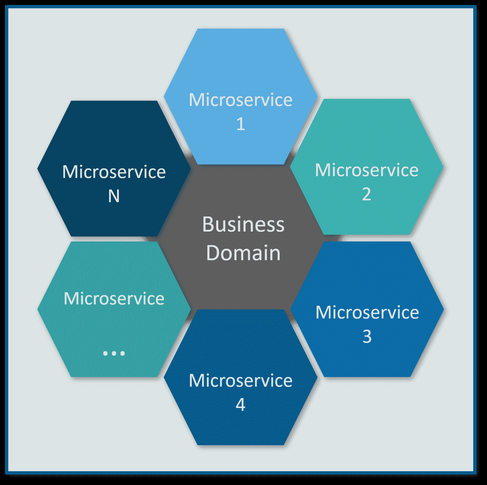
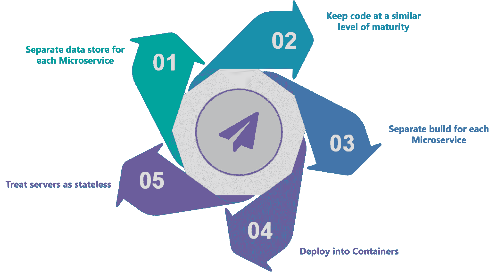
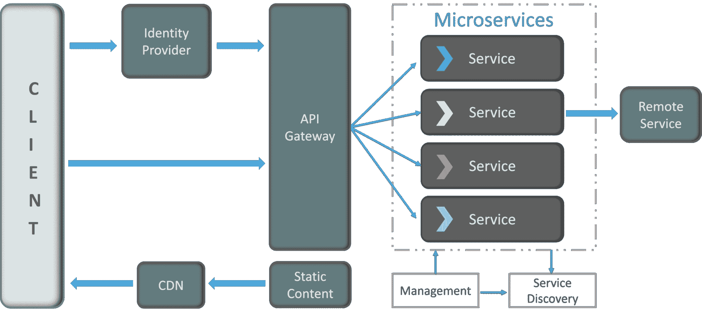

# 2023 年你必须准备的 50 个微服务面试问题

> 原文：<https://www.edureka.co/blog/interview-questions/microservices-interview-questions/>

## **顶级微服务面试问题**

根据 Gartner 的说法，微服务是云开发的新应用平台。微服务是独立部署和管理的，一旦在容器中实现，它们与底层操作系统的交互很少。因此，如果你计划在微服务领域开始你的职业生涯，并且你希望了解与之相关的技能，现在正是时候，因为这项技术还处于萌芽状态。因此，为了帮助你准备面试，我想出了微服务面试问答博客。

在这篇微服务面试问题博客中，我收集了面试官最常问的问题。这些问题是向 ***[微服务认证培训](https://www.edureka.co/microservices-architecture-training)*** 专家咨询后收集的。

Want to Upskill yourself to get ahead in Career? Check out the ***[Top Trending Technologies](https://www.edureka.co/blog/top-10-trending-technologies/) Article.***

如果你最近参加过任何微服务面试，请将这些面试问题贴在评论区，我们会尽快回答。如果你有什么问题，在你的微服务面试中可能会遇到，你也可以在下面评论。

## **顶级微服务面试问题**

1.  [列举微服务架构的优势。](#advantagesofmicroservices)
2.  [你对微服务了解多少？](#whataremicroservices)
3.  [微服务有哪些特点？](#featuresofmicroservices)
4.  设计微服务的最佳实践是什么？
5.  [微服务架构是如何工作的？](#workingofmicroservices)
6.  [微服务架构有哪些利弊？](#prosandconsofmicroservices)
7.  [单片、SOA、微服务架构有什么区别？](#monoliticvssoavsmicroservices)
8.  [您在使用微服务架构时面临的挑战是什么？](#challengesformicroservices)
9.  [SOA 和微服务架构的主要区别是什么？](#soavsmicroservices)
10.  [微服务有什么特点？](#characteristicsofmicroservices)

### **Q1。列出微服务架构的优势。**

 <caption>#### **微服务架构的优势**</caption> 
| **优势** | **描述** |
| ***自主开发*** | 所有微服务都可以基于其各自的功能轻松开发 |
| ***自主部署*** | 基于他们的服务，他们可以在任何应用中单独部署 |
| ***故障隔离*** | 即使应用程序的一个服务不工作，系统仍然继续运行 |
| ***混合技术栈*** | 不同的语言和技术可以用来构建同一应用的不同服务 |
|  | 单个组件可以根据需要扩展，无需将所有组件一起扩展 |

### **Q2。你对微服务了解多少？**

*   **微服务**，又名 ***微服务架构*** ，是一种架构风格，将应用程序构建为小型自治服务的集合，围绕**业务领域建模。**
*   用外行人的话来说，你一定见过蜜蜂如何通过排列六边形的蜡细胞来建造它们的蜂巢。
*   他们最初用各种材料从一小段开始，然后继续用它建造一个大蜂巢。
*   这些细胞形成一种模式，产生一种牢固的结构，将蜂窝的特定部分结合在一起。
*   在这里，每个单元独立于其他单元，但也与其他单元相关联。
*   这意味着对一个细胞的损害不会损害其他细胞，因此，蜜蜂可以重建这些细胞，而不会影响整个蜂巢。

**图 1:** 微服务的蜂巢表征——微服务面试问题

参考上图。这里，每个六边形代表一个单独的服务组件。类似于 bees 的工作，每个敏捷团队用可用的框架和选择的技术栈构建一个单独的服务组件。就像在蜂窝中一样，每个服务组件形成一个强大的微服务架构，以提供更好的可伸缩性。此外，每个服务组件的问题都可以由敏捷团队单独处理，对整个应用程序没有影响或影响很小。

### **Q3。微服务有什么特点？**

**图 3:** 微服务的特点——微服务面试问题

*   **解耦**——系统内的服务在很大程度上是解耦的。因此，应用程序作为一个整体可以很容易地构建、修改和扩展
*   **组件化**–微服务被视为独立的组件，可以很容易地被替换和升级
*   **业务能力**——微服务非常简单，专注于单一能力
*   **自主**–开发人员和团队可以相互独立工作，从而提高速度
*   **连续** **交付**——通过软件创建、测试和批准的系统化自动化，允许软件的频繁发布
*   **责任**——微服务不把应用作为项目来关注。相反，他们将应用程序视为他们负责的产品
*   分权治理——重点是为正确的工作使用正确的工具。这意味着没有标准化的模式或任何技术模式。开发者可以自由选择最有用的工具来解决他们的问题
*   **敏捷**——微服务支持敏捷开发。任何新功能都可以快速开发并再次丢弃

### **Q4。设计微服务的最佳实践是什么？**

以下是设计微服务的最佳实践:

**图 4:** 设计微服务的最佳实践——微服务面试问题

### **Q5。微服务架构是如何工作的？**

微服务架构具有以下组件:

**图 5:** 微服务的架构——微服务面试问题

*   **客户端**–来自不同设备的不同用户发送请求。
*   **身份提供者**—验证用户或客户身份并颁发安全令牌。
*   **API 网关**——处理客户端请求。
*   **静态内容**——容纳了系统的所有内容。
*   **管理**—平衡节点上的服务并识别故障。
*   **服务发现**——寻找微服务间通信路径的指南。
*   **内容交付网络**——代理服务器及其数据中心的分布式网络。
*   **远程服务**–支持远程访问驻留在 IT 设备网络上的信息。

### **Q6。微服务架构有哪些利弊？**

| **微服务架构的优劣** | **微服务架构的弊端** |
| 使用不同技术的自由 | 增加故障排除的挑战 |
| 每个微服务侧重于单一能力 | 因远程呼叫而增加延迟 |
| 支持单个可展开单元 | 加大配置等操作力度 |
| 允许频繁的软件发布 | 难以维护交易安全 |
| 确保每个服务的安全性 | 难以跨越各种界限跟踪数据 |
| 多个服务并行开发和部署 | 服务之间难以编码 |

### **Q7。单片、SOA、微服务架构有什么区别？**

**图 6:** 单片 SOA 对比&微服务——微服务面试问题

*   **单片架构**类似于一个大容器，其中应用程序的所有软件组件被组装在一起并紧密打包。
*   面向服务的架构是相互通信的服务的集合。通信可以包括简单的数据传递，也可以包括两个或多个协调某些活动的服务。
*   **微服务架构**是一种架构风格，它将应用程序构建为小型自治服务的集合，围绕业务领域进行建模。

### **Q8。您在使用微服务架构时面临的挑战是什么？**

开发一些更小的微服务听起来很容易，但是在开发它们时经常面临的挑战如下。

*   **自动化组件**:很难自动化，因为有很多更小的组件。因此，对于每个组件，我们必须遵循构建、部署和监控阶段。
*   **可感知性**:将大量组件维护在一起变得难以部署、维护、监控和识别问题。它需要对所有组件都有很强的感知能力。
*   **配置管理**:在各种环境中维护组件的配置有时会变得很困难。
*   **调试**:很难找出每一个服务的错误。维护集中式日志记录和仪表板来调试问题是非常重要的。

### **Q9。SOA 和微服务架构的主要区别是什么？**

SOA 和微服务的主要区别如下:

| **SOA** | **微服务** |
| 遵循“**尽可能多的共享**”架构方法 | 遵循“**尽可能少的共享**”架构方法 |
| 重要性在于**业务功能**重用 | 重要性在于概念上的**有界语境** |
| 他们有**共同的** **治理的**和标准的 | 他们专注于**人** **协作**和其他选项的自由 |
| 使用**企业服务总线**进行通信 | 简单消息系统 |
| 它们支持**多种消息协议** | 他们使用轻量级协议，如 **HTTP/REST** 等。 |
| **多线程**处理 I/O 的开销更大 | **单线程**通常使用事件循环特性进行非锁定 I/O 处理 |
| 最大化应用服务的可重用性 | 重点关注**脱钩** |
| **传统关系数据库**更常用 | **现代**关系数据库**** 更常用 |
| 系统性的改变需要修改整体结构 | 一个系统性的变化是创建一个新的服务 |
| 开发运维/持续交付正在变得流行，但还不是主流 | 强烈关注开发运营/持续交付 |

### **Q10。微服务有什么特点？**

您可以列出微服务的特征如下:

**图 7:** 微服务的特点——微服务面试问题

您可以浏览微服务面试问题和答案的录音，我们的讲师已经通过示例详细解释了这些主题，这将有助于您更好地理解这一概念。

## **2022 年微服务面试问答|爱德华卡**

[https://www.youtube.com/embed/zWWgKlMEDUU?rel=0&showinfo=0](https://www.youtube.com/embed/zWWgKlMEDUU?rel=0&showinfo=0)

### **Q11。什么是领域驱动设计？**

**图 8:**DDD 原理——微服务面试问题

### **Q12。为什么需要领域驱动设计(DDD)？**

**图 9:** 我们为什么需要 DDD 的因素——微服务面试问题

### **Q13。什么是无处不在的语言？**

如果非要定义**无处不在的语言(UL)** ，那么它就是特定领域的开发者和用户使用的一种通用语言，通过它可以很容易地解释这个领域。

这种无处不在的语言必须非常清晰，这样才能让所有团队成员达成共识，并以机器能够理解的方式进行翻译。

### **Q14。什么是凝聚力？**

一个模块内部的元素属于一起的程度被称为**内聚**。

### **Q15。什么是耦合？**

组件间依赖强度的度量被称为**耦合**。一个好的设计总是被说成有**高内聚**和**低耦合**。

#### 订阅我们的 youtube 频道以获取新的更新..！