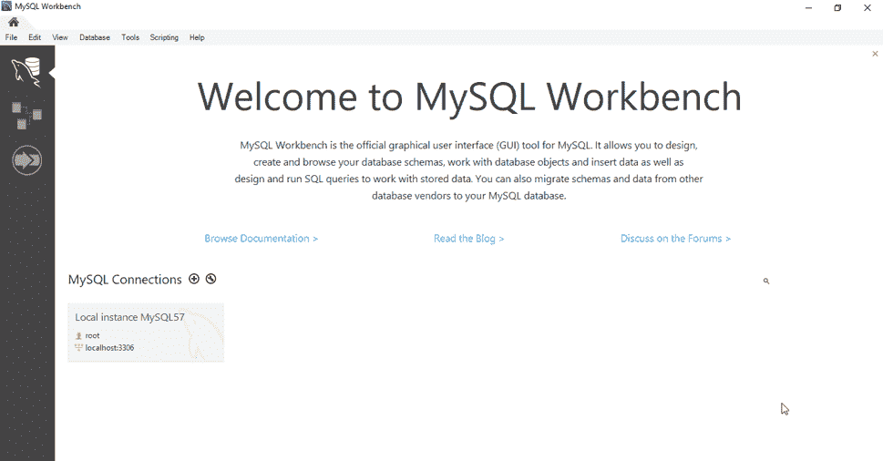
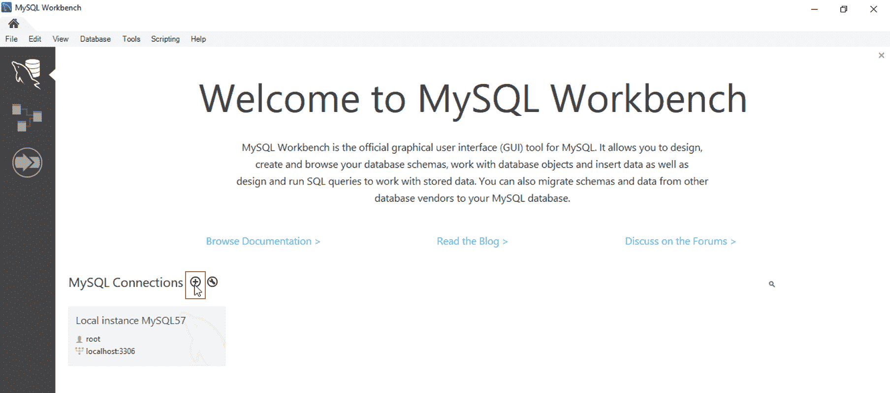
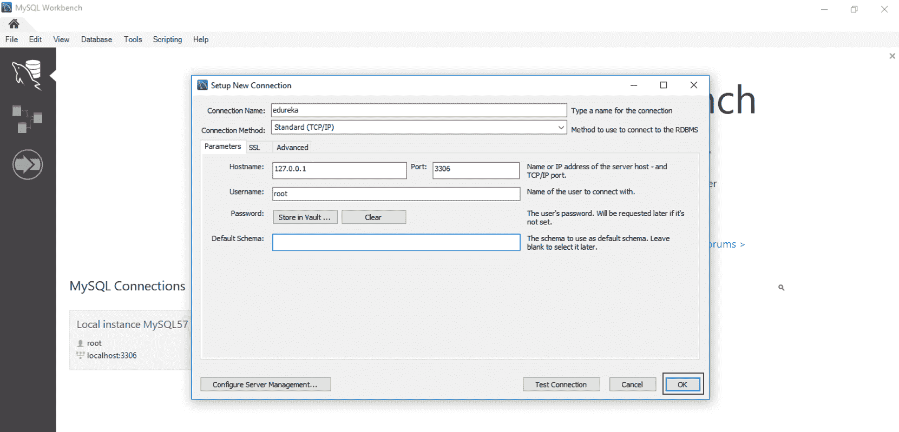
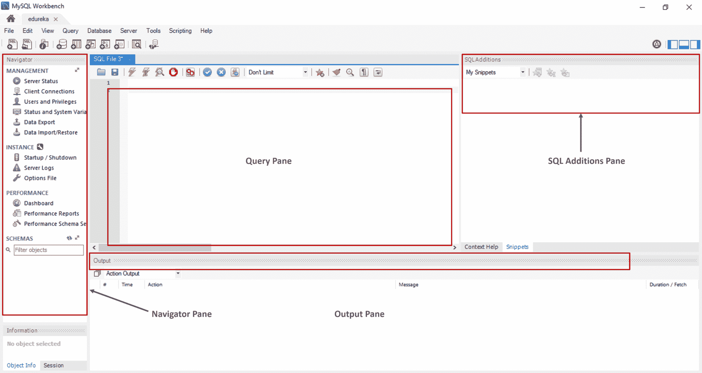
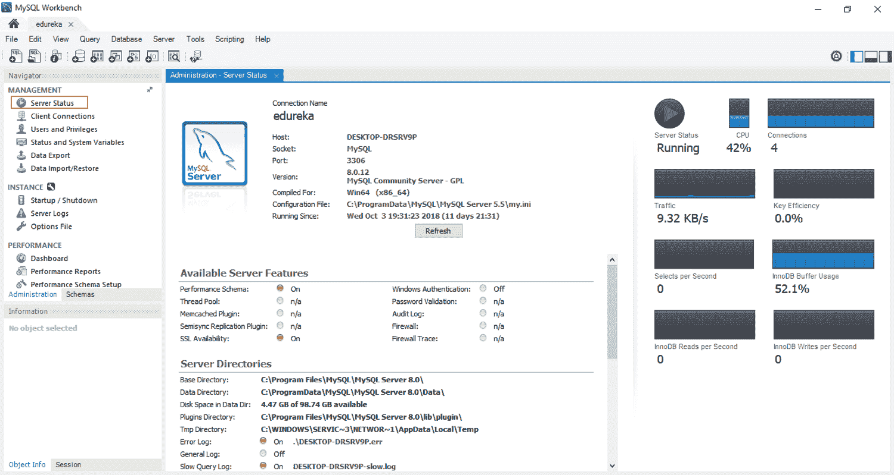
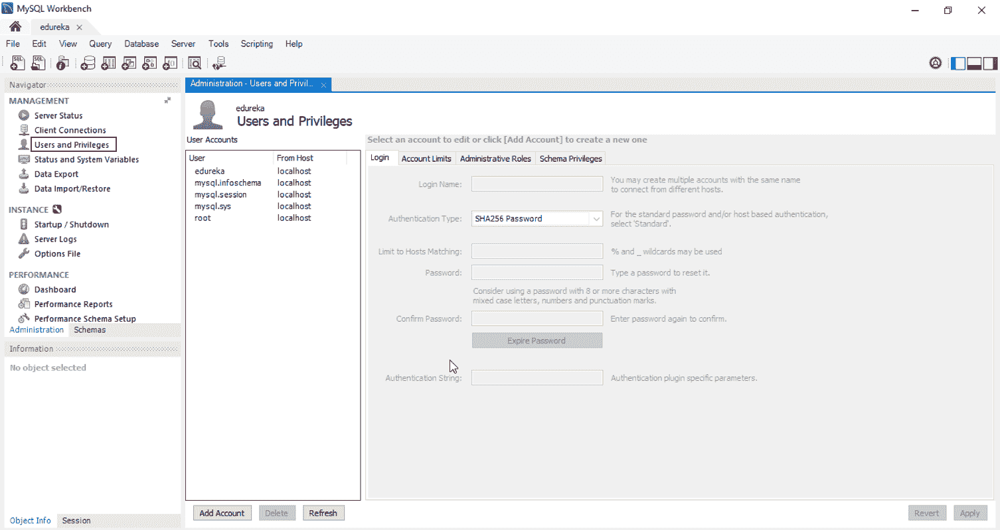
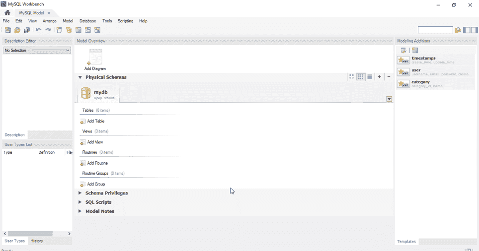

# MySQL Workbench 教程 RDBMS 工具的综合指南

> 原文：<https://www.edureka.co/blog/mysql-workbench-tutorial>

上一篇关于 [**MySQL 教程**](https://www.edureka.co/blog/mysql-tutorial/) 的博客主要关注的是与 SQL 相关的各种命令和概念。在 MySQL Workbench 教程的这篇博客中，您将学习 MySQL 执行各种操作的工具。

本博客将涵盖以下主题:

*   [什么是 MySQL？](#What%20is%20MySQL?)
*   [MySQL 工作台&其功能](#MySQL%20Workbench%20&%20its%20Functionalities)
*   [安装 MySQL 工作台](#Install%20MySQL%20Workbench)
*   [MySQL 工作台版本](#MySQL%20Workbench%20Editions)
*   [创建连接](#Creating%20a%20connection)
*   [SQL 开发编辑](#SQL%20Development%20Editor)
*   [行政任务](#Administrative%20Tasks)
*   [性能仪表盘](#Performance%20Dashboard)
*   [数据库设计&造型](#Database%20Designing%20&%20Modelling)
*   [数据迁移向导](#Data%20Migration%20Wizard)
*   [高级 MySQL 功能](#Advanced%20MySQL%20Capabilities)

## **MySQL 工作台教程:什么是 MySQL？**

MySQL 是一个开源的关系数据库管理系统，可以在很多平台上运行。它提供多用户访问以支持许多存储引擎。

MySQL 具有各种特性，使我们能够完成许多任务，例如全面的应用程序开发、提供可用性和可伸缩性。

现在，很明显，当你在一个行业级别工作时，你不能在终端上做所有的事情，对吗？您需要某种仪表板，使您能够轻松处理大型数据库和创建模型。

可以执行这些操作的仪表板是 MySQL 工作台。

## **MySQL 工作台教程:** **MySQL 工作台&其功能**

MySQL Workbench 是一个设计或图形工具，用于 MySQL 服务器和数据库。该工具与旧的 server 5.x 版本兼容，不支持 4.x 服务器版本。

MySQL work bench 的功能如下:

*   **SQL 开发:**该功能提供了使用内置 SQL 编辑器执行 SQL 查询、创建和管理数据库服务器连接的能力。
*   **数据建模(设计):**此功能使您能够以图形方式创建数据库模式的模型，在模式和实时数据库之间执行反向和正向工程，并使用综合表格编辑器编辑数据库的所有方面。
*   **服务器管理:**此功能使您能够通过管理用户、执行备份和恢复、检查审计数据、查看数据库健康状况以及监控 MySQL 服务器性能来管理 MySQL 服务器实例。
*   **数据迁移:**此功能允许您从 Microsoft SQL Server、Microsoft Access 和其他 RDBMS 表、对象和数据迁移到 MySQL。
*   **MySQL 企业级支持:**该功能为 MySQL 企业级备份、MySQL 防火墙、MySQL 审计等企业级产品提供支持。

现在你已经知道了 MySQL Workbench，接下来让我告诉你安装 MySQL Workbench 的基本要求和步骤。

Want to get certified as Database Administrator? [<button>Learn Now</button>](https://www.edureka.co/mysql-dba)

## **MySQL 工作台教程:** **安装 MySQL 工作台**

安装 MySQL Workbench 的基本系统要求是您应该在系统上安装 MySQL。

现在，由于 MySQL Workbench 可用于许多操作系统。这些系统中的每一个，都有自己的基本要求，你可以从[这里](https://dev.mysql.com/doc/workbench/en/wb-requirements.html)查阅。

除此之外，要下载 MySQL Workbench，您必须点击下载选项卡，然后选择您想要下载的版本。

所以，比如你想在 Windows 上下载 Workbench 的社区版，可以参考这里的链接[。](https://dev.mysql.com/downloads/workbench/)

现在，你知道如何安装了，让我告诉你 MySQL Workbench 的版本。

## **MySQL 工作台教程:** **MySQL 工作台版本**

MySQL Workbench 主要有三个版本:

*   社区版(开源，GPL)
*   标准版(商业版)
*   企业版(商业版)

| **特征** | **社区版** | **标准版** | **企业版** |
| 可视化 SQL 开发 | 是 | 是 | 是 |
| 可视化数据库管理 | 是 | 是 | 是 |
| 性能调整 | 是 | 是 | 是 |
| 用户和会话管理 | 是 | 是 | 是 |
| 连接管理 | 是 | 是 | 是 |
| 对象管理 | 是 | 是 | 是 |
| 数据管理 | 是 | 是 | 是 |
| 可视化数据建模 | 是 | 是 | 是 |
| 逆向工程 | 是 | 是 | 是 |
| 正向工程 | 是 | 是 | 是 |
| 模式同步 | 是 | 是 | 是 |
| 模式&模型验证1 | 否 | 是 | 是 |
| DBDoc1 | 否 | 是 | 是 |
| 用于 MySQL 企业备份的 GUI1 | 否 | 否 | 是 |
| 用于 MySQL 企业审计的 GUI1 | 否 | 否 | 是 |
| 【MySQL 企业防火墙的 GUI1 | 否 | 是 | 是 |
| 脚本&插件 | 是 | 是 | 是 |
| 数据库迁移 | 是 | 是 | 是 |

现在，一旦您下载并安装了 MySQL Workbench，您将看到以下屏幕，即主页选项卡。

在首页标签的左侧，你看到 3 个不同的图标对吗？

这些是主要的三个模块:

*   SQL 开发——本部分包括 SQL 编辑器，您可以通过该编辑器创建和管理数据库。
*   数据建模——这一部分使您能够根据自己的需要对数据进行建模。
*   服务器管理–这一部分用于在连接之间迁移数据库。

现在，在你进入这些模块之前，使用它们的功能。您必须首先创建一个连接。

## **MySQL 工作台教程:** **创建连接**

现在，要创建一个连接，您必须点击您在主页选项卡上看到的加号。

点击后，您会看到这个对话框，您需要在对话框中输入连接名称、连接方法和其他详细信息。在你提到细节后，点击**确定**。

点击 OK 后，您将看到您的连接已经创建。

现在，让我们进入 SQL 编辑器，继续我们的讨论。

Interested to crack interviews for DBA? [<button>Learn Now!</button>](https://www.edureka.co/blog/interview-questions/sql-interview-questions)

## **MySQL 工作台教程:** **SQL 编辑器**

SQL 编辑器由一组专门的编辑器组成，如查询、模式和表格。除此之外，编辑器还包括四个窗格，您可以在屏幕上看到。

因此，查询和窗格一起允许您创建和编辑数据、执行基本管理任务、查看和导出结果以及运行查询。

现在，让我们看看管理任务部分。

## **MySQL 工作台教程:** **管理任务**

在这一部分，您将经历以下几个部分:

*   [服务器状态](#Server%20Status)
*   [用户&特权](#Users%20&%20Privileges)
*   [数据导出&导入](#Data%20Export%20&%20Import)
*   [MySQL 企业备份接口](#MySQL%20Enterprise%20Backup%20Interface)

### **服务器状态**

通过该选项卡，您可以立即查看 MySQL 环境的基本健康指标和计数器。正如您在下面的快照中看到的，该选项卡包括服务器运行速率、可用功能、服务器目录以及身份验证和 SSL 的安全设置的视图。

### **用户&权限**

该选项卡提供了与活动 MySQL 服务器实例相关的所有用户和权限的列表。因此，使用该选项卡，您可以添加和管理用户帐户、调整权限以及使密码过期。请参考下面的快照。

### **数据导出&导入**

在 MySQL Workbench 中，主要有三种导出和导入数据的方法，您可以通过下表了解。

| **GUI 位置** | **数据集** | **导出类型** | **导入类型** |
| SQL 编辑器下的结果网格菜单 | 结果集(执行 SQL 查询后) | CSV，HTML，JSON，SQL，XML，Excel XML，TXT | CSV |
| 对象浏览器上下文菜单 | 表格 | JSON，CSV | JSON，CSV |
| 管理导航器 | 数据库和/或表格 | SQL | SQL |
| 管理导航器 | 数据库和/或表格 | SQL | SQL |

现在，要导出/导入数据，您必须从**导航窗格**中选择数据导出/数据导入选项。

选择该选项后，您必须输入您要导入/导出的文件夹的路径名。请参考下面的快照。

### **MySQL 企业备份接口**

MySQL Workbench 的商业版本使我们能够使用 MySQL 企业备份(MEB)功能，从而保护数据免受任何损失。

【MySQL Workbench 主要提供两种 MySQL 企业备份操作:

*   **在线备份 :** 该操作建立了一个备份配置文件来定义应该备份什么，备份应该存储在哪里，以及什么时候(频率)应该备份 MySQL。
*   **恢复 :** 该操作通过恢复由 MySQL Workbench 中的在线备份功能创建的备份，将 MySQL 服务器恢复到特定时间点。

## **MySQL 工作台教程:** **性能仪表盘**

MySQL Workbench 的性能仪表板为您提供了服务器性能的统计视图。要打开仪表板，请转到**导航窗格**，并在**性能**部分选择仪表板。请参考下面的快照。

除此之外，performance 部分使您能够通过 Performance Schema 报告深入了解 MySQL 服务器的运行情况，并通过 Query Statistics 查看执行的查询的关键统计数据。

## **MySQL 工作台教程:** **数据库设计&建模**

数据库设计使您能够可视化需求并解决设计问题。这使您能够创建有效且性能良好的数据库，同时提供响应不断发展的数据需求的灵活性。

正如你在下面的快照中看到的，你主要有 3 个选择。

从左侧，加号允许您添加一个新的 EER 图表。文件夹标志允许您在 PC 上添加已保存的 EER 模型，作为工作台的基础。您看到的箭头符号允许您从数据库创建 EER 模型或从脚本创建 EER 模型。

下面的快照是 MySQL 工作台的基本视图。

在数据库建模中，你可以使用模型编辑器创建一个 EER 图。因此，您可以添加一个表，添加一个视图，添加一个例程，编辑表中的数据，突出显示模型的特定部分。

好了，伙计们，这些功能并没有结束，我把剩下的留给你们去探索。

## **MySQL 工作台教程:** **数据迁移向导**

MySQL 工作台提供了将 ODBC 兼容的数据库迁移到 MySQL 的能力。它允许您跨服务器迁移到不同的数据库类型，包括 MySQL。它还允许转换表和复制数据，但不会转换存储过程、视图或触发器。

除了在许多平台上工作之外，迁移还允许在迁移过程中进行定制和编辑。

以下是迁移向导在将数据库迁移到 MySQL 时执行的步骤:

*   最初，它连接到源 RDBMS 并检索可用数据库的列表。
*   将所选数据库逆向工程成源 RDBMS 特有的内部表示。因此，在这一步中，所有对象都根据所选择的对象名称映射方法的类型进行重命名。
*   然后，它自动开始将源 RDBMS 对象迁移到 MySQL 特定的对象中。
*   之后，它允许我们检查更改，以便我们可以编辑和纠正迁移对象中的错误。
*   然后，它在目标 MySQL 服务器中创建迁移的对象。如果出现错误，您可以随时返回上一步并进行更正。
*   最后，迁移的表的数据从源 RDBMS 复制到 MySQL。

## **MySQL 工作台教程:** **高级 MySQL 功能**

提供了一个扩展系统，使开发者能够扩展 MySQL Workbench 的功能。它还提供对跨平台 GUI 库 MForms 的访问，并允许创建具有图形用户界面的扩展。

工作台的高级特性支持以下功能:

*   你可以创建工具和插件
*   您可以操作模式并自动化常见任务
*   您可以扩展工作台用户界面并创建自定义工作台功能

所以，这个博客到此结束！

我希望你喜欢在 MySQL Workbench 教程博客上阅读这篇博客。我们已经看到了 MySQL Workbench 的各种功能和特性。

Want to learn more about MySQL? [<button>View Batches Now!</button>](https://www.edureka.co/mysql-dba)

*如果您希望了解更多关于 MySQL 的知识，并了解这款开源关系数据库，那么请查看我们的 **[MySQL DBA 认证培训](https://www.edureka.co/mysql-dba)** ，该培训带有讲师指导的现场培训和真实项目体验。本培训将帮助您深入了解 MySQL，并帮助您掌握这门学科。*

*有问题吗？请在“ **MySQL Workbench 教程**的评论区提及，我会回复你。*