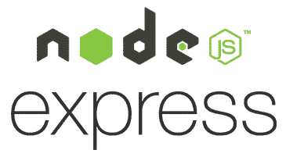

# Node.js 速成教程完整指南——您需要知道的一切

> 原文：<https://www.edureka.co/blog/node-js-express-tutorial/>

谈到服务器端脚本，Node.js 一直是前端开发人员的最爱。嗯，何乐而不为， Node.js 是一种强大的语言，具有广泛的灵活性，并且相对容易编码。但是 Node.js 开发人员一直在寻找可以利用其速度的东西，这导致了 Express.js 的发明。在这篇关于 Node.js Express 教程的文章中，我将全面介绍什么是 Express.js，以及它与 Node.js 一起使用的情况

以下是我将在 Node.js Express 教程中讨论的话题:

*   [express . js简介](#express)
*   [express . js 的特点](#features)
*   [快速入门. js](#gettingstarted)
*   [【获取、发布、放置、删除】](#routing)

## **express . js 简介**

Express.js 是建立在 Node.js 之上的 web 应用程序框架。它有助于在服务器端应用程序中轻松管理服务器和路由之间的数据流。在麻省理工学院的许可下，它作为开源软件发布，公众可以完全免费使用。此外，Express.js 非常轻量级，提供了最大的灵活性以及一长串最有趣的特性。

这就是为什么 Express.js 自开发以来就被称为 Node.js 事实上的标准服务器框架的原因。

Express.js 通过向 Node.js 开发人员提供急需的 后端功能，扩展了他们的视野。它允许开发者用 JavaScript 开发可以在服务器端执行的软件，这在前端应用程序的历史上还是第一次。更简单地说，Express 和 Node 共同完成了这幅画面。Node.js 促进了服务器端应用程序的开发，而 Express.js 则帮助在网站上发布这些应用程序。

在这篇 Node.js Express 教程文章的下一部分中，我们现在来看看 Express.js 的一些主要特性，这些特性帮助 Express . js 在市场上获得了流行。

## **express . js 的特点**

下面我挑选了 Express.js 的一些最重要的特性:

1.  让网络应用开发更快
2.  帮助构建单页、多页和混合类型的移动和 web 应用
3.  Express 提供了两个模板引擎，杰德和 EJS
4.  Express 遵循模型-视图-控制器(MVC)架构
5.  与 MongoDB、Redis、MySQL 等数据库集成
6.  定义了一个错误处理中间件
7.  简化应用程序的配置和定制。

有了上面提到的所有特性，Express.js 让 [Node.js](https://www.edureka.co/blog/nodejs-tutorial/) 的代码开发变得小菜一碟。这就是为什么现在几乎没有 Node.js 应用程序不带 Express.js 的原因。

现在，您已经非常熟悉 Express.js 以及它如何与 Node.js 一起工作，让我们更深入地研究 Node.js Express 教程，并使用两者创建一个简单的应用程序。

## **express . js 入门**

在你开始使用 Express.js 之前，首先你需要[在你的系统](https://www.edureka.co/blog/nodejs-tutorial/#express)上安装 Express.js。让我们从理解一个简单的 Express.js 应用程序的基本组件开始。下面是一个简单应用程序的入口文件，它只在指定的 URL 上显示欢迎消息。

```
//Importing express module
const express = require('express') 
//Creating an express module object
const app = express() 

//Creating Callback function and sending response
app.get('/', (req, res) => res.send('Welcome to Edureka Demo!!!'))

//Establish the server connection
//PORT ENVIRONMENT VARIABLE
const port = process.env.PORT || 8080;
app.listen(port, () => console.log(`Listening on port ${port}..`));
```

如您所见，像任何其他 javascript 文件一样，第一步是导入所需的包。因为我们目前关注的是 Express.js，所以你只需要导入 Express 模块。下一步，创建 express module 对象，以便在应用程序中使用它。完成后，您需要创建一个回调函数，当用户试图浏览应用程序的根目录，即http://localhost:8080时，将调用该函数。然后，这个回调函数将使用您传递的字符串进行响应，并显示在网页上。

在回调函数中,‘RES’参数由‘request’模块提供，将数据发送回网页。

最后，你需要为服务器分配端口。在本例中，我创建了一个环境变量来分配端口 8080。最后，您需要使用 listen to 函数，以便让服务器应用程序在指定的端口上监听客户机请求。

我希望现在你已经掌握了如何建立基本结构。现在让我们进一步了解 Node.js express.js 应用程序中的路由。

## **路由方法**

路由是确定应用程序特定行为的过程。它基本上定义了应用程序应该如何响应客户端对特定路由、路径或 URI 以及特定 HTTP 请求方法的请求。

每条路线可以包含一个以上的处理函数，当用户浏览特定路线时，将执行这些函数。以下是路线定义的结构:

```
app.METHOD(PATH, HANDLER)
```

这里:

*   app 是 express 的一个实例，在这里可以使用任何变量 。
*   方法 是一种 HTTP 请求方法如 获取、设置、放置、删除
*   路径 是特定网页到服务器的路径
*   HANDLER 是找到匹配路由时执行的回调函数。

基本上有四种主要的 HTTP 方法可以在请求中提供，这有助于指定用户请求的操作。这些方法是:

1.  得到
2.  邮政
3.  放
4.  删除

下面我对每一个都做了简短的描述:

### **获取**

HTTP GET 方法帮助客户端请求表示特定的资源。具有 GET 的请求只是检索数据，不会产生任何影响。下面是 GET handler 的一个小例子:

```
app.get('/', (req, res) => {
res.send('Welcome to Edurekas Node.js Express Tutorial!!');
});
```

### **发帖**

HTTP POST 方法帮助请求服务器接受包含在请求中的数据，作为由 URI 识别的资源的新对象。

```
app.post('/api/books', (req, res)=> {
//Method Body
});
```

**放**

HTTP PUT 方法有助于请求服务器接受包含在请求中的数据，作为对由所提供的 URI 标识的现有对象的更改。如果数据不存在，PUT 将使用提供的信息创建一个新的数据。

```
app.put('/api/books/:id', (req, res) => {
//method body
});

```

### **删除**

HTTP DELETE 方法有助于请求服务器从目的地删除特定的资源。

```
app.delete('/api/books/:id', (req, res) => {
//method body
});
```

关于使用 express.js 的 HTTP 方法的完整演示，可以参考我关于 [Node.js REST API](https://www.edureka.co/blog/rest-api-with-node-js/) 的文章。在那里，我提供了对 HTTP 方法和 REST API 的深入描述。

说到这里，我们结束这篇 Node.js 速成教程。我试图让概念简单明了。现在，如果你想了解 Node.js 的更多细节，你可以看看我在 [Node.js 教程](https://www.edureka.co/blog/nodejs-tutorial/)上的文章。

*如果您发现本《Node.js 速成教程* *】相关，* *请查看 Edureka 提供的 [**Node.js 认证培训**](https://www.edureka.co/nodejs-certification-training)* *，edu reka 是一家值得信赖的在线学习公司，拥有遍布全球的 25 万多名满意的学习者。*

*有问题吗？请在本 Node.js 速成教程的评论部分提及，我们会给你回复。*