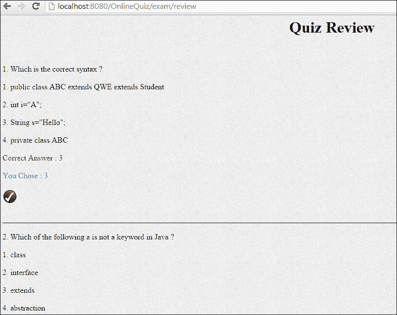
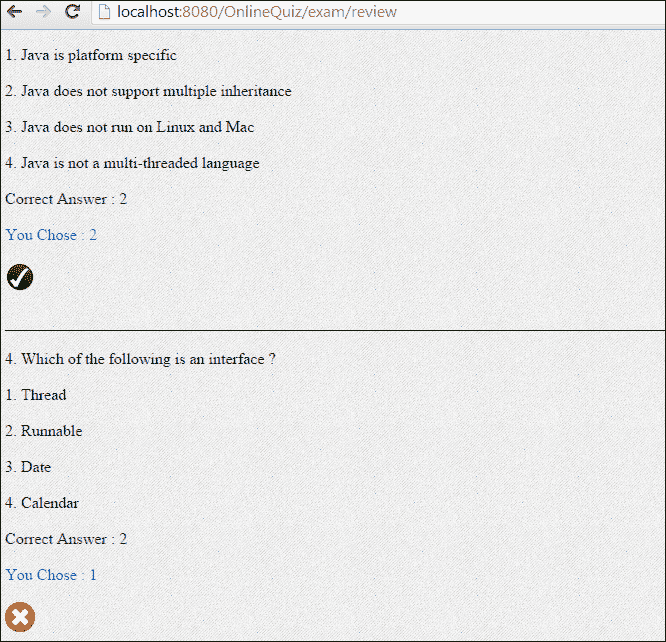
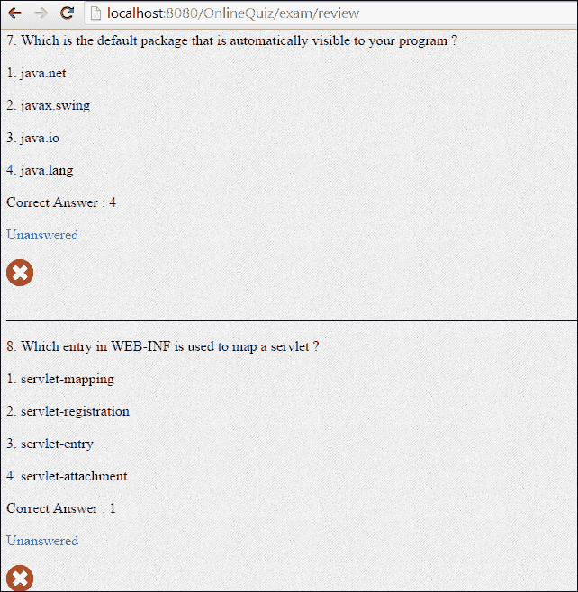
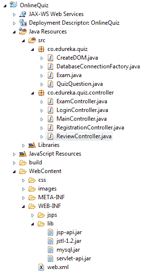

# 在线测验应用程序:测验复习

> 原文：<https://www.edureka.co/blog/online-quiz-application-quiz-review/>

这是使用 JSP Servlet 创建在线测验应用程序系列的第三篇文章。

如果你还没有阅读之前的帖子，请浏览一下，因为这将使你更容易跟随这篇帖子并完全理解它。

第 1 部分—[使用 JSP Servlet 创建在线测验应用程序](https://www.edureka.co/blog/creating-an-online-quiz-application-using-jsp-servlet/ "Creating an Online Quiz Application using JSP Servlet")

第 2 部分—[测验应用程序—实施倒计时定时器](https://www.edureka.co/blog/creating-an-online-quiz-application-implementing-countdown-timer/ "Creating an Online Quiz Application using JSP Servlet")

在这篇文章中，我们将为我们的测验应用程序添加以下功能

1.给用户一个在完成测验时检查他的答案的选项

2.将用户的回答标记为正确或不正确

3.将未回答的问题标记为未回答

下面是创建的测验结果页面的快照。

**测验结果页面**

我们还需要什么来使审查功能工作？

用户可以随时完成测验，完成测验后，他可以选择查看自己的答案。如果用户没有回答某个问题并通过单击“下一步”按钮跳过该问题，则该问题将在考试复习页面上显示为未回答。

为了向用户提供测验的摘要，我们所要做的就是保存用户的回答，当他完成测验时，将它与问题的实际答案进行比较。

如果用户的回答与问题的正确答案相匹配，那么我们显示正确的符号 else 叉号(x)。

[](https://www.edureka.co/blog/wp-content/uploads/2015/02/second-1.png)

[](https://www.edureka.co/blog/wp-content/uploads/2015/02/third-1.png)

我们将添加一个名为 ReviewController 的新控制器，它将提取所有数据并发送到一个 JSP 页面来显示。

**注意:当用户点击下一个或上一个按钮时，我们从 XML 文件中提取问题。**

假设用户开始一个测验，只尝试一个问题，然后点击完成按钮。

现在，在测验评论页面上，我们必须显示所有的问题及其选项，以及用户的回答，无论它是否正确。由于在这种情况下，用户没有完成整个测验，其余的 9 个问题将显示为未回答。

[](https://www.edureka.co/blog/wp-content/uploads/2015/01/Fourth.png)

因此，当用户点击复习测验来查看他的回答以及该问题的正确答案时，我们必须从 XML 文件中获取所有问题及其正确答案。

## Eclipse IDE 中的项目结构

[](https://www.edureka.co/blog/wp-content/uploads/2015/01/project_structure-1.png)

注意:我们刚刚包含了一个新的控制器 ReviewController。

## ReviewController.java

```
@WebServlet("/exam/review")
public class ReviewController extends HttpServlet {
	private static final long serialVersionUID = 1L;

    /**
     * @see HttpServlet#HttpServlet()
     */
    public ReviewController() {
        super();
        // TODO Auto-generated constructor stub
    }

	/**
	 * @see HttpServlet#doGet(HttpServletRequest request, HttpServletResponse response)
	 */
	protected void doGet(HttpServletRequest request, HttpServletResponse response) throws ServletException, IOException {
		// TODO Auto-generated method stub

		Exam exam=(Exam)request.getSession().getAttribute("currentExam");

		request.setAttribute("totalQuestion",exam.getTotalNumberOfQuestions());

		ArrayList< QuizQuestion> reviewQuestionList=new ArrayList< QuizQuestion>();

		Document dom=exam.getDom();

		for(int i=0;i< exam.getTotalNumberOfQuestions();i++){
			int number=i;
			String options[]=new String[4];
		    String question=null;
		    int correct=0;

			NodeList qList=dom.getElementsByTagName("question");
		    NodeList childList=qList.item(i).getChildNodes();		    

		    int counter=0;

		    for (int j = 0; j <  childList.getLength(); j++) {
	            Node childNode = childList.item(j);
	            if ("answer".equals(childNode.getNodeName()))
	            {
	                options[counter]=childList.item(j).getTextContent();
	                counter++;
	            }
	            else if("quizquestion".equals(childNode.getNodeName()))
	            {
	            	question=childList.item(j).getTextContent();
	            }
	            else if("correct".equals(childNode.getNodeName()))
	            {
	            	correct=Integer.parseInt(childList.item(j).getTextContent());
	            }

	        }

			QuizQuestion q=new QuizQuestion();
			q.setQuestionNumber(number);
			q.setQuestion(question);
			q.setCorrectOptionIndex(correct);
			q.setQuestionOptions(options);
		        q.setUserSelected(exam.getUserSelectionForQuestion(i));
			reviewQuestionList.add(number,q);
		}
		request.setAttribute("reviewQuestions",reviewQuestionList);		
		request.getRequestDispatcher("/WEB-INF/jsps/examReview.jsp").forward(request,response);
	}

	/**
	 * @see HttpServlet#doPost(HttpServletRequest request, HttpServletResponse response)
	 */
	protected void doPost(HttpServletRequest request, HttpServletResponse response) throws ServletException, IOException {
		// TODO Auto-generated method stub
		doGet(request,response);
	}

}
```

注意:我已经在 QuizQuestion 的 ArrayList 中设置了所有必需的信息，并将该 ArrayList 设置为请求范围中的一个属性。

```
ArrayList< QuizQuestion> reviewQuestionList=new ArrayList< QuizQuestion>();

request.setAttribute("reviewQuestions",reviewQuestionList);
```

在 JSP 页面中，我们只需检索存储在 reviewQuestions 属性中的值。我已经创建了一个名为 examReview.jsp 的 JSP 页面，它将显示测验摘要。

## 显示 QuizQuestion 以及选项

在 JSP 页面中，我们使用 JSTL c:forEach 来迭代由 ReviewController 设置的 QuizQuestion 列表

```
< c:forEach var="question" items="${requestScope.reviewQuestions}" varStatus="counter">
< br>
${counter.count}. ${question.question}< br/>< br/>

< c:forEach var="option" items="${question.questionOptions}" varStatus="counter">
${counter.count}.   ${option}< br/>< br/>
< /c:forEach>
```

## 显示正确答案

**注意，在 XML 文件中，我存储了从索引 0 开始的选项。**

[](https://www.edureka.co/blog/wp-content/uploads/2015/01/Sixth.png)

这就是为什么我们在向用户显示正确答案时添加了一个，因为这对用户来说是直观的。

```
< font color="green">Correct Answer : ${question.correctOptionIndex+1}< /font>< br/>
```

## 标记未回答的问题

用户不一定要尝试所有的问题。他可以点击“下一步”按钮跳过它。那么我们如何发现一个问题是否被回答了呢？

我在考试构造函数中做了一个改变，这样当我们创建一个新的考试时，对于每个问题，我们也将用户的回答设置为-1。因此，当用户开始测验时，我们将让用户选择每个问题，即使用户只是在测验之间的任何问题上单击“完成”按钮。

但是如果用户实际回答了一个问题，那么-1 将被用户对该问题的选择所取代。

```
public Exam(String test,int totalNumberOfQuestions) throws SAXException,ParserConfigurationException,IOException, URISyntaxException{
		dom=CreateDOM.getDOM(test);

		for(int i=0;i< totalNumberOfQuestions;i++){
			selections.put(i,-1);
		}

		questionList=new ArrayList< QuizQuestion>(totalNumberOfQuestions);

	}
```

因此，如果用户没有回答一个问题，而是跳到下一个问题，或者只是单击 finish 按钮，那么将会出现-1 的初始响应。在 JSP 页面中，我们可以比较用户选择是否为-1。如果为-1，则表示用户没有回答该问题。我们会将该问题标记为未回答。

```
< c:if test='${question.userSelected == -1}'>
< font color="#1334F1">Unanswered< /font>< br/>
< /c:if>
```

## 显示用户响应

如果用户实际回答了一个问题，初始回答-1 将被替换为用户的回答，它将被替换为 1、2、3 或 4，因为每个问题有 4 个选项。

```
< c:if test='${question.userSelected != -1}'>
< font color="#1334F1">You Choosed : ${question.userSelected}< /font>< br/>
< /c:if>
```

我们正在做一个 c:if 测试，以确保用户确实回答了一个问题，然后显示用户的回答。

## 将响应标记为正确

如果用户的选择和问题的正确答案匹配，我们将显示一个显示正确标记的图像。

```
< c:if test='${question.userSelected == question.correctOptionIndex+1}'>
< img height="30" width="30" src="${pageContext.request.contextPatimg/correct.png"/>
< /c:if>
```

## 将响应标记为不正确

一个简单的 c:if 测试将用户的回答与问题的正确选项进行比较。如果两者不相等，这意味着用户回答了错误的问题，我们显示一个带有叉号的图像。

```
< c:if test='${question.userSelected != question.correctOptionIndex+1}'>
< img height="30" width="30" src="${pageContext.request.contextPatimg/redcross.png"/>
< /c:if>
```

单击下载按钮下载代码。

【button leads form _ title = " Download Code " redirect _ URL = https://edu reka . wistia . com/medias/q 2 kgiq 4 su 3/Download？media _ file _ id = 67378724 course _ id = 44 button _ text = "下载代码"]

有问题要问我们吗？请在评论区提到它，我们会给你回复。

**相关帖子:**

[Java 入门/J2EE](https://www.edureka.co/java-j2ee-soa-training)

[使用 JSP Servlet 创建在线测验应用程序](https://www.edureka.co/blog/creating-an-online-quiz-application-using-jsp-servlet/)