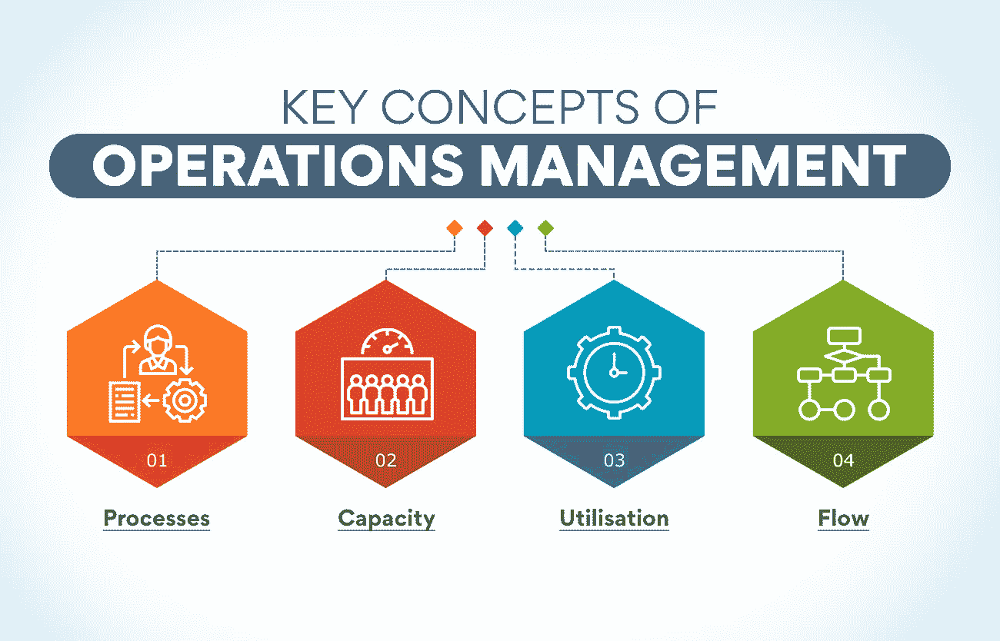

# 运营管理:定义、范例和策略

> 原文：<https://www.edureka.co/blog/operations-management-definition>

什么是运营管理？这是很多人都会问的问题，提供一个简洁的答案可能会很有挑战性。简而言之，运营管理(OM)的定义可以是计划、组织、领导和控制公司资源和活动以实现其目标的过程。它包括从生产和制造到物流和客户服务的一切。在这篇博文中，我们将更详细地探讨运营管理定义，并提供运营管理示例如何在业务中使用。

## **运营管理的定义**

运营管理(OM)的定义是监督、协调和设计业务运营以提高效率和有效性的过程。它是整个生产过程的驱动力，从开始到结束。运营经理的职责包括计划、组织、指导和控制生产公司产品或服务所需的资源。

[运营管理是任何企业或组织的重要职能](https://www.edureka.co/blog/roles-and-functions-of-operations-management/)。它可以决定一家公司是否能够高效地生产高质量的产品或服务。运营经理必须清楚地了解他们的职责以及如何有效地管理运营。

对于运营管理来说，理解几个关键概念很重要。这些包括:

**流程:** 所有的企业都有需要管理的流程来生产他们的产品或服务。运营经理负责确保所有流程高效且有效。

**产能:** 一个公司在一定时期内所能完成的工作量称为产能。运营经理必须了解公司的能力，以确保其得到有效利用。

利用率: 这衡量的是一家公司有多少产能被利用。运营经理努力确保高利用率，以实现效率最大化。

**流程:** 资源在公司生产过程中的移动被称为流程。运营经理需要确保资源顺畅流动，以避免瓶颈。

虽然这些只是理解[运营管理](https://www.edureka.co/blog/beginners-guide-to-operations-management/)所必需的几个概念，但许多其他的概念也很重要。通过理解这些概念，你可以成为一名高效的运营经理。

如果你对运营管理感兴趣，有几个资源可供你参考。例如，我们有一个关于运营管理的深刻课程，可以开始成为运营经理的旅程。

## **不同类型的操作**

**制造:** 是设计、创造、交付商品的过程。制造过程需要原材料、劳动力和设备。制造业的运营管理负责计划、安排和控制这些要素。拥有一个高效的制造流程来按时生产高质量的产品至关重要。

**服务:** 为顾客提供服务的活动。服务运营需要人力和资源来提供服务。服务中的运营管理负责管理向客户提供服务的流程。顺畅无缝的服务功能将产生更多收入并扩大业务。

**也读:[运营管理的目标是什么？](https://www.edureka.co/blog/what-are-the-objectives-of-operations-management/)**

**零售:** 零售行业的运营管理保证了店铺的平稳高效运行。它包括诸如上架、管理库存和提供客户服务等任务。零售运营经理必须能够有效地计划和执行任务，才能取得成功。零售行业的运营经理通常具有商业或管理背景，并忽略商店位置的日常运营。

招待费是管理企业日常运营的过程。运营管理的目标是简化公司的运营，使其尽可能高效和有效。运营经理负责业务的各个方面，以确保业务顺利运行，并确保实现公司的目标。例如，酒店的运营经理将负责管理前台、客房服务和餐饮员工。

**物流:** 物流需要计划、实施和控制产品和服务从产地到消费地的流动。通俗地说，物流就是两点之间资源流动的管理。物流对运营管理至关重要，因为它决定了公司生产和交付产品或服务的效率。

**供应链:** 从获得原材料到将成品交付给客户的过程称为供应链。正是这些活动将输入转化为输出。在运营管理中，主要目标是管理转换过程，使其平稳高效地运行。[供应链管理中的运营管理](https://www.edureka.co/blog/operations-management/)包括管理资源、信息和财务。

关于运营管理，你需要学习很多东西。想开始你的职业生涯吗？查看我们在运营、供应链和项目管理方面的高级课程，给你的职业生涯一个推动力。

## 运营管理是如何运作的？

**运营管理的定义需要** 监督、设计和控制商品或服务的生产。它包括管理创造产品或服务所必需的资源。运营管理确保生产过程高效且有效。运营管理的目标是为组织创造价值。

**运营管理流程:**

运营管理是由三个主要功能组成的流程:

*   **规划:** 这是确定需要做什么以及什么时候需要做的过程。使用 OM，您可以创建一个计划来指导您的业务运营。
*   **调度:** 它决定每项任务何时完成。在运营管理中，您可以创建一个计划来确保所有任务按时完成。
*   **执行:** 是关于执行计划。在运营管理中，您通过确保所有资源得到有效利用来执行计划。

## **运营管理的例子有哪些？**

运营管理通过优化利用所有资源来满足客户需求，确保所有业务运营高效运行。它涉及管理创造和交付公司主要产品和服务的过程。

主导流程的常见运营管理活动包括:

*   产品和服务设计
*   过程选择
*   产能规划
*   质量控制
*   库存管理
*   调度
*   供应链管理
*   项目管理。

**运营管理示例**

**一家公司的制造流程:** 一家制造公司将需要设计其流程并建立质量控制程序，以确定所有产品最有效地满足客户要求。该公司还需要确定最有效的方式来使用其资源和安排生产，以满足客户需求。

公司的销售和营销流程: 管理公司的销售和营销流程至关重要，因为它们是创造收入的源泉。如果这些流程得不到有效管理，公司将无法产生维持自身所需的收入。

**呼叫中心的运营:** 在呼叫中心，运营管理部门负责诸如计划人员配备水平、监控绩效和安排休息时间等活动。它还负责确保呼叫中心拥有必要的设备和用品。呼叫中心的运营管理通常也负责培训新员工。

**创造新产品:** 在创造新产品时，运营管理流程中有几个重要的考虑因素。市场研究、目标受众、产品设计和生产计划都确保了产品的成功。

**也可阅读:[医院运营管理——了解关键职能](https://www.edureka.co/blog/operations-management-in-hospitals)**

**创建和维护库存:** 为了跟上客户需求，企业需要维持一定水平的库存。这包括预测客户需求，并确保手头有足够的库存来满足这一需求。

## **运营管理策略**

各公司使用不同的[运营管理](https://www.edureka.co/blog/why-do-businesses-need-an-operations-strategy/)策略来提高业务流程的效率。

降低成本: 降低成本是提高运营效率的一种方法。这可以通过提高生产率和消除浪费来实现。例如，宏盟是一家通过降低运营成本节省了数百万美元的公司。它将能够把这些节省下来的资金再投资到业务的其他领域，或者用它们来提高底线。

**提高质量:** 运营管理还负责提高产品和服务的质量。这可以通过质量控制来实现，质量控制设定标准，然后衡量产品或服务是否符合这些标准。如果没有，运营经理会努力找出问题的原因并找到解决方案。质量改进是运营经理永无止境的目标，因为无论质量已经有多好，总有改进的空间。

**提高生产率**

运营经理也有责任提高生产率。通过提高生产力，运营经理可以帮助提高公司的底线。例如，如果运营经理可以找到一种方法来减少完成任务所需的时间，他们就可以为公司省钱。此外，如果运营经理能够提高产品质量，他们就能增加销售额和收入。有几种方法，如过程改进、质量控制和员工培训。

**最佳利用数据**

数据是任何称职的运营经理的生命线。为了对生产过程做出[准确的决策](https://www.edureka.co/blog/operations-management-decisions)，人们必须获得准确和最新的数据。数据可以来自各种来源，如销售报告、客户调查，甚至是从生产过程本身收集的数据。一旦收集了所有数据，就必须对其进行分析，以确定任何趋势或模式。这种分析可用于决定如何改进生产过程或预测未来需求。

**设定目标和预测**

运营管理就是设定目标和预测。它包括弄清楚需要做什么来达到预期的结果，以及预测未来的趋势。为了确保您的组织平稳运行，必须部署运营管理。只有通过这种理解，你才能设定适当的目标，做出准确的预测。

**加强协作**

运营管理的定义运营管理是一个与生产商品和服务有关的商业领域，包括确保以尽可能少的资源有效地管理商业运营。为此，各业务部门之间的有效协作是必不可少的。所有团队成员都必须意识到他们的角色和责任来实现这一点。他们需要能够和谐地一起工作，以避免任何冲突

**人力资源管理**

人力资源管理是一个帮助组织管理和控制员工相关活动的过程。它包括吸引和雇佣员工进行培训和发展、绩效管理和员工关系。人力资源管理实践(如劳动力规划和继任规划)可以提高运营管理的效率。

**改善供应链**

供应链包括将原材料转化为成品并交付给最终客户的所有过程。运营管理提高了组织供应链的效率和有效性。换句话说，它确保商品和服务的生产和交付迅速且具有成本效益。

## **底线**

没有运营管理，企业将无法生产商品或提供服务。这一关键的管理区域确保所有生产环节平稳高效地运行。在高需求时期，企业必须在保持质量标准的同时满足客户的期望，这一点至关重要。

运营管理负责计划、协调和控制生产公司产品和服务所需的所有资源和活动。从原材料到成品，运营管理监督生产的每一步。在当今快节奏的商业世界中，高效的运营管理是成功的关键。

如果你渴望学习更多关于运营管理的知识，请参加我们的综合证书课程。它涵盖了从运营管理定义和示例到不同类型的运营管理的所有内容。你还在等什么？借助我们关于运营管理的[课程，加速您的职业发展。](https://www.edureka.co/highered/advanced-program-in-operations-supply-chain-project-management-iitg)

## **更多信息:**

[了解人才管理及其重要性](https://www.edureka.co/blog/talent-management-and-its-importance/)

[战略性劳动力规划:步骤和流程](https://www.edureka.co/blog/strategic-workforce-planning)

[改善员工关系——11 条建议](https://www.edureka.co/blog/employee-relations)

[什么是运营管理中的流程设计？](https://www.edureka.co/blog/process-design-in-operations-management/)