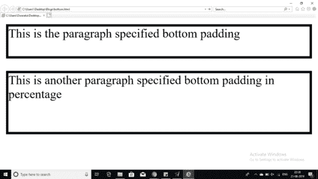
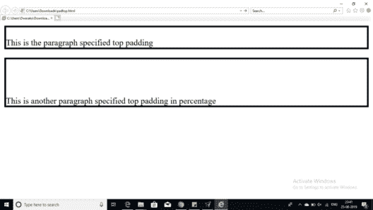
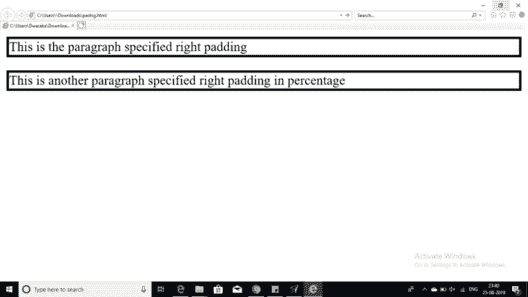
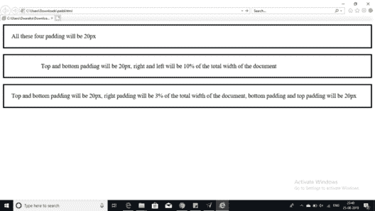

# 如何用例子实现 CSS 中的填充

> 原文：<https://www.edureka.co/blog/padding-in-css>

填充是 [HTML](https://www.edureka.co/blog/what-is-html/) 和 [CSS](https://www.edureka.co/blog/what-is-css/) 最重要的方面之一。在本文中，我们将按以下顺序讨论 CSS 中填充的重要性和用法:

*   [CSS 中的填充是什么？](#what)
*   [填充属性](#properties)

## **CSS 中的填充是什么？**

padding 属性允许您指定元素的内容文本和它的边框之间应该出现的位置和间距。该属性的值应该是长度、百分比或单词。

如果该值是继承的，它将与父值填充相同。此处如果使用百分比，则百分比是包含框的百分比。

## **填充属性**

CSS 中填充的以下属性可用于控制列表。不过，您也可以主要使用以下属性为盒子两侧的填充设置不同的值:

*   **Padding-bottom:** 指定一个元素的底部填充。

*   **Padding-top:** 指定一个元素的顶部填充。

*   **左填充:**指定元素的左填充。

*   **右填充:**指定元素的右填充。

*   **填充:**这是进一步属性的简写。

**底部填充属性:**

这被设置为一个元素的底部填充。它可以接受百分比长度的值。

`
` `This is the paragraph specified bottom padding 
` `
` `This is another paragraph specified bottom padding in percentage`

**输出:**

**填充顶部属性**

此 padding-top 属性将设置元素的顶部填充。这可以采用百分比长度的值。

`
``This is the paragraph specified top padding``
``
``This is another paragraph specified top padding in percentage`

**输出:**

**左填充属性**

这个左填充属性将设置一个元素的左填充。它可以接受百分比长度的值。

`
``This is the paragraph specified left padding``
``
``This is another paragraph specified left padding in percentage`

**输出:**

**右填充属性**

这个 padding-right 属性将设置元素的右填充。它可以接受百分比长度的值。

`
``This is the paragraph specified right padding``
``
``This is another paragraph specified right padding in percentage`

**输出:**

**填充属性**

这个填充属性设置右、左、上、下的填充。这可以采用百分比长度的值。

`
``All these four padding will be 20px``
``
``Top and bottom padding will be 20px, right and left will be 10% of the total width of the document``
``
``Top and bottom padding will be 20px, right padding will be 3% of the total width of the document, bottom padding and top padding will be 20px``
`

**输出:**

至此，我们结束了这篇关于 CSS 中填充的精彩文章。我希望你能理解我们添加填充的各种方法。

如果你有兴趣学习更多关于网络开发的知识，可以看看 Edureka 的 **[网络开发认证培训](https://www.edureka.co/complete-web-developer)** 。 *Web 开发认证培训将帮助您学习如何使用 HTML5、CSS3、Twitter Bootstrap 3、jQuery 和 Google APIs 创建令人印象深刻的网站，并将其部署到亚马逊简单存储服务(S3)。*

如果你仍然感兴趣，如果你有任何问题，你可以在这个“CSS 填充”博客的评论区发表，我们会尽快回复你。