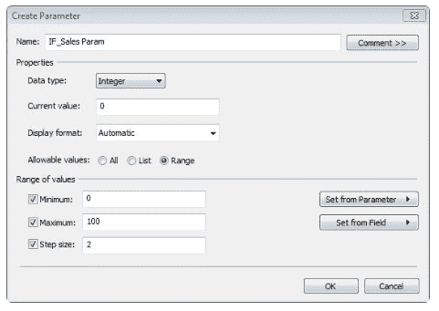
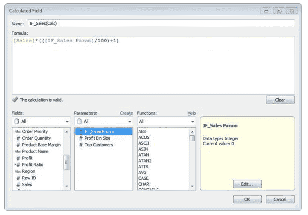
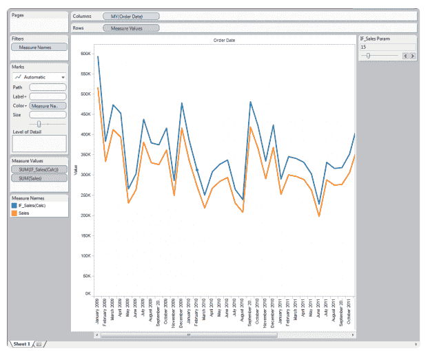

# 如何在 Tableau 中创建和使用参数

> 原文：<https://www.edureka.co/blog/parameters-in-tableau/>

请这样想，如果您的可视化需要一个不在数据集中的组件，该怎么办？Tableau 中的 ***参数将允许您将该值传递到 [*Tableau*](https://www.edureka.co/blog/tableau-tutorial/) 中。***

Tableau 正在成为 2019 年商业智能领域最热门的趋势之一。看看谷歌的趋势，似乎没有比“现在”更好的时机来让 ***[在 Tableau](https://www.edureka.co/tableau-certification-training) 获得认证。***

本文涵盖以下主题:

*   [Tableau 中的参数是什么？](#whatareparametersintableau)
*   [入门](#gettingstarted)
*   [在 Tableau 中创建参数](#creatingparametersintableau)
*   [在计算中使用 Tableau 参数](#usingtableauparametersincalculations)
*   [参数控制](#parametercontrol)
*   [在可视化中使用 Tableau 参数](#usingtableauparameters)

[https://www.youtube.com/embed/sH1Rtzl9zCQ](https://www.youtube.com/embed/sH1Rtzl9zCQ)

## **Tableau 中的参数是什么？**

Tableau 中的参数允许您使用数据中没有的聚合值，并将这些值合并到您的 [***仪表板报告***](https://www.edureka.co/blog/tableau-dashboards/) 中。创建后，最终用户可以控制输入来查看参数效果的结果。

那么，Tableau 中的参数到底是什么？

***为了特定目的定制程序而传递给程序的任何值都称为参数**。*它可以是任何东西:一个文本串、一个数值范围或一个数量，等等。

参数帮助您试验一些*假设*场景。假设您不确定要在视图中包含哪些字段，或者哪种布局最适合您的查看者。您可以将参数整合到您的视图中，您的 [***图表和图形***](https://www.edureka.co/blog/tableau-charts/) 让查看者选择他们想要如何查看数据。

当您使用参数时，您需要以某种方式将它们与视图联系起来:

*   视图中使用的计算和计算字段中。

*   在视图中显示参数控件，供用户选择参数。

*   引用参数操作中的参数。

仅仅从理论上了解这个概念对你没有任何好处。因此，在接下来的几个部分中，我将指导您完成在 Tableau 中创建和使用参数的过程。

## **第一步:入门**

您可以从打开 Tableau 并连接到 ***超市样本数据集开始。***

1.将 ***订单日期*** 拖到列货架，将 ***销售*** 拖到行货架。

2.右键单击 ***年*** 列架上的药丸。

3.前往 ***更多>习俗。***

4.当 ***自定义日期*** 对话框出现时，点击下拉菜单中的 ***月/年*** 选项。

你将得到一个如下的图表:

****

## **步骤 2:在 Tableau 中创建参数**

因此，我试图创建的场景是一个 ***假设*** 场景。比如说。 ***如果销售额增加 3%***会怎么样。

要创建参数，请执行以下操作:

1.  进入 ***分析*** 菜单，选择 ***创建计算字段*** 。或者，您也可以在 ***Measures*** 窗格中右键单击，并从那里选择 ***创建计算字段*** 。
2.  现在，在创建将使用我们的参数的计算字段之前，我们必须创建参数。所以在窗口的下半部分，有一个标题为 ***参数*** 的部分，旁边还有一个链接写着 ***创建*** 。点击 ***创建*** 。
3.  完全按照所示填写字段。
4.  点击 ***确定*** 。您的参数现在显示在参数框中。

****

## **步骤 3:在计算中使用 Tableau 参数**

现在，对于这个场景，我们现在想使用我们的参数和一些 [***Tableau 函数***](https://www.edureka.co/blog/tableau-functions/) 来创建一个计算字段添加到我们的图形中，以查看 ***它对我们的数据*** 的影响。仍在“计算字段”对话框中，创建计算字段:

1.将计算字段命名为 ***IF_Sales(Calc)***

2.公式: ***【销售额】*(([IF _ Sales Param]/100)+1)***

3.点击 ***确定*** 。  ♠ *请注意，在计算中，我们创建的参数将与销售度量进行交互。*

## **第四步:参数控制**

返回 Tableau 主视图，您将在“度量”窗格中看到计算字段，并在数据窗口的“参数”窗格中看到参数。 1。点击 ***参数 IF_Sales Param***

2.选择 ***显示参数控制***

3.在视图的右上方，将显示您的 ***参数控制过滤器*** 。

****

## **步骤 5:在可视化中使用 Tableau 参数**

1.将 ***计算字段 IF_Sales(Calc)*** 拖放到 ***Sales*** 轴上。当你悬停在它上面时，你会注意到一个透明的等号。

2.放下后，您会注意到 ***测量名称*** 现在已经添加到您的 ***颜色架*** ，并且一个 ***颜色图例*** 同时显示和 ***IF_Sales*** 。

3.因为您的参数控制在 0，所以您的线在彼此之上。

4.单击您的参数控件，您将看到两行出现。

这几行同时代表来自数据集的销售额和 ***计算销售额*** 的运行值。并且您已经成功地将您的参数合并到您的 [***可视化***](https://www.edureka.co/blog/what-is-tableau/) ！

参数是动态的有用元素，可以为报表增加交互性和灵活性。这是一个多功能的工具，可以用于计算和设置，同样好！

*想了解更多 Tableau 中的参数？或者可能是其他概念？Edureka 的 [**Tableau 10 认证培训**](https://www.edureka.co/tableau-certification-training) 就是适合你的。它与 Tableau 合格的协理水平考试相一致。它专门用于帮助分析和数据专业人员创建有洞察力的视觉效果、仪表盘、执行脚本和在 Tableau 上创建网络图，从而以更好、更有洞察力的方式呈现数据。现场互动课程由行业从业者共同创建，涵盖了 Tableau 数据可视化的关键方面，如条件格式、脚本、链接图表、仪表板集成以及 Tableau 与 R.* 的集成