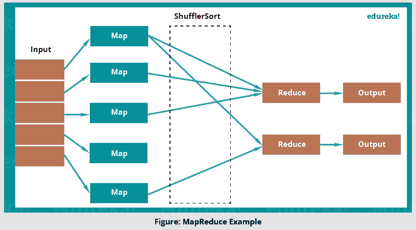
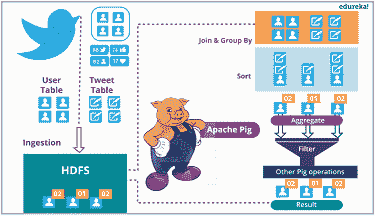
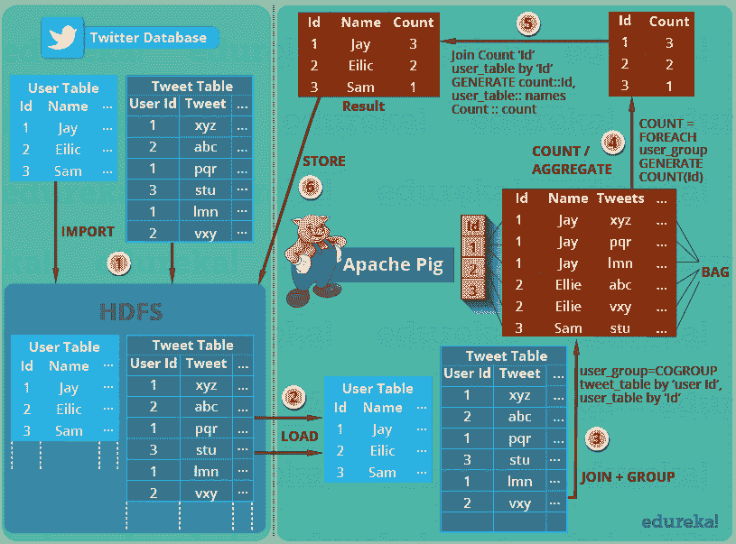
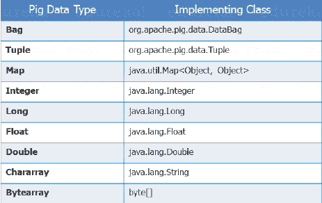
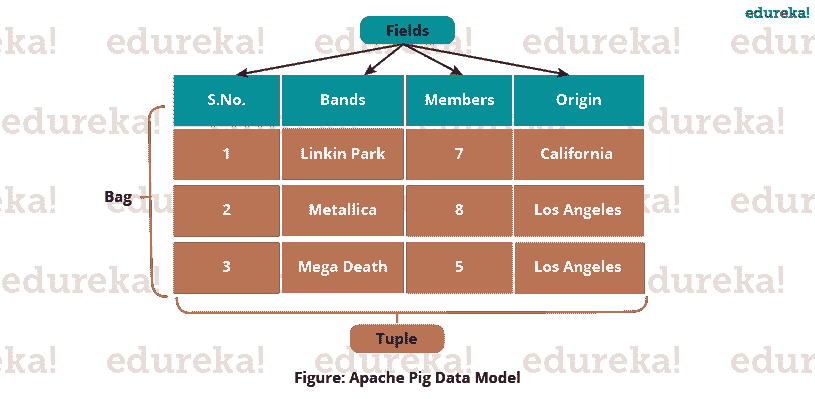

# Pig 教程:Apache Pig 架构和 Twitter 案例研究

> 原文：<https://www.edureka.co/blog/pig-tutorial/>

正如我们在 ***[Hadoop 生态系统](https://www.edureka.co/blog/hadoop-ecosystem)*** 博客中提到的，Apache Pig 是我们 Hadoop 生态系统中必不可少的一部分。所以，我想带你看一下这个 Apache Pig 教程，它是我们 ***[Hadoop 教程系列](https://www.edureka.co/blog/hadoop-tutorial/)的一部分。*** 学习它有助于你理解并无缝执行 [***大数据 Hadoop 认证***](https://www.edureka.co/big-data-and-hadoop#projects) 所需的项目。在这篇阿帕奇猪教程博客中，我将谈论:

*   [阿帕奇猪 vs MapReduce](#apache_pig_vs_mapreduce)
*   [阿帕奇猪简介](#introduction)
*   [哪里用阿帕奇猪？](#where_to_use_apache_pig)
*   [推特案例分析](#twitter_case_study)
*   [阿帕奇猪建筑](#architecture)
*   [猪拉丁数据模型](#pig_latin_data_model)
*   [阿帕奇猪图式](#schema)

在开始 Apache Pig 教程之前，我想让你问自己一个问题——*当 MapReduce 用于大数据分析时，为什么 Apache Pig 会出现？*

这个甜蜜而简单的答案是:

***大约 10 行 Pig 代码等于 200 行 MapReduce 代码*** 。

用 Java 编写 MapReduce 作业对每个人来说都不是一件容易的事情。如果你想体验一下 MapReduce Java 代码， ***[点击这里](https://www.edureka.co/blog/mapreduce-example-reduce-side-join/)*** 你就会明白其中的复杂性。因此，Apache Pig 成为不擅长 Java 或 Python 的程序员的福音。即使有人懂 Java 并且擅长 MapReduce，他们也会更喜欢 Apache Pig，因为使用 Pig 很容易。现在让我们来看看。

## **阿帕奇猪教程:阿帕奇猪 vs MapReduce**

程序员在编写 MapReduce 任务时面临困难，因为它需要 Java 或 Python 编程知识。对他们来说，阿帕奇猪是救星。

*   Pig Latin 是一种高级数据流语言，而 MapReduce 是一种低级数据处理范式。
*   不用在 MapReduce 中编写复杂的 Java 实现，程序员可以使用 Pig Latin 非常容易地实现相同的实现。
*   Apache Pig 使用多查询方法(即使用 Pig Latin 的单个查询我们可以完成多个 MapReduce 任务)，这将代码长度减少了 20 倍。因此，这将开发周期缩短了近 16 倍。
*   Pig 提供了许多内置的操作符来支持数据操作，如连接、过滤、排序、分类等。而在 MapReduce 中执行相同的功能是一项巨大的任务。
*   在 Apache Pig 中执行连接操作很简单。而在 MapReduce 中很难执行数据集之间的连接操作，因为它需要顺序执行多个 MapReduce 任务来完成工作。
*   此外，它还提供了 MapReduce 中没有的嵌套数据类型，如元组、包和地图。一会儿我会给你解释这些数据类型。

现在我们知道了为什么阿帕奇猪会出现在画面中，你会很好奇什么是阿帕奇猪？让我们在这个 Apache Pig 教程博客中继续前进，浏览 Apache Pig 的介绍和特性。

## **阿帕奇猪教程:** **阿帕奇猪简介**

Apache Pig 是一个平台，用于分析将它们表示为数据流的大型数据集。它旨在提供 MapReduce 的抽象，降低编写 MapReduce 程序的复杂性。我们可以使用 Apache Pig 在 Hadoop 中非常容易地执行数据操纵操作。

阿帕奇猪的特点是:

*   Pig 使程序员能够在不懂 Java 的情况下编写复杂的数据转换。
*   Apache Pig 有两个主要组件——Pig 拉丁语言和 Pig 运行时环境，Pig 拉丁程序在其中执行。
*   对于大数据分析，Pig 给出了一种简单的数据流语言，称为 ***Pig Latin*** ，它具有类似于 SQL 的功能，如连接、过滤、限制等。
*   使用脚本语言和 SQL 的开发人员利用了猪拉丁语。这就给了开发者 ***e*** ***用阿帕奇猪编程*** 的 ase。Pig Latin 提供了各种内置的操作符，如 join、sort、filter 等，用于读取、写入和处理大型数据集。由此可见，Pig 有一个 ***r** **ich 套运算符*** 。
*   程序员使用 Pig Latin 编写脚本来分析数据，这些脚本由 Pig MapReduce 引擎在内部转换为 Map 和 Reduce 任务。在 Pig 之前，编写 MapReduce 任务是处理存储在 HDFS 的数据的唯一方法。
*   如果程序员想编写 Pig 中没有的自定义函数，Pig 允许他们用自己选择的任何语言编写用户定义的函数(***【UDF***),如 Java、Python、Ruby、Jython、JRuby 等。并把它们嵌入到猪文字中。这为 Apache Pig 提供了 ***e** **的可扩展性*** 。
*   Pig 可以处理任何类型的数据，即来自不同来源的结构化、半结构化或非结构化数据。阿帕奇猪 ***h** **andles 各种数据*** 。
*   大约， *10 行 pig 代码等于 200 行 MapReduce 代码*。
*   它可以处理不一致的模式(在非结构化数据的情况下)。
*   Apache Pig 提取数据，对数据执行操作，并以所需格式将数据转储到 HDFS，即 **ETL(提取转换加载)**。
*   Apache Pig 自动优化执行前的任务，即 ***自动优化*** 。
*   它允许程序员和开发人员专注于整个操作，而不用分别创建映射器和缩减器函数。

了解了什么是阿帕奇猪之后，现在让我们了解一下哪里可以使用阿帕奇猪，最适合阿帕奇猪的用例有哪些？

## **阿帕奇猪教程:阿帕奇猪用在哪里？**

Apache Pig 用于分析和执行涉及临时处理的任务。使用阿帕奇猪:

*   我们需要处理大量数据集，如网络日志、在线流数据等。
*   我们需要为像 ***这样的搜索平台进行数据处理(需要处理不同类型的数据)，雅虎 40%的工作都使用 Pig，包括新闻提要和搜索引擎*** 。
*   我们需要处理时间敏感的数据负载。在这里，需要快速提取和分析数据。例如，机器学习算法需要时间敏感的数据加载，如 twitter 需要快速提取客户活动的数据(即推文、转发和喜欢)，并分析数据以发现客户行为的模式，并立即提出建议，如趋势推文。

现在，在我们的 Apache Pig 教程中，让我们浏览一下 **Twitter 案例研究**，以更好地了解 Apache Pig 如何帮助分析数据并使业务理解变得更容易。

## **阿帕奇猪教程:Twitter 案例分析**

我将带你看一个 Twitter 的案例，在这个案例中，Twitter 采用了 Apache Pig。

Twitter 的数据正在加速增长(即每天 10 TB 数据)。因此，Twitter 决定将存档数据转移到 HDFS，并采用 Hadoop 来从中提取商业价值。

他们的主要目标是分析存储在 Hadoop 中的数据，以得出以下每日、每周或每月的见解。

### **C**计数操作 :

*   twitter 一天能满足多少请求？
*   请求的平均延迟是多少？
*   Twitter 上每天有多少次搜索？
*   收到多少个独特的查询？
*   有多少独立用户来访问？
*   用户的地理分布如何？

### ***关联大数据*** :

*   移动用户的使用有何不同？
*   群组分析:根据用户的行为，通过对用户进行分类来分析数据。
*   当现场出现问题时，哪里出了问题？
*   用户经常使用哪些功能？
*   搜索修正和搜索建议。

### ***对大数据的研究* &产生更好的成果比如:**

*   Twitter 可以从用户的推文中分析出哪些信息？
*   谁跟随谁，基于什么？
*   跟随者与跟随者的比例是多少？
*   用户口碑如何？

**还有很多……**

所以，为了分析数据，Twitter 最初使用 MapReduce，这是一种基于 HDFS 的并行计算(即 Hadoop 分布式文件系统)。

例如，他们想分析在给定的 tweet 表中，每个用户存储了多少条 tweet？

使用 MapReduce，这个问题将被依次解决，如下图所示:



MapReduce 程序首先将关键字作为行输入，并将 tweet 表信息发送给 mapper 函数。然后，映射器功能将选择用户 id 并将单位值(即 1)与每个用户 id 相关联。Shuffle 函数会将相同的用户 id 排序在一起。最后，Reduce 函数会将属于同一用户的所有 tweets 的数量加在一起。输出将是用户 id，结合用户名和每个用户的 tweets 数量。

但是在使用 MapReduce 时，他们面临一些限制:

*   分析通常需要用 Java 来完成。
*   执行的连接需要用 Java 编写，这使得它更长，也更容易出错。
*   对于投影和滤镜，需要编写定制代码，这使得整个过程变得更慢。
*   使用 MapReduce 时，作业被分成许多阶段，这使得管理变得困难。

于是，Twitter 搬到阿帕奇猪进行分析。现在，连接数据集、分组、排序和检索数据变得越来越简单。你可以在下图中看到 twitter 如何使用 Apache Pig 来分析他们的大型数据集。



Twitter 既有半结构化数据，如 Twitter Apache 日志、Twitter 搜索日志、Twitter MySQL 查询日志、应用程序日志，也有结构化数据，如推文、用户、屏蔽通知、电话、收藏夹、保存的搜索、转发推文、认证、短信使用、用户关注等。这很容易被阿帕奇猪处理。

Twitter 将所有存档数据转储到 HDFS。它有两个表格，即用户数据和推文数据。用户数据包含关于用户的信息，如用户名，追随者，追随者，推文数量等。而 tweet 数据包含 Tweet、其所有者、转发次数、点赞次数等。现在，twitter 使用这些数据来分析客户的行为，改善他们过去的体验。

我们将看到 Apache Pig 如何解决 MapReduce 所解决的相同问题:

**问题** : *在给定的 tweet 表中，分析每个用户存储了多少 tweet？*

下图显示了 Apache Pig 解决问题的方法:



上图显示了这个问题的逐步解决方案。

**步骤****1**——首先，twitter 将 twitter 表(即用户表和 tweet 表)导入 HDFS。

**步****2**——然后 Apache Pig 将表加载( **LOAD** )到 Apache Pig 框架中。

**步骤****3**–然后使用 **COGROUP** 命令将 tweet 表和用户表连接并分组，如上图所示。

这导致了内袋数据类型，我们将在本博客后面讨论。

生产的内袋示例(参考上图)–

(1， **{(1，杰伦，xyz)，(1，杰伦，pqr)，(1，杰伦，lmn)}** )

(2， **{(2，艾莉，abc)，(2，艾莉，vxy)}** )

(3， **{(3，山姆，斯图)}** )

**步****4**——然后根据使用**计数**命令的用户统计推文。因此，每个用户的推文总数可以很容易地计算出来。

产生的元组示例为(id，tweet count)(参考上图)–

(1， **3** )

(2， **2** )

(3， **1** )

**步骤****5**——最后将结果与用户表连接，提取出产生结果的用户名。

产生的元组示例为(id，name，tweet count)(参考上图)–

(1、 ****，**** 3)

(2，**艾莉，** 2)

(3，**山姆**，1)

**步****6**——最后，这个结果被存储回 HDFS。

Pig 不仅仅限于此操作。它可以执行我之前在这个用例中提到的各种其他操作。

这些见解有助于 Twitter 执行情感分析，并根据用户行为和模式开发机器学习算法。

Now, after knowing the Twitter case study, in this Apache Pig tutorial, let us take a deep dive and understand the architecture of Apache Pig and Pig Latin’s data model. This will help us understand how pig works internally. Apache Pig draws its strength from its architecture.

## **小猪教程|爱德华卡**


[//www.youtube.com/embed/GG-VRm6XnNk?rel=0&showinfo=0](//www.youtube.com/embed/GG-VRm6XnNk?rel=0&showinfo=0)

你可以看看这个视频，里面讨论了所有与猪有关的概念。

## **阿帕奇猪教程:建筑**

为了编写 Pig 脚本，我们需要 Pig 拉丁语，为了执行它们，我们需要一个执行环境。Apache Pig 的架构如下图所示。


### **猪拉丁脚本**

最初如上图所示，我们向 Apache Pig 执行环境提交 Pig 脚本，该脚本可以使用内置操作符用 Pig 拉丁语编写。

有三种方法可以执行 Pig 脚本:

*   ***Grunt Shell* :** 这是 Pig 提供的用于执行所有 Pig 脚本的交互 Shell。
*   ***脚本文件* :** 将所有 Pig 命令写入一个脚本文件，并执行 Pig 脚本文件。这是由 Pig 服务器执行的。
*   ***嵌入式脚本* :** 如果一些函数在内置操作符中不可用，我们可以通过编程方式创建用户定义的函数，使用 Java、Python、Ruby 等其他语言来实现这些功能。并嵌入猪拉丁脚本文件**。然后，执行脚本文件。**

### **解析器**

从上图可以看到，通过 Grunt 或 Pig 服务器后，Pig 脚本被传递给解析器。解析器进行类型检查并检查脚本的语法。解析器输出 DAG(有向无环图)。DAG 表示 Pig 拉丁语句和逻辑运算符。逻辑运算符表示为节点，数据流表示为边。

### **优化器**

然后 DAG 被提交给优化器。优化器执行优化活动，如拆分、合并、转换和重新排序操作符等。这个优化器为 Apache Pig 提供了自动优化功能。优化器的基本目标是在处理提取的数据时减少管道中任何时刻的数据量，为此它执行如下功能:

*   *PushUpFilter* :如果过滤器中有多个条件，且过滤器可以拆分，Pig 拆分条件，分别上推每个条件。尽早选择这些条件有助于减少管道中剩余的记录数量。
*   *PushDownForEachFlatten*:应用 Flatten，在计划中尽可能晚的时候，在一个复杂类型(比如 tuple 或者 bag)和记录中的其他字段之间产生一个叉积。这使得管道中的记录数量很少。
*   *【column pruner】*:省略从不使用或不再需要的列，减少记录的大小。这可以在每个操作符之后应用，以便可以尽可能积极地修剪字段。
*   *MapKeyPruner* :省略从不使用的映射键，减少记录的大小。
*   *LimitOptimizer* :如果在加载或排序操作符之后立即应用 limit 操作符，Pig 会将加载或排序操作符转换为对限制敏感的实现，这不需要处理整个数据集。较早应用限制会减少记录的数量。

这只是优化过程的一部分。此外，它还通过执行**加入**、**命令，通过**执行**分组功能。**

要关机，自动优化，可以执行这个命令:

```
pig -optimizer_off [opt_rule | all ]
```

### **编译器**

优化过程结束后，编译器将优化后的代码编译成一系列 MapReduce 作业。编译器负责将 Pig 作业自动转换为 MapReduce 作业。

### **执行引擎**

最后，如图所示，这些 MapReduce 作业被提交给执行引擎执行。然后执行 MapReduce 作业并给出所需的结果。结果可以使用“**转储**语句显示在屏幕上，并可以使用“**存储**语句存储在 HDFS 中。

在了解了架构之后，现在在这个 Apache Pig 教程中，我将为您讲解 Pig Latins 的数据模型。

## **阿帕奇猪教程:猪拉丁数据模型**

Pig Latin 的数据模型使 Pig 能够处理所有类型的数据。Pig Latin 可以处理两种原子数据类型，如 int、float、long、double 等。以及复杂的数据类型，如 tuple、bag 和 map。我将单独解释它们。下图显示了数据类型及其相应的类，我们可以使用它们来实现:



### **原子/标量数据类型**

原子或标量数据类型是所有语言中使用的基本数据类型，如 string、int、float、long、double、char[]、byte[]。这些也被称为原始数据类型。字段(列)中每个单元格的值都是原子数据类型，如下图所示。

对于字段，位置索引由系统自动生成(也称为**位置符号**，用' $ '表示，从$0 开始，增长$1，$2，依此类推……与下图相比，$0 =序列号，$1 =波段，$2 =成员，$3 =来源。

标量数据类型有“1”、“林肯公园”、“7”、“加利福尼亚”等。



现在我们将讨论猪拉丁语中的 ***复杂数据类型*** 即元组、包和映射。

### **元组**

元组是一组有序的字段，每个字段可能包含不同的数据类型。您可以将它理解为存储在关系数据库的一行中的记录。一个元组是一行中的一组单元格，如上图所示。元组中的元素不一定需要附加模式。

一个元组用“()”符号表示。

元组的例子-T2(1，林肯公园，7，加州)

由于元组是有序的，我们可以使用字段的索引来访问每个元组中的字段，比如元组上面的$1 form 将返回值‘Linkin Park’。您可以注意到，上面的元组没有附加任何模式。

### **包**

包是一组元组的集合，这些元组是表的行的子集或整行。一个包可以包含重复的元组，并且不强制要求它们必须是唯一的。

包具有灵活的模式，即包内的元组可以具有不同数量的字段。一个包也可以有不同数据类型的元组。

一个包用“{}”符号表示。

一个包的例子 **{(加州林肯公园 7 号)，(金属乐队 8 号)，(洛杉矶超级死神)}**

但是，为了使 Apache Pig 有效地处理行李，这些字段及其各自的数据类型需要在同一序列中。

一套袋子—

**{(林肯公园，7，加州)，(金属乐队，8)，(超级死神，洛杉机)}，**

**{(金属乐队，8，洛杉机)，(超级死神，8)，(加州林肯公园)}**

有两种袋子，即**外袋**或关系和**内袋。**

外袋或关系只不过是一袋元组。这里的关系类似于关系数据库中的关系。为了更好地理解它，让我们举一个例子:

**{(加州林肯公园)，(洛杉矶金属乐队)，(洛杉矶超级死神)}**

上面这个袋子解释了*乐队*和他们的*发源地*之间的关系。

另一方面，内包包含元组内的包。例如，如果我们根据*波段的来源*对*波段的*元组进行排序，我们将得到:

(洛杉矶， **{(金属乐队，洛杉矶)，(超级死神，洛杉矶)}** )

(加州， **{(加州林肯公园)}** )

这里，第一个字段类型是一个字符串，而第二个字段类型是一个包，它是一个元组中的内部包。


### **地图**

映射是用来表示数据元素的键值对。 关键字必须是 chararray []，并且应该像列名一样是唯一的，这样它就可以被索引，并且可以根据关键字访问与它相关联的值。该值可以是任何数据类型。

地图由“[]”符号表示，键值由“#”符号分隔，如上图所示。

地图示例【乐队#林肯公园，成员#7】，【乐队#金属乐队，成员# 8】

现在正如我们所学的猪拉丁的数据模型。我们将理解 Apache Pig 如何处理模式以及如何处理无模式数据。

## **阿帕奇猪教程:图式**

模式为字段指定名称，并声明字段的数据类型。模式在 Pig 拉丁语中是可选的，但 Pig 鼓励您尽可能使用它们，因为在解析脚本时，错误检查变得很有效，从而导致程序的有效执行。模式可以声明为简单和复杂的数据类型。在 LOAD function 期间，如果声明了模式，它还会附加数据。

Pig 中关于图式的几点:

*   如果模式只包含字段名，则字段的数据类型被认为是字节数组。
*   如果给字段指定了名称，您可以通过字段名和位置符号来访问该字段。而如果缺少字段名，我们只能通过位置符号来访问它，即$后跟索引号。
*   如果您执行任何关系组合的操作(如连接、共组等)。)并且如果任何关系缺少模式，则产生的关系将具有空模式。
*   如果模式为空，Pig 会将其视为字节数组，字段的实际数据类型将动态确定。

我希望这个阿帕奇猪教程博客内容丰富，你会喜欢。在这篇博客中，您了解了 Apache Pig 的基础知识，它的数据模型和架构。Twitter 案例研究可以帮助你更好地沟通。在我的下一篇关于 ***[Hadoop 教程系列](https://www.edureka.co/blog/hadoop-tutorial/)*** 的博客中，我们将会介绍 Apache Pig 的 ***[安装，这样您就可以在实际操作 Pig 和执行 Pig 拉丁命令的时候亲自动手了。](https://www.edureka.co/blog/apache-pig-installation)***

*既然你已经理解了 Apache Pig 教程，那就来看看 Edureka 的 **[Hadoop 培训](https://www.edureka.co/big-data-and-hadoop)** 吧，edu reka 是一家值得信赖的在线学习公司，拥有遍布全球的 250，000 多名满意的学习者。Edureka 大数据 Hadoop 认证培训课程使用零售、社交媒体、航空、旅游和金融领域的实时用例，帮助学员成为 HDFS、Yarn、MapReduce、Pig、Hive、HBase、Oozie、Flume 和 Sqoop 领域的专家。*

*有问题吗？请在评论区提到它，我们会给你回复。*