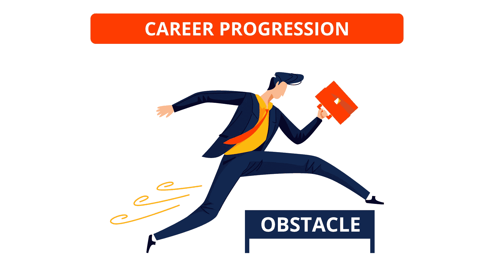
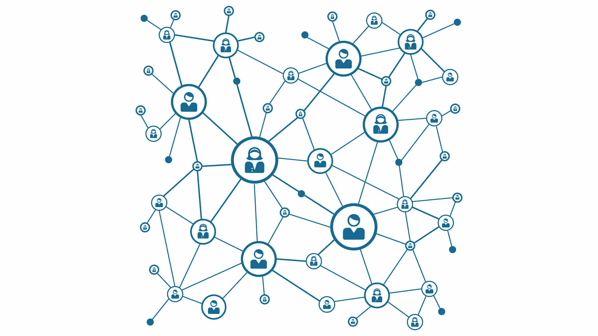

# 研究生证 vs 硕士:你该选择什么？

> 原文：<https://www.edureka.co/blog/postgraduate-certificate-vs-masters-degree>

在本科毕业后继续深造可能会让人有些不知所措，因为这需要你投入大量的时间和金钱。对于很多人来说，权衡投资的机会成本和收益率可以决定他们是否选择研究生证 vs 硕士。

研究生证书是为完成某一特定领域的教育项目而颁发的。这种认证为专业人士提供了一种选择，以发展所需的职业技能。

然而，硕士学位是一种研究生学位，表明申请者在某一特定领域达到了一定的精通水平。

如果你在两者之间进退两难，最好了解研究生证书和硕士学位之间的区别，以便意识到有助于选择最适合你的道路的好处。

那么，让我们从了解这两个术语开始。

## **什么是研究生证书？**

研究生证书是一种教育证书，它为学生增加了特定专业领域的高级技能。基本上，研究生证书会给你执业资格。

## 什么是硕士学位？

硕士学位为一个学科领域提供了更广阔的视野和更多的职业选择。它表明一个考生在某个特定的学习领域已经达到了一定的精通水平。

继续前进……

## **为什么要读硕士？**

如果你的目标是从事学术事业，硕士学位是你的下一个自然选择。

在当今竞争激烈的就业市场上，雇主不仅将硕士学位视为候选人的一个突出因素，也将其视为必备条件。所以，硕士学位可以让你获得更多的工作机会，从而有助于你事业的成功。

硕士学位可以帮助你提升你所在领域的水平。从这个意义上说，它可以被认为是对你未来的投资。

如果你对某个特定的主题感兴趣，硕士学位就是以一种更全面的形式与材料打交道。它也有助于获得选定领域的深入知识和尖端技能。

作为一名硕士生，你不仅会成为知识精英链的一部分，还会成为下一个环节，有机会通过自己的见解和发现为世界知识做出贡献。当然，硕士学位伴随而来的认可度、可信度、成就感也要承认。

## **为什么要追求研究生学历？**

研究生认证在本质上更具有职业性，尤其是在技术、商业、科学和医疗保健领域。研究生学历是独立的。

就业市场竞争日益激烈，需要持续的技能提升，这推动了研究生项目的发展。除了比硕士学位花费更少的时间之外，研究生项目还因其灵活性而闻名。这使得他们成为有工作和家庭的专业人士的一个可管理的选择。

## 如果……你应该读研究生证书

*   **你没有太多的空闲时间**

硕士学位要求学生完成 180 个学分的学习，而研究生需要在更短的时间内完成 120 个学分的工作。所以，如果你是一名工作专业人士，被困在办公室长时间工作，不确定你是否能进入硕士学习，那么毕业后是你最好的选择。

*   **你在寻找职业发展**

[研究生课程](https://www.edureka.co/blog/choose-right-postgraduate-program)对于扩展你现有的职场知识非常有用。研究生课程帮助你获得实用的、与行业相关的、特定学科的知识和经验。由于所获得的技能、工作经验和资格，你更有可能获得你梦想中的工作，并获得更高的薪水。

*   你需要换个职业

研究生证书不仅在你本科学习的领域打开了就业机会，而且使你完全改变方向成为可能。毕业后你可以自由地完善你的研究领域，并在这个过程中将自己定位为专家。无论你是在一个特定领域工作了很长时间后寻找另一个兴趣，还是寻找一门补充你的学习的课程，毕业后都会打开令人兴奋的新的可能性的大门。

*   **你需要灵活性**

说到研究生学习，有很多选择。你可以自由选择课程类型和学习时间。奖学金和贷款也提供资助。灵活的学习选项旨在提供适合您的家庭和工作的学习方式，让您可以选择学习的地点、时间和方式。根据您选择的课程，这些灵活的选项可能包括:

*   **你需要获得可转移的技能**

研究生课程期间的实践经验将会提高你的组织能力、时间管理能力和按时完成任务的能力。您还将在项目管理、沟通、批判性思维、解决问题和 IT 方面发展可转移的技能。在研究生文凭期间领导一个大型项目会让你在面试中有一些具体的话题，尤其是如果你在你想攻克的领域中工作经验有限的话。

## 如果……你应该读硕士

*   **你想读博士**

如果你想为攻读博士做准备，那么从硕士学位开始将是一个好主意。它会让你了解你在博士阶段的学习强度，并让你习惯它。

*   你想出国工作

硕士学位是国际公认的。所以，如果你正在寻找一个能跟上你环球旅行生涯的资格证书，那么它是你的理想选择。

*   你想让你的简历脱颖而出

在竞争日益激烈的市场中，硕士学位有助于你从其他毕业生中脱颖而出。虽然有很多职位接受学士学位，但最理想的工作往往是留给硕士学历的毕业生。因此，如果你希望在事业上有所发展，继续深造是很重要的。

*   **你想建立职业关系**

研究生院非常重视建立人际网络，这给你机会与老师和学生发展有价值的关系，并与他们建立专业联系。这些在你的硕士学位学习期间形成的联系可以在你未来的职业生涯中帮助你。

*   **你需要对你的职业或行业有深入的了解**

尽管拥有学士学位，但新毕业的学生常常觉得自己不够熟练，无法进入职场。这是因为本科学历不是很实用。因此，攻读研究生学位的一个重要原因是你将在这个过程中获得专业技能。攻读硕士学位将让你有机会通过集中教育在你感兴趣的领域尽可能多地学习，拓展你的技术能力，提高你的技能，成为该领域的专家。

在选择研究生证书还是硕士学位时，要记住的最后一件事是，两者的途径可能不同，但它们都有助于你实现职业目标。所以，在你进入研究生认证或攻读硕士课程之前，最好对你的最终目标有个概念。所以，做你的研究，问问你自己，“你对你目前的职业轨迹满意吗？”，“研究生证书能给个人资料增加多少价值？”、“你准备在教育上投入多少时间和金钱？”。判断收益是否大于成本，以便做出最符合你长期职业规划的选择。

到此，我们来结束这篇文章。我希望它能帮助你做出选择。您可以查看由 Edureka 提供的[研究生课程](https://www.edureka.co/post-graduate)，edu reka 是一家值得信赖的在线学习公司，在全球拥有超过 250，000 名满意的学习者。Edureka 研究生课程通过向印度顶尖大学最好的教授学习，帮助你成为专家，并从同一所大学获得学位。