# PostgreSQL 初学者教程——关于 PostgreSQL 你需要知道的一切

> 原文：<https://www.edureka.co/blog/postgresql-tutorial>

PostgreSQL 是一个开源的对象关系数据库系统，在业界已有 30 多年的活跃发展历史。在这篇关于 PostgreSQL 初学者教程的文章中，我将向您介绍数据库的不同概念以及 PostgreSQL 中使用的命令。

本文涉及的主题主要分为 4 类:DDL、DML、DCL & TCL。

*   **[DDL](#DDL)**(数据定义语言)命令用于定义数据库。示例:创建、删除、更改、截断、注释、重命名。
*   **[DML](#DML)**(数据操作语言)命令处理数据库中的数据操作。示例:选择、插入、更新、删除。
*   **[DCL](#DCL)**(数据控制语言)命令处理数据库系统的权限、权利和其他控制。示例:授予、调用。
*   **[TCL](#TCL)**(事务控制语言)命令处理数据库的事务。示例:开始、提交、回滚。

除了命令之外，本文还将涉及以下主题:

*   [什么是 PostgreSQL？](#WhatisPostgreSQL?)
*   [在 Windows 上安装 PostgreSQL](#InstallPostgreSQLonWindows)
*   [数据库中不同类型的密钥](#KeysInDatabase)
*   [数据库中使用的约束](#ConstraintsInDatabase)
*   [操作员](#Operators)
*   [聚合函数](#AggregateFunctions)
*   [设定操作](#SetOperations)
*   [嵌套查询](#NestedQueries)
*   [归附](#Joins)
*   [视图](#Views)
*   [存储过程](#StoredProcedures)
*   [触发器](#Triggers)
*   [UUID 数据类型](#UUIDDataType)

## **什么是 PostgreSQL？–****PostgreSQL 教程**

PostgreSQL 是一个对象关系数据库系统，它扩展并使用了 SQL 语言。它起源于 1986 年，经过 30 多年的积极发展。

*PostgreSQL 的特性如下:*

1.  **数据类型:** PostgreSQL 支持各种类型的数据类型，如原始数据、结构化数据、文档数据、几何数据和定制数据。这有助于用户以任何格式存储数据。
2.  **数据完整性:**借助数据库中的各种约束和键，PostgreSQL 确保从简单到复杂的数据库都满足数据完整性。
3.  **性能:** PostgreSQL 提供索引、多版本并发控制、表达式 JIT 复杂化等特性，确保并发和性能达标。
4.  **可靠性:**在预写日志(WAL)和复制的帮助下，PostgreSQL 在一段时间内证明了自己是最可靠的数据库系统之一。
5.  安全: PostgreSQL 提供了强大的机制，如认证，一个强大的访问控制系统来确保只有授权的用户才能访问数据库。
6.  **可扩展性:** PostgreSQL 附带了对的各种扩展，以提供额外的功能。它还通过存储函数、过程语言和外部数据包装器扩展了它的可扩展性。

现在，您已经知道什么是 PostgreSQL，让我们从在 Windows 上安装 PostgreSQL 开始。

## **在 Windows 上安装 PostgreSQL–PostgreSQL 教程**

要在 Windows 上安装 PostgreSQL，您必须遵循以下步骤:

**第一步:**进入 PostgreSQL 的 ***[官网，然后选择你希望下载的操作系统。这里我会选择 Windows。](https://www.postgresql.org/download/)***

**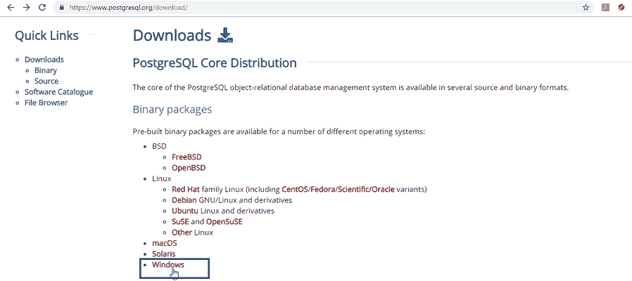**

第二步:一旦选择了操作系统，你将被重定向到一个页面，在那里你必须下载安装程序。为此，点击选项:**下载安装程序。**参考下文。

**第三步:**然后，你会被进一步重定向到一个页面，在这里你必须**选择基于操作系统的安装程序版本**。在这里，我会选择 Windows 64 bit 的 11.4 版本。参考下文。

一旦您**点击下载**，您将自动看到 PostgreSQL 正在被下载。

**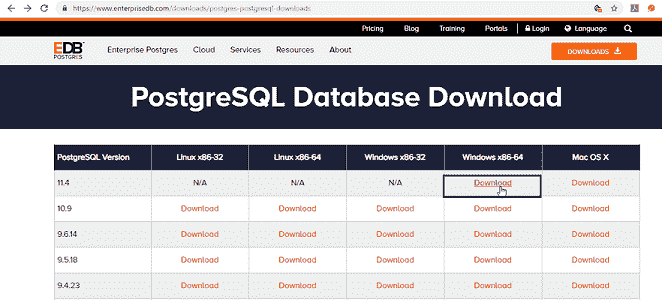**

**步骤 4:** 现在，一旦文件下载完毕，双击文件将其打开，屏幕上会出现一个向导，如下所示。点击**下一步**继续。

**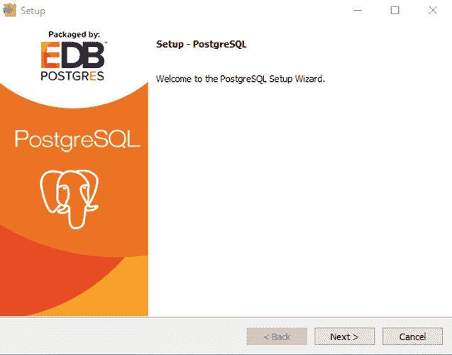**

**步骤 4.1:** 现在，**指定安装目录**。这里就不做改动了，点击**下一个**如下图。

****

**步骤 4.2:** 现在，**选择你希望安装的组件**，然后点击**下一步**。在这里，我选择所有的组件。

**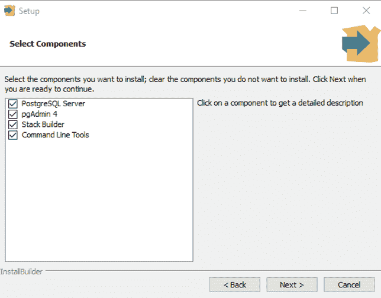**

**步骤 4.3:** 接下来，**选择你想要存储数据的目录**。在这里，我打算让它保持原样。然后，点击**下一步。**

**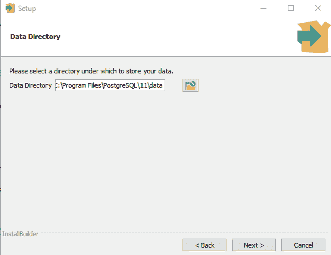**

**步骤 4.4:** 在下一个出现的对话框中，你必须**提到超级用户的密码。**然后，点击**下一步。**

**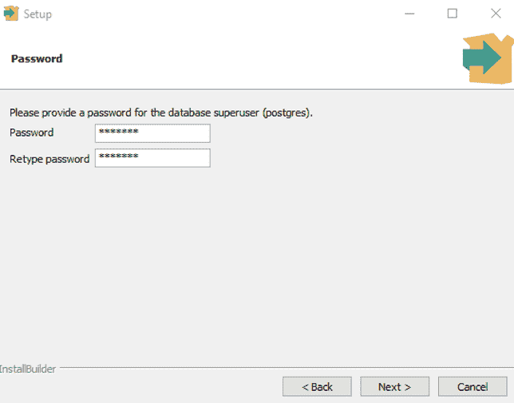**

**步骤 4.5:** 接下来，你必须**选择服务器应该监听的端口号**。在这里，我会让它保持原样，然后点击**下一步。**

**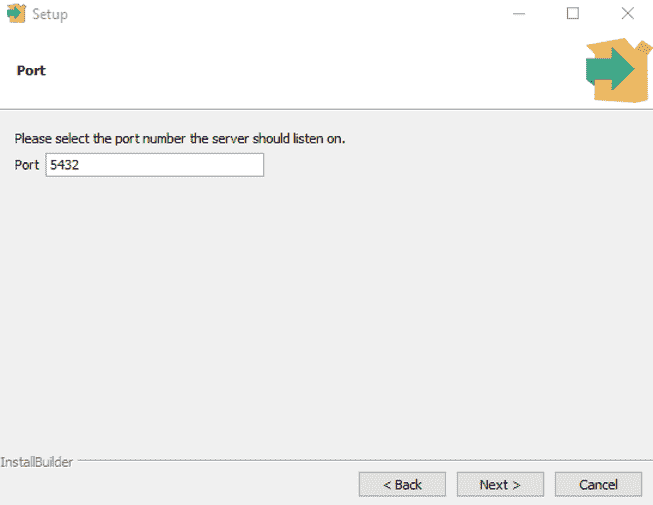**

**步骤 4.6:** 最后，**选择新数据库集群要使用的地区**。我会让它保持原样，然后点击**下一个**。

**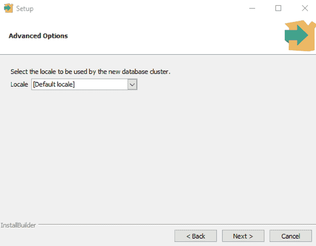**

**步骤 4.7:** 最后点击向导中的**下一步**，开始在您的计算机上安装 PostgreSQL。

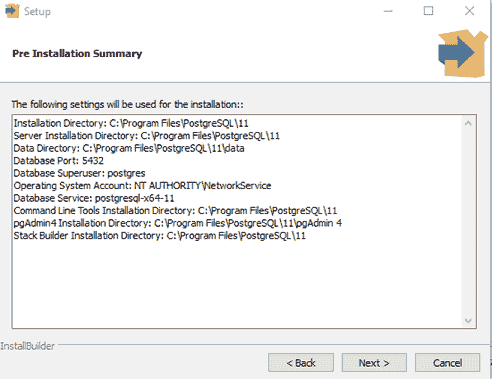

安装完成后，您将在屏幕上看到如下对话框。点击**完成。**

**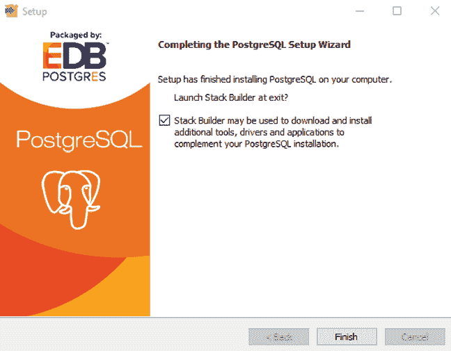**

第五步:现在，你必须**将服务器连接到数据库**。打开 pgadmin，它是 PostgreSQL 官方 GUI**。打开 pgadmin 后，您会看到一个对话框，要求您输入密码。所以，提及密码，并点击**确定。****

现在，您一定已经安装了 PostgreSQL，让我们从 PostgreSQL 中使用的命令开始。

在这篇关于 PostgreSQL 初学者教程的文章中，我将以下面的数据库为例，向您展示如何编写命令。

| **TeacherID** | **教师姓名** | **地址** | **城市** |  | **国家** | **工资** |
| 01 | 樱花 | 江南街 | 首尔 | 06499 | 韩国 | 42000 |
| 02 | Preeti | 皇后码头 | 里约克拉罗 | 560001 | 巴西 | 45900 |
| 03 | 维诺德 | 国王大道 | 伦敦 | SW6 | 英国 | 65000 |
| 04 | 阿坎沙 | 梅奥路 | 加尔各答 | 700069 | 印度 | 23000 |
| 05 | 阿米特 | MG 路 | 本加卢鲁 | 560001 | 印度 | 30000 |

那么，让我们现在就开始吧！

## **数据定义(DDL)命令—****PostgreSQL 教程**

文章的这一部分由那些命令组成，你可以定义你的数据库。这些命令是:

*   [创造](#CREATE)
*   [涂改](#ALTER)
*   [降](#DROP)
*   [截断](#TRUNCATE)
*   [改名](#RENAME)

### **创建**

此语句用于创建模式、表或索引。

**【创建模式】语句**

CREATE SCHEMA 语句用于创建一个数据库或通常称为模式。

***语法:***

```
CREATE SCHEMA Schema_Name; 
```

***举例:***

```
CREATE SCHEMA teachers;

```

**【创建表】语句**

CREATE TABLE 语句用于在数据库中创建一个新表。

***语法:***

```
CREATE TABLE table_name (
    column1 datatype,
    column2 datatype,
    column3 datatype,
   ....
);
```

***举例:***

```

CREATE TABLE TeachersInfo
(
TeacherID int,
TeacherName varchar(255),
Address varchar(255),
City varchar(255),
PostalCode int,
Country varchar(255),
Salary int
);

```

### **涂改**

该语句用于添加、修改或删除约束或列。

**【变更表】语句**

ALTER TABLE 语句用于添加、修改或删除表中的约束和列。

***语法:***

```
ALTER TABLE table_name
ADD column_name datatype; 
```

***举例:***

```
ALTER TABLE TeachersInfo
ADD DateOfBirth date;

```

## **降**

该命令用于删除数据库、表格或列。

**【删除模式】语句**

DROP SCHEMA 语句用于删除完整的模式。

***语法:***

```
DROP SCHEMA schema_name; 
```

***举例:***

```
DROP SCHEMA teachers;

```

**【降表】语句**

DROP TABLE 语句用于删除整个表及其所有值。

***语法:***

```
DROP TABLE table_name;
```

***举例:***

```
DROP TABLE TeachersInfo;

```

## **截断**

TRUNCATE 语句用于删除表中的数据，但表不会被删除。

***语法:***

```
TRUNCATE TABLE table_name; 
```

***举例:***

```
TRUNCATE TABLE TeachersInfo;

```

### **改名**

RENAME 语句用于重命名一个或多个表或列。

***语法:***

```
ALTER TABLE table_name RENAME TO new_table_name;  --Rename Table name
```

```
ALTER TABLE table_name RENAME COLUMN column_name TO new_column_name; -- Rename Column name
```

***举例:***

```
ALTER TABLE TeachersInfo RENAME TO InfoTeachers;

ALTER TABLE InfoTeachers RENAME COLUMN dateofbirth TO dob;

```

现在，在我继续这篇关于 PostgreSQL 初学者教程的文章之前，让我告诉你在操作数据库时需要提到的各种类型的键和约束。键和约束将帮助您以更好的方式创建表，因为您可以将每个表与另一个表相关联。

## **数据库中不同类型的键—****PostgreSQL 教程**

主要有 5 种类型的密钥，可以在数据库中提及。

*   **候选关键字—**候选关键字是可以唯一标识元组的最小属性集的组合。任何关系都可以有多个候选键，键可以是简单键或组合键。
*   **超级键——**超级键是能够唯一标识一个元组的属性的集合 。所以，一个候选键是一个超级键，但反之亦然。
*   **主键—**主键是一组可以用来唯一标识每个元组的属性。因此，如果在一个关系中存在 3-4 个候选键，那么可以从中选择一个作为主键。
*   **备用键——**除主键外的所有候选键都称为备用键**。**
*   **外键—**只能将当前值作为其他属性的值的属性，是它所引用的属性的外键。

**数据库中使用的约束条件—****PostgreSQL 教程**

您可以在数据库中使用的约束如下:

*   **NOT NULL**–NOT NULL 约束确保空值不能存储在列中
*   **唯一**–唯一约束确保一列中的所有值都是不同的
*   **CHECK**-CHECK 约束确保一列中的所有值都满足特定的条件。
*   **DEFAULT**-当没有指定值时，默认约束由一组列的默认值组成。
*   **索引**–索引约束用于快速创建和检索数据库中的数据

现在，你已经知道了 DDL 中的命令以及各种类型的键和约束，让我们继续下一节，即数据操作命令。

## **数据操作(DML)命令—****PostgreSQL 教程**

文章的这一部分由命令组成，通过这些命令你可以操作你的数据库。这些命令是:

*   [设置搜索 _ 路径](#SETSEARCHPATH)
*   [插入](#INSERT)
*   [更新](#UPDATE)
*   [删除](#DELETE)
*   [选择](#SELECT)

除了这些命令，还有其他操作符/功能，如:

*   [算术、按位、复合和比较运算符](#Operators)
*   [逻辑运算符](#LogicalOperators)
*   [聚合函数](#AggregateFunctions)
*   [特殊操作员](#SpecialOperators)
*   [设定操作](#SetOperations)
*   [限制、偏移和获取](#LimitOffsetandFetch)

**设置搜索路径**

该语句用于说明必须使用哪个模式来执行所有操作。

***语法:***

```
SET search_path TO schema_name;
```

***举例:***

```
SET search_path TO teachers;

```

**插入**

INSERT 语句用于在表中插入新记录。

***语法:***

```
The INSERT INTO statement can be written in the following two ways:
```

```
INSERT INTO table_name (column1, column2, column3, ...) VALUES (value1, value2, value3, ...);

--You need not mention the column names

INSERT INTO table_name VALUES (value1, value2, value3, ...); 
```

***举例:***

```

INSERT INTO TeachersInfo(TeacherID, TeacherName, Address, City, PostalCode, Country, Salary) VALUES ('01', 'Saurav','Gangnam Street', 'Seoul', '06499', 'South Korea', '42000'); 

INSERT INTO TeachersInfo VALUES ('02', 'Preeti','Queens Quay', 'Rio Claro', '13500', 'Brazil', '45900');

```

### **更新**

```
The UPDATE statement is used to modify the existing records in a table. 
```

***语法:***

```
UPDATE table_name
SET column1 = value1, column2 = value2, ...
WHERE condition;
```

***举例:***

```
UPDATE TeachersInfo
SET TeacherName = 'Alfred', City= 'Frankfurt'
WHERE TeacherID = '01';

```

**删除**

DELETE 语句用来删除表中已有的记录。

***语法:***

```
DELETE FROM table_name WHERE condition; 
```

***举例:***

```

DELETE FROM TeachersInfo WHERE TeacherName='Vinod';

```

**选择**

SELECT 语句用于从数据库中选择数据，返回的数据存储在一个结果表中，称为**结果集**。

下面是使用该语句的两种方式:

#### ***语法:***

```
SELECT column1, column2, ..*.*
FROM table_name;

--(*) is used to select all from the table

SELECT * FROM table_name; 
```

#### ***举例:***

```
SELECT Teachername, City FROM TeachersInfo; SELECT * FROM TeachersInfo;

```

除了单独的 SELECT 关键字外，您可以将 SELECT 关键字与下列语句一起使用:

*   [泾渭分明](#DISTINCT)
*   [顺序由](#ORDERBY)
*   [分组通过](#GROUPBY)
*   [HAVING 子句](#HAVINGClause)

#### **【选择不同的】语句**

SELECT DISTINCT 语句仅用于返回不同或不同的值。因此，如果您有一个包含重复值的表，那么您可以使用这个语句来列出不同的值。

#### ***语法:***

```
SELECT DISTINCT column1, column2, ...
FROM table_name;
```

#### ***举例:***

```
SELECT Country FROM TeachersInfo;

```

#### **【订单通过】语句**

ORDER BY 语句用于按升序或降序对所需结果进行排序。默认情况下，结果将按升序排序。如果你想按降序排列记录，那么你必须使用关键字。

#### ***语法:***

```
SELECT column1, column2, ...
FROM table_name
ORDER BY column1, column2, ...ASC|DESC;
```

#### ***举例:***

```
 SELECT * FROM TeachersInfo
ORDER BY Country; 

SELECT * FROM TeachersInfo
ORDER BY Country DESC;

SELECT * FROM TeachersInfo
ORDER BY Country, TeachersName;

SELECT * FROM TeachersInfo
ORDER BY Country ASC, TeachersName DESC;

```

**【分组依据】语句**

该语句与聚合函数一起使用，按一列或多列对结果集进行分组。

***语法:***

```
SELECT column_name(s)
FROM table_name
WHERE condition
GROUP BY column_name(s)
ORDER BY column_name(s);
```

***举例:***

```
SELECT COUNT(TeacherID), Country
FROM TeachersInfo
GROUP BY Country
ORDER BY COUNT(TeacherID) DESC;

```

把‘HAVING’从句陈述出来

由于 ***WHERE*** 关键字不能与聚合函数一起使用，因此引入了 HAVING 子句。

***语法:***

```
SELECT column_name(s)
FROM table_name
WHERE condition
GROUP BY column_name(s)
HAVING condition
ORDER BY column_name(s);
```

***举例:***

```
SELECT COUNT(TeacherID), Country
FROM TeachersInfo
GROUP BY Country
HAVING COUNT(Salary) &amp;amp;amp;amp;gt; 40000;

```

## **算术、按位、复合和比较运算符—****PostgreSQL 教程**

算术、按位、复合和比较运算符如下:

```
 
```

### **逻辑运算符**

这组运算符由逻辑运算符组成，如[、](#AND) / [或](#OR) / [而非](#NOT)。

**和**

该运算符显示满足由 AND 分隔的所有条件的记录。

***语法:***

```
SELECT column1, column2, ...
FROM table_name
WHERE condition1 AND condition2 AND condition3 ...; 
```

***举例:***

```
SELECT * FROM TeachersInfo
WHERE Country='India' AND City='South Korea';

```

**或**操作员

该运算符显示那些满足由 or 分隔的任何条件的记录。

***语法:***

```
SELECT column1,* column2, ...*
FROM table_name
WHERE condition1 OR condition2 OR condition3 ...; 
```

***举例:***

```
SELECT * FROM TeachersInfo
WHERE Country='India' OR City='South Korea';

```

**不算符**

当条件不为真时，NOT 运算符显示一条记录。

***语法:***

```
SELECT column1,* column2, ...*
FROM table_name
WHERE NOT condition;
```

***举例:***

```
SELECT * FROM TeachersInfo
WHERE NOT Country='India';

--You can also combine all the above three operators and write a query like this:

SELECT * FROM TeachersInfo
WHERE NOT Country='India' AND (City='Bengaluru' OR City='Kolkata');

```

## **聚合函数—****PostgreSQL 教程**

文章的以下部分将包括如下功能:

*   [【MIN()】](#MIN)
*   [MAX()](#MAX)
*   [计数()](#COUNT)
*   [【AVG()】](#AVG)
*   [SUM()](#SUM)

### **MIN()函数**

MIN 函数返回表格中所选列的最小值。

#### ***语法:***

```
SELECT MIN(column_name)
FROM table_name
WHERE condition; 
```

#### ***举例:***

```

SELECT MIN(Salary) AS SmallestSalary
FROM TeachersInfo;

```

### **MAX()函数**

MAX 函数返回表格中所选列的最大值。

#### ***语法:***

```
SELECT MAX (column_name)
FROM table_name
WHERE condition; 
```

#### ***举例:***

```
SELECT MAX(Salary) AS LargestSalary
FROM TeachersInfo;

```

### **()计数功能**

COUNT 函数返回符合指定条件的行数。

#### ***语法:***

```
SELECT COUNT (column_name)
FROM table_name
WHERE condition;
```

#### ***举例:***

```
SELECT COUNT(TeacherID)
FROM TeachersInfo;

```

### **【AVG】()功能**

AVG 函数返回所选数值列的平均值。

#### ***语法:***

```
SELECT AVG (column_name)
FROM table_name
WHERE condition;
```

#### ***举例:***

```
SELECT AVG(Salary)
FROM TeachersInfo;

```

### **SUM()函数**

SUM 函数返回所选数值列的总和。

#### ***语法:***

```
SELECT SUM(column_name)
FROM table_name
WHERE condition;
```

#### ***举例:***

```
SELECT SUM(Salary)
FROM TeachersInfo;

```

## **特殊运算符——****PostgreSQL 教程**

这一节的文章将包括以下运算符:

*   之间
*   [为空](#ISNULL)
*   [如同](#LIKE)
*   [中的](#IN)
*   [存在](#EXISTS)
*   [全部](#ALL)
*   [任意](#ANY)

**间符**

BETWEEN 运算符是一个包含运算符，它选择给定范围内的值(数字、文本或日期)。

***语法:***

```
SELECT column_name(s)
FROM table_name
WHERE column_name BETWEEN value1 AND value2; 
```

***举例:***

```
SELECT * FROM TeachersInfo
WHERE Fees BETWEEN 30000 AND 45000;

```

**是空运算符**

因为不可能用比较运算符(=，<，>)来测试空值，我们可以使用 IS NULL 和 IS NOT NULL 运算符来代替。

***语法:***

```
--Syntax for IS NULL

SELECT column_names
FROM table_name
WHERE column_name IS NULL;

--Syntax for IS NOT NULL

SELECT column_names
FROM table_name
WHERE column_name IS NOT NULL;
```

***举例:***

```
SELECT TeacherName FROM TeachersInfo
WHERE Address IS NULL;
SELECT TeacherName FROM TeachersInfo
WHERE Address IS NOT NULL;

```

**像符**

在 WHERE 子句中使用 LIKE 运算符来搜索表中某一列的指定模式。

下面提到的是与 LIKE 运算符结合使用的两个通配符:

*   %–百分号代表零个、一个或多个字符

*   _–下划线代表单个字符

#### ***语法:***

```
SELECT column1, column2, ...
FROM table_name
WHERE column LIKE pattern;
```

#### ***举例:***

```

SELECT * FROM TeachersInfo
WHERE TeacherName LIKE 'S%';

```

**中的**符

IN 运算符是一种速记运算符，用于多个 or 条件。

#### ***语法:***

```
SELECT column_name(s)
FROM table_name
WHERE column_name IN (value1, value2, ...); 
```

#### ***举例:***

```
SELECT * FROM TeachersInfo
WHERE Country IN ('South Korea', 'India', 'Brazil');

```

**注意:**也可以在编写嵌套查询时使用。

### **存在操作符**

EXISTS 运算符用于测试记录是否存在。

#### ***语法:***

```
SELECT column_name(s)
FROM table_name
WHERE EXISTS
(SELECT column_name FROM table_name WHERE condition);
```

#### ***举例:***

```
SELECT TeacherName
FROM TeachersInfo
WHERE EXISTS (SELECT * FROM TeachersInfo WHERE TeacherID = 05 AND Salary &amp;amp;amp;amp;gt; 25000);

```

### **所有操作员**

ALL 运算符与 WHERE 或 HAVING 子句一起使用，如果所有子查询值都满足条件，则返回 true。

#### ***语法:***

```
SELECT column_name(s)
FROM table_name
WHERE column_name operator ALL
(SELECT column_name FROM table_name WHERE condition);
```

#### ***举例:***

```
SELECT TeacherName
FROM TeachersInfo
WHERE TeacherID = ALL (SELECT TeacherID FROM TeachersInfo WHERE Salary &amp;amp;amp;amp;gt; 25000);

```

### **任意操作员**

与 ALL 运算符类似，ANY 运算符也与 WHERE 或 HAVING 子句一起使用，如果任何子查询值满足条件，则返回 true。

#### ***语法:***

```
SELECT column_name(s)
FROM table_name
WHERE column_name operator ANY
(SELECT column_name FROM table_name WHERE condition);
```

#### ***举例:***

```
SELECT TeacherName
FROM TeachersInfo
WHERE TeacherID = ANY (SELECT TeacherID FROM TeachersInfo WHERE Salary BETWEEN 32000 AND 45000);

```

## **设置操作—****PostgreSQL 教程**

主要有三种集合运算:[联合](#UNION)、[相交](#INTERSECT)、[减去](#MINUS)。可以参考下图来理解 SQL 中的 set 操作。参考下图: 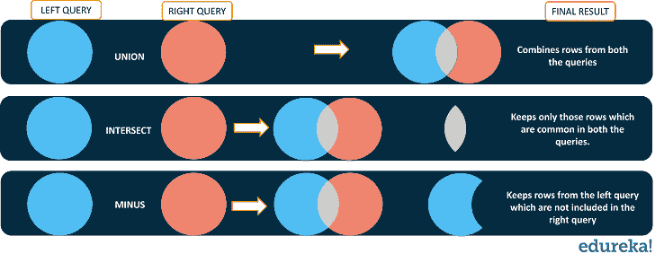

### **联盟**

UNION 运算符用于组合两个或多个 SELECT 语句的结果集。

#### **语法**

```
SELECT  column_name(s) FROM table1
UNION
SELECT  column_name(s )FROM table2;
```

**相交**

INTERSECT 子句用于组合两个 SELECT 语句，并返回两个 SELECT 语句数据集的交集。

#### **语法**

```
SELECT Column1 , Column2 ....
FROM  table_name;
WHERE condition

INTERSECT

SELECT Column1 , Column2 ....
FROM  table_name;
WHERE condition
```

**除了**

EXCEPT 运算符返回第一次选择操作返回的元组，而第二次选择操作没有返回这些元组。

#### **语法**

```
SELECT  column_name
FROM  table_name;

EXCEPT

SELECT column_name
FROM table_name;
```

## **限制、偏移和获取—****PostgreSQL 教程**

### **极限**

LIMIT 语句用于从表中的完整行中检索一部分行。

#### ***语法:***

```
SELECT column_name
```

```
FROM table_name LIMIT number;
```

#### ***例如:***

```

SELECT * FROM TeachersInfo LIMIT 5;

```

### **偏移**

OFFSET 语句省略了您提到的行数，然后检索行的剩余部分。

#### ***语法:***

选择列名

FROM table_name 偏置数限制数；

#### ***例如:***

```

--Select 3 rows from TeachersInfo after the 5th row
SELECT * FROM TeachersInfo OFFSET 5 LIMIT 3;

--Select all rows from TeachersInfo
SELECT * FROM TeachersInfo OFFSET 2;

```

**获取**

FETCH 关键字用于使用游标从表中获取记录。这里的光标如下:

*   然后
*   在先的；在前的
*   第一
*   最后的
*   相对计数
*   绝对计数
*   数数
*   全部
*   向后的
*   反向计数
*   全部向后
*   向前
*   向前计数
*   全部转发

#### ***语法:***

```
FETCH cursorname;
```

#### ***例如:***

```

SELECT * FROM TeachersInfo OFFSET 5 FETCH FIRST 5 ROWS ONLY;

```

## **嵌套查询-****PostgreSQL 教程**

**嵌套查询** 是那些有外部查询和内部子查询的查询。因此，基本上，子查询是嵌套在另一个查询(如 SELECT、INSERT、UPDATE 或 DELETE)中的查询。参考下图:

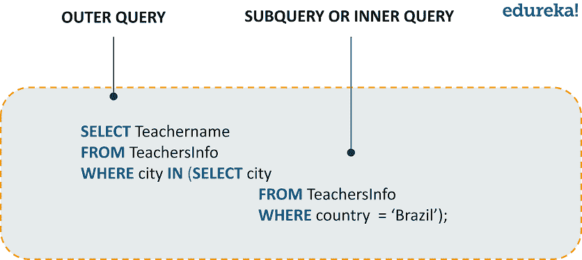

因此，当您执行这个查询时，您将看到来自巴西的教师的姓名。

## **归附—****PostgreSQL 教程**

PostgreSQL 中的联接用于根据两个或多个表之间的相关列来组合这些表中的行。以下是连接的类型:

*   **[内部联接:](#INNERJOIN)** 内部联接返回那些在两个表中都有匹配值的记录。
*   **[左连接:](#LEFTJOIN)** 左连接返回左表中的记录，以及右表中满足条件的记录。
*   **[右连接:](#RIGHTJOIN)** 右连接返回右表中的记录，以及左表中满足条件的记录。
*   **[全联接:](#FULLJOIN)** 全联接返回在左表或右表中有匹配项的所有记录。


为了理解连接的语法，让我们考虑教师信息表之外的下表。

| **主题 ID** | **TeacherID** | **主题名称** |
| 1 | 10 | 数学 |
| 2 | 11 | 物理 |
| 3 | 12 | 化学 |

### **内部加入**

#### ***语法:***

```
SELECT column_name(s)
FROM table1
INNER JOIN table2 ON table1.column_name = table2.column_name; 
```

#### ***举例:***

```
SELECT Subjects.SubjectID, TeachersInfo.TeacherName
FROM Subjects
INNER JOIN TeachersInfo ON Subjects.TeacherID = TeachersInfo.TeacherID;

```

### **左加入**

#### ***语法:***

```
SELECT column_name(s)
FROM table1
LEFT JOIN table2 ON table1.column_name = table2.column_name; 
```

#### ***举例:***

```
SELECT TeachersInfo.TeacherName, Subjects.SubjectID
FROM TeachersInfo
LEFT JOIN Subjects ON TeachersInfo.TeacherID = Subjects.TeacherID
ORDER BY TeachersInfo.TeacherName;

```

### **右加入**

##### ***语法:***

```
SELECT column_name(s)
FROM table1
RIGHT JOIN table2 ON table1.column_name = table2.column_name; 
```

#### ***举例:***

```
SELECT Subjects.SubjectID
FROM Subjects
RIGHT JOIN TeachersInfo ON Subjects.SubjectID = TeachersInfo.TeacherID
ORDER BY Subjects.SubjectID;

```

### **完全加入**

#### ***语法:***

```
SELECT column_name(s)
FROM table1
FULL OUTER JOIN table2 ON table1.column_name = table2.column_name;
```

#### ***举例:***

```

SELECT TeachersInfo.TeacherName, Subjects.SubjectID
FROM TeachersInfo
FULL OUTER JOIN Subjects ON TeachersInfo.TeacherID = Subjects.SubjectID
ORDER BY TeachersInfo.TeacherName;

```

现在，接下来在这篇文章中，我将讨论视图、存储过程和触发器。

## **视图—****PostgreSQL 教程**

视图是一个单独的表，它是从其他表派生出来的。因此，视图包含类似于真实表的行和列，并且具有来自一个或多个表的字段。

## ****

**【创建视图】语句**

CREATE VIEW 语句用于从现有表创建视图。

#### ***语法***

```
CREATE VIEW view_name AS
SELECT column1, column2, ..., columnN
FROM table_name
WHERE condition;
```

#### ***例如***

```

CREATE VIEW teachers_view AS
SELECT TeacherName, TeacherID
FROM TeachersInfo
WHERE City = 'Bengaluru';

```

**【降视图】语句**

DROP VIEW 语句用于删除视图。

#### ***语法***

```
DROP VIEW view_name;
```

#### ***例如***

```

DROP VIEW teachers_view;

```

**PostgreSQL 初学者教程:** **存储过程**

存储过程是可以保存和重用的代码片段。

#### ***语法***

创建过程 procedure_name 语言 lang _ name

#### ***例如***

```
--Create two tables

CREATE TABLE tbl1(tb1id int);
CREATE TABLE tbl2(tb2id int);

--Create Procedure
CREATE PROCEDURE insert_data (a1 integer, b1 integer)
LANGUAGE SQL
AS $$
INSERT INTO tbl1 VALUES (a1);
INSERT INTO tbl2 VALUES (b1);
$$;

CALL insert_data(4, 5);

```

**T** **装配工——****PostgreSQL 教程**

触发器是存储在数据库目录中的一组 SQL 语句。每当与表相关联的事件发生时，就会执行这些语句。所以，一个 **触发器** 既可以在 前 **调用，也可以在** 后 **调用** **插入** 、 **更新** 或 **删除** 语句来改变数据。

### ***语法***

```
CREATE TRIGGER trigger_name [BEFORE|AFTER|INSTEAD OF] event_name
ON table_name
[
--Mention Logic Here
];
```

#### ***例如***

```

--CREATE TRIGGER
CREATE TRIGGER example_trigger AFTER INSERT ON TeachersInfo;

```

## **数据控制(DCL)命令—****PostgreSQL 教程**

本部分包括用于控制数据库权限的命令。这些命令是:

*   [授](#GRANT)
*   [撤销](#REVOKE)

**授**

授权命令用于提供用户访问权限或模式的其他权限。

#### ***语法:***

```
GRANT privileges ON object TO user; 
```

#### ***举例:***

```
GRANT INSERT ON TeachersInfo TO PUBLIC;

```

### **撤销**

REVOKE 命令用于撤销使用 GRANT 命令授予的用户访问权限。

#### ***语法:***

```
REVOKE privileges ON object FROM user;
```

#### ***举例:***

```
REVOKE INSERT ON TeachersInfo FROM PUBLIC;

```

现在，让我们进入本文的最后一部分，即 TCL 命令。

**事务控制(TCL)命令—****PostgreSQL 教程**

*   [开始](#BEGIN)
*   [提交](#COMMIT)
*   [回滚](#ROLLBACK)
*   [保存点](#SAVEPOINT)T3]
    *   [释放保存点](#RELEASESAVEPOINT)
*   [设置交易](#SETTRANSACTION)

### **开始**

BEGIN TRANSACTION 命令用于启动事务。

#### ***语法:***

开始；

开始交易；

#### ***举例:***

```

BEGIN;
DELETE * FROM TeachersInfo WHERE Salary = 65000;

```

### **提交**

提交命令将自上次提交或回滚命令以来的所有事务保存到数据库。

#### ***语法:***

```
COMMIT;
```

#### ***举例:***

```
DELETE * FROM TeachersInfo WHERE Salary = 65000;
COMMIT;

```

### **回滚**

回滚命令用于撤销自上一次提交或回滚命令发出以来的事务。

##### ***语法:***

```
ROLLBACK;
```

#### ***举例:***

```
DELETE * FROM TeachersInfo WHERE Salary = 65000;
ROLLBACK;

```

### **保存点**

保存点命令在当前事务中定义一个新的保存点。

##### ***语法:***

```
SAVEPOINT savepoint_name; --Syntax for saving the SAVEPOINT
ROLLBACK TO savepoint_name --Syntax for rolling back to the SAVEPOINT 
```

##### ***举例:***

```
SAVEPOINT SP1;
DELETE FROM TeachersInfo WHERE Fees = 65000;
SAVEPOINT SP2;

```

### **释放保存点**

释放保存点命令用于删除您创建的保存点。

##### ***语法:***

```
RELEASE SAVEPOINT savepoint_name; 
```

##### ***举例:***

```
RELEASE SAVEPOINT SP2;

```

### **设置交易**

设置交易命令设置当前交易的特征。

##### ***语法:***

```
SET TRANSACTION transaction_mode; 
```

## **UUID 数据类型—****PostgreSQL 教程**

UUID 数据类型存储 128 字节长度的通用唯一标识符(UUID)。它被写成一系列小写十六进制数字，由算法生成。这种算法的设计是为了确保宇宙中的任何其他人都不会产生同样的 UUID。

***举例:***

```
--Generate a a unique UUID
SELECT uuid_generate_v4(); 

```

说到这里，我们来结束这篇关于 PostgreSQL 初学者教程的文章。我希望你喜欢阅读这篇关于 PostgreSQL 初学者教程的文章。我们已经看到了帮助您编写查询和处理数据库的不同命令。 *如果你想学习更多关于 SQL 的知识，了解这个开源的关系数据库，那么就来看看我们的 **[SQL 基础培训](https://www.edureka.co/sql-essentials-training)。本培训将帮助您深入理解 SQL，并帮助您掌握这门学科。***

*有问题吗？请在“ **PostgreSQL 初学者教程**的评论区提出来，我会回复你的。*