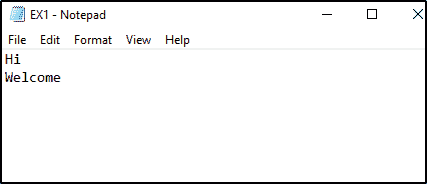
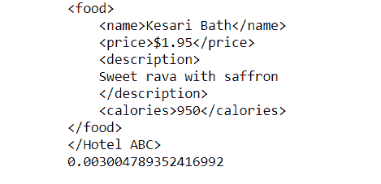

# Python 中的 print 是什么，如何使用它的参数？

> 原文：<https://www.edureka.co/blog/print-in-python/>

编程最重要的基础之一是打印输出。每种编程语言都有自己的方法将输出打印到控制台或文件中。在 [Python](https://www.edureka.co/blog/python-programming-language) 中，利用 Python 的打印功能，这个返回输出的过程变得非常简单。在本文中，您将学习 Python 中 print 的所有重要方面。 在继续之前，让我们来看看这里涵盖的内容:

*   [Python 中的 print 是什么？](#whatisprint)
*   [在 Python 中使用打印](#usingprint)
    *   [无可选参数](#withoutparameters)
    *   [指定分隔符](#seperator)
    *   [使用结束参数](#end)
    *   [写入文件](#file)
    *   [改变冲洗参数](#flush)

## **Python 中的 print 是什么？**

Python 中的 print 是标准的[函数](https://www.edureka.co/blog/python-functions)，用于将输出打印到控制台。该函数的语法如下:

**语法:**

print( *value1* ， *value2* ，…， *sep* = ' '， *end* = ' n '， *file* = sys.stdout，*flush*= False)参数及其说明如下:

| 参数 | 描述 |
| *值 1，值 2* ，… | 需要打印的输出。可以不止一个 |
| *九月* | 一个可选参数，用于指定如何分隔正在打印的对象。默认值是一个空格(“”)。 |
| *结束* | 一个可选参数，用于指定输出结束时打印的内容。默认值为“n” |
| *文件* | 写方法的可选参数。默认值为 sys.stdout |
| *冲水* | 一个可选参数，用于指定输出是必须刷新(True)还是缓冲(False)。其默认值为 False |

**注意:**所有的对象在作为输出返回之前都会被转换成一个字符串。

## **在 Python 中使用打印**

打印功能可按如下方式使用:

### **无可选参数:**

您可以利用 print 语句根据需要简单地打印任何输出对象。考虑下面的例子:

**举例:**

```
print("Using the print function in Python")
```

**输出:**使用 Python 中的打印功能

这里，print 函数只是将给定的字符串打印到控制台。

现在让我们为一个打印语句赋予多个值。

**举例:**

```
a=2019
b='World'
print('Hello',a,b)
```

**输出:**你好 2019 世界

正如您所看到的，在上面的例子中，一条 print 语句打印了三个不同的对象。此外，'+ ' [运算符](https://www.edureka.co/blog/operators-in-java/)允许连接对象，例如:

**例如:**

```
a='Hi'
b='Welcome'
print(a+b)
```

输出: HiWelcome

这里还有几个例子供您尝试:

**举例:**

```
print('Hello')
print('Hello','World')              #printting two strings
print('Hello'+'World')              #concatenating two strings
print('Hellon'+'World')             #printing with n
print('Hello','World',2019)         #printing strings along with integers
print(2019,'Hello World')           
print(str(2019)+'Hello World')      #concatenating integers with strings (using type conversion) 
print(34+67)                        #adding within print
```

您还可以在每个对象之间指定任何类型的分隔符。

### **指定分隔符:**

Separator 在 print 语句中出现的不同对象之间创建一个分区。该属性的默认值是一个空白字符(“”)。用户可以根据需要更改该运算符的值。

**例如:**

```
a='Hello'
b='World'
print(a,2019,b,sep=',')
```

**输出:**你好，2019，世界

在上面的例子中，不同的对象由逗号(，)分隔，而不是空白字符，这与前面的例子不同。

你也可以调整在输出结束时打印什么。

### **使用*结束*参数:**

*end* 参数允许您配置在输出结束时打印什么。此参数的默认值是“n”或下一行字符。让我们看看当我使用两个独立的打印函数来打印输出时会发生什么。

**举例:**

```
a='Hi'
b='Welcome'
print(a)
print(b)
```

**输出:**

```
Hi
Welcome
```

这里， *end* 参数未设置，因此输出打印在两行单独的行中。万一你想把它们打印在同一行，你可以这样做:

**例如:**

```
a='Hi'
b='Welcome'
print(a,end=' & ')
print(b)
```

**输出:**嗨&欢迎光临

在上面的例子中，*结束*参数的值是输出之间的“&”。

print 语句还可以将输出写入文件。

### **写入文件:**

可以选择使用*文件*参数将输出写入文件。如果文件不存在，它会创建一个同名的新文件，并将输出写入其中。例如:

**举例:**

```
newfile = open('abc.txt','w')
print('Hi Welcome', file = newfile)
newfile.close()
```

**输出:**看看下图中的文件:

### ****

### ***冲水*参数:**

Python 中 print 的 flush 参数允许您选择缓冲或无缓冲输出。该参数的默认值为 False，表示输出将被缓冲。如果你设置为真，输出是无缓冲的，这个过程通常比前者慢。看看下面例子中默认缓冲输出所用的时间:

**举例:**

```
import time
g=open('sample.txt', 'r')
a=g.read()
s=time.time()
print(a,flush=False)
e=time.time()
print(e-s)
```

**输出:**


执行此操作所需的时间为 0.00099 秒。现在，让我们尝试将值更改为 True。

**举例:**

```
import time
g=open('sample.txt', 'r')
a=g.read()
s=time.time()
print(a,flush=True)
e=time.time()
print(e-s)
```

**输出:**



当输出无缓冲时，同样的过程需要 0.003 秒。这是因为以块为单位传输输出比按字符顺序打印输出更容易。通常所有的 I/o 都被缓冲。但是，当用户需要在特殊情况下刷新整个输出时，此选项很方便。

这就结束了这篇关于“用 Python 打印”的文章。  希望你已经把一切都理解清楚了。  ***一定要尽可能多的练习，还原自己的经历。***

*有问题吗？请在这个“用 Python 打印”博客的评论部分提到它，我们会尽快回复你。*

*要深入了解 Python 及其各种应用，您可以注册参加实时 **[Python 在线培训](https://www.edureka.co/data-science-python-certification-course)** ，该培训提供全天候支持和终身访问。*