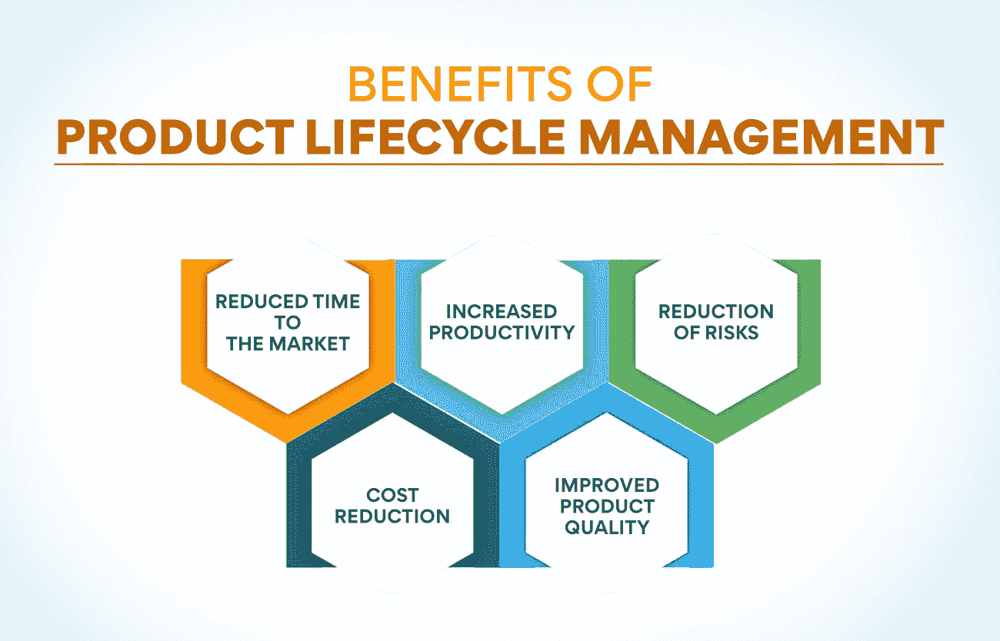
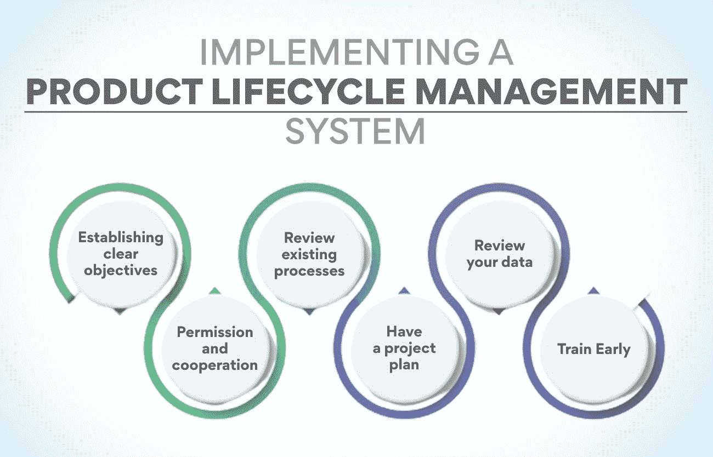

# 什么是产品生命周期管理？终极指南

> 原文：<https://www.edureka.co/blog/product-lifecycle-management/>

消费者接受任何进入市场的东西的日子已经一去不复返了。他们变得越来越挑剔，对自己的钱有更高的期望。即使在过去几年里，他们的期望也发生了变化。人们想要更个性化的产品。如今，客户希望产品和服务能够更快地交付。对于公司来说，密切关注产品创造及其在市场中的发展历程已经变得至关重要。产品生命周期管理已经成为公司保持竞争力的关键。

**什么是产品生命周期管理？**

产品生命周期管理指的是在产品经历不同阶段时，处理产品所采用的各种策略。PLM 从[产品开发](https://www.edureka.co/blog/product-development/)阶段开始适用，一直到产品衰退。为不同阶段制定特殊策略有助于公司超越竞争对手，确保从产品中获得最大收益。它将参与产品制造和营销的所有部门聚集在一起，并帮助他们进行协调。

通过参加产品管理高级管理人员证书课程，可以深入理解这一概念。您可以访问我们的网站，了解更多关于该计划及其内容。

**了解产品生命周期**

在我们深入了解产品生命周期管理的好处之前，有必要了解[产品生命周期](https://www.edureka.co/blog/product-lifecycle/)及其阶段。每个产品从开发到退出市场都要经历这些阶段。有人可能想知道为什么一个组织必须停止一种产品。在我们的一生中，我们看到了许多市场上不再存在的产品。像 CD 和 MP3 播放器这样的产品几乎正在消失。这就是为什么理解产品的不同阶段很重要。

**产品生命周期的各个阶段**

**开发**

这是产品生命周期的第一阶段。企业必须根据各种因素创造产品，首先是市场需求。第一步是确定一个问题，该产品将比现有的解决方案更好地解决这个问题。市场研究和与潜在客户的互动有助于找到现有问题的最佳答案。公司还必须确定对新产品的需求是否足够大。一旦完成，团队就开始设计理想的产品。

一旦概念准备好了，[产品管理](https://www.edureka.co/blog/product-management/)团队就决定先开发哪些功能。他们首先创建一个原型，看看它是否值得被客户接受。一旦产品被接受，下一步就是创建一个最小可行的产品，只包含最基本的特性。在发布最终产品之前，这是产品生命周期管理中的重要一步。这是给一些选定的客户，以获得他们的反馈。基于这些反应，产品被改进以投放市场。

**简介**

这是将产品引入市场的阶段。这是市场营销和销售团队聚在一起为产品制定策略的时候。他们必须找出让自己在竞争中脱颖而出的特点，并在营销信息中突出这些特点。产品必须在市场上有足够的支持。营销团队必须[在公共场所策划](https://www.edureka.co/blog/product-planning/)足够的活动，以确保目标受众注意到新产品。

公司是时候考虑指定分销渠道来接触消费者了。在产品生命周期管理的这个阶段，最大的努力必须放在让产品对目标受众可见上。公司必须在社交媒体上推广产品，并与有影响力的人合作，测试和讨论产品。同样非常重要的是，要确保营销信息能够传达给潜在客户，并让他们充分了解产品。

**成长**

产品生命周期管理中的产品增长代表产品的收入增长。该产品已获得顾客的认可，销售额持续增长。公司也开始从中赚取更多的利润。它改变了策略，从让顾客尝试产品到让他们选择它。该公司开始瞄准同一个市场的新用户群，以便更深入地开展业务。它给公司带来了额外的销售额，而没有太多的额外支出。

生产率增长的另一个策略是将产品引入新市场。它需要建立新的销售渠道。由于该产品已经在一些细分市场进行了营销和测试，因此更容易让新用户购买它。该公司还可以增加新的功能来吸引更多的客户群。这将促进产品销售，提高公司收益。实现产品增长的另一种方法是为现有客户增加支持服务。

**也可以阅读:[你成功所需的 10 大产品经理技能](https://www.edureka.co/blog/product-manager-skills/)**

**到期日**

顾名思义，该产品现阶段已经在市场上取得了稳定的地位。在早期阶段观察到的快速增长停止了，销售额稳步但缓慢地增长。随着营销费用的减少，公司开始获得更多的收入。市场最初的兴奋感也逐渐消失，迫使该公司改变其营销策略。作为产品生命周期管理的一部分，许多公司甚至降低价格来保持市场竞争力。

许多公司利用这段时间来纠正在引进和成长阶段出现的错误。一些公司可能开始在产品中增加更多的功能来保持竞争力。分销网络变得更广，人们开始寻找新的市场和客户群。公司不能变得自满，必须不断推广产品以保持市场领先地位。他们应该不断告诉他们的客户他们相对于竞争对手的优势。这是最有利可图的阶段，生产成本下降，销售持续稳定。

**饱和度**

这是产品在特定市场取得最大销量的阶段。该公司只能希望通过给产品增加更多的功能来增加业务。在产品旅程的这一阶段，竞争最为激烈。公司必须寻找新的方法来区分他们的产品和竞争对手。一些产品组的优势是几年后需要更换。这类商品将继续销售。某些产品甚至被制造成必须被替换或升级。

在这个阶段，产品生命周期管理团队必须提出独特的销售理念，以保持业务持续发展。如果不可能给产品增加新的功能，那么企业必须考虑如何改善客户服务，从竞争中分得一杯羹。解决这种情况的另一个方法是降低价格。许多公司采取这种做法来确保他们的产品销售不受影响。但这往往会导致竞争对手之间的价格战。

**拒绝**

几乎所有产品都到了销售开始下滑的阶段。这种现象可能有多种原因。新技术的到来是主要原因之一。CD 销量的下降就是这样一个例子。多年来，顾客的口味也在不断变化。这一点在许多时尚潮流中都可以看到，它们逐渐消失，让位给新的风格。不管是什么原因，每个公司都必须有一个产品生命周期管理战略来面对这种情况，并尽可能减少其影响。

公司可以通过将产品留在市场上，希望竞争对手会撤回他们的产品来克服这种局面。公司也可以看看其他产品的用途，并进入这些利基市场。它可以从同样的商品中赚取额外的利润。一些公司停止所有的营销活动，以节省成本，并从产品中赚取尽可能多的利润，直到他们停止生产。另一个[策略](https://www.edureka.co/blog/product-strategy/)是停止生产该产品，并推出其继任者，以吸引同一客户群的注意力。

产品管理高级管理人员证书课程深入探讨了产品生命周期的各个阶段。人们可以通过访问我们的网站来了解更多关于这门课程的信息。

**产品生命周期管理的优势**

1.  **缩短上市时间**

拥有产品生命周期管理战略的最大优势在于，它有助于公司快速将产品推向市场。需要不同的团队来构思、设计和开发产品。团队之间的沟通更好，人们可以期待更快的反馈。PLM 有助于更快地对产品设计进行更改，并快速对其进行测试。这意味着公司可以更早地推出产品。

2.  **生产率提高**

没有实施产品生命周期管理的公司发现他们在搜索信息上浪费了大量时间。这可能导致生产率降低。PLM 的最大优势在于它将所有数据整合在一个集中的地方。所有的设计、工作流程、计划和沟通都可以从单一来源获得。PLM 还帮助每个人了解项目的状态，并提供他们的意见。

**也可阅读:[产品经理的角色&职责是什么？](https://www.edureka.co/blog/roles-and-responsibilities-of-a-product-manager/)**

3.  **降低风险**

每个产品都需要遵循许多合规标准。不遵守这些标准可能对公司不利。这可能导致支付巨额罚款和名誉损失。一个产品生命周期管理平台有助于将所有信息存储在中央存储器中。访问它有助于所有团队确保每个标准都得到遵守。它有助于避免因违规而导致的罚款和延误造成的损失。

4.  **降低成本**

拥有产品生命周期管理战略的最大好处之一。从设计阶段到产品旅程结束，每个人都可以获得信息。利用这一点，他们可以找到降低成本的方法。制造和采购团队可以协调并寻找降低生产成本的方法。制造团队还可以查看可以重复使用的产品，从而为公司节省大量资金。

5.  **提高产品质量**

在竞争激烈的市场中，公司只有向顾客提供最高质量的产品，才能取得进步。为了生产这样一个产品，公司需要大量的市场信息。一个有效的产品生命周期管理战略有助于收集市场数据，并提供给所有团队。团队将持续获得客户反馈，这将有助于定期改进产品。

**实施产品生命周期管理系统**

与任何新系统一样，如果你没有系统的方法，实施产品生命周期管理系统会很有挑战性。让我们看看你如何能顺利地把系统安装到位。

1.  **确立明确的目标**——确立改变的原因和你希望实现的目标至关重要。这有助于衡量实施的成功。
2.  **审查现有流程**–你必须审查现有流程，并决定哪些流程需要纳入新系统。在 PLM 下引入一个流程肯定会有一定的优势。
3.  **检查您的数据**–必须决定哪些数据应该转移到新系统，哪些数据应该保留在原来的位置。这也是清理现有数据的机会。
4.  **许可与合作**——在实施系统之前，需要说服最高管理层并获得他们的许可。您还必须确保使用该系统的每个人的合作。
5.  **制定项目计划**——在实施产品生命周期管理时，最好从项目计划着手，并为项目指派一名领导。
6.  尽早培训——最好在新系统实施之前就对员工进行培训。这将使它从一开始就获得成功。

参加[产品管理](https://www.edureka.co/highered/advanced-executive-program-in-product-management-iitg)高级执行官证书课程的人将学习如何无障碍地实施产品生命周期管理。访问我们的网站将会让你对这门课程及其益处有更多的了解。

**结论**

很明显，产品生命周期管理给公司带来了很多好处。在当今竞争激烈的市场中，这是必要的，可以帮助企业获得更多的利润。实施该策略将有助于您在产品的所有阶段完全控制产品。[产品经理](https://www.edureka.co/blog/product-manager)从使用这一策略中获益匪浅，并能确保他们的职业生涯快速发展。任何渴望成为产品管理团队一员的人都会从一个知名机构那里学习到这个系统，并从中受益匪浅。

## **更多信息:**

[印度产品经理的平均工资](https://www.edureka.co/blog/product-manager-salary/)

[如何成为产品经理？完整的职业指南](https://www.edureka.co/blog/how-to-become-a-product-manager/)

[什么是产品管理课程？为什么它们至关重要？](https://www.edureka.co/blog/product-management-courses)

[11 个重要的产品管理指标和 KPI](https://www.edureka.co/blog/product-management-metrics)