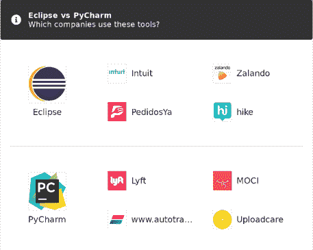

# 关于 Python 环境您需要知道的一切

> 原文：<https://www.edureka.co/blog/python-environment>

众所周知，Python 在过去几年中因其简单性和平台间代码的可移植性而获得了巨大的赞誉。然而，我们从哪里开始编写 python 代码呢？环境的主要原因是为单个项目的开发创造一个孤立的区域。这允许每个项目都没有依赖项，而不管计算机上存储的其他项目是否有特定要求。在本文中，我们将了解 Python 环境。

*   [需要 Python 环境](#need)
*   [Python 环境变量](#variables)

## **对 Python 环境的需求**

要转换任何代码，你都需要一个解释器，这涉及到应用程序的 70%。那你就需要一条“刘海线”。主要有两种方法来创建它。您可以选择使用简单的文本编辑器(如写字板或 Notepad ++)创建程序，或者在 putty 平台上创建 python shell。它们各有利弊。外壳可用于与操作系统交互，例如,“终端”可用于控制 windows 操作系统。在 shell 中，对代码的解释是实时进行的，这非常有益。它让您了解可能的错误和代码执行输出。

下面是一段在 Python IDE(集成开发环境)中运行的代码，比如 PyCharm，它给出了想要的输出。

```
while(1)
#!/usr/bin/env python
#get the username from a prompt
username=raw_input(“Login :   “)
#list of allowed users
Participant1=”Pranav”
Participant2=”Radhika” 
#control the input user 
If (username= =Participant1):
 print “access given”
elif (username == Participant2):
 print “hello”
else:
 print “access not granted”
#end

```


对于 Windows 操作系统，获得 python 设置的最好地方当然是官方网站，也就是 www.python.org。MAC OS X 的电脑已经安装了 python。Linux 也遵循 suite，大多数电脑都预装了它。

广泛推荐使用与自制软件一起安装的 python 3。然后使用 pip3 安装“virtualenv”。由于所有的包都被复制，我们需要确定我们的环境的位置，这可以通过以下方式完成:

`virtualenv -p python3 ~/virtEnv1`

术语 virtEnv1 是虚拟环境的名称，它定义了我们环境的确切路径。环境启动后，bin 文件夹中有一个名为“active”的文件。我们将设置为下面提到的源。

`cd~/virtEnv1`

如果您选择停用虚拟环境，请键入`Deactivate`

**Python 环境的不同方面**

以类似的方式，我们可以创建许多这样的环境，并为不同版本的 python 复制上述过程。

*   Python 环境包装器(PEW)。皮尤作为一个包装，它只能使用一次。这使得在虚拟环境中工作变得非常容易。使用一个命令，您可以在安装几个软件包后立即创建一个新环境。

*   VENV 是另一个最值得推荐的虚拟环境工具。它会生成一个配置文件，python 可以直接理解该文件，并且不会将二进制文件复制到更新的位置。然而，唯一的问题是它不支持 3.3 及以下版本。

*   PIPENV 将所有东西带入了一个全新的领域，因为它将支持的包和环境组合到一个工具中。只需要环境的规范，它为不同的目的(如生产、测试和开发)创建不同的部分。

python 设置附带了许多模块和包，这些模块和包遵循一组定义的过程来下载、存储和解包这些文件。每当我们存储一个项目或试图检索一个包时，python 都会访问最初安装它的主文件夹的唯一子路径。有一些库被称为站点包或第三方包，它们只不过是用户创建的文件。另一种类型叫做系统包，是 python 定义的标准库。

## **环境变量**

*   **PYTHONPATH**

该变量告诉 Python 解释器导入程序的模块文件的位置。它应该包括 Python 源代码库目录和包含 Python 源代码的目录。Python 安装程序有时会预置 PYTHONPATH。

*   **PYTHONSTARTUP**

它包含一个包含 Python 源代码的初始化文件的路径。每次启动解释器时都会执行。在 Unix 中它被命名为“. pythonrc.py ”,它包含加载实用程序或修改 PYTHONPATH 的命令。

*   **PYTHONCASEOK**

它在 Windows 中用于指示 Python 在导入语句中查找第一个不区分大小写的匹配。将该变量设置为任意值以激活它。

*   **蟒蛇之家**

这是一个替代的模块搜索路径。它通常嵌入在 PYTHONSTARTUP 或 PYTHONPATH 目录中，以便于切换模块库。

*   **python 断点**

如果设置了这个，它使用点路径符号命名一个可调用的。该模块将被导入，然后由 sys.breakpointhook()的默认实现运行，该实现本身由内置断点()调用。如果未设置，或者设置为空字符串，则等效于值“pdb.set_trace”。将此项设置为字符串“0”会导致 sys.breakpointhook()的默认实现除了立即返回之外什么也不做。



*至此，我们结束了这篇关于 Python 环境的文章*。 *要深入了解 Python 及其各种应用程序，您可以 [**在此**](https://www.edureka.co/python/) 注册在线实时培训，全天候支持，终身访问。*

*有问题吗？在这篇 Python 环境文章的评论部分提到它们，我们将会回复您。*