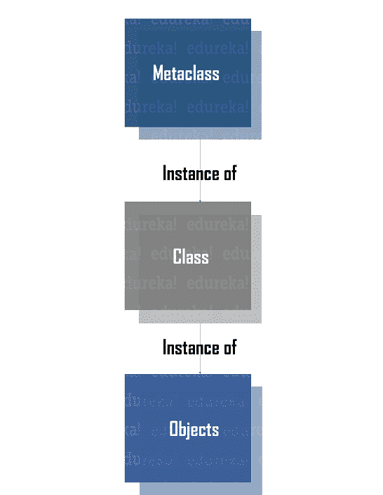
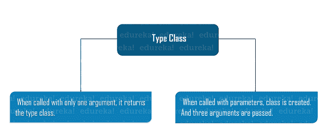
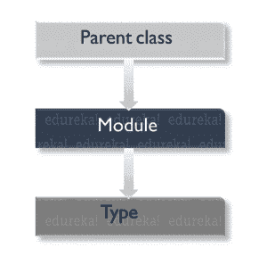

# 如何创建你的第一个 Python 元类？

> 原文：<https://www.edureka.co/blog/python-metaclasses/>

Python 元类设置了类的行为和规则。元类有助于修改类的实例化，并且相当复杂，是 [Python 编程](https://www.edureka.co/python-programming-certification-training)的高级特性之一。 通过这篇文章，我将深入讨论 Python 元类的概念、它的属性、如何以及何时在 Python 中使用元类。本文涵盖了以下概念:

## **什么是 Python 元类？**

Python 元类是与 Python 的[面向对象编程概念](https://www.edureka.co/blog/object-oriented-programming-python/)相关的高级特性之一。它决定了一个类的行为，并进一步帮助修改它。

在 Python 中创建的每个类都有一个底层元类。所以当你创建一个类的时候，你间接地使用了元类。它隐式地发生，你不需要指定任何东西。

与元编程相关联的元类决定了程序操纵自身的能力。学习元类可能看起来很复杂，但是让我们先弄清楚[类和对象](https://www.edureka.co/blog/python-class/)的一些概念，这样就容易理解了。

## **Python 中的类和对象**

一个类是一个蓝图，一个拥有对象的逻辑实体。 一个简单的类在声明时没有分配任何内存，它发生在一个类的实例被创建时。

通过创建的对象，可以访问该类。这个类只是作为一个模板。对象的属性本质上意味着我们可以在运行时与它交互，像变量一样传递参数，存储，修改，也可以与它交互。

使用 __class__ 属性可以检查对象的类别。让我们来看看这个简单的例子:

```
class Demo: 
       pass        
#This is a class named demo
 test=Demo()
print(test.__class__)  #shows class of obj
print(type(test))  #alternate method  

```

`Output: <class '__main__.Demo'>`

Python 大量处理了类和对象的概念，并允许简单而顺利的应用程序开发。但是是什么让 [Python](https://www.edureka.co/blog/learn-python/) 不同于 [Java](https://www.edureka.co/blog/java-tutorial/) 和 [C](https://www.edureka.co/blog/c-programming-tutorial/) 这样的语言呢？***Python 中的一切都可以定义为具有属性和方法的对象。*** 主旨是 Python 中的类不过是更大类的另一个对象。

~~~~

一个类为一个对象定义规则。类似地，元类负责为类分配行为。我们已经知道类是一个对象，就像每个对象都有一个实例一样，类是元类的一个实例。

但是像 [Ruby](https://www.edureka.co/blog/ruby-on-rails-tutorial/) 和 Objective-C 这样的语言也支持元类。那么，是什么让 Python 元类变得更好，为什么要学习它呢？答案是 Python 中的动态类。让我们仔细看看。

## **Python 中的动态类**

Python 是一种动态编程语言，允许在运行时创建一个类。不像其他语言，如 C++，只允许在编译时创建类。在灵活性方面，Python 比其他静态类型的语言更有优势。

动态类型语言和静态类型语言差别不大， 但是在 Python 中，它变得更加有用，因为它提供了元编程。

但是，如果我告诉你 Python 有别于其他编程语言的另一个关键特性呢？

像 Java 或 C++ 这样的语言有像 float、char、int 等数据类型。而 Python 将每个变量视为一个对象。每个对象都属于一个类，比如 int 类或 str 类。您可以简单地使用一个名为 **type()的内置函数来检查任何变量的类。**

```

number = 10993
print("Type associated is:", type(number))
name = "Aishwarya"
print("Type associated is:", type(name))

```

`Output: `

`Type associated is:  <class 'int'>`

`Type associated is: <class 'str'>`

既然你已经理解了 Python 中的一切都有与之相关的类型。在下一个主题中，我们将尝试理解元类实际上是如何工作的。

## **Python 元类是如何工作的？**

每当一个类被创建时，默认的元类(class 类型)就会被调用。 元类携带名称、基类集和与类相关的属性等信息。因此，当一个类被实例化时，调用类型类时会携带这些参数。元类可以通过两种方法创建:

1.  类型类别
2.  自定义元类

让我们继续讨论类型类以及如何创建一个类型类。

### **类型类**

Python 有一个内置的元类叫做 类型 。不像 Java 或 C，有主数据类型。Python 中的每个变量或对象都有一个关联的类。Python 在幕后使用类型类来创建所有的类。在上一个主题中，我们看到了如何使用 **type()来检查对象的类。让我们举一个例子，通过创建一个简单的类来定义一个新的类型。**

```

class Edureka():
obj = Edureka()

print(type(obj))

```

`Output: <class '__main__.Edureka'>`

```

print(type(Edureka))

```

`Output: <class 'type'>`

在上面的代码中，我们有一个名为 Edureka 的类，以及一个相关的对象。我们创建了一个名为 Edureka 的新类型，只需创建一个以该类型命名的类。在第二段代码中，当我们检查 Edureka 类的类型时，结果为“type”。

因此，除非另外定义，元类使用**类型类**来创建所有其他类。我们可以通过两种方法访问类型类:



当我们通过 type class 传递参数时，它使用下面的语法。

```

type(__name__, __base__, attributes)

```

在哪里，

*   该名称是一个字符串，带有类名
*   基础是一个元组，帮助创建子类
*   属性是一个字典，分配键值对

由于 Python 中的类的行为类似于对象，它们的行为也可以用同样的方式改变。我们可以在一个类中添加或删除方法，就像我们处理对象一样。

现在你知道元类在 Python 中创建了所有其他的类，并使用 type class 定义了它们的行为。但是你一定想知道，有没有其他方法可以创建元类？因此，让我们看看如何创建一个自定义元类。

### **Python 中的自定义元类**

现在我们知道并理解了类型类是如何工作的。是时候学习如何创建我们的自定义元类了。 我们可以通过执行动作或者代码注入来修改类的工作方式。为了实现这一点，我们可以在创建类定义时将元类作为关键字传递。或者，我们可以通过简单地继承一个通过这个元类关键字实例化的类来实现这一点。

在创建一个新类的时候，Python 会寻找**_ _ 元类 __** 关键字。以防万一，如果它不存在。它遵循类型类层次结构。



在 Python 执行了一个名称空间中的所有字典之后，它调用 type object 来创建一个类的对象。有两种方法可以用来创建自定义元类。

```
class EduFirst(type):
def __new__(cls, name, base_cls, dict):
pass
class EduSecond(type):
def __init__(self, name, base_cls, dict):
pass

```

我来详细解释一下这两种方法:

1.  **__new__():** 当用户想在创建类之前定义一个元组字典时使用。它返回一个类的实例，很容易覆盖/管理对象流。
2.  **__init__()** :在对象已经创建后调用，简单初始化。

### **Python 中 __call__ 是什么？**

在官方 [Python 文档](https://docs.python.org/3/tutorial/index.html)中， **__call__** 方法可以用来定义自定义元类。此外，当调用一个类来定义自定义行为时，我们可以覆盖其他方法，如 __prepare__ 等。

很像一个类如何像一个模板一样创建对象，同样，元类也像一个模板一样创建类。因此，元类也被称为类工厂。

看下一个例子:

```

class Meta(type):
def __init__(cls, name, base, dct):
cls.attribute = 200
class Test(metaclass = Meta):
pass
Test.attribute

```

`Output: 200`

元类允许类定制。还有各种其他有效且简单得多的方法可以达到同样的效果。一个这样的例子是使用 Decorators。

## **装饰者 vs 元类**

[装饰器](https://www.edureka.co/blog/python-decorator-tutorial/)是 Python 的一个流行特性，它允许你给代码添加更多的功能。装饰器是一个可调用的对象，它帮助修改现有的类，甚至是一个函数。在编译期间，一部分代码调用并修改另一部分。这个过程也称为元编程。

| **装饰者** | **元类** |
| 更改后返回相同的类(例如:猴子补丁) | 每当创建一个新类时，我们就使用元类 |
| 缺乏灵活性 | 提供类的灵活性和定制 |
| 不兼容，无法执行子类化 | 通过使用继承和将对象方法转换为静态方法来提供子类化，以实现更好的优化 |

```

def decorator(cls):
class NewClass(cls):
attribute = 200
 return NewClass
@decorator
Class Test1:
 pass
@decorator

Class Test2:
 pass
Test1.attribute

Test2.attribute

```

`Output: 200`

Python 中的 [Decorator 是一个非常有用和强大的工具，它可以帮助改变函数的行为，而无需实际改变任何代码。](https://www.edureka.co/blog/decorators-in-python/) 当你想在调试时修改程序的一部分，而不是重写函数或改变整个程序时，这就方便了。相反，你可以简单地写一行装饰符，它会处理剩下的事情。

我们的课程到此结束。希望本文能帮助您理解什么是元类，以及如何和何时使用它。

*如果您发现这篇文章与“Python 元类”相关，请查看一下  [Edureka 的 Python 编程认证课程](https://www.edureka.co/python-programming-certification-training) 这是一家值得信赖的在线学习公司，拥有遍布全球的 250，000 多名满意的学习者。*

*我们在这里帮助你踏上旅程的每一步，并为想要成为  [Python 开发者](https://www.edureka.co/blog/how-to-become-a-python-developer/)的学生和专业人士设计课程。该课程旨在让您在 Python 编程方面有一个良好的开端，并训练您掌握核心和高级 Python 概念以及各种  [Python 框架](https://www.edureka.co/blog/python-frameworks/) ，如  [Django。](https://www.edureka.co/blog/django-tutorial/)*

如果你遇到任何问题，请在“Python 元类”的评论区自由提问。我们团队很乐意回答。