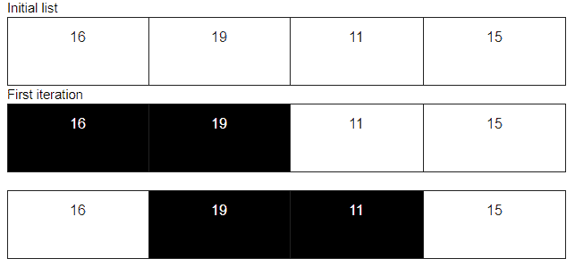
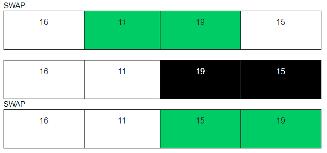
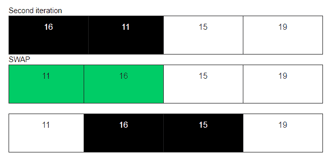

# 如何在 Python 中实现冒泡排序？

> 原文：<https://www.edureka.co/blog/python-program-bubble-sort>

排序是指根据元素间的某种线性关系，将任何数据按升序或降序排列。这篇关于 [Python](https://www.edureka.co/blog/python-programming-language) 中的冒泡排序的文章将帮助你详细理解这个概念。

我们将在本博客中讨论以下话题:

*   [什么是冒泡排序？](#WhatisBubblesort)
*   [执行冒泡排序的步骤](#StepsforBubble)
*   [冒泡排序算法](#BubbleSortAlgorithm)
*   [Python 程序执行](#PythonProgramtoimplementBubble) [ent 冒泡排序](#PythonProgramtoimplementBubble)

## **什么是冒泡排序？**

冒泡排序又称下沉排序。这是一个简单的排序算法，它不断地遍历要排序的列表，比较每一对相邻的项，如果它们的顺序不正确，就交换它们。重复这些步骤，直到不再需要交换，这时列表被排序。

## **执行冒泡排序的步骤**

*   比较列表中的第一个和第二个元素，如果它们的顺序不对，就交换。
*   比较第二个和第三个元素，如果顺序不对，就交换它们。
*   以类似的方式继续，直到列表的最后一个元素。
*   继续重复以上所有步骤，直到列表排序完毕。

通过以下可视化，上述步骤将变得更加清晰—



 


## ****冒泡排序算法****

现在让我们看看冒泡排序背后的算法。

***第一关:***

( **16，19** ，11，15，10)–>(**16，19** ，11，15，10)–该算法比较前两个元素并交换自 19 > 16 以来的值

( 16， **19，11** ，15，10)—>(16， **11，19** ，15，10)—互换自 19 > 11

( 16，11， **19，15** ，10)—>(16，11， **15，19** ，10)——自 19 > 15 起互换

( 16，11，15， **19，10**)–>(16，11，15， **10，19**)–现在，由于这些元素已经处于正确的顺序(19 > 10)，算法不会交换它们。

***第二关:***

( **16，11** ，15，10，19)——>(**11，16** ，15，10，19)——自 16 > 11 起互换

( 11， **16，15** ，10，19)——>(11， **15，16** ，10，19)——从 16 > 15 开始互换

( 11，15， **16，10** ，19)——>(11，15， **10，16** ，19)——从 16 > 10 开始互换

( 11，15，10，16，19)——>(11，15，10，16，19 )

[数组](https://www.edureka.co/blog/2d-arrays-in-python/)已经排序，但是我们的 algo 不知道它是否完成。因此，它需要另一个没有任何交换的完整传递来知道它已排序。

***第三关:***

( 11， **15，10** ，16，19)——>(11， **15，10** ，16，19 )

( 11， **15，10** ，16，19)——>(11， **10，15** ，16，19)——从 15 > 10 开始互换

( 11，10，15，16，19)——>(11，10，15，16，19 )

( 11，10，15，16，19)——>(11，10，15，16，19 )

***第四关:***

( **11，10** ，15，16，19)——>(**10，11** ，15，16，19)——从 11 > 10 开始互换

最终输出为(10，11，15，16，19)

现在让我们将它编码—

**Python 程序实现冒泡排序**

a = [16，19，11，15，10，12，14]

```
#repeating loop len(a)(number of elements) number of times
for j in range(len(a)):
    #initially swapped is false
    swapped = False
    i = 0
    while i<len(a)-1: #comparing the adjacent elements if a[i]>a[i+1]:
            #swapping
            a[i],a[i+1] = a[i+1],a[i]
            #Changing the value of swapped
            swapped = True
        i = i+1
    #if swapped is false then the list is sorted
    #we can stop the loop
    if swapped == False:
        break
print (a)

```

```
OUTPUT: 
```

 在上面的代码中，我们比较相邻的数字，如果顺序不对就交换。重复相同的过程 len(a)多次。我们已经指定了一个变量‘swapped ’,如果任何两个元素在一次迭代中被交换，它就变成‘True’。如果没有元素的互换，那么列表已经排序，因此,“交换”的值没有变化，我们可以打破循环。

说到这里，我们结束这篇题为“如何在 Python 中实现冒泡排序”的博客。我希望这些内容对您的 Python 知识有所帮助。

***Make sure you practice as much as possible and revert your experience.***

*有问题吗？请在这篇“如何在 Python 中实现冒泡排序”博客的评论部分提到它，我们会尽快回复您。*

*要深入了解 Python 及其各种应用，您可以注册参加实时 **[Python 在线培训](https://www.edureka.co/python)** ，该培训提供全天候支持和终身访问。*