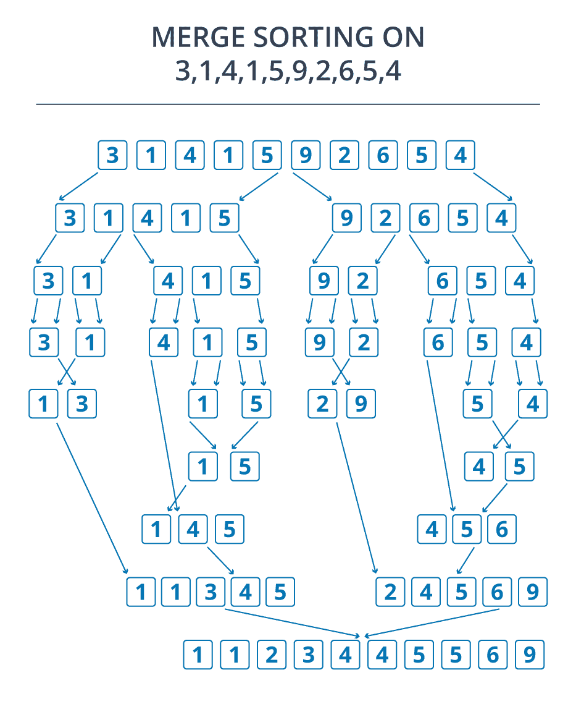
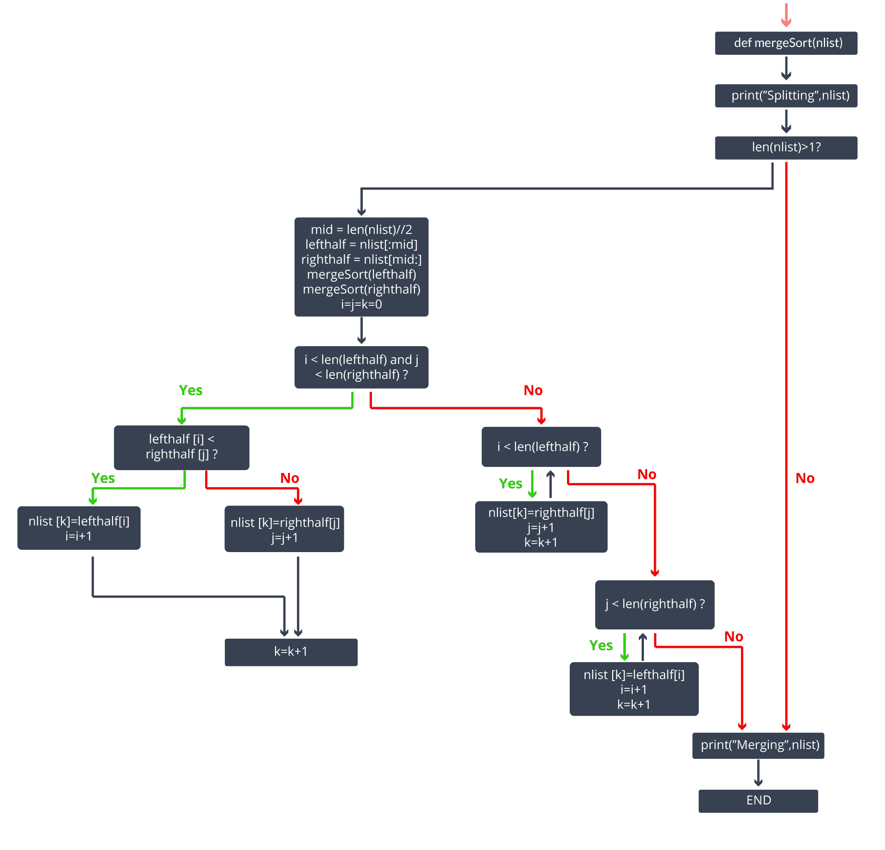

# 如何在 Python 中实现归并排序？

> 原文：<https://www.edureka.co/blog/python-program-merge-sort/>

本博客基于分而治之的方法。合并排序是一种“分而治之”的算法，将问题分成子问题，然后合并以解决问题。这篇关于用 [Python](https://www.edureka.co/blog/python-programming-language) 进行合并排序的博客将带你详细了解以下主题——

*   [Python 中什么是归并排序？](#MergeSortinPython)
*   [各个击破的方法](#DivideandConquer)
*   [在 Python 中实现归并排序](#ImplementingMergeSortinPython)
*   [合并排序实现流程图](#Flowchart)
*   [优点及用法](#AdvantagesandUsage)

## **Python 中什么是归并排序？**

合并排序基于分治算法，其中输入数组被分成两半，然后分别排序并合并以获得解决方案。merge()函数用于合并排序后的[数组](https://www.edureka.co/blog/arrays-in-python/)。

## **分治法**

*   将数组分成两半，对每一半重复该过程，直到每一半的大小为 1 或 0。
*   大小为 1 的数组是普通排序的。
*   现在，两个排序后的数组合并成一个大数组。并且这一直持续到所有元素被组合并且数组被排序。

这里有一个可视化的合并排序，可以帮你理清头绪

输入数组= [3，1，4，1，5，9，2，6，5，4]

 现在，让我们继续实施。

## **在 Python 中实现合并排序**

```
def mergeSort(nlist):
    print("Splitting ",nlist)
    if len(nlist)>1:
        mid = len(nlist)//2
        lefthalf = nlist[:mid]
        righthalf = nlist[mid:]

        mergeSort(lefthalf)
        mergeSort(righthalf)
        i=j=k=0       
        while i < len(lefthalf) and j < len(righthalf):
            if lefthalf[i] < righthalf[j]:
                nlist[k]=lefthalf[i]
                i=i+1
            else:
                nlist[k]=righthalf[j]
                j=j+1
            k=k+1

        while i < len(lefthalf):
            nlist[k]=lefthalf[i]
            i=i+1
            k=k+1

        while j < len(righthalf):
            nlist[k]=righthalf[j]
            j=j+1
            k=k+1
    print("Merging ",nlist)

nlist = [3,1,4,1,5,9,2,6,5,4]
mergeSort(nlist)
print(nlist)

```

**输出:**

$python main.py ('分裂'，[3，1，4，1，5，9，2，6，5，4]) ('分裂'，[3，1，4，1，5]) ('分裂'，[3，1]) ('分裂'，[3]) ('合并'，[3]) [4]) ('合并'，【4】)('分裂'，【1，5】)('分裂'，【1】)('合并'，【1】)('分裂'，【5】)('合并'，【5】) 2]) ('拆分'，[9]) ('合并'，[9]) ('拆分'，[2]) ('合并'，[2]) ('合并'，[2，9]) 】 [4]) ('合并'，【4】)('合并'，【4，5】)('合并'，【4，5，6】)('合并'，【2，4，5，6，9】)('合并'，【1，2，3，4，4，4

**合并排序实现流程图**



## **合并排序的优点和用途**

大多数其他算法在处理像文件和链表这样的顺序数据结构时表现不佳。在这些结构中，访问一个随机元素需要线性时间，而不是常规的常数时间。合并排序的本质使得这种数据结构变得简单而快速。 归并排序的一个最大特点是比较次数少。它的比较次数为 O(n * log(n))，但是与快速排序相比，常数因子是很好的，这使得它在比较函数是一个慢操作时很有用。 另外，归并排序的分而治之的方法使其便于并行处理。

*说到这里，我们结束这篇关于“如何在 Python 中实现归并排序”的博客。我希望这些内容对您的 Python 知识有所帮助。要深入了解 Python 及其各种应用程序，您可以注册参加实时 [Python 认证培训](https://www.edureka.co/python)，该培训提供全天候支持和终身访问。*