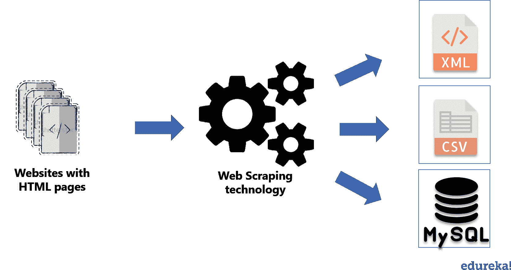

# Python 中的正则表达式及示例

> 原文：<https://www.edureka.co/blog/python-regex/>

## **Python 正则表达式:**

**正则表达式** 可用于搜索、编辑和操作文本。这在 Python 下的所有子域中打开了各种各样的应用。Python 正则表达式被几乎所有的初创公司广泛使用，并且对他们的应用程序有很好的行业吸引力，也使正则表达式成为现代程序员的资产。

在这个 Python RegEx 博客中，我们将检验以下概念:

*   我们为什么要使用正则表达式？
*   [什么是正则表达式？](#z2)
*   [基本正则表达式运算](#z3)
*   [使用正则表达式的电子邮件验证](#z4)
*   [使用正则表达式的电话号码验证](#z5)
*   [使用正则表达式的网页抓取](#z6)

## **Python 正则表达式| Python 正则表达式教程| Edureka**


[https://www.youtube.com/embed/zN8rwVXwRUE?rel=0&showinfo=0](https://www.youtube.com/embed/zN8rwVXwRUE?rel=0&showinfo=0)*This Edureka “Python RegEx” tutorial will help you in understanding how to use regular expressions in Python.*

## **为什么要用正则表达式？**

为了回答这个问题，我们将看看我们所面临的各种问题，这些问题通过使用正则表达式来解决。

考虑以下场景:

您有一个包含大量数据的日志文件。从这个日志文件中，您希望只获取日期和时间。正如您可以看到的图像，日志文件的可读性乍一看很低。


在这种情况下，可以使用正则表达式来识别模式并轻松提取所需的信息。

考虑下一个场景——你是一名销售人员，你有很多电子邮件地址，其中很多是假的/无效的。看看下面的图片:


你可以做的是，你可以利用正则表达式，你可以验证电子邮件地址的格式，并过滤掉假身份证从真正的。

下一个场景与销售人员的例子非常相似。考虑下面的图像:


我们如何验证电话号码，然后根据原籍国进行分类？

每一个正确的数字都有一个特定的模式，可以通过使用正则表达式来追踪。

接下来是另一个简单的场景:


我们有一个包含姓名、年龄和地址等详细信息的学生数据库。考虑这样一种情况，即区号最初是 **59006** ，但现在已经改为 **59076。**为每个学生手动更新这一信息将非常耗时，而且是一个非常漫长的过程。

基本上，要使用正则表达式解决这些问题，我们首先从包含 pin 码的学生数据中找到一个特定的字符串，然后用新的字符串替换所有的字符串。

正则表达式可以用于多种语言。比如:

*   Java 语言(一种计算机语言，尤用于创建网站)
*   计算机编程语言
*   红宝石
*   迅速发生的
*   斯卡拉
*   绝妙的
*   C#
*   服务器端编程语言（Professional Hypertext Preprocessor 的缩写）
*   java 描述语言

还有其他“n”种情况下正则表达式可以帮助我们。在 Python RegEx 博客的后续部分，我将带您了解这一点。

所以，接下来在这个 Python 正则表达式博客上，让我们看看正则表达式到底是什么。

## **什么是正则表达式？**

正则表达式用于识别文本串中的搜索模式。它还有助于找出数据的正确性，甚至可以使用正则表达式进行查找、替换和格式化数据等操作。

考虑下面的例子:


在给定字符串的所有数据中，假设我们只需要城市。这可以通过格式化的方式转换成只有姓名和城市的字典。现在的问题是，我们能找出一种模式来猜测名字和城市吗？此外，我们也可以找出年龄。年龄大了，就容易了吧？它只是一个整数。

我们该如何处理这个名字呢？如果你看一下这个模式，所有的名字都以大写字母开头。在正则表达式的帮助下，我们可以使用这种方法来识别姓名和年龄。

考虑以下代码:

```

import re

Nameage = '''
Janice is 22 and Theon is 33
Gabriel is 44 and Joey is 21
'''

ages = re.findall(r'd{1,3}', Nameage)
names = re.findall(r'[A-Z][a-z]*',Nameage)

ageDict = {}
x = 0
for eachname in names
    ageDict[eachname] = ages[x]
    x+=1
print(ageDict)

```

此时不需要担心语法，但是由于 Python 具有惊人的可读性，您可以很好地猜到代码的正则表达式部分发生了什么。

**输出:**

```
{'Janice': '22', 'Theon': '33', 'Gabriel': '44', 'Joey': '21'}
```

接下来，在这个 Python RegEx 博客上，让我们看看可以使用正则表达式执行的所有操作。

## **可以用正则表达式执行的操作——正则表达式示例:**

利用正则表达式可以执行许多操作。这里，我列出了几个对帮助你更好地理解正则表达式的用法非常重要的例子。

让我们从如何在字符串中找到特定的单词开始这篇 Python RegEx 博客。

**在字符串中查找单词:**

考虑下面这段代码:

```

import re

if re.search("inform","we need to inform him with the latest information"):
    print("There is inform")

```

我们在这里所做的就是搜索单词 **inform** 是否存在于我们的搜索字符串中。如果是，那么我们得到一个输出，说**有通知**。

我们可以写一个方法来做类似的事情。

```

import re

allinform = re.findall("inform","We need to inform him with the latest information!")

for i in allinform:
    print(i)

```

这里，在这种特殊情况下**通知**会被发现两次。一份来自通知，另一份来自**通知。**

而在如上图的正则表达式中找到一个单词就是这么简单。

在这个 Python RegEx 博客的下一篇文章中，我们将看看如何使用正则表达式生成迭代器。

**生成迭代器:**

生成迭代器是找到并报告字符串的起始和结束索引的简单过程。考虑下面的例子:

```

import re

Str = "we need to inform him with the latest information"

for i in re.finditer("inform.", Str):
    locTuple = i.span()
    print(locTuple)

```

对于找到的每个匹配项，打印起始和结束索引。当我们执行上面的程序时，你能猜出我们得到的输出吗？下面来看看吧。

**输出:**

```
(11, 18)
(38, 45)
```

很简单，对吧？

在这个 Python RegEx 博客的下一篇文章中，我们将探讨如何使用正则表达式来匹配单词和模式。

**匹配单词和模式:**

考虑一个输入字符串，您必须将某些单词与该字符串匹配。具体来说，请看下面的示例代码:

```

import re

Str = "Sat, hat, mat, pat"

allStr = re.findall("[shmp]at", Str)

for i in allStr:
    print(i)

```

字符串中有什么共同点？您可以看到字母“a”和“t”在所有输入字符串中是常见的。代码中的[shmp]表示要查找的单词的首字母。因此，任何以字母 s、h、m 或 p 开头的子字符串都将被考虑进行匹配。其中任何一个，并且结尾必须跟 at。

**输出:**

```
hat
mat
pat
```

请注意，它们都区分大小写。正则表达式具有惊人的可读性。一旦你了解了基础知识，你就可以开始全力以赴地工作了，这很容易，对吗？

接下来，在这个 Python 正则表达式博客上，我们将看看如何使用正则表达式一次匹配一系列字符。

**匹配一系列字符:**

我们希望输出第一个字母应该在 h 和 m 之间的所有单词，后面必须跟 at。看看下面的例子，我们应该意识到我们应该得到的输出是帽子和垫子，对吗？

```

import re

Str = "sat, hat, mat, pat"

someStr = re.findall("[h-m]at", Str)

for i in someStr:
    print(i)

```

**输出:**

```
hat
mat
```

现在让我们稍微修改一下上面的程序，以获得一个非常不同的结果。查看下面的代码，并尝试找出上面的代码和下面的代码之间的区别:

```

import re

Str = "sat, hat, mat, pat"

someStr = re.findall("[^h-m]at", Str)

for i in someStr:
    print(i)

```

发现了细微的区别？我们在正则表达式中添加了一个插入符号 symbol(^。它所做的会抵消它所带来的影响。我们得到的不是从 h 到 m 的所有输出，而是除此之外的所有输出。

我们可以预期的输出是不是以 h 和 m 之间的字母开始，但最后仍然跟随着的单词。

**输出:**

```
sat
pat
```

接下来，在这个 Python RegEx 博客上，我将解释我们如何使用正则表达式替换字符串。

**替换字符串:**

接下来，我们可以使用正则表达式检查另一个操作，用其他内容替换字符串中的一项。这非常简单，可以用下面这段代码来说明:

```

import re

Food = "hat rat mat pat"

regex = re.compile("[r]at")

Food = regex.sub("food", Food)

print(Food)

```

在上面的例子中，单词 **rat** 被替换为单词 **food。**最终的输出会是这样的。正则表达式的替换方法就是在这种情况下使用的，它还有各种各样的实际用例。

**输出:**

```
hat food mat pat
```

在这个 Python 正则表达式博客的下一篇文章中，我们将检查一个 Python 特有的问题，叫做 Python 反斜杠问题。

**反斜杠问题:**

考虑如下所示的示例代码:

```

import re

randstr = "Here is Edureka"

print(randstr)

```

**输出:**

```
Here is Edureka
```

这就是反斜杠问题。其中一条斜线从输出中消失了。这个特殊的问题可以使用正则表达式来解决。

```

import re

randstr = "Here is Edureka"

print(re.search(r"Edureka", randstr))

```

输出可能如下所示:

```
<re.Match object; span=(8, 16), match='Edureka'>
```

正如你所看到的，双斜线的匹配已经找到了。这就是使用正则表达式解决反斜杠问题是多么简单。

在这个 Python RegEx 博客的下一篇文章中，我将带您了解如何使用正则表达式匹配单个字符。

**匹配单个字符:**

字符串中的单个字符可以很容易地使用正则表达式进行单独匹配。查看以下代码片段:

```

import re

randstr = "12345"

print("Matches: ", len(re.findall("d{5}", randstr)))

```

预期的输出是给定输入字符串中出现的第 5 个数字。

**输出:**

```
Matches: 1
```

在这个 Python RegEx 博客的下一篇文章中，我将带您了解如何使用正则表达式删除换行符。

**删除换行符:**

在 Python 中，我们可以使用正则表达式轻松地删除换行符。考虑如下所示的另一段代码:

```

import re

randstr = '''
You Never
Walk Alone
Liverpool FC
'''

print(randstr)

regex = re.compile("
")

randstr = regex.sub(" ", randstr)

print(randstr)

```

**输出:**

```
You Never
Walk Alone
Liverpool FC

You Never Walk Alone Liverpool FC
```

从上面的输出中可以看出，新行被替换为空白，输出显示在一行上。

根据你想用什么来替换字符串，你还可以使用许多其他的东西。它们列举如下:

*   **:** 退格
*   **:** 表单馈送
*   **:** 回车
*   **:** 页签
*   **:** 垂直制表符

考虑如下所示的另一个示例:

```

import re

randstr = "12345"

print("Matches:", len(re.findall("d", randstr)))

```

**输出:**

```
Matches: 5
```

从上面的输出可以看出，d 匹配字符串中的整数。然而，如果我们用 D 替换它，它将匹配除整数之外的所有内容，与 D 正好相反

接下来，在这个 Python 正则表达式博客上，让我们浏览一些在 Python 中使用正则表达式的重要实际用例。

## **正则表达式的实际用例**

我们将检查日常广泛使用的 3 个主要用例。以下是我们将检验的概念:

*   电话号码验证
*   电子邮件地址验证
*   刮网

让我们从第一个案例开始 Python 正则表达式教程的这一部分。

**电话号码验证:**

问题陈述–需要在任何相关场景中轻松验证电话号码。

考虑以下电话号码:

*   444-122-1234
*   123-122-78999
*   111-123-23
*   67-7890-2019

电话号码的一般格式如下:

*   以 3 位数和“-”号开头
*   3 个中间数字和“-”号
*   结尾 4 位数

我们将在下面的例子中使用 w。注意， **w = [a-zA-Z0-9_]**

```

import re

phn = "412-555-1212"

if re.search("w{3}-w{3}-w{4}", phn):
    print("Valid phone number")

```

**输出:**

```
Valid phone number
```

**电子邮件验证:**

问题陈述–在任何情况下验证电子邮件地址的有效性。

考虑以下电子邮件地址的示例:

*   Anirudh@gmail.com
*   Anirudh @ com
*   AC .com
*   123 @.com

手动操作时，只需扫一眼就能识别出有效的邮件 id 和无效的邮件 id。但是当让我们的程序为我们做这件事时，情况又是怎样的呢？考虑到这个用例遵循了以下准则，这是非常简单的。

指导方针:

所有电子邮件地址应包括:

*   1 到 20 个小写和/或大写字母、数字和加号。_ % +
*   @符号
*   2 到 20 个小写和大写字母、数字和加号
*   句号符号
*   2 到 3 个小写和大写字母

代码:

```

import re

email = "ac@aol.com md@.com @seo.com dc@.com"

print("Email Matches: ", len(re.findall("[w._%+-]{1,20}@[w.-]{2,20}.[A-Za-z]{2,3}", email)))

```

**输出:**

```
Email Matches: 1
```

从上面的输出可以看出，我们在输入的 4 封电子邮件中有一封有效邮件。

这基本上证明了使用正则表达式并实际使用它们是多么简单和高效。

**网页抓取**

问题陈述——根据要求从网站上删除所有电话号码。

要了解网页抓取，请查看下图:



我们已经知道，一个网站将由多个网页组成。假设我们需要从这些页面中获取一些信息。

网页抓取主要用于从网站中提取信息。您可以将提取的信息保存为 XML、CSV 甚至 MySQL 数据库的形式。这可以通过使用 Python 正则表达式轻松实现。

```

import urllib.request
from re import findall

url = "http://www.summet.com/dmsi/html/codesamples/addresses.html"

response = urllib.request.urlopen(url)

html = response.read()

htmlStr = html.decode()

pdata = findall("(d{3}) d{3}-d{4}", htmlStr)

for item in pdata:
    print(item)

```

**输出:**

```
(257) 563-7401
(372) 587-2335
(786) 713-8616
(793) 151-6230
(492) 709-6392
(654) 393-5734
(404) 960-3807
(314) 244-6306
(947) 278-5929
(684) 579-1879
(389) 737-2852
(660) 663-4518
(608) 265-2215
(959) 119-8364
(468) 353-2641
(248) 675-4007
(939) 353-1107
(570) 873-7090
(302) 259-2375
(717) 450-4729
(453) 391-4650
(559) 104-5475
(387) 142-9434
(516) 745-4496
(326) 677-3419
(746) 679-2470
(455) 430-0989
(490) 936-4694
(985) 834-8285
(662) 661-1446
(802) 668-8240
(477) 768-9247
(791) 239-9057
(832) 109-0213
(837) 196-3274
(268) 442-2428
(850) 676-5117
(861) 546-5032
(176) 805-4108
(715) 912-6931
(993) 554-0563
(357) 616-5411
(121) 347-0086
(304) 506-6314
(425) 288-2332
(145) 987-4962
(187) 582-9707
(750) 558-3965
(492) 467-3131
(774) 914-2510
(888) 106-8550
(539) 567-3573
(693) 337-2849
(545) 604-9386
(221) 156-5026
(414) 876-0865
(932) 726-8645
(726) 710-9826
(622) 594-1662
(948) 600-8503
(605) 900-7508
(716) 977-5775
(368) 239-8275
(725) 342-0650
(711) 993-5187
(882) 399-5084
(287) 755-9948
(659) 551-3389
(275) 730-6868
(725) 757-4047
(314) 882-1496
(639) 360-7590
(168) 222-1592
(896) 303-1164
(203) 982-6130
(906) 217-1470
(614) 514-1269
(763) 409-5446
(836) 292-5324
(926) 709-3295
(963) 356-9268
(736) 522-8584
(410) 483-0352
(252) 204-1434
(874) 886-4174
(581) 379-7573
(983) 632-8597
(295) 983-3476
(873) 392-8802
(360) 669-3923
(840) 987-9449
(422) 517-6053
(126) 940-2753
(427) 930-5255
(689) 721-5145
(676) 334-2174
(437) 994-5270
(564) 908-6970
(577) 333-6244
(655) 840-6139
```

我们首先导入执行 web 抓取所需的包。并且最终结果包括作为使用正则表达式完成的网络搜集的结果而提取的电话号码。

## **结论**

我希望这篇 Python 正则表达式教程能帮助你学习开始使用 Python 正则表达式所需的所有基础知识。

当您试图开发需要使用正则表达式和类似原则的应用程序时，这将非常方便。现在，在正则表达式和 Web 抓取的帮助下，您也应该能够使用这些概念轻松地开发应用程序。

看完这篇关于 Python 正则表达式教程的博客后，我很确定你想了解更多关于 Python 的知识。想要了解更多关于 Python 的知识，你可以参考下面的博客:

1.  **[Python 教程——Python 编程初学者](https://www.edureka.co/blog/python-tutorial/)**
2.  **[用于数据科学的 Python](https://www.edureka.co/blog/learn-python-for-data-science/)**
3.  [**你应该学习 Python 的 10 大理由**](https://www.edureka.co/blog/10-reasons-why-you-should-learn-python)
4.  [**Python 请求教程**](https://www.edureka.co/blog/python-requests-tutorial/)
5.  [**Python Tkinter 教程**](https://www.edureka.co/blog/tkinter-tutorial/)

*要深入了解 Python 及其各种应用，您现在就可以注册参加[最佳 Python 课程](https://www.edureka.co/python-programming-certification-training)在线培训，该培训提供全天候支持和终身访问。*

有问题吗？请在这个“Python 正则表达式教程”博客的评论部分提到它，我会尽快回复你。