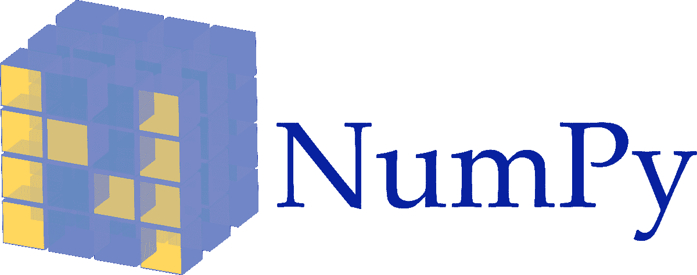
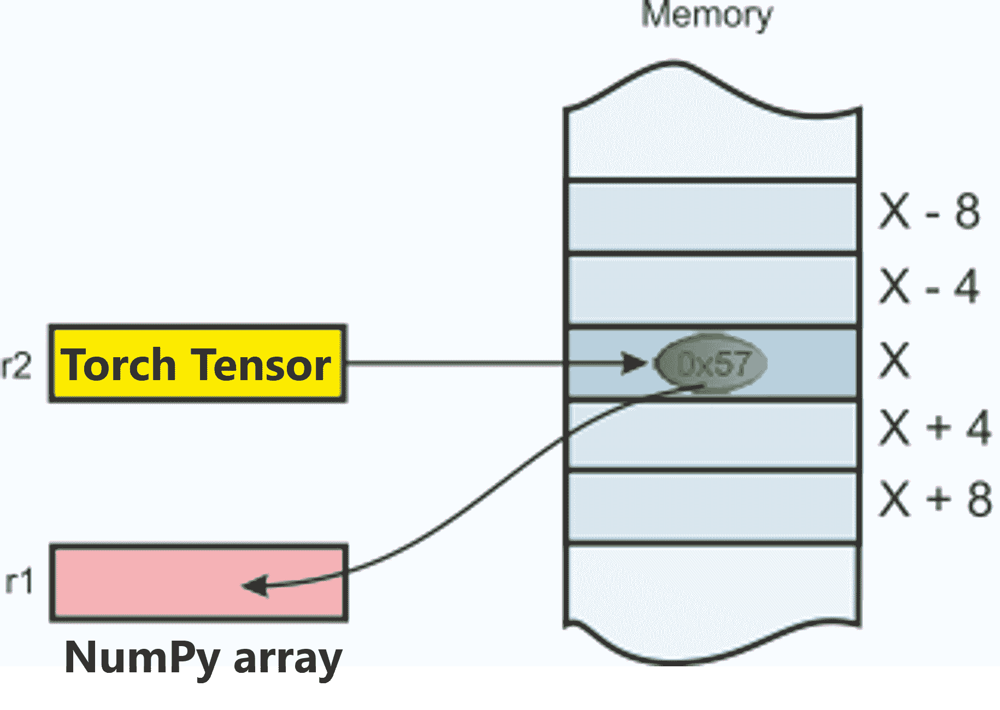
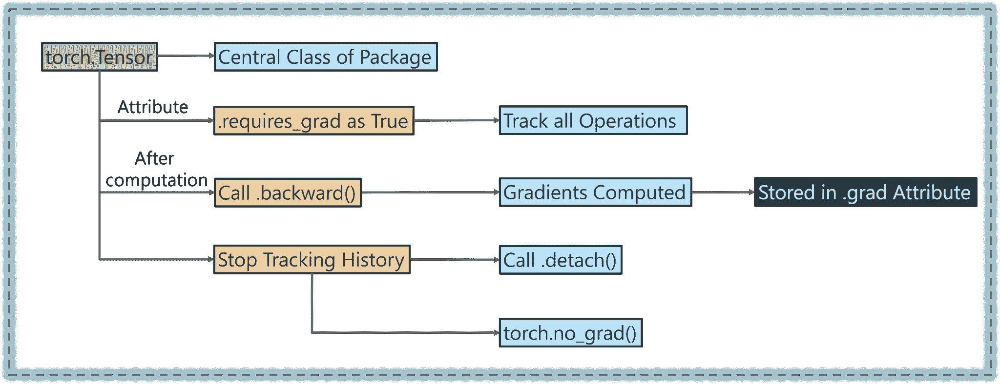
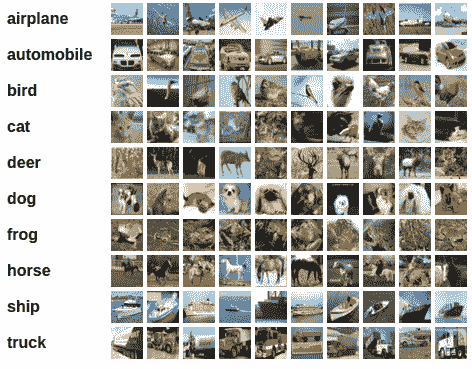

# PyTorch 教程–使用 PyTorch 实现深度神经网络

> 原文：<https://www.edureka.co/blog/pytorch-tutorial/>

## **PyTorch 教程:**

让我们以这样一个事实开始这篇 **PyTorch 教程**博客:深度学习是今天**每个人**都在使用的东西，从**虚拟帮助**到在**购物**时获得**推荐**！ 随着更新的工具出现，更好地利用深度学习，编程和实现变得更加容易。

本 **PyTorch 教程**按以下顺序给你一个**完整洞察**py torch:

*   [什么是 PyTorch](#z1)
*   [py torch](#z2)的特点
*   [安装 py torch](#z3)
*   NumPy 桥
*   [PyTorch:自动轮模块](#z5)
*   [用例:图像分类器](#z6)

## **Python 中的深度学习框架**

Python 是**编码和深度学习工作的首选**，因此有**广泛的**框架可供选择。如:

##  

## **py torch 是什么？**

这是一个基于 **[Python](https://www.edureka.co/blog/python-programming-language)** 的科学计算**包**针对两组受众:

*   一个代替 NumPy 的来利用**GPU**的力量。
*   深度学习**研究平台**提供最大的**灵活性**和**速度**。

## **py torch 的特点——亮点**

## **安装 py torch**

在 PyTorch 教程中，让我们看看在您的机器上安装 PyTorch 是多么简单。


基于系统属性，比如**操作系统**或者软件包管理器，这是非常简单的。它可以从**命令提示符**安装，也可以安装在 **IDE** 中，如 **PyCharm** 等。

接下来，在 PyTorch 教程博客上，让我们看看 **NumPy** 是如何融入 PyTorch 的。

立即查看 AI 和深度学习课程即将推出的批次！ [<button>学现</button>](https://www.edureka.co/ai-deep-learning-with-tensorflow)

## **张量**

张量类似于 [NumPy 的](https://www.edureka.co/blog/python-numpy-tutorial/) n 维数组，另外张量也可以用在 GPU 上来加速计算。

我们来构造一个简单的张量，检查输出。首先，让我们看看如何构建一个 5×3 的矩阵，这是未知的:

```
x = torch.empty(5, 3)
print(x)

```

输出:

```
tensor([[8.3665e+22, 4.5580e-41, 1.6025e-03],
        [3.0763e-41, 0.0000e+00, 0.0000e+00],
        [0.0000e+00, 0.0000e+00, 3.4438e-41],
        [0.0000e+00, 4.8901e-36, 2.8026e-45],
        [6.6121e+31, 0.0000e+00, 9.1084e-44]])
```

现在让我们构造一个随机初始化的矩阵:

```
    x = torch.rand(5, 3)
    print(x)

```

输出:

```
tensor([[0.1607, 0.0298, 0.7555],
        [0.8887, 0.1625, 0.6643],
        [0.7328, 0.5419, 0.6686],
        [0.0793, 0.1133, 0.5956],
        [0.3149, 0.9995, 0.6372]])
```

直接从数据构建张量:

```
x = torch.tensor([5.5, 3])
print(x)

```

输出:

```
tensor([5.5000, 3.0000])
```

**张量运算**

操作有多种语法。在下面的例子中，我们将看看加法运算:

```

y = torch.rand(5, 3)
print(x + y)

```

输出:

```
    tensor([[ 0.2349, -0.0427, -0.5053],
            [ 0.6455,  0.1199,  0.4239],
            [ 0.1279,  0.1105,  1.4637],
            [ 0.4259, -0.0763, -0.9671],
            [ 0.6856,  0.5047,  0.4250]])

```

调整大小:如果你想改变一个张量的形状/大小，你可以使用“torch . view”:

```

x = torch.randn(4, 4)
y = x.view(16)
z = x.view(-1, 8) # the size -1 is inferred from other dimensions
print(x.size(), y.size(), z.size())

```

输出:

```
torch.Size([4, 4]) torch.Size([16]) torch.Size([2, 8])
```

## **NumPy 为 py torch**



**NumPy 是 Python 编程语言的库**，增加了对大型多维**数组**和**矩阵**的支持，以及对这些数组进行操作的大量**高级数学函数**。

也用作:

*   **库**提供**工具**用于集成 C/C++和 FORTRAN 代码。
*   运算具有**线性代数**、**傅立叶变换**和**随机数**功能。

除了其明显的科学用途，NumPy 还可以用作通用数据的有效的多维容器**和任意数据类型的**。

这使得 **NumPy** 能够**无缝**并快速**将**与各种**数据库集成！**

## **NumPy 桥——阵列和张量**

## 

**将**火炬张量转换为 NumPy 数组，反之亦然**轻而易举！**



Torch 张量和 NumPy 数组将**共享它们的底层内存位置**，改变一个将改变另一个。

## **将火炬张量转换为 NumPy 数组:**

```
a = torch.ones(5)
print(a)

```

```
Output: tensor([1., 1., 1., 1., 1.]) 
```

```
b = a.numpy()
print(b)

```

```
Output: [1\. 1\. 1\. 1\. 1.]
```

让我们执行一个**求和运算**，并检查值中的**变化**

```
a.add_(1)
print(a)
print(b)

```

```
Output: tensor([2., 2., 2., 2., 2.]) [2\. 2\. 2\. 2\. 2.]
```

## **将 NumPy 数组转换为 Torch 张量:**

```
import numpy as no
a = np.ones(5)
b = torch.from_numpy(a)
np.add(a, 1, out=a)
print(a)
print(b)

```

输出:

```
[2\. 2\. 2\. 2\. 2.]
tensor([2., 2., 2., 2., 2.], dtype=torch.float64)
```

如你所见，就是这么简单！

接下来在这个 PyTorch 教程博客上，让我们来看看 PyTorch 的**亲笔签名模块**。

## **PyTorch:自动轮模块**

**亲笔签名**包为张量上的所有操作提供**自动微分**。



它是一个**由运行定义的框架**，这意味着你的反向开发由你的代码如何运行来定义，并且每一次**迭代**都可以**不同**。

接下来，在 PyTorch 教程博客上，让我们看一个有趣而简单的用例。

## **PyTorch 用例:训练一个图像分类器**

一般来说，当你必须处理图像、文本、音频或视频数据时，你可以使用**标准 python 包**，将数据加载到 **Numpy** 数组中。然后你可以把这个阵列转换成一个**火炬。*张量**。

*   对于**图像**来说，**枕**、 **OpenCV** 等包都是有用的。
*   对于**音频**，包如 **Scipy** 和 **Librosa** 。
*   对于**文本**，基于原始 Python、 **Cython** 的加载或者 **NLTK** 和 **SpaCy** 都是有用的。

专门针对视觉，有一个名为 **torchvision** 的包，它有**数据加载器**用于常见数据集，如 **Imagenet、CIFAR10、MNIST 等**。和图像数据转换器。

这提供了**巨大的便利**和**避免了编写样板代码。**

对于本教程，我们将使用 **CIFAR10** 数据集。

它有**类**:飞机、汽车、鸟、猫、鹿、狗、青蛙、马、船、卡车。CIFAR-10 中的图像大小为 3x32x32，即 32×32 像素的 3 通道彩色图像，如下所示:



## **PyTorch:训练 CIFAR10 分类器**


我们将依次执行以下步骤:

## **1。加载并归一化 cifar 10**

使用**火炬**，加载 cifa r10**非常容易！**

简单如下:

```
import torch
import torchvision
import torchvision.transforms as transforms

```

火炬视觉数据集的输出是范围为[0，1]的 **PILImage** 图像。我们把它们转换成归一化范围[-1，1]的张量。

```
transform = transforms.Compose(
[transforms.ToTensor(),
transforms.Normalize((0.5, 0.5, 0.5), (0.5, 0.5, 0.5))])
trainset = torchvision.datasets.CIFAR10(root='./data', train=True,
download=True, transform=transform)
trainloader = torch.utils.data.DataLoader(trainset, batch_size=4,
shuffle=True, num_workers=2)
testset = torchvision.datasets.CIFAR10(root='./data', train=False,
download=True, transform=transform)
testloader = torch.utils.data.DataLoader(testset, batch_size=4,
shuffle=False, num_workers=2)
classes = ('plane', 'car', 'bird', 'cat',
'deer', 'dog', 'frog', 'horse', 'ship', 'truck')

```

输出:

```
Downloading https://www.cs.toronto.edu/~kriz/cifar-10-python.tar.gz to ./data/cifar-10-python.tar.gz Files already downloaded and verified 
```

接下来，让我们从**数据集中打印一些**训练图像**！**

```

import matplotlib.pyplot as plt
import numpy as np

# functions to show an image

def imshow(img):
img = img / 2 + 0.5 # unnormalize
npimg = img.numpy()
plt.imshow(np.transpose(npimg, (1, 2, 0)))

# get some random training images
dataiter = iter(trainloader)
images, labels = dataiter.next()

# show images
imshow(torchvision.utils.make_grid(images))
# print labels
print(' '.join('%5s' % classes[labels[j]] for j in range(4)))

```


输出:

```
dog  bird horse horse
```

## **2。定义一个卷积神经网络**

考虑使用**三通道图像**(红、绿、蓝)的情况。下面是定义 CNN 架构的**代码**:

```

import torch.nn as nn
import torch.nn.functional as F

class Net(nn.Module):
def __init__(self):
super(Net, self).__init__()
self.conv1 = nn.Conv2d(3, 6, 5)
self.pool = nn.MaxPool2d(2, 2)
self.conv2 = nn.Conv2d(6, 16, 5)
self.fc1 = nn.Linear(16 * 5 * 5, 120)
self.fc2 = nn.Linear(120, 84)
self.fc3 = nn.Linear(84, 10)

def forward(self, x):
x = self.pool(F.relu(self.conv1(x)))
x = self.pool(F.relu(self.conv2(x)))
x = x.view(-1, 16 * 5 * 5)
x = F.relu(self.fc1(x))
x = F.relu(self.fc2(x))
x = self.fc3(x)
return x

net = Net()

```

## **3。定义损失函数和优化器和**

我们将需要**定义**损失函数。在这种情况下，我们可以利用**分类交叉熵**损失。我们也将使用 **SGD** 和**动量**。

基本上，交叉熵损失是一个范围在 0-1 的概率值。**完美模型**会有 **0** 的交叉熵损失，但有可能**期望值**可能是 0.2，但你得到的是 2。这将导致**非常高的损耗**并且完全没有效率！

```
import torch.optim as optim

criterion = nn.CrossEntropyLoss()
optimizer = optim.SGD(net.parameters(), lr=0.001, momentum=0.9)

```

## **4。火车网**

这是事情开始变得有趣的时候！我们只需在我们的**数据迭代器**上**循环**，并且**将输入**到**网络**和**优化**。

```
for epoch in range(2): # loop over the dataset multiple times

running_loss = 0.0
for i, data in enumerate(trainloader, 0):
# get the inputs
inputs, labels = data

# zero the parameter gradients
optimizer.zero_grad()

# forward + backward + optimize
outputs = net(inputs)
loss = criterion(outputs, labels)
loss.backward()
optimizer.step()

# print statistics
running_loss += loss.item()
if i % 2000 == 1999: # print every 2000 mini-batches
print('[%d, %5d] loss: %.3f' %
(epoch + 1, i + 1, running_loss / 2000))
running_loss = 0.0

print('Finished Training')

```

输出:

```
[1,  2000] loss: 2.236
[1,  4000] loss: 1.880
[1,  6000] loss: 1.676
[1,  8000] loss: 1.586
[1, 10000] loss: 1.515
[1, 12000] loss: 1.464
[2,  2000] loss: 1.410
[2,  4000] loss: 1.360
[2,  6000] loss: 1.360
[2,  8000] loss: 1.325
[2, 10000] loss: 1.312
[2, 12000] loss: 1.302
Finished Training
```

## **5。测试数据上的测试网络**

我们已经在**训练数据集**上训练了 **2 遍**的网络。但是我们需要**检查**网络是否已经学习了任何东西。

我们将通过**预测神经网络输出的类别标签** l 来检查这一点，并且**对照地面事实来检查它。**如果预测是**正确的**，我们**将**样本添加到正确预测的列表中。

好了，第一步！让我们展示一个测试集中的图片来熟悉一下。

```
dataiter = iter(testloader)
images, labels = dataiter.next()

# print images
imshow(torchvision.utils.make_grid(images))
print('GroundTruth: ', ' '.join('%5s' % classes[labels[j]] for j in range(4)))

```


输出:

```
GroundTruth:    cat  ship  ship plane 
```

好了，现在让我们看看神经网络认为上面这些例子是什么:

```
outputs = net(images) 
```

输出为 10 级的**能量**。一个类别的能量越高，网络越认为该图像属于特定的类别。那么，让我们得到**最高能量**的指数:

```
predicted = torch.max(outputs, 1)

print('Predicted: ', ' '.join('%5s' % classes[predicted[j]]
for j in range(4)))

```

输出:

```
Predicted:    cat   car   car plane
```

***结果看起来不错。***

在 PyTorch 教程博客的下一篇文章中，让我们看看网络在整个数据集上的表现！

```
correct = 0
total = 0
with torch.no_grad():
for data in testloader:
images, labels = data
outputs = net(images)
_, predicted = torch.max(outputs.data, 1)
total += labels.size(0)
correct += (predicted == labels).sum().item()

print('Accuracy of the network on the 10000 test images: %d %%' % (
100 * correct / total))

```

输出:

```
Accuracy of the network on the 10000 test images: 54 % 
```

那看起来**比机会**好，机会【】是 **10%** 的准确率(从 10 个类中随机挑选一个类)。

**看来像是网络学到了什么！**

有哪些**表现好**的班，**表现不好**的班？

```
class_correct = list(0\. for i in range(10))
class_total = list(0\. for i in range(10))
with torch.no_grad():
for data in testloader:
images, labels = data
outputs = net(images)
_, predicted = torch.max(outputs, 1)
c = (predicted == labels).squeeze()
for i in range(4):
label = labels[i]
class_correct[label] += c[i].item()
class_total[label] += 1

for i in range(10):
print('Accuracy of %5s : %2d %%' % (
classes[i], 100 * class_correct[i] / class_total[i]))

```

输出:

```
Accuracy of plane : 61 %
Accuracy of   car : 85 %
Accuracy of  bird : 46 %
Accuracy of   cat : 23 %
Accuracy of  deer : 40 %
Accuracy of   dog : 36 %
Accuracy of  frog : 80 %
Accuracy of horse : 59 %
Accuracy of  ship : 65 %
Accuracy of truck : 46 %
```

在这个 **PyTorch 教程**的博客中，我们确保**训练**一个小的**神经网络**，该网络**对**图像进行分类，结果完全符合预期！

**看看下面这些有趣的博客:**

1.  **[具有深度学习的人工智能](https://www.edureka.co/blog/deep-learning-tutorial)！**
2.  **[张量流教程](https://www.edureka.co/blog/tensorflow-tutorial/)**
3.  [**神经网络教程**](https://www.edureka.co/blog/neural-network-tutorial/)
4.  [**反向传播教程**](https://www.edureka.co/blog/backpropagation)

 *查看 Edureka 的这个 [**NLP 使用 Python**](https://www.edureka.co/python-natural-language-processing-course) 培训，将你的人工智能技能提升到下一个水平你可以浏览这个 PyTorch 教程视频，在那里我已经用用例详细地解释了这些主题，这将帮助你更好地理解这个概念。* 

## **PyTorch 教程|使用 PyTorch 的图像分类器| edu reka**


[https://www.youtube.com/embed/XriwHXfLi6M?rel=0&showinfo=0](https://www.youtube.com/embed/XriwHXfLi6M?rel=0&showinfo=0)

本视频将帮助您了解 PyTorch 的各种重要基础知识。

现在就向专家学习人工智能和深度学习！ [<button>学现</button>](https://www.edureka.co/ai-deep-learning-with-tensorflow)