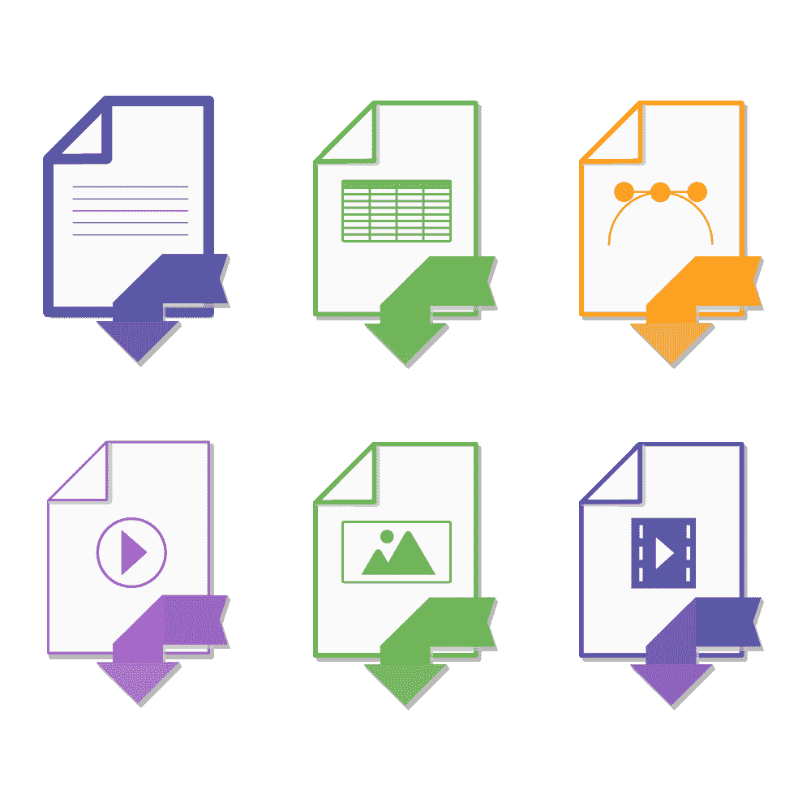
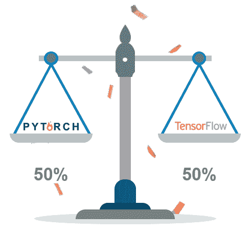
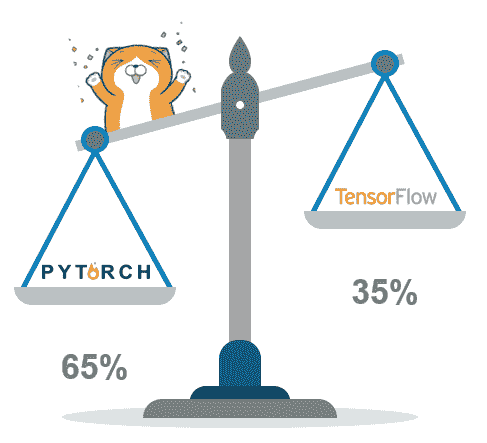

# PyTorch vs TensorFlow:哪个框架更好？

> 原文：<https://www.edureka.co/blog/pytorch-vs-tensorflow/>

这篇关于 **PyTorch v/s TensorFlow** 的对比博客旨在对任何考虑开始一个**新项目**，从一个深度学习框架**切换**或**学习**前 2 个框架的人有用！ 在设置**深度学习**栈的训练和部署的组件时，重点基本上是**可编程性**和**灵活性**。

让我们看看我们将用于**比较** : 的**因素**

想考取深度学习工程师认证？ [<button>学现</button>](https://www.edureka.co/ai-deep-learning-with-tensorflow)

**那么让战斗开始吧！【T2**

我将通过比较两个框架的加速时间来开始这篇 PyTorch vs TensorFlow 的博客。

## **升温时间:**

 PyTorch 基本上是**开发的 NumPy** ，具有利用**显卡**的能力。

由于像**一样简单的东西在 NumPy** 是先决条件，这使得 PyTorch **非常容易**学习和掌握。

用 **Tensorflow** ，主要的事情大家都知道是先**编译**，然后我们有**实际**图形输出。

那么，这里的**动力**在哪里呢？另外， **TensorFlow** 具有依赖关系，其中编译后的代码是**使用 **TensorFlow** **执行引擎**运行**。嗯，对我来说，**依赖性越少**总体来说越好。

回到 **PyTorch** ，众所周知，代码以**闪电般的速度**执行，结果是**总体上非常高效**，这里**不需要**额外的概念来学习。

对于 **TensorFlow，**我们需要变量范围、占位符和会话等概念。这也导致**更多的样板代码**，我敢肯定**没有一个程序员喜欢这些。**

***所以在我看来，PyTorch 赢了这一场！***

## **图形构建与调试:**

从 **PyTorch** 开始，明确的**优势**就是整个创图过程的**动态性**。

图表可以通过**解释**对应于**图表**特定方面的**代码**的行来构建。

这是**完全基于**运行时**构建的**，我非常喜欢这一点。

使用 **TensorFlow** ，**构造是静态的**，图形需要经过**编译**，然后在我之前提到的**执行引擎**上运行。

因为可以使用 **pdb** ，PyTorch 代码让我们的生活变得更加容易。同样，通过使用**标准 python 调试器**，我们将**而不是**要求**学习**使用从**开始的另一个调试器**。

好了**张量流**，你需要在**上多花一点力气**。有两个选项可以调试:

*   你将需要**学习**这个 **TF 调试器。**
*   **请求**从**会话**中你要检查的**变量**。

***嗯，PyTorch 也赢了这一场！***

## **覆盖:**

嗯某些操作如:

1。**翻转**一个张量沿着一个**维度**

2。**C**T3 一张张量为 **NaN** 和**无穷大**

3。快速**傅立叶**变换支持

由 **TensorFlow** 原生支持。

我们还有 **contrib** 包，我们可以用它来创建**更多的** **型号**。

这允许支持更高级功能的**使用，并给你一个**选项**的大范围使用。**

与 **PyTorch** 合作得很好，到目前为止它已经实现了**更少的功能**，但是我确信**的差距将很快被弥合**，因为 **PyTorch** 吸引了所有的注意力。

然而在**自由职业者**和学习者中**不如 **TensorFlow** 受欢迎。嗯，这是**主观的**但这就是它是什么家伙！**

***TensorFlow 这一轮把它钉死了！***

## **连载** :

嗯，**毫不奇怪**用**和**两个框架保存和**加载**模型是相当简单的。

**PyTorch** 有个**简单的** API。API 既可以保存一个模型的所有权重，也可以保存整个类的权重。

然而， **TensorFlow** 的主要**优势**是**整个图形**可以保存为**协议缓冲区**，是的，这也包括**参数**和**操作**。

然后可以基于**需求**以其他支持的**语言**如 **C++或 Java** 加载**图形。**

这对于**部署栈**来说至关重要，其中 **Python** 是**而不是**一个**选项**。当您更改**模型源代码**但希望能够**运行旧模型**时，这也很有用。

***好得一清二楚，张量流得了这一套！***

## **部署** :

对于**小规模的**服务器端部署**两个**框架都很容易包装在例如 Flask web 服务器中。

对于**移动**和**嵌入式部署来说，** **TensorFlow** 确实很好用。这超过了大多数其他深度学习框架，包括 **PyTorch** 。

部署到 **Android** 或 **iOS** 确实需要**tensor flow 中的**大量工作。

你**不**必须**用 **Java 或 C++** 重写**你的模型的整个推理部分。

除了**性能**之外， **TensorFlow** **服务**的一个显著特点是，可以轻松**热插拔****而不会**导致服务宕机。

***我想这一轮我也要给 TensorFlow！***

## **文档:**

嗯，不用说，我已经在两个框架的官方文档中找到了我需要的一切。

**Python API**是**有据可查的**，并且有足够的**示例**和**教程**来学习任一框架。

但是有一件小事引起了我的注意，那就是 **PyTorch C 库**大部分是**未注册的**。

然而，当编写一个**自定义 C 扩展**时，也许如果**对整个**软件**有贡献**，这只**有影响**。

***总而言之，我可以说我们这些家伙在这里打了个平手！***

然而，如果你认为你倾向于某件事，请到评论区发表你的观点。**我们在那里交战吧！**

## **设备管理** :

**TensorFlow** 中的 设备管理是一件**轻而易举的事情**——你**不需要指定**任何东西，因为**默认值**已经设置好了。

例如， **TensorFlow** 自动假设你想要**在 GPU 上运行，**如果有可用的话。

在 **PyTorch，**中，你必须**明确地将**的所有东西移动到设备**上，即使启用了 CUDA。**

使用 **TensorFlow** 设备管理的**的唯一缺点是，默认情况下，它**会消耗所有可用 GPU 上的所有内存**，即使只有一个**正在使用，也会消耗**。**

通过 **PyTorch** ，我发现**代码**需要更多**频繁检查**CUDA 可用性**和更明确的设备管理。尤其是当**编写的代码**应该能够在**上运行**CPU**和 **GPU** 时。

***tensor flow 在这里轻松取胜！***

## **自定义扩展:**

继续，最后但同样重要的是，我为你们挑选了**定制扩展**。

**构建或绑定用 **C、C++或 CUDA** 编写的自定义扩展**对于**和**两种框架都是可行的。

**TensorFlow** 需要**更多的样板代码**尽管可以说**清理器**支持多种**类型**和**设备**。

然而在 **PyTorch** 中，你只需**为每个 **CPU** 和 **GPU** 版本编写一个接口**和相应的**实现**。

**编译**扩展也是**直截了当**与框架和**都不需要**下载除了 **pip 安装**之外的任何头文件或源代码。

***而 PyTorch 在这方面占了上风！***

## **结论:**

好吧，乐观点说，我会说 **PyTorch** 和 **TensorFlow** 是相似的，我会打成平手。

但是，在我个人看来，我会**更喜欢 PyTorch** 而不是 **TensorFlow** (比例为 **65%** 比 **35%** )

不过，这个**并没有** PyTorch 好！

在一天结束的时候，它归结为你想用什么来编码和你的**组织需要什么**！

我在**家里**用 **PyTorch** ，在**工作**用 **TensorFlow** ！

| **比较因素** | **张量流** | **py torch** |
| 上升时间 |  | ***W*** |
| 图形创建和调试 |  | ***W*** |
| 覆盖率 | ***W*** |  |
| 序列化 | ***W*** |  |
| 部署 | ***W*** |  |
| 文档 | ***平局*** | ***平局*** |
| 设备管理 | ***W*** |  |
| 自定义扩展 |  | ***W*** |

**看看这篇关于[人工智能与深度学习](https://www.edureka.co/blog/deep-learning-tutorial)的有趣博客！**

我个人相信，无论是 **TensorFlow** 还是 **PyTorch** 都将**彻底改变**深度学习**的各个方面，从**虚拟辅助**一直到**带着你**逛城。这对深度学习和所有的用户都有很大的影响！**

我希望你喜欢我在 **PyTorch v/s Tensorflow** 上的对比博客。如果你有任何**问题**，请在评论区提出来，我会尽快回复你们！

看完这篇关于 PyTorch vs TensorFlow 的博客后，我很确定你想了解更多关于 PyTorch 的事情，很快我将推出一个关于 PyTorch 的博客系列。想了解更多关于 TensorFlow 的信息，你可以参考以下博客:

1.  **[什么是深度学习？](https://www.edureka.co/blog/what-is-deep-learning)**
2.  ****
3.  [**张量流教程**](https://www.edureka.co/blog/tensorflow-tutorial/)
4.  [**神经网络教程**](https://www.edureka.co/blog/neural-network-tutorial/)
5.  

## **PyTorch vs TensorFlow:原力跟哪个强？|你该学哪个？|爱德华卡**

[https://www.youtube.com/embed/Mn1AACvK-YI?rel=0&controls=0&showinfo=0](https://www.youtube.com/embed/Mn1AACvK-YI?rel=0&controls=0&showinfo=0)*This Edureka comparison video of “PyTorch vs TensorFlow” provides you with a detailed comparison between the top 2 Python Deep Learning Frameworks.*现在就向专家学习人工智能和深度学习！ [<button>学现</button>](https://www.edureka.co/ai-deep-learning-with-tensorflow)

通过我们的[人工智能课程](https://www.edureka.co/executive-programs/machine-learning-and-ai)，发现你成为人工智能和人工智能专家的全部能力。了解各种人工智能相关技术，如机器学习、深度学习、计算机视觉、自然语言处理、语音识别和强化学习。

看看这个由 Edureka 使用 Python 训练的 [**NLP，将你的人工智能技能提升到下一个水平**](https://www.edureka.co/python-natural-language-processing-course)