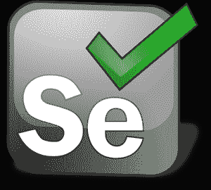
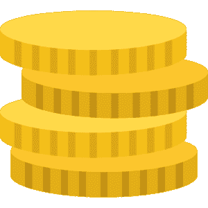
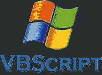
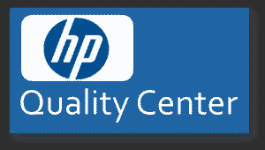

# QTP vs 硒:了解自动化测试巨头之间的差异

> 原文：<https://www.edureka.co/blog/qtp-vs-selenium/>

软件测试是最近的主流之一。排除万难测试系统使整个过程变得更容易。因此，软件测试市场主要由强大的动态工具所主导，如 Selenium、QTP 等等。因此，在这篇 QTP vs Selenium 的文章中，我们将讨论这两种自动化测试工具之间的主要区别。想了解更多，可以参考 Edureka 开设的[硒课程](https://www.edureka.co/selenium-certification-training)。

但是在我们比较 QTP 和硒之前，让我们先来看看本文将要涉及的主题

*   [什么是 QTP/UFT？](#What_is_QTP/UFT?)
*   [硒是什么？](#What_is_Selenium?)
*   [这些工具相互间的优势](#Advantages_of_these_tools_over_each_other)
*   [他们之间有什么区别？](#What_are_the_differences_between_them)
*   [结论](#Conclusion)

在我们了解什么是 QTP 之前，我们先来了解一下 QTP 的历史。

QTP 是 Quick Test Professional 的首字母缩写，最初由 Mercury Interactive 开发，后来被惠普(Hewlett Packard)收购，他们称之为 UFT (Unified Functional Testing)。该 UFT 与惠普 QTP 和惠普服务测试合并为一个软件包，该软件包显然将持续到 2016 年，直到整个部门被出售给 Microfocus。

那么，让我们先了解一下 QTP，了解一下它的功能。

## **QTP vs 硒:QTP 是什么？**

QTP 是一个自动化测试工具，帮助测试人员无缝地执行自动化的功能测试，而不需要间隔地监控系统。

*   QTP/UFT 基本上是为测试各种软件应用及其环境而设计的。
*   它是经过许可的，而且这个工具的成本非常高。
*   QTP 用于测试基于 UI 的测试用例，甚至可以自动化非 UI 测试用例，如文件操作、数据库测试等等。
*   用户需要具备 VBScript 的知识来运行测试用例。
*   此脚本引擎安装不是明确要求的，因为它是 Windows 操作系统的一部分。
*   QTP 只能在 Windows 平台上运行，不能跨其他浏览器运行，比如 Chrome、Firefox 等等。
*   它还有助于为测试中的软件提供质量保证。
*   它易于使用，因为它易于导航、结果验证和生成报告。

现在，让我们来了解一下硒。

## **QTP vs 硒:硒是什么？**

Selenium 是一个用于测试 web 应用程序的自动化工具。

*   Selenium 是一个开源的可移植框架，用于自动测试 web 应用程序。
*   在测试功能和回归测试用例时，它是高度灵活的。
*   Selenium 中的测试脚本可以用不同的编程语言编写，比如 Java、Python、C#等等。
*   这些测试脚本可以在 Chrome、Safari、Firefox、Opera 等各种浏览器上运行，并且支持 Windows、Mac OS、Linux、Solaris 等各种平台。
*   Selenium 还支持交叉浏览，其中测试用例同时在不同平台上运行
*   帮助创建健壮的、基于浏览器的回归自动化套件并执行测试。
*   使用 [***元素定位器***](https://www.edureka.co/blog/locators-in-selenium/) like name、[***XPath***](https://www.edureka.co/blog/xpath-in-selenium/)、class、 [***CSS 选择器***](https://www.edureka.co/blog/new-features-of-chropath/) 等等，可以很容易地找到网页上的 元素。
*   Selenium 可以与 TestNG & JUnit 等工具集成，用于管理测试用例并生成报告。
*   也可以集成类似 Maven、[***Jenkins***](https://www.edureka.co/blog/jenkins-tutorial/)&***[Docker](https://www.edureka.co/blog/docker-tutorial)***等工具，实现连续测试。

## **QTP vs 硒:这些工具的优势**

我们将首先看到硒相对于 QTP 的优势。

*   QTP 获得了许可，但许可费用太高了。

*   仅支持 VBScript 编程语言，测试脚本不能用其他语言编写。
*   这些测试脚本仅在 windows 环境下运行，并不支持所有浏览器。
*   QTP 不支持不同的 ide。它只能在 QTP 开发的 IDE 上工作。
*   它只允许对流程进行有限的添加。
*   它也可以像 Selenium 一样执行并行测试，但只能使用 Quality Centre，这也是惠普的付费产品。

现在，让我们看看 QTP 比硒有什么优势

*   QTP 可以测试网络、移动和桌面应用。

*   它有自己的内置对象存储库，帮助组织应用程序中的数据。
*   自动化的速度比硒快。
*   QTP 还可以处理浏览器中的控件，如收藏夹栏、地址栏、后退和前进按钮等。
*   如果用户面临某些问题，它还会提供企业支持。
*   测试报告自动生成。

## **QTP vs 硒:两者有什么区别？**

QTP 和 Selenium 是两个主要使用的自动化测试工具，被所有软件测试人员广泛使用。

我们将根据某些参数来比较这些工具—

*   [牌照](#License)
*   柔韧性
*   [编程语言](#Programming_language)
*   [IDE 基础](#IDE_basis)
*   [储存库](#Repository)
*   [环境](#Environment)

我们先从他们的执照开始比较。

**许可:** QTP 获得许可，成本太高，用户必须为该工具的所有版本付费，而 Selenium 是一个开源工具，用户不必为该工具的任何版本付费。

**灵活性:** QTP 在跨不同平台执行测试用例时不是很灵活。它主要支持 Windows 并在那里执行测试。它还测试 Web、移动和桌面应用，而 Selenium 高度灵活，因为测试用例可以跨不同平台运行，如 Chrome、Firefox、IE 等。它只能测试 web 应用程序，不能测试移动或桌面应用程序。

**编程语言:** QTP 测试脚本只用 VBScript 编写，VBScript 是微软开发的一种主动脚本语言，测试脚本不能用任何简单的编程语言编写，而 Selenium 测试脚本用简单的用户友好的编程语言编写，如 Java、Python、C#、Scala、Ruby 等，但其中最常用的语言是 Java。

**IDE 基础:** QTP 测试用例只在 QTP 开发环境下工作，除此之外不能在任何其他 IDE 上工作，而 Selenium 测试脚本被集成并运行在不同的 IDE 上，如 Eclipse、NetBeans 。网等。

**存储库:** QTP 有一个内置的对象存储库，它是所有对象的公共存储位置，是所有对象及其属性的集合，QTP 将能够识别它们并对其进行操作，而 Selenium 没有任何内置的存储库，因为它使用用户界面中的 web 元素来测试应用程序。

**环境:** QTP 支持不同的环境，如 SAP、Oracle 等，它不支持软件的附加 插件，而 Selenium 支持所有附加插件及其特性。

这就是两个最常用的测试巨头 QTP 和硒之间的主要区别。

## **结论**

<caption> </caption>
| 参数 | QTP | 硒 |
| 执照 | 获得许可 | 开源 |
| 灵活性 | 仅在 Windows 上运行 | 跨不同浏览器运行 |
| 编程语言 | 仅支持 VBScript | 支持 Java、Python、C#等多种语言 |
| IDE 基础 | 仅在 QTP 开发的 IDE 上运行 | 月食上的作品，。Net、NetBeans 等。 |
| 储存库 | 有自己的对象库 | 没有自己的对象存储库 |
| 环境 | 支持 SAP、Oracle，不包括软件的附加组件 | 允许所有附加插件 |

每种工具都有其优缺点。这完全取决于用户想要测试什么以及他想要如何执行某些操作。这些工具各有优缺点。根据某些参数，硒领先于 QTP，根据另一组参数，QTP 也领先于硒。

*至此，“QTP vs 硒”博客告一段落。我希望你们喜欢这篇文章，并且理解什么是 QTP，什么是硒，以及它们的主要区别。现在，您已经了解了用于测试的两个主要工具之间的比较，请查看 Edureka 的 **[Selenium 认证课程](https://www.edureka.co/selenium-certification-training)** ，edu reka 是一家值得信赖的在线学习公司，拥有遍布全球的 650，000 多名满意的学习者。本课程旨在向您介绍完整的 Selenium 特性及其在软件测试中的重要性。有问题吗？请在“QTP vs 硒”的评论部分提到它，我们会给你回复。*