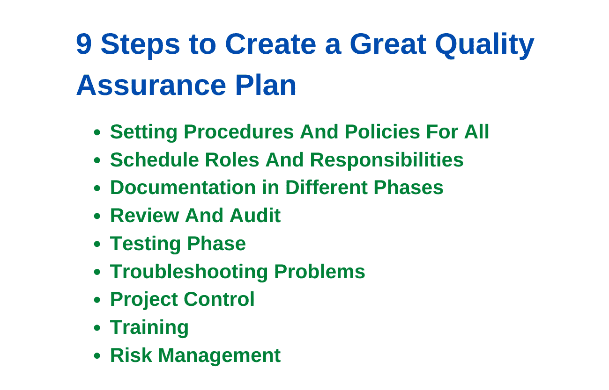
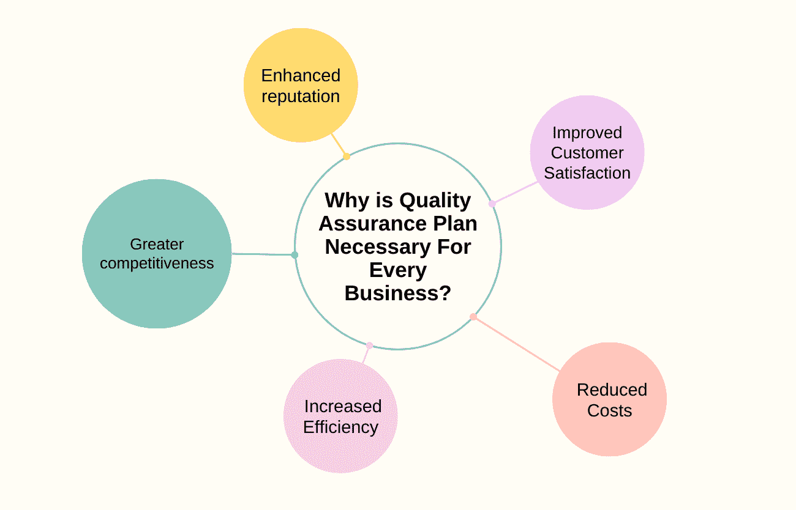

# 什么是质量保证计划？创建伟大计划的 9 个步骤

> 原文：<https://www.edureka.co/blog/quality-assurance-plan/>

质量保证计划更像是一份详细的文件，概述了公司将如何确保其产品或服务的质量。它包括公司必须遵循的所有质量控制程序、政策和标准，以确保其产品或服务满足所有客户要求。创建一个质量保证计划可能看起来令人生畏，但事实并非如此。遵循这 9 个步骤，你可以创建一个伟大的质量保证计划，以帮助您的公司达到其所有的质量目标。

## **定义目标和目的**

创建高效质量保证计划的第一步是定义你的目标。它将帮助您确定如何确保您的产品或服务符合要求的标准。

在定义目标时，有一些重要的事情需要回顾:

*   您客户的需求和期望是什么？
*   你公司的目标是什么？
*   行业标准有哪些？

一旦你回顾了这些因素，你就可以开始设定目标。确保他们(聪明):

*   具体的
*   可测量的
*   可实现的
*   相关
*   有时间限制的

## **创建卓越质量保证计划的 9 个步骤**

## **为所有**设置程序和策略

为所有人制定程序和政策是制定质量保证计划的第一步。通过这样做，您将确保参与项目的每个人都了解对他们的期望，以及他们应该如何去满足这些期望。

在制定程序和政策时，需要考虑各种因素，包括:

*   用什么标准来评估质量？
*   这些标准将如何实施？
*   谁将负责确保达到质量标准？
*   将实施哪些流程来检查是否符合质量标准？
*   如何处理不合规行为？

一旦你为项目的所有方面建立了程序和政策，你就可以为单个任务创建具体的质量保证计划。

## **安排角色和职责**

在制定质量保证计划时，安排角色和职责至关重要。这将确保每个人都知道他们在流程中的角色，并确保任务正确完成。以下是安排角色和职责的一些提示:

*   确定谁将负责每项任务。
*   根据技能和经验委派任务。
*   为每项任务设定最后期限。
*   定期召开会议，检查进展并解决任何问题。

通过安排角色和职责，你可以创建一个平稳有效运行的质量保证计划。

## **不同阶段的文件**

文件是质量保证不可或缺的一部分。它记录了已经完成的工作，可用于帮助跟踪进度和确定需要改进的地方。文档可以分为不同的阶段，每个阶段都有其用途。

文档编制的第一阶段是规划阶段。当项目经理为项目创建一个高层次的计划时。该计划包括总体目标、范围、时间表和预算。这个阶段还包括创建质量保证计划。质量保证计划概述了如何监控项目。

文档的第二阶段是执行阶段。这是项目实际工作进行的时候。在此阶段，创建描述工作如何完成以及完成了什么的文档。这些文档可以帮助评估项目是否达到其目标，并确定任何需要改进的地方。

记录的第三阶段是监控和评估阶段。当质量保证活动被执行以确保项目保持在轨道上并满足其目标时。如果发现了问题，就会记录下来，并采取纠正措施来解决这些问题。

记录的第四个也是最后一个阶段是结束阶段。这是项目完成的时候，所有剩余的工作都被记录下来。结案报告包括项目总结、成功评估以及对未来项目的建议。

**也读:[如何成为一个更好的项目经理？十大技巧](https://www.edureka.co/blog/become-a-better-project-manager)**

## **审查和审计**

质量保证计划中的审查和审计是监控公司交付的产品或服务质量的过程。这可以由员工在内部完成，也可以由独立的第三方组织在外部完成。审查和审计的目的是确保公司符合其质量标准，并持续可靠地交付其产品或服务。

作为质量保证计划的一部分，进行审查和审计有很多好处:

1.  它有助于识别公司可能达不到质量标准的地方。这些信息可以用来改善公司的运营方式。
2.  审查和审计结果可以向管理层提供关于公司质量保证计划运行情况的有价值的反馈。
3.  定期审查和审计有助于建立客户和其他利益相关者对公司提供高质量产品或服务能力的信心。

## **测试阶段**

测试有助于确保产品和系统的设计和制造正确，并满足客户的期望。质量保证计划中的测试阶段是验证产品或系统是否满足设计中规定的要求。

它还包括检查产品或系统是否按预期工作，以及识别任何不符合要求的地方。

这使得企业可以在发布之前进行必要的改进，从长远来看可以节省时间和金钱。执行良好的测试阶段也有助于增强客户对产品或服务的信心。

功能测试关注的是你的软件的具体特性，以及它们工作得有多好。例如，如果你正在开发一个 web 应用程序，功能测试将包括:

*   测试登录功能之类的东西。
*   向购物车添加商品。
*   结帐。

非功能测试评估你的软件在速度、可伸缩性和安全性方面的表现。这种类型的测试对于 web 应用程序非常重要，因为它们需要处理大量的流量和数据。

## **故障排除问题**

没有放之四海而皆准的答案，因为故障排除过程会因您所拥有的具体质量保证计划而异。但是，您可以采取一些常规步骤来解决可能出现的任何问题:

1.  首先，明确问题。这似乎是显而易见的，但是在识别问题时，具体一点是很重要的。到底是什么不起作用？有什么症状？
2.  一旦你发现了问题，试着重现它。这将帮助您缩小问题的潜在原因。
3.  一旦你重现了问题，就开始逐一消除潜在的原因。检查常见问题，如不正确的配置或数据输入错误。
4.  如果你仍然找不到问题的根源，考虑向更有经验的同事或顾问寻求帮助。
5.  最后，一旦你发现并解决了问题，记录下哪里出了问题以及你是如何解决的。下次出现类似问题时，这些信息会非常有价值。

## **项目控制**

质量保证计划中的项目控制是监控和调节项目进度以确保其满足质量要求的过程。它包括建立一个系统来跟踪进展，识别问题和风险，并根据需要采取纠正措施。

项目控制有助于确保项目不偏离轨道并实现其目标。它有助于在早期发现潜在的问题，因此可以在问题造成重大延误或成本超支之前加以解决。它还允许涉众看到项目的进展，以及它是否满足他们的期望。

## **训练**

在制定质量保证计划时，培训是最关键的步骤之一。毕竟，如果你的团队在如何实施和遵循计划方面没有得到足够的培训，它将不会有效。

你的质量保证计划中应该包括两种主要类型的培训:

1.  **初始培训—**这是应该提供给新员工或那些将负责执行质量保证计划的人的培训。它应该包括计划的基本内容以及如何实施。
2.  **持续培训—**初始培训完成后，应根据需要提供持续培训。这可能包括复习课程或关于计划具体方面的更详细的培训。

## **风险管理**

风险管理是任何质量保证计划的重要组成部分。通过尽早识别和评估风险，您可以避免未来的潜在问题。查看一些创建有效风险管理计划的技巧:

1.  识别所有潜在的风险。它包括外部风险和内部风险。考虑你业务的方方面面，从产品开发到市场营销到财务稳定。
2.  评估每个风险的概率和影响。风险发生的可能性有多大？如果真的发生，影响会有多严重？
3.  为每种风险制定缓解策略。一旦你确定并评估了风险，就该制定缓解策略了。这可能包括从改变生产流程到增加营销预算的所有事情。
4.  实施并监控你的风险管理计划。定期监控你的计划，以确保它有效地减少或消除风险。根据需要进行必要的调整。

通过遵循这些步骤，你可以创建一个有效的风险管理计划，帮助你的企业走上成功之路。

## **创建质量保证计划时要记住的事情**

在为项目创建质量保证计划时，有许多方面需要考虑。记住这些要点:

1)预先定义你的目标和成功标准。它将帮助你确定你的计划中需要包括什么，以及如何衡量成功。

制定一份详细的行动计划。包括谁负责每项任务，什么时候需要完成，交付成果是什么。

确保你有足够的资源来执行这个计划。这包括人员、时间和预算。

执行计划并跟踪进度。根据您的目标定期检查结果，并根据需要进行调整。

做好适应的准备。在你的项目过程中，事情不可避免地会发生变化，所以要灵活，并相应地调整你的计划。

**也可理解为:[创建成功上市战略的步骤](https://www.edureka.co/blog/go-to-market-strategy/)**

## 质量保证计划的最佳实践

要创建一个伟大的计划，必须遵循质量保证计划的最佳实践。应遵循四个主要的最佳实践:

*   定义质量保证计划的范围。
*   确定谁负责质量保证流程的每一步。
*   制定可测量的标准，用于评估质量目标是否已经达到。
*   建立监控进度的流程，并根据需要采取纠正措施。

通过遵循这些最佳实践，您可以确保您的质量保证计划是有效的，并帮助您实现您想要的结果。

## 为什么质量保证计划对每个企业都是必要的？

这是一份概述流程和程序的文件，将遵循这些流程和程序以确保符合质量标准。它是任何企业的基本工具，因为它可以帮助提高客户满意度，降低成本，提高效率。

制定质量保证计划有很多好处；下面，我们将更详细地探讨其中的五种。

1.  **提高客户满意度**

拥有质量保证计划的一个重要优势是它可以提高客户满意度。收到符合其期望的产品或服务的客户更有可能对购买感到满意。这可以为你的公司带来更多的生意和积极的口碑营销。

2.  **降低成本**

实施质量保证计划的另一个好处是，它有助于降低与返工或产品缺陷相关的成本。通过确保产品在交付给客户之前符合质量标准，企业可以避免昂贵的事后修复过程。在某些情况下，这也可以减少保修索赔。

3.  **效率提高**

拥有质量保证计划也有助于提高企业运营的效率。当每个人都了解需要遵循的程序，并且有一个简单的流程来衡量质量时，简化操作和消除浪费就变得更加容易。从长远来看，这种提高的效率可以为您的公司节省时间和金钱。

4.  **更强的竞争力**

在今天的市场上，企业需要在质量和价格上竞争。制定质量保证计划可以向潜在客户表明，你对提供高质量的产品和服务是认真的。它可以为您提供竞争优势，帮助您赢得新业务。

5.  **声誉提升**

最后，拥有质量保证计划的另一个好处是，它有助于提高你公司的声誉。当顾客知道你对质量有很高的标准，他们会更容易信任你的品牌。这种增加的信任可以带来更多的业务和进一步的机会。

## **结论**

质量保证是一个帮助确保产品和服务满足顾客或客户要求的过程。通过创建质量保证计划，企业可以制定具体的目标和目的，以满足质量标准。通过遵循这些步骤，您可以确保您的质量保证计划将全面有效地帮助您的企业实现其质量目标。

为了成功管理运营、供应链和项目，了解质量保证和控制流程的工作方式至关重要。我们的[运营、供应链和项目管理高级证书课程](https://www.edureka.co/highered/advanced-program-in-operations-supply-chain-project-management-iitg)可以帮助你获得这些知识。

这门综合课程深入研究运营管理、库存计划、供应链优化、项目管理原则以及质量保证和控制。它还包括一些练习，帮助您在现实世界中应用这些概念。

## **更多信息:**

[运营管理入门指南](https://www.edureka.co/blog/operations-management/)

[供应链管理的主要决策领域](https://www.edureka.co/blog/major-decision-areas-in-supply-chain-management/)

[如何实现最佳职业成长](https://www.edureka.co/blog/professional-growth/)

[品牌管理 v/s 产品管理:了解关键差异](https://www.edureka.co/blog/brand-and-product-management/)