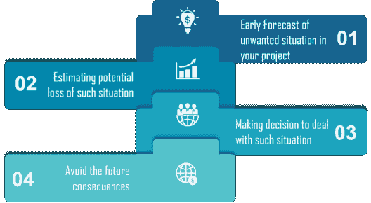

# 什么是软件测试中的风险分析，如何进行风险分析？

> 原文：<https://www.edureka.co/blog/risk-analysis-in-software-testing/>

任何意外事件的概率被定义为风险。在[软件测试](https://www.edureka.co/blog/what-is-software-testing/)中，风险分析是识别您构建的应用程序或软件中的风险并对它们进行优先测试的过程。之后，分配风险级别的过程就完成了。对风险进行分类，从而计算风险的影响。

我们将详细研究这个主题。在此之前，让我向您介绍一下我们的博客议程:

*   [为什么要使用风险分析？](#WhyuseRiskAnalysis?)
*   [风险识别](#RiskIdentification)
*   [风险评估](#RiskAssessment)
*   [风险评估视角](#PerspectiveofRiskAssessment)
*   如何进行风险分析？

我们要开始了！

继续这篇关于软件测试中风险分析的文章。

## **为什么要使用风险分析？**

在任何软件中，在项目开始时使用风险分析会突出潜在的问题领域。了解风险领域后，它有助于开发人员和管理人员减轻风险。当[测试计划](https://www.edureka.co/blog/test-plan-in-software-testing/)被创建时，测试产品所涉及的风险以及它们可能对你的软件和解决方案造成损害的可能性都将被考虑在内。

现在，您可能会想，您可能会遇到哪些风险？这里有一个列表:

1.  新硬件的使用
2.  新技术的使用
3.  使用新的自动化工具
4.  代码序列
5.  应用程序测试资源的可用性

你一定知道有些风险是不可避免的。我列举如下:

1.  您为**测试**分配的**时间**

2.  由于应用程序的复杂性或规模导致的**缺陷泄漏**

3.  **客户**交付项目的紧迫性

4.  不完整的需求

在这种情况下，你必须小心处理。可以注意以下几点:

*   进行**风险评估**审查会议

*   使用**最大资源**在高风险区域工作

*   创建一个**风险评估数据库**以备将来使用

*   识别并注意**风险等级指标**:高、中、低。

那么，这些风险等级指标是什么？嗯，这里有一个解释。

**高:**表示风险的影响非常高且不可容忍。公司可能面临亏损。

**中:**尚可，不可取。公司可能会遭受财务损失，但风险有限。

**低:**尚可忍受。很少或没有外部风险或财务损失。

继续前进！我们的下一个主题如下:

## **风险识别**

风险识别过程中包含不同的风险。这些建议如下:

1.  **商业风险:**这种风险是与我们的主题相关的最常见的风险。是风险可能来自你的公司或者你的客户，而不是来自你的项目。

2.  **测试风险**:你应该非常熟悉你正在工作的平台，以及正在使用的[软件测试工具](https://www.edureka.co/blog/software-testing-tools/)。

3.  **过早发布风险**:分析与发布不令人满意或未经测试的软件相关的风险需要大量的知识

4.  **软件风险**:你应该非常了解与软件开发过程相关的风险。

在确定了与你的软件相关的风险之后，下一步是评估风险；即风险评估。

## **风险评估**

在风险分析过程中，这些步骤被证明是最重要的步骤。据说这一步太复杂了，应该非常小心地处理。风险识别后，评估必须以编程方式进行。风险评估有几种观点。请继续阅读！

继续前进！我们下一个主题是软件测试中的风险分析

## **风险评估的视角**

风险评估有三个角度:

*   影响

*   原因

*   可能性

**效果—**通过效果评估风险。万一你发现一个条件、事件或行动，并试图确定其影响。

**原因—**按原因评估风险与按结果评估风险相反。开始扫描问题，找到问题背后最可能的原因。

**可能性—**通过可能性来评估风险就是说某项需求有可能得不到满足。

现在，向前看，你脑海中盘旋的问题是，我们实际上应该如何执行风险分析？好了，这就是你的解决方案！

## 如何进行风险分析？

有三个步骤:

1.  寻找风险

2.  分析每种单独风险的影响

3.  针对已识别风险的措施

至此，我已经接近了这篇博客的结尾，我希望这篇博客的内容能够为你的 Java 知识增加价值。我们将继续一起探索 Java 世界。敬请期待！

*既然您已经了解了测试，请查看由* *Edureka* *提供的* [***软件测试基础课程***](https://www.edureka.co/software-testing-fundamentals-training) *，这是一家值得信赖的在线学习公司，拥有遍布全球的 250，000 多名满意的学习者。本课程旨在向您介绍完整的软件测试生命周期。您将学习不同级别的测试、测试环境设置、测试用例设计技术、测试数据创建、测试执行、错误报告、DevOps 中的 CI/CD 管道以及软件测试的其他基本概念。* *有问题吗？请在“什么是软件测试”的评论部分提到它，我们会给你回复。*

有问题要问我们吗？请在 *【软件测试】* *博客* *的* *风险分析的评论区提出，我们会尽快回复您。*