# 随处自动化 RPA 随处自动化初学者指南

> 原文：<https://www.edureka.co/blog/rpa-automation-anywhere/>

## **RPA 自动化随处可见:**

自动化自 20 世纪 20 年代就已存在，但直到 20 世纪 90 年代初才开始流行。正如自动化这个词所暗示的，这个软件为各种各样的日常工作提供帮助，例如数据输入、发票处理等。为了完成这类任务，我们需要机器人流程自动化。机器人过程自动化(RPA)是一种新时代的技术，可以帮助您轻松执行繁琐的任务。Automation Anywhere 是 RPA 市场的领导者之一，在这篇 RPA Automation Anywhere 文章中，您将了解流行的 RPA 工具 Automation Anywhere 的所有概念，并了解如何将其用于自动化。

博客将涵盖以下主题:

*   [机器人过程自动化简介](#Introduction%20To%20Robotic%20Process%20Automation)
*   [RPA 工具](#RPA%20Tools)
*   [什么是 RPA 自动化随处可见？](#What%20is%20RPA%20Automation%20Anywhere?)
    *   [自动化随处架构](#Automation%20Anywhere%20Architecture)
    *   [自动化产品随处可见](#Products%20of%20Automation%20Anywhere)
*   [随处安装自动化的步骤](#Steps%20To%20Install%20Automation%20Anywhere)
*   [到处都在使用自动化的行业](#Industries%20using%20Automation%20Anywhere)
*   [RPA 自动化随处可见:案例研究](#RPA%20Automation%20Anywhere:%20Case%20Study)
*   [演示](#Demo)

那么，让我们现在就开始阅读这篇文章。

## **机器人过程自动化简介**

考虑这样一个实例，一名员工的唯一工作就是每天在特定时间向服务器输入详细信息。现在，您认为员工应该手动完成这项任务还是尝试自动完成这项任务？

显然，第二种选择听起来更好，对吗？

因此，通过配置所需的动作，员工可以简单地让机器人为他做这项工作。机器人在没有任何人类干预的情况下完成一系列任务，以帮助人类更好地利用他们的才能的过程被称为机器人过程自动化。

您可以浏览 RPA 视频讲座，我们的 ***[自动化随处培训](https://www.edureka.co/automation-anywhere-certification-training)*** 专家正在讨论每一项&技术的细节。

## **什么是机器人过程自动化(RPA) |爱德华卡**

[https://www.youtube.com/embed/n6nxTBB16ag?rel=0&showinfo=0](https://www.youtube.com/embed/n6nxTBB16ag?rel=0&showinfo=0)

在此视频中，您将了解 RPA 及其领先工具，如 UiPath、BluePrism 和 Automation Anywhere。

Now, when I say robots perform your jobs, they are not actual physical robots performing your jobs, but the various tools present in the RPA Market perform your jobs. These tools offer various products and functionalities to do so. Now, let me quickly brief you on the [market leaders in RPA](https://www.edureka.co/blog/rpa-tools-list-and-comparison/).

## **RPA 工具**

RPA 行业中有各种各样的可用工具，但拥有市场的顶级工具是 UiPath、Blue Prism 和 Automation Anywhere。参考下图。

从上面的趋势可以看出， [UiPath](https://www.edureka.co/blog/uipath-tutorial/) 在三者中脱颖而出。但是，其他工具也足以开始你的职业生涯，因为[蓝棱镜](https://www.edureka.co/blog/rpa-blue-prism/)用于大型企业，Automation Anywhere 提供 30 天免费试用。因此，既然这篇文章是关于任何地方的自动化，让我们向前看，学习这个工具的产品、安装和实际实现。

**了解我们在顶级城市的 RPA 与 UiPath 认证课程**

| 印度 | 美国 | 其他热门城市 |
| [在海得拉巴的卢旺达爱国军训练](https://www.edureka.co/robotic-process-automation-training-hyderabad) | [达拉斯 RPA 球场](https://www.edureka.co/robotic-process-automation-training-dallas) | [德里 RPA 认证](https://www.edureka.co/robotic-process-automation-training-delhi) |
| [在班加罗尔的爱国军训练](https://www.edureka.co/robotic-process-automation-training-bangalore) | [夏洛特的 RPA 球场](https://www.edureka.co/robotic-process-automation-training-charlotte) | [孟买 RPA 认证](https://www.edureka.co/robotic-process-automation-training-mumbai) |
| [钦奈 RPA 认证](https://www.edureka.co/robotic-process-automation-training-chennai) | [纽约 RPA 课程](https://www.edureka.co/robotic-process-automation-training-new-york-city) | [浦那 RPA 认证](https://www.edureka.co/robotic-process-automation-training-pune) |

## **什么是 RPA 自动化随处可见？**

Automation Anywhere 是一个 RPA 工具，其目的是为用户提供可扩展、安全且有弹性的服务。该工具提供 30 天的免费试用，让您首先探索该工具并自动执行任务，然后为您提供企业服务。

Automation Anywhere 提供了更好的性能，因为它能够集成到不同的平台，并且可以同时扩展。该工具旨在用于企业级，主要用于解决复杂性问题。

接下来，在这篇关于 RPA Automation Anywhere 的博客中，让我向您介绍 Automation Anywhere 的架构。

### **自动化随处架构**

任何地方的自动化都遵循分布式架构。通过这种架构，集中管理是通过 Automation Anywhere 的控制室实现的。

该工具的架构主要分为 Bot 创建者和 Bot 运行者。这两个部件都连接到控制室，如下图所示。

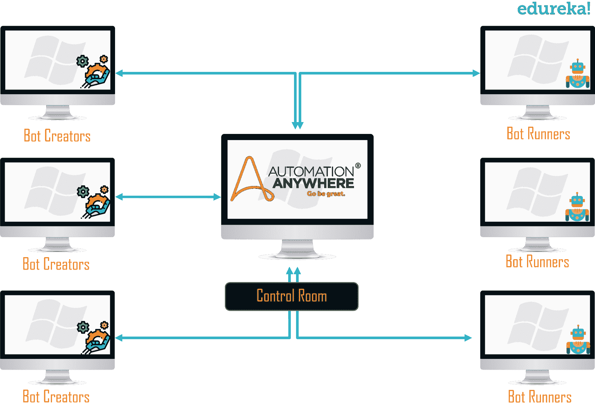那么，让我们一个一个地看看这些组件。

#### **Bot 创造者**

顾名思义，机器人创建者是用来创建机器人的。这些是基于桌面的应用程序，通过主动控制室进行验证，并且只能上传或下载机器人。在配置这些机器人时，对于控制室，多个开发人员可以创建单独的任务/机器人，并可以一次执行所有任务/机器人。

#### **控制室**

控制室是建筑中最重要的组成部分。它是一个 web 服务器，基本上控制着由机器人创建者创建的机器人。由于 Automation Anywhere 侧重于集中管理，控制室提供了集中用户管理、自动化部署、源代码控制等功能，并提供了一个仪表板。

此外，让我告诉你，有两种类型的许可证可在自动化的任何地方。

*   开发许可证:如果你有这个许可证，那么你可以创建、编辑和运行一个机器人。
*   **运行许可证:**如果你有这个许可证，那么你将没有任何编辑权限，但你只能运行一个机器人。

<article class="maincontentblog">

#### **Bot Runners**

机器人运行程序用于执行机器人。多个机器人可以并行执行，不能更新或创建自动化。它们是安装在 windows 机器上的运行时客户端，可以向控制室报告执行日志状态。

所以，如果你把这三个部分总结在一起，那么一旦一个开发者创建了一个任务/机器人，并在控制室进行更新。控制室可以据此基于需求或优先级在机器人运行器上调度和执行这些机器人。

### **自动化产品随处可见**

除了上述三种产品，Automation Anywhere 还提供其他三种产品。参考下文。

*   智商机器人
*   机器人洞察力
*   Bot 农场

让我们逐一了解它们是什么。

#### **智商机器人**

智商机器人或认知机器人像人一样思考，具有自学能力、基于算法的决策和主题专业知识等特征。这些机器人从半结构化和非结构化数据中提取数据，并使用语义模型来这样做。

#### **Bot 洞察**

Bot Insight 是一个用于分析每个机器人性能的工具。有了这个自动化产品，你可以随时随地看到你的业务的统计数据和图表。

**Bot 农场**

Bot Farm 允许您基于按需数字劳动力创建多个 Bot。这也通过 Automation Anywhere Enterprise 提供了机器人流程自动化服务。

所以，人们都在谈论 Automation Anywhere 架构及其提供的产品。现在，在这篇关于 RPA Automation Anywhere 的博客中，让我们开始安装这个工具。

## **随处安装自动化的步骤:**

在任何地方安装自动化主要意味着安装 IQ 机器人和 RPA 企业。因此，一旦你登录获得免费试用，你将不得不安装这两个自动化产品的任何地方。

让我们一步一步地开始。

**第一步:**进入 [Automation Anywhere 官网](https://www.automationanywhere.com/in/lp/free-trial)，获取免费试用下载链接。然后，选择*的选项**开始试用*** 。

**第二步:**一旦点击 ***开始试用*** ，提及下面的详细信息。请参考下面的快照。

**第三步:**一旦你提到了所有的细节，点击**开始试用**选项，然后你会看到一条消息，显示你已经获得了企业 RPA 和 IQ 机器人的单独电子邮件。请参考下面的快照。

**第四步:**现在让我们学习一下如何配置 IQ Bots 和 RPA Enterprise。首先，让我们看看如何配置智商机器人。

### **配置智商机器人**

**第一步:**进入你一定在邮件中收到的 IQ Bot 登录页面。

**第二步:**在下面的邮件中注明你必须拥有的用户名和密码。

第三步:这将让你登录到你的智商机器人，你会看到这个页面。

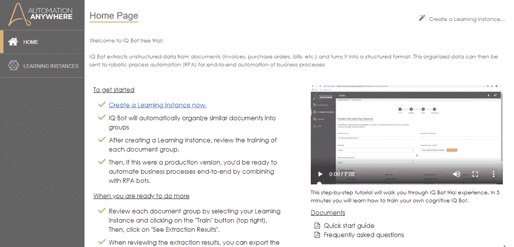现在，让我们看看 RPA Enterprise 的配置。

### **RPA 企业**

**第一步:**打开您收到的 RPA Enterprise 的邮件， ***下载*****将企业客户端文件** 解压到您想要的文件夹。

**第二步:**双击 ***启动客户端Automation _ Anywhere _******Enterprise _ Client _ 11 . 2 . 0 . exe***

**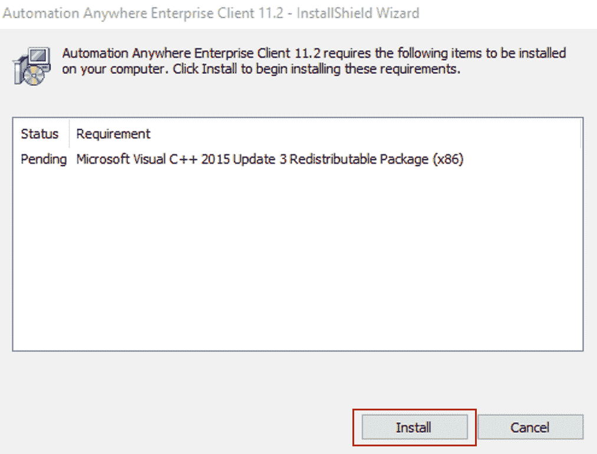第三步:**一旦启动客户端，点击 ***安装*** 。参考下图。

**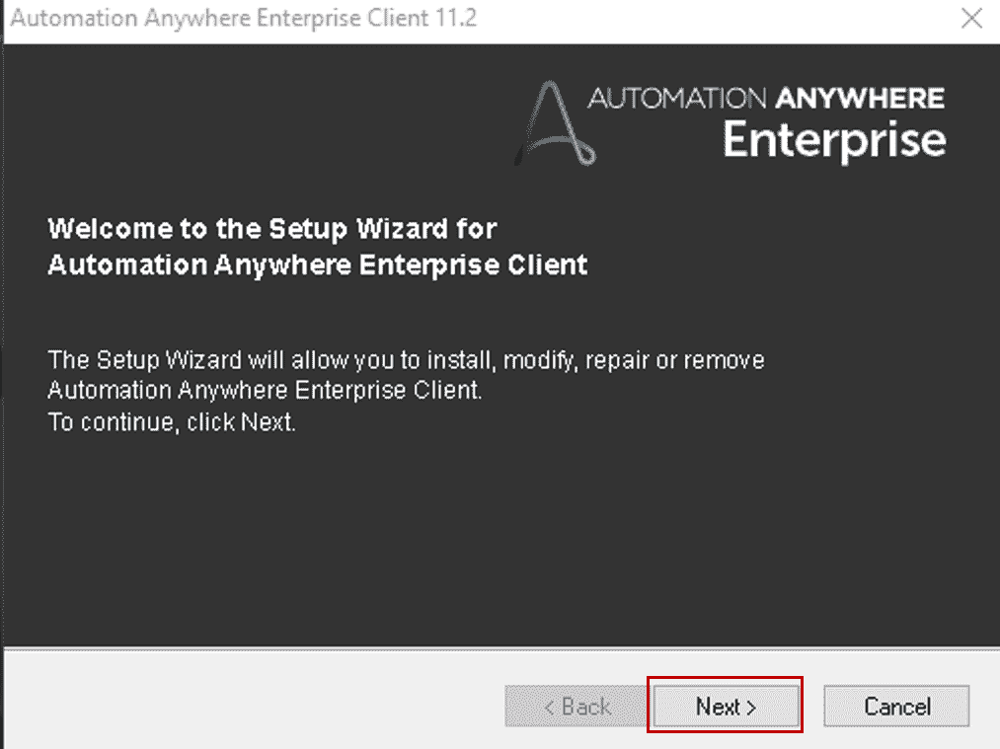第四步:**然后点击 ***下一步*** ，接受许可协议并再次点击 ***下一步*** 。

**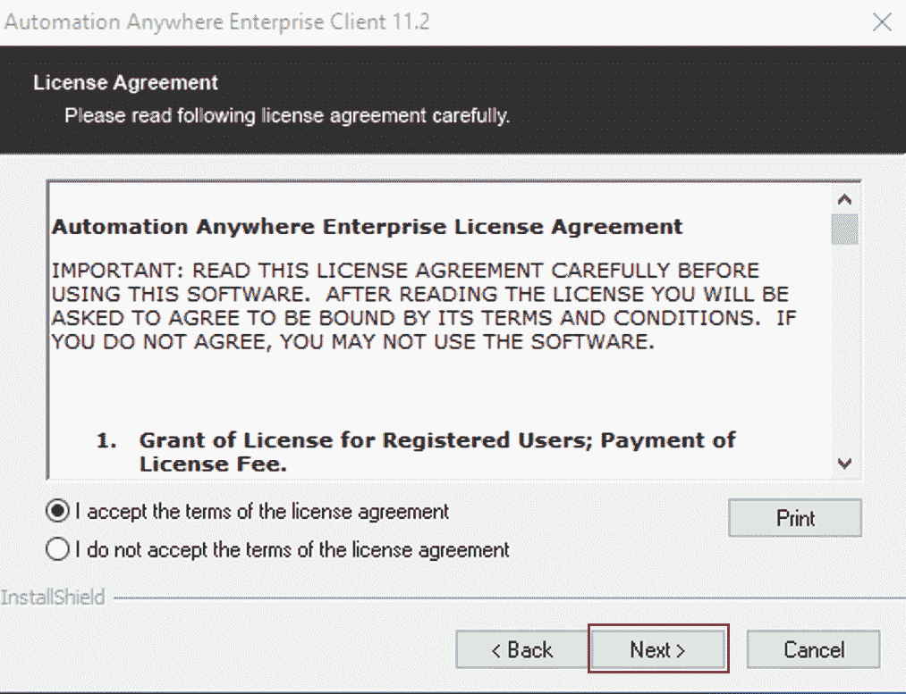第五步:**选择 ***目的文件夹*** ，再次点击 ***下一个*** 。

**第六步:**查看你的安装选择，点击 ***安装*** 。

**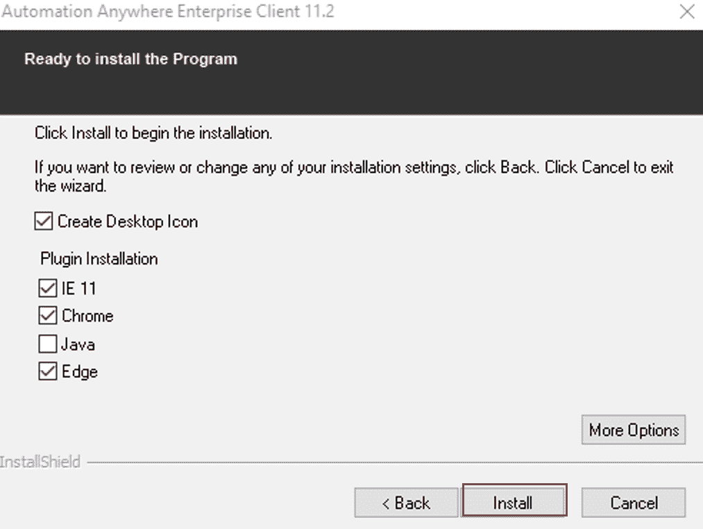第七步:**一旦向导完成，点击 ***完成*** 。

**第 8 步:**点击完成后， ***使用您必须在电子邮件中获得的凭证登录控制室*** 。之后点击 ***登录*** 。

**第九步:**登录后，你会看到下面的对话框，在这里你可以选择 ***自动化*** 或者 ***帮我自动化*** 。选择其中一个选项或简单地**跳过**选项，然后您将被重定向到 *** Automation Anywhere 仪表盘*** 。

**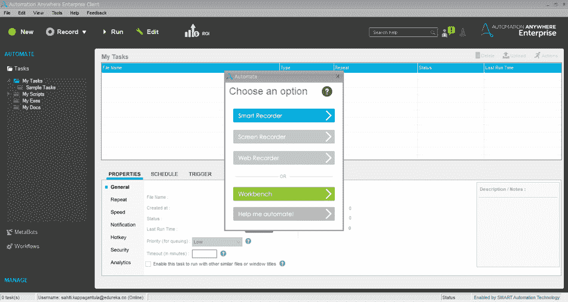第十步:**在上面的快照中，你可以看到一个智能录像机、屏幕录像机、网络录像机的选项。如果你想记录任何动作，你可以开始使用这些记录器。

现在，您已经知道如何在任何地方安装自动化，在这篇关于 RPA Automation Anywhere 的文章的下一篇中，让我来介绍使用该工具的顶级行业。

## 使用自动化的行业随处可见

使用该工具最多的行业如下:

*   **业务流程外包:**该行业使用自动化来降低运营成本，提高运营绩效，并增加劳动力的能力。
*   **电信:**电信行业用于为连接的客户提供支持，提高效率，实现快速增长。
*   **医疗保健:**医疗保健在任何地方使用自动化来有效地与患者互动，降低风险，并分析关键的医疗保健数据。
*   **金融服务:**自动化无处不在有助于金融行业提高效率、减少欺诈和合规。
*   **制造业:**制造业利用自动化来简化供应链管理，降低成本，加速生产。

现在，您已经了解了使用该工具的主要行业，接下来，在这篇关于 RPA Automation Anywhere 的文章中，我将向您展示一个实际的实施，其中一家公司通过使用该工具而受益。

## **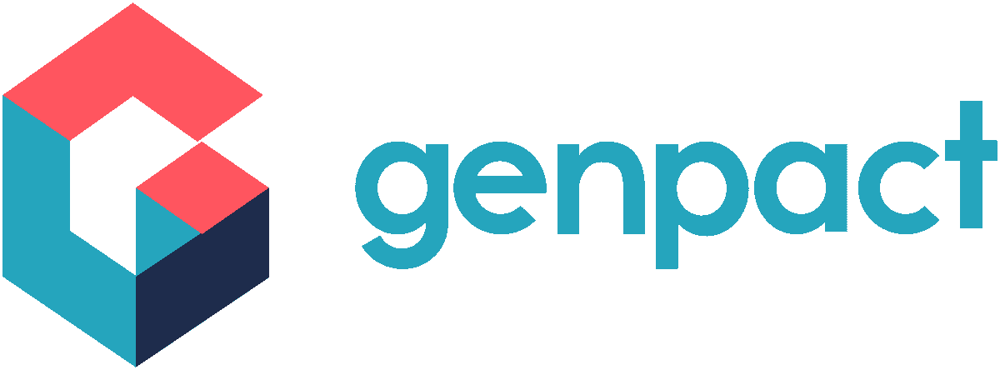 案例分析:Genpact** 

Genpact 是一家服务公司，旨在实现数字化转型。Genpact 的一个客户生产相机、镜头并将其销售给大公司。

### **问题陈述**

Genpact 的客户订单执行程序是一个效率非常低的手动过程，因为人们必须手动查询系统以获得新订单。这造成了相当大的混乱，因为人们必须不断地登录系统。此外，他们必须验证购买的订单，并应用相关的价格和折扣。现在，很明显，这个过程非常繁琐，费时而且容易出错。

为了让他们的业务受益，Genpact 决定将这一过程自动化。

### **解**

Automation Anywhere 和 Genpact 决定使用智能企业流程重新设计上述流程。他们的目标是消除系统中的不准确性、低效率和人为错误。因此，执行团队决定将遗留系统与任何地方的自动化集成在一起，并确保人们关注整个执行过程。自动化流程见下。

#### **为自动化创建的流程**

为自动化创建的流程如下:

*   系统将首先从客户数据库中提取数据，并检查新的采购订单。
*   然后，一旦采购订单被下载，就会立即被推送到遗留系统中。
*   之后，代理会密切关注该过程，并手动验证订单以保持准确性。
*   最后，Automation Anywhere 将采购上传到 Oracle，然后自动应用折扣。
*   代理反复检查完成的订单，并确保质量控制。

### **结果**

由于 Genpact 和 Automation Anywhere 的合作，观察到的结果如下:

*   生产率提高了 40%
*   交易率提高了 25%
*   发生的成本和错误显著减少。
*   减少了 90%的体力劳动者。

所以，伙计们，这就是一家公司通过在任何地方使用自动化而受益的方式。接下来，在这篇关于 RPA Automation Anywhere 的文章中，我将向您展示如何实际使用 Automation Anywhere。

## **演示:从 PDF 文档中提取数据**

在这次实践中，我将向您展示如何从 PDF 文档中读取数据并将数据存储在 Excel 表格中。请按照以下步骤操作。

**步骤 1:** 登录控制室，打开 Automation Anywhere 企业客户端。

**第二步:**现在，点击 ***新建*** 选项，选择 ***工作台*** 。这将把您重定向到该企业的工作台。

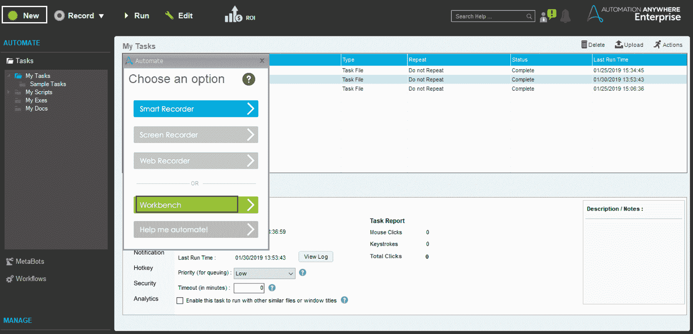

**步骤 3:** 现在选择您要从中提取数据的 PDF，并记下您要提取数据的所有字段。下面的快照显示了我想要从中提取数据的文档。在这里，我想提取日期，发票，客户 ID，到期日，描述，单价，数量，金额，税率，总数。

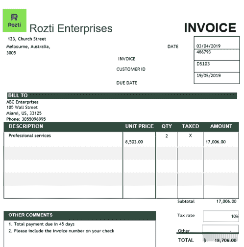

**第四步:**现在，转到工作台右侧的 ***变量管理器*** ，为您想要提取数据的所有字段添加变量。这里你必须创建 10 个变量。让我向您展示如何创建单个变量。参考下文。

**第 4.1 步:**点击添加选项。在打开的对话框中，在 ***名称字段*** 中提及变量的名称，点击 ***保存*** 。

**步骤 4.2:** 重复上述步骤，创建另外 9 个变量。

**第五步:**现在点击左边面板的 ***Excel*** 命令，双击 ***打开电子表格*** 子命令。这将打开一个对话框。

**步骤 5.1:** 现在转到 ***省略号按钮*** 和 ***提到 Excel 文件的路径*** 应该提到提取数据的地方。然后，点击 ***保存*** 。这一步将设计打开 Excel 文件的任务。

步骤 6: 现在，你必须确保你的数据是从 A2 单元格自动填充的。要为这个 ***创建一个动作，双击定位到单元格*** 子命令，在 ***特定单元格区域*** 中输入 A2 。之后点击 ***保存*** 。参考下文。

这一步将设计一个打开电子表格的任务，并将光标放在 A2 单元格上。

**第七步:**现在，你要开始从 PDF 文件中提取数据了。为此，请遵循以下步骤。

**步骤 7.1:** 点击 ***PDF-Integration*** 命令，双击 ***提取表单字段*** 子命令。

**步骤 7.2:** 现在点击省略号按钮，选择您想要从中提取数据的 PDF 文件。

**步骤 7.3:** 之后，从 ***插入字段*** 部分，选择 ***添加*** 选项，并将鼠标拖动到所需字段上。

**步骤 7.4:** 现在，右击选中的字段，选择 ***添加*** 字段。

**步骤 7.5:** 在提取文本窗口中，选择合适的变量名，输入字段名。然后点击 ***确定*** 。

这将为指定的变量和字段名存储提取的数据。

**步骤 7.6:** 对其他 9 个字段/变量重复同样的步骤。

**步骤 7.7:** 最后点击 ***保存*** 。

**第 8 步:**现在，您必须将提取的数据存储在 Excel 文件的各个单元格中。为此，请遵循以下步骤。

**步骤 8.1:** 点击 ***Excel*** 命令，双击 ***设置单元格*** 子命令。

**步骤 8.2:** 在打开的对话框中，转到单元格数值部分， ***按 F2*** ，选择你想选择的变量名。然后点击 ***插入*** 。在这里，我将选择发布日期。

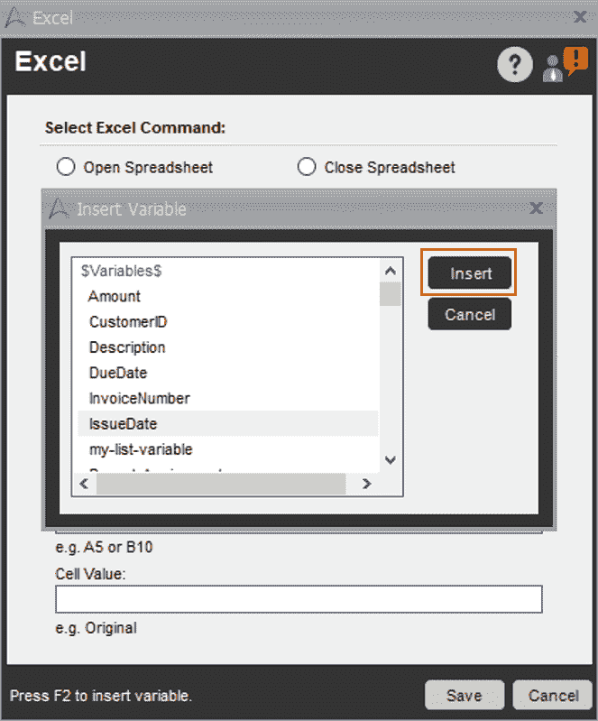

该操作将使您将数据存储在 ***A2 单元格*** 中。现在，下一个提取的数据应该存储在下一个 B2 单元中。为此，双击 ***转到单元格*** 子命令，选择 ***向右一个单元格选项。*** 之后，点击 ***保存。***

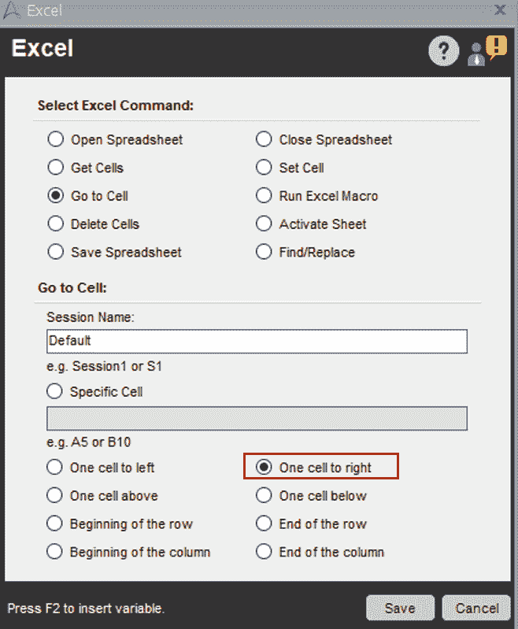

**步骤 8.3:** 现在，要将值插入 B2 单元格，再次双击 ***设置单元格*** 子命令，并按 F2。选择变量名并点击插入。

**步骤 8.4:** 现在，将下一个值插入 C2 单元格。为此，重复上述步骤。

现在，您已经提取了单个 PDF 的数据，如果您希望从各种其他 PDF 提取数据。你必须把数据存储在下一行，对吗？

**步骤 9:** 为此，双击 ***转到单元格*** 子命令，并选择 下一个单元格的 ***。***

**步骤 10:** 要转到起始单元格，即行中的第一个单元格，选择 ***转到单元格*** 子命令，并选择行首。

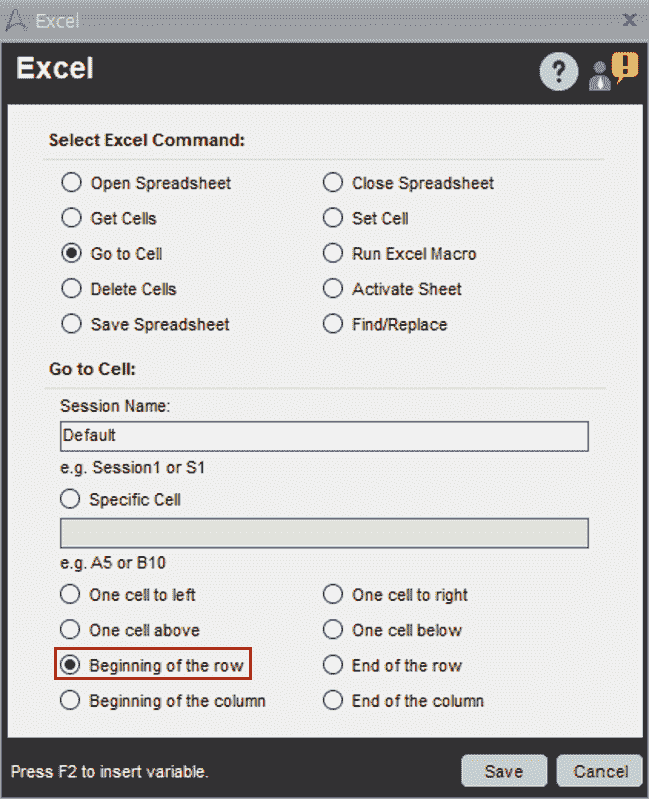 **步骤 11:** 现在，以上所有操作都是从一个 PDF 文件中提取数据。要从多个 PDF 文件中提取数据，请遵循以下步骤。

**步骤 11.1:** 点击任务窗格中的部分动作，然后 ***双击左侧面板中的循环*** 命令。

**步骤 11.2:** 在这里选择双击 ***文件夹中的每个文件*** 命令，从 ***浏览*** 选项中提到包含所有 PDF 文件的文件夹的路径。然后点击 ***保存*** 。

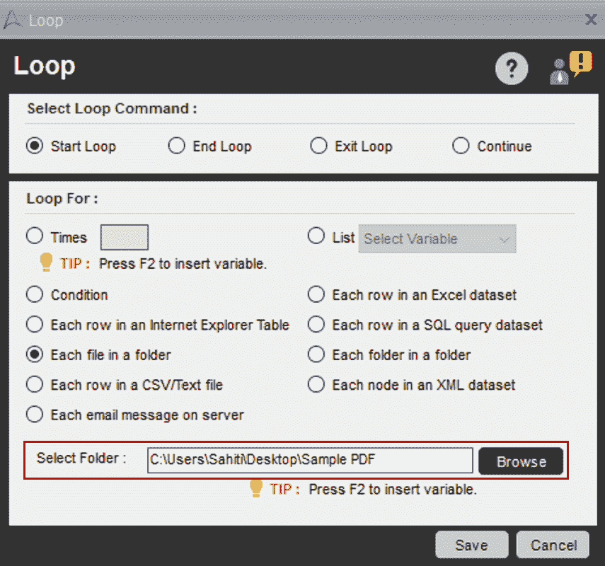

**步骤 11.3:** 将 ***结束循环*** 命令移动到动作列表最后一行的下方。

**步骤 11.4:** 双击 ***PDF Integration*** 命令，在 ***PDF Name 部分插入需要的变量( **$FileName$** )。***

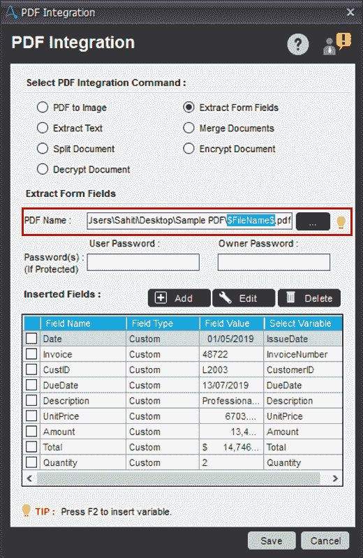

这就是你的最终任务清单的样子。

现在，点击 ***保存*** 按钮，保存您的任务并通过点击 ***运行*** 按钮执行任务。

您会看到下面的输出。

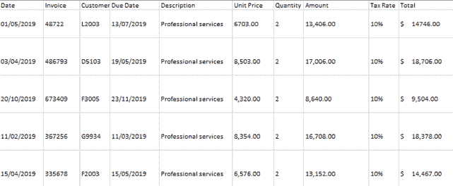

所以伙计们！关于 RPA Automation Anywhere 的博客到此结束。如果您希望作为 RPA 开发人员的职业生涯有一个飞跃，那么开始学习 RPA 及其各种工具。

我们在 edureka，提供面授 ***RPA 使用自动化随处*** 培训 。Edureka 是一家值得信赖的在线学习公司，在全球拥有超过 250，000 名满意的学习者。本培训将帮助您获得 ***机器人过程自动化*** 方面的深入知识以及任何地方的自动化实践经验。

另外，如果你想从事自动化方面的职业？你应该看看我们的 [RPA 开发者课程](https://www.edureka.co/masters-program/rpa-developer-training)硕士项目。 *培训课程包括现场讲师指导培训、行业用例、现场动手项目。这个培训项目将帮助你对 RPA 充满信心，并帮助你得到你一直想要的工作。*

有问题要问我们吗？请在这个**RPA Automation Anywhere**博客的评论部分提出来，我们会给你回复。

</article>

