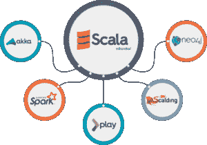
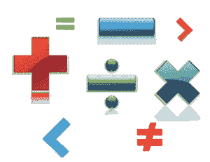
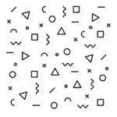

# 2023 年准备的最重要的 Scala 面试问题

> 原文：<https://www.edureka.co/blog/interview-questions/scala-interview-questions/>

[**Scala**](https://www.edureka.co/apache-spark-scala-training?qId=3dd545ff500b1dd4a2cd13d6cc06d14c&index_name=prod_courses&objId=614&objPos=1) ，无与伦比的编程语言，以其非凡的能力轻松处理[大数据](https://www.edureka.co/blog/big-data-tutorial)的**P**etabytes。Scala 正主导着诸如 [Java](https://www.edureka.co/blog/java-tutorial/) 和[Python](https://www.edureka.co/blog/python-tutorial/)这样的成熟语言。这篇 **Scala 面试问题**文章将涵盖能帮你找到工作的关键问题。我把问题排列如下。

*   [Scala 面试题](#begin) : [初级](#begin)
*   [Scala 面试题](#inter) : [中级](#inter)
*   [Scala 面试问题:](#advance) [高级水平](#advance)

## **Scala 面试问题:** **初级**

****

**Q1。什么是 Scala？**

**Ans**:[**Scala**](https://www.edureka.co/blog/what-is-scala/)是一种基于 **Java 的**混合编程语言，融合了**F****functional**和**面向对象**编程语言的特点。它可以把自己和 **Java 虚拟机**集成起来，编译写出来的代码。

**Q2。解释 Scala 既是函数式的又是面向对象的编程语言？**

**Ans** : **Scala** 把每一个单值都当做一个**对象**，其中甚至包括**函数。**因此，Scala 融合了**面向对象**和**功能性**编程特性。

**Q3。写几个 Scala 的框架**

**Ans**:Scala 支持的部分**框架**如下:



**Q4。提到 Scala 中变量的类型？它们之间的区别是什么？**

**Ans**:Scala 中的变量主要有两种:

**可变变量**

**不可变变量**


**Q5。解释 Scala 中的流。**

**Ans** :简单来说，我们将 **流**定义为一个**惰性**列表，它只在需要的时候评估元素。这种懒惰的计算提高了程序的性能。

**Q6。提及 Scala** 的优势

**Ans**:Scala 的一些主要优势如下:

**Q7。解释 Scala** 中的运算符

**Ans** :以下是 Scala 中的运算符:

****

**Q8。Scala 中什么是递归尾？**

**Ans**:’**递归**是一个调用自身的函数。例如，函数 A 调用函数 B，B 调用函数 C。这是在**功能** **编程**中经常使用的技术。为了进行尾部递归，对函数的回调必须是最后执行的函数。

**Q9。解释一下 Scala 中元组的用法？**

**Ans**:**Scala****tuple**将**有限**个条目组合在一起，这样程序员就可以**将一个 tuple 作为一个整体**传递给**。**与**数组**或**列表不同，**元组**是不可变的**，可以保存不同**数据类型的对象。**

**Q10。类和对象有什么不同？**

**Ans** : **类**组合了**数据**及其**方法**，而**对象**是类中一个特定的**实例**。

就这样，我们完成了**初级** **级**的一些问题。现在，让我们转到下一个级别的面试问题，这恰好是的 **Scala 中级** **级别** **面试** **问题**。

你甚至可以通过印度 [数据工程认证](https://www.edureka.co/microsoft-azure-data-engineering-certification-course-india) 查看大数据的细节。

## **Scala 面试问题:** **中级**

## ****

**Q11。Scala 中为什么需要 App？**

**Ans: App** 是一个助手类，它将**主** **方法**及其**成员**保存在一起。App trait 可用于快速将**对象**转化为**可执行程序**。我们可以让我们的类**扩展**应用程序来呈现可执行代码。

```
object Edureka extends App{
     println("Hello World")
   }

```

**Q12。什么是高阶函数？**

**答:****高阶**函数是至少执行以下操作之一的函数:将一个或多个**函数**作为**自变量，**返回一个**函数**作为其**结果**。

**Q13。解释 Scala 中为变量提供的范围。**

**答:** 根据用途不同有**三种**不同的范围。即:

**字段:**

**方法参数:**

**局部变量:**

**Q14。什么是终结？**

**Ans:闭包**被认为是一个**函数**，它的返回值**依赖于闭包**函数外声明的一个或多个**变量**的值。****

示例:

```
val multiplier = (i:Int) => i * 10

```

这里，函数体 i * 10 中使用的唯一变量是 I，它被定义为函数的参数

**Q15。解释 Scala 中的特征。**

**Ans:** 一个 **Trait** 可以定义为一个**单元**，其中**封装了****方法**及其**变量**或**字段。下面的例子将帮助我们更好地理解。**

```
trait Printable{
   def print()
}
class A4 extends Printable{
   def print(){
      println("Hello")
  }
}
object MainObject{
   def main(args:Array[String]){
      var a = new A4()
      a.print()
  }
}

```

**Q16。提及 Scala 与 Java 的不同**

**Ans:**Scala 与 **Java** 不同的几个场景如下:

**Q17。解释扩展关键字**

**答:**你可以**扩展**一个基本 **Scala** 类，你可以设计一个**继承的**类，就像你在 **Java** 中使用**扩展**关键字一样，但是有两个**限制:**方法**覆盖**需要覆盖**关键字**，并且只有 P **主构造函数**可以通过让我们通过下面的例子来理解

```
println("How to extend abstract class Parent and define a sub-class of Parent called Child")
  class Child=(name:String)extends Parent(name){
     override def printName:Unit= println(name)
  }
 object Child {
  def apply(name:String):Parent={
  new Child(name)
  }
}

```

**Q18。用语法** 解释隐式类:当类在作用域内时，隐式类允许与类的主构造函数进行隐式对话。隐式类是用“Implicit”关键字标记的类。这个特性是在 Scala 2.10 版本中引入的。

```
//Syntax:
  object {
      implicit class Data type) {
          def Unit = xyz
       }
  }

```

**Q19。解释 Scala 中可用的访问修饰符**

**Ans:**Scala 中可用的访问修饰符主要有**三个**。即，

**私人:**

下面的程序将详细解释这一点。

```
class Outer {
   class Inner {
      private def f() { println("f") }
       class InnerMost {
         f() // OK
      }
   }
   (new Inner).f() // Error: f is not accessible
}

```

**被保护:**

下面的节目 将对此进行详细解释。

```
package p 
  class Super {
      protected def f() { println("f") }
   }
  class Sub extends Super {
      f()
   }
  class Other {
      (new Super).f() // Error: f is not accessible
   }
}

```

**公共:**

下面是解释**公共**成员的示例代码片段

```
class Outer {
   class Inner {
      def f() { println("f") }
       class InnerMost {
         f() // OK
      }
   }
   (new Inner).f() // OK because now f() is public
}

```

**Q20。什么是标量中的单子？**

**Ans:** 一个**单子**是一个包裹另一个物体的物体。你通过**单子**小程序，即函数，来执行底层对象的数据操作，而不是**直接操作**对象**。** **单子**选择如何将程序应用到**底层对象。**

****

**Q21。解释 Scala 匿名函数。**

**Ans:** 在**源代码中，匿名的**函数被称为“**函数字面量”**，在运行时，函数字面量被实例化成称为**函数值的对象。** **Scala** 为定义**匿名函数提供了相对简单的**语法**。**

```

//Syntax
(z:Int, y:Int)=> z*y
Or
(_:Int)*(_Int)

```

**Q22。如何在列表中追加数据？**

**Ans:**Scala 中的****要追加到列表中，我们有以下**方法:**

```
use “:+” single value
var myList = List.empty[String]
myList :+= "a"

```

**Q23。为什么 Scala 更喜欢不变性？**

**Ans: Scala** 在设计上更喜欢**不变性**，在很多情况下将其作为**默认。不变性**在处理**相等**问题或**并发**程序时会有所帮助。

****

**Q24。举一些 Scala** 中的包的例子

**Ans:****Scala**中的三个重要和**默认** **包**如下:

*   **爪哇** 。 **朗。_:**Java。 **朗。_** 包在 **Java** 里。提供了设计 Java 编程语言的基础类。
*   **Java . io . _:****Java . io . _**用于导入 Scala 中每个类的包，用于输入输出资源。
*   **预定义** : **预定义** 为常用的类型提供了类型别名，如不可变集合类型 Map、Set、列表构造函数

**Q25。Scala 中为什么要使用选项？**

**Ans:Scala 中的选项**用于**包装**缺少的**值**。

**Q26。提到 Scala 中的标识符。**

**Ans:** 有**四种**类型的 **Scala** 标识符:

```

//Scala program to demonstrate Identifiers in Scala.
object Main
{
//Main method
      def main(args: Array[String])
     { 
          //Valid Identifiers
         var 'name = "Hari"'
         var age = 20;
         var Branch = "Computer Science"
         println()
         println()
         println()
      }
}

```

**Q27。如何在 Scala 中定义一个函数？**

**Ans: def** 关键字用于**定义 **Scala 中**的**函数**。**

```
object add {
   def addInt( a:Int, b:Int ) : Int = {
      var sum:Int = 0
      sum = a + b
      return sum
   }
}

```

**Q28。Scala 代码是如何编译的？**

**Ans:代码**写在 **Scala IDE** 或 **Scala REPL 中，**之后，代码转换成**字节** **代码**并转移到 **JVM** 或 **Java 虚拟机**中进行编译。

****

**Q29。解释 Yield 的功能。**

**Ans:Yield**is used 用一个**循环，Yield** 为每次迭代产生一个**值**。另一种方法是使用 **map/flatMap** 和**滤镜**配合**游牧民。**

```
for (i <- 1 to 5) yield i

```

**Q30。区分空、零、无和无**

**Ans:** 他们看起来相似但**不同**他们的**行为:**

| **Null** | 无 | **无** | **没事** |
| **Null** 代表**缺席** 的一个值。 | **零**表示 **结束**一列 | **无**是一个**没有值**的期权的值。 | **虚无**是**类型系统中最低的**类型。 |

**Q31。解释 If-Else-If 术语**

**Ans: If-Else-If** 语句执行**三个**语句中的**一个**。

**举例:**

```
object Demo {
   def main(args: Array[String]) {
      var x = 30;
      if( x == 10 ){
         println("Value of X is 10")
      } else if( x == 20 ){
         println("Value of X is 20");
      } else if( x == 30 ){
         println("Value of X is 30");
      } else{
         println("This is else statement");
      }
   }
}

```

**Q32。描述 Scala 中的循环。**

**Ans:**Scala 中主要有**三种**类型的**循环**。

你甚至可以通过 [数据工程师课程](https://www.edureka.co/microsoft-azure-data-engineering-certification-course) 了解大数据的细节。

**Q33。生成无限循环**

**Ans:** 一个循环变成一个**无限循环**如果一个**条件**永远不会变成**假。**如果你使用的是 **Scala，**while**循环是实现无限循环的最佳方式。**

下面的程序实现了一个无限循环。

```
object Demo {
   def main(args: Array[String]) {
      var a = 10;
       //An infinite loop.
      while( true ){
         println( "Value of a: " + a );
      }
   }
}

```


**Q34。Scala 中函数声明的语法是什么？**

**Ans:** 函数声明的**语法**如下:

```
def functionName ([list of parameters]) : [return type] = {
   function body
   return [expression]
}

```

这里，**返回**类型是任何有效的 **Scala 数据类型**，我们用**逗号**分隔参数列表，参数列表和**返回** **类型**是可选的。与 **Java 非常相似，**我们使用一个 return 语句和一个**表达式**，以防函数返回一个**值。**

**Q35。我如何连接两个字符串？**

**Ans:** 有**三个**方法来执行 **Scala** 中的**字符串串联**

```
string1.concat(string2);
"My name is ".concat("Zara");
"Hello," + " world" + "!"

```

**Q36。解释任意五个字符串方法。**

**Ans:** 以下是 Scala 中的几个字符串方法。

**Q37。解释如何创建数组**

**Ans** :我们使用以下方法在 Scala 中创建数组:

```
var myMatrix = ofDim[Int](3,3)

```

```
range (10, 20, 2)

```

****

**Q38。Scala 中的 Map 是什么？**

**Ans** : **Map** 是**键/值**对的集合。Scala r **基于其**键获取**值**。

```
val colors = Map("red" -> "#FF0000", "azure" -> "#F0FFFF")

```

**Q39。解释 Scala 中的异常处理**

**Ans** : **抛出异常:** 抛出异常看起来和 Java 里一样。创建一个异常对象，然后用 throw 关键字抛出它，如下所示。

**Scala** 允许你**在单个块中尝试/捕捉**任何**异常**，然后使用 case 块对其执行模式匹配。尝试下面的示例程序来处理**异常。**

举例:

```
import java.io.FileReader
import java.io.FileNotFoundException
import java.io.IOException
object Demo {
   def main(args: Array[String]) {
      try {
         val f = new FileReader("input.txt")
      } catch {
         case ex: FileNotFoundException ={
            println("Missing file exception")
         }  
         case ex: IOException = {
            println("IO Exception")
         }
      }
   }
}

```

于是，就这样，我们完成了**中级**上的几道题。现在，让我们进入下一阶段的面试问题，这恰好是**高级** **水平** **面试** **问题**。

## **Scala 面试问题:** **高级水平**

****

**Q40。通过一个例子**解释 Scala 中的模式匹配

**年** : 

一个**模式匹配**包括一系列选择，每个选择都以**关键字**案例开始。每个选项都包括一个**模式**和一个或多个**表达式，** Scala 会在模式匹配时进行计算，一个**箭头符号** **= >** 将模式与表达式分开。

试试下面的示例程序，它展示了如何匹配一个**整数**值。

```
object Demo {
   def main(args: Array[String]) {
      println(matchTest(3))
   } 
   def matchTest(x: Int): String = x match {
      case 1 = "one"
      case 2 = "two"
      case _ = "other"
   }
}

```

**Q41。解释 Scala 中的提取器**

**Ans**:Scala 中的**提取器**是一个对象，它有一个名为**的方法作为其成员之一。**未应用**方法的目的是匹配**值**并将其拆开。**

**Q42。** **x+y** ***z 的结果是什么，为什么？**

与任何其他编程语言相似，Scala 也遵循**总统**和**优先级**表。根据表格，Scala 执行如下操作。

**Q43。什么是辅助构造函数**

**Ans:** 我们在 Scala 中使用**辅助构造函数**进行构造函数重载。辅助构造函数必须在其主体的第一行调用先前**定义的**辅助构造函数或者**主** **构造函数**。

**Q44。通过程序解释递归**

年:

```
def factorial_loop(i: BigInt): BigInt = {
  var result = BigInt(1)
 for (j- 2 to i.intValue)
  result *= j
  result
}
for (i - 1 to 10)
  format("%s: %sn", i, factorial_loop(i))

```

**Q45。举例解释 Que**

**Ans** : **队列**是与**栈**类似的**数据结构**，只是它遵循**先进先出**的程序进行数据处理。在 **Scala 中，**要处理队列，需要导入一个名为**的库**，

**导入 Scala . collection . mutable . queue**

```
import scala.collection.mutable.Queue
val empty = new Queue[Int]

```

就这样，我们结束了这篇 **Scala 面试问题**的文章。我希望我们对你关于 **Scala** 、其**特性**以及可以使用 **Scala** 执行的各种类型的**操作**的知识有所启发。

*本文基于* [**Apache Spark 和 Scala 认证培训**](https://www.edureka.co/apache-spark-scala-training?qId=82d084ab436ef95fb7cd26f129d2dc86&index_name=prod_search_results_courses&objId=614&objPos=2) *旨在为您准备 Cloudera Hadoop 和 Spark 开发者认证考试(CCA175)。您将深入了解 Apache Spark 和 Spark 生态系统，包括 Spark 数据帧、Spark SQL、Spark MLlib 和 Spark 流。您将获得关于 Scala 编程语言、HDFS、Sqoop、Flume、Spark GraphX 和 Kafka 等消息系统的全面知识。*