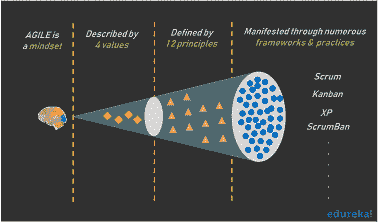
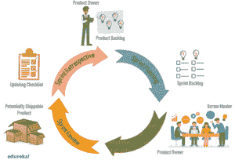

# Scrum vs 敏捷:区别在哪里？

> 原文：<https://www.edureka.co/blog/scrum-vs-agile/>

敏捷和 [Scrum](https://www.edureka.co/blog/what-is-scrum/) 是最近几年非常流行的两个术语，理由很多。总之，它们使项目的开发和管理变得精简、系统化、更快、更具成本效益。有时候敏捷和 Scrum 这两个术语可以互换使用，这让你怀疑它们是不是同一个东西。是吗？让我们来看看这篇“Scrum vs Agile”的文章。

下面列出了本文中讨论的主题:

*   敏捷和 Scrum 是一样的吗？
*   [什么是敏捷？](#Agile)
*   什么是 Scrum？
*   [敏捷& Scrum](#KeyDifferences) 的主要区别

开始了。

## 敏捷和 Scrum:它们是一样的吗？

开发一款新产品并不是一件容易的事情，要让它在这个竞争激烈的市场大受欢迎就更具挑战性了。在众多可用的工具和技术中，很难决定哪些适合您的产品。在那方面 ***敏捷*** 和 ***scrum*** 通常名列前茅。这些流行语似乎可以互换使用，但它们之间有一个重要的区别。

一个很好的类比就是食谱和饮食的区别。饮食是一套基于你遵循的原则和价值观的方法和实践。食谱是一个框架，你可以用它来实现你的素食。这类似于 ***【敏捷(节食)******Scrum(你遵循的食谱)**的关系。*如果非要用专业术语来说的话:

*   敏捷是一套基于**敏捷宣言**中表达的价值观和原则的方法和实践，包括团队的协作、自组织和交叉功能。

敏捷有许多形式，这意味着敏捷项目管理哲学有许多子集。Scrum 就是其中之一。

*   Scrum 是一个框架，用于处理[角色](https://www.edureka.co/blog/what-is-scrum/#ScrumTeam)、[事件](https://www.edureka.co/blog/what-is-scrum/#ScrumEvents)、[工件](https://www.edureka.co/blog/what-is-scrum/#ScrumArtifacts)，以及实现**敏捷思维的规则/指南。**这是一种更加精炼的敏捷形式，它从敏捷中汲取核心原则，同时加入了自己的特色，以形成一种更加与众不同的战略。

所以敏捷和 scrum 终究不是一回事。为了理解 Scrum 方法论，我们应该知道什么是敏捷。让我们从理解敏捷这个行话开始。

## **什么是敏捷？**

***敏捷* *是一种* *的心态，一种哲学，更像是一种思维方式，一种运动* *在开发产品的同时注重沟通、团队思维、内在动力、授权、创新行走、流程和价值创造* *。***

在其核心，敏捷是一套保持软件开发团队有组织和高效的行动原则。敏捷始于 2001 年，一个软件开发团队在犹他州欢聚一堂，进行周末的讨论。他们将自己的观点和原则汇编成一份易于理解和应用的文件。我们称之为 ***敏捷宣言*** 。

所以， ***敏捷*** 更多的是一种哲学和一套要遵循的价值观和原则，而不是一个应用于项目的过程。它有多种形式，scrum 是其中之一。让我们详细探讨一下 scrum。

## 什么是 Scrum？

***Scrum 是一个轻量级的[敏捷框架，](https://www.edureka.co/blog/importance-of-agile-pmi-acp/)人们可以在其中解决复杂的适应性问题，同时富有成效和创造性地交付尽可能高价值的产品。***

在 scrum 流程中，产品负责人创建一个要完成的任务列表，Scrum 团队将列表分成更小的部分，称为 [***冲刺***](https://www.edureka.co/blog/what-is-scrum/#ScrumEvents) 。sprint 通常持续两到四周，并产生可以交付给客户的项目。团队在几次冲刺中重复这个过程。这是一种非常成功且广泛使用的敏捷方法，具有多种优势。

现在你知道敏捷和 scrum 是不一样的，让我们来看看敏捷和 scrum 的主要区别。

## **敏捷和 Scrum 的主要区别**

下表列出了 Scrum 和敏捷的主要区别。

| ***特征*** | ***敏捷*** | ***Scrum*** |
| 性质和范围 | 敏捷是一种心态和一套原则 | Scrum 是一个实现敏捷原则的框架 |
| 规划 | 规划发生在三个层次上:发布规划、迭代规划和日常规划 | 团队完成当前的冲刺活动后，计划下一次冲刺 |
| 适应变化的灵活性 | 敏捷非常灵活，因此能够快速适应变化 | 僵化的框架&没有太多频繁变化的空间 |
| 设计和执行 | 敏捷执行非常简单，通常是以前没有做过的事情 | 致力于尝试新的和创造性的想法，产生简洁和聪明的结果 |
| 监视进程 | 需要详细的跟踪&它发生在整个设计的每个里程碑之后 | 监控发生在某些特征的编译之后，而不是在每个设计之后 |
| 领导作用 | 领导者对团队完成(或未完成)的工作负责 | 没有“团队领导”，相反，它培养了一个多功能和自组织的团队 |
| 交流方式 | 有效的沟通方式是团队内部定期的面对面交流 | 根据时间表，每天/每周进行沟通 |
| 估计时间和交付 | 首要任务是通过提供有价值的软件的持续交付来满足客户 | 在每次冲刺后，向客户交付构建以获得他们的反馈 |
| 客户反馈 | 鼓励业务用户在各种流程中定期反馈 | 定期的反馈来自最终用户，但是以一种更有序的方式，比如在每次冲刺之后 |

这就把我们带到了“Scrum vs Agile”这篇文章的结尾。最后，你可以将 ***敏捷*** 视为一种组织思维模式，将 ***Scrum*** 视为一个团队可以用来实现这种新思维模式并最终取得组织成功的工具和技术。希望你清楚这篇文章中与你分享的所有内容。

在开始使用 Scrum 术语之前，确保你已经精通了它。现在是 ***[获得 Scrum](https://www.edureka.co/certified-scum-master-certification-training) 认证的最佳时机。***

*有问题吗？请在这篇“Scrum vs Agile”**文章的评论部分提到它，我们会尽快回复您。*