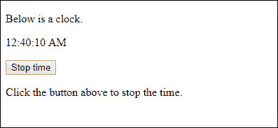

# JavaScript 中的 SetInterval 是什么，它是如何工作的？

> 原文：<https://www.edureka.co/blog/setinterval-in-javascript/>

JavaScript 既可用作客户端编程语言，也可用作服务器端编程语言。It 提供了大量的方法来轻松实现一些功能。这使得 [JavaScript](https://www.edureka.co/blog/what-is-javascript/) 成为最流行的编程语言之一，同时它也被广泛应用于多种产品开发中。JavaScript 中的 SetInterval 是 JavaScript 中定时事件的一部分，我们将按以下顺序学习:

*   [定时事件](#timing)
*   [JavaScript 中的 SetInterval](#set)
*   [如何停止执行？](#stop)

## **定时事件**

JavaScript 还允许执行与时间相关的[函数](https://www.edureka.co/blog/javascript-functions/)和方法，而不是程序的执行时间。这允许在指定时间执行功能，而不管程序的执行时间。

在 JavaScript 中使用计时事件的两个关键方法是:

*   **setTimeout(函数，毫秒)**

该函数在以毫秒为单位的指定时间后只执行一次作为参数传递的函数。

*   **setInterval(函数，毫秒)**

该功能从执行时间开始执行，并在达到每个时间间隔后执行。它在每个时间间隔重复执行该功能。

现在让我们继续，看看 JavaScript 中的 SetInterval 是如何工作的。

## **JavaScript 中的 SetInterval**

该函数的第一个参数是要执行的函数，第二个参数表示每次执行之间的时间间隔。

```
var myVar = setInterval(myTimer, 1000);

function myTimer() {
var d = new Date();
document.getElementById("demo").innerHTML = d.toLocaleTimeString();
}
```

这里，document.getElementById 从 [HTML](https://www.edureka.co/blog/what-is-html/) 中获取元素，其 Id 为“demo ”, d . tolocaletimestring()函数从系统中给出当前时间。

因此，每 1000 毫秒重复一次，相当于 1 秒。因此，该功能每 1 秒重复执行一次，因此时间每秒更新一次。

那么我们如何停止这次处决？让我们来了解一下！

## **如何停止执行？**

在另一个名为 clearInterval()的函数的帮助下，我们可以从函数 setInterval()停止执行。 clearInterval()使用函数 setInterval()返回的变量。

**例如:**

```
myVar = setInterval(function, milliseconds);
clearInterval(myVar);
```

下面是一个使用 setInterval()和 clearInterval()的例子。这将启动一个时钟，并提供一个按钮来停止时间。

```
<!DOCTYPE html>
<html>
<body>
<p>Below is a clock.</p>
<p id="demo"></p>
<button onclick="clearInterval(myVar)">Stop time</button>
<br>
<p>Click the button above to stop the time.</p>
<script>
var myVar = setInterval(myTimer ,1000);
function myTimer() {
var d = new Date();
document.getElementById("demo").innerHTML = d.toLocaleTimeString();
}
</script>
</body>
</html>
```

**输出:**



更多关于 setInterval()和 clearInterval()的例子。

### **创建动态进度条**

```
<!DOCTYPE html>
<html>
<style>
#myProgress {
width: 100%;
height: 30px;
position: relative;
background-color: #ddd;
}

#myBar {
background-color: #4CAF50;
width: 10px;
height: 30px;
position: absolute;
}
</style>
<body>

<h1>JavaScript Progress Bar</h1>

<div id="myProgress">
<div id="myBar"></div>
</div>

<br>
<button onclick="move()">Click Me</button>

<script>
function move() {
var elem = document.getElementById("myBar");
var width = 0;
var id = setInterval(frame, 10);
function frame() {
if (width == 100) {
clearInterval(id);
} else {
width++;
elem.style.width = width + '%';
}
}
}
</script>

</body>
</html>
```

**输出:**

初始输出


点击按钮后输出“点击我”。


### **在两个背景之间切换**

```
<!DOCTYPE html>
<html>
<body>

<button onclick="stopColor()">Stop Toggling</button>

<script>
var myVar = setInterval(setColor, 300);

function setColor() {
var x = document.body;
x.style.backgroundColor = x.style.backgroundColor == "yellow" ? "pink" : "yellow";
}

function stopColor() {
clearInterval(myVar);
}
</script>

</body>
</html>
```

**输出:**


颜色会在黄色和粉色之间切换。上面的输出是点击按钮之前的，下面的是点击按钮之后的。


至此，我们已经结束了 JavaScript 文章中的 SetInterval。我希望您理解 SetInterval 方法是如何工作的。

*查看 Edureka 的 **[Web 开发认证培训](https://www.edureka.co/complete-web-developer)** 。* *Web 开发认证培训将帮助您学习如何使用 HTML5、CSS3、Twitter Bootstrap 3、jQuery 和 Google APIs 创建令人印象深刻的网站，并将其部署到亚马逊简单存储服务(S3)。*

*有问题吗？请在这个博客的评论部分提到它，我们会给你回复。*