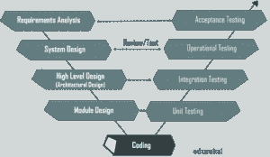
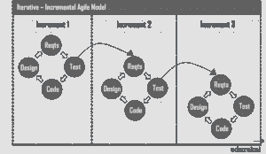
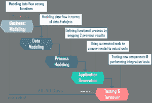
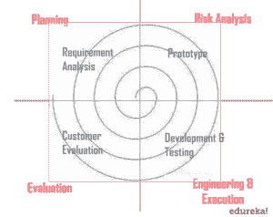
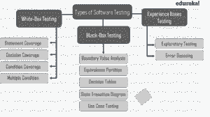
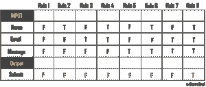
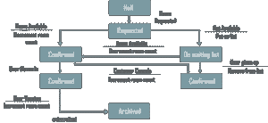

# 你需要知道的关于软件测试方法和技术的一切

> 原文：<https://www.edureka.co/blog/software-testing-methodologies-and-techniques/>

历史上充满了软件缺陷造成数十亿美元的浪费，有时甚至导致人员伤亡的例子。为了确保发布的软件是安全的，并且功能如预期，引入了 [**软件测试**](https://www.edureka.co/software-testing-fundamentals-training) 的概念。作为软件开发周期的一个阶段，软件测试基于特定的方法。在本文中，您将了解软件开发组织使用的各种不同的软件测试方法和技术。

下面列出了我们将在本文中讨论的主题:

*   [软件测试方法论](#SoftwareTestingMethodologies)
    *   [测试方法的重要性](#Benefits)
    *   [顶级测试方法](#SoftwareTestingMethodologyTypes)
*   [软件测试技术](#SoftwareTestingTechniques)
    *   [黑盒测试技术](#BlackBoxTechniques)
    *   [白盒测试技术](#WhiteBoxTechniques)
    *   [基于经验的测试技术](#ExperienceBasedTechniques)

## **软件测试方法论**

*测试方法是策略、原则、想法、方法和概念的各种组合，可以帮助您确保特定的软件产品或应用程序没有错误、符合目的并且很好地符合用户需求。*

许多公司通俗地使用术语软件开发方法学&测试方法学。随着软件应用变得越来越复杂，拥有一个健壮的测试方法是很重要的。下面列出了使用测试方法的一些好处:

*   在单一集成环境中管理需求、[测试用例](https://www.edureka.co/blog/test-case-in-software-testing/)、bug、问题
*   在整个测试生命周期中提供全面的可追溯性
*   充当完整的测试解决方案，包括管理需求、测试用例设计、发布管理等
*   提供软件产品的完整画面和健康状态
*   通过许多自动化测试解决方案利用当前的技术投资

如今，有几十种高效的软件测试方法，每一种都有不同的逻辑、起点、执行持续时间和方法。作为这篇“软件测试方法和技术”文章的第一部分，让我们来看看更著名的软件测试方法。


## **瀑布模型**

瀑布模型是温斯顿·罗伊斯在 1970 年开发的最古老的模型之一。也称为线性顺序生命周期模型，传统的瀑布测试方法以一种顺序的方式表示多个阶段，并逐渐向下流动(就像瀑布一样)。这意味着只有在您成功地完成了前一个阶段之后，您才能进入下一个开发或测试阶段。一旦进入下一阶段，就没有回头路了。瀑布模型的主要阶段如下图所示。


**瀑布模型的优势:**

*   易于理解和使用
*   便于测试和分析
*   节省大量的时间和金钱
*   如果明确定义了所有需求，那么对小型项目很有好处
*   允许部门化和管理控制

**瀑布模型的缺点:**

*   风险和不确定性
*   缺乏对当前进度的了解
*   当需求不断变化时不适合
*   当产品处于测试阶段时，很难对其进行更改
*   最终产品仅在周期结束时可用
*   不适合大型复杂的项目

## **V-模型(验证和确认模型)**

V-Model 是瀑布模型的扩展，其中流程执行以 V 形的顺序方式进行。正如你在下图中看到的，在开发周期的每个阶段都有一个直接相关的测试阶段。根据这种测试方法，当需求准备好时，过程开始。然后，您可以执行静态测试、验证和评审，这有助于在最后阶段防止可能的缺陷。嗯，你可以说这个模型分为 3 个阶段:验证阶段、编码阶段和确认阶段。在下图中，左边是验证阶段，右边是确认阶段。



**V 型车的优势**

*   它简单易用
*   当需求被理解时，适用于小项目
*   由于阶段是按顺序执行的，因此避免了重叠
*   与瀑布模型相比，更具成本效益

**V 型车的缺点**

*   没有响应需求变化的内在能力
*   没有明确的解决方案可以消除软件缺陷
*   导致测试被挤在开发的最后
*   不适合大型复杂的项目

## **增量模式**

您可以将增量模型视为[软件测试](https://www.edureka.co/blog/software-testing-tutorial/)的多瀑布模型。整个增量过程被分成不同数量的循环。每个增量都为软件增加了额外的功能。增量包括三个周期:软件设计和开发、测试和实现。使用这个模型可以同时模拟开发不同的产品版本。例如，您可以在测试阶段拥有第一个版本，第二个版本在开发阶段，第三个版本在设计阶段。这一直持续到项目完成。


与其他模型相比，它的优势在于更灵活，更改需求的成本更低。此外，软件测试过程更有效，因为如果使用较小的迭代，测试和调试更容易。但缺点是，与瀑布模型相比，它的成本更高。

## **敏捷模式**

敏捷模型，一种迭代&增量方法的形式，将开发过程分成更小的部分、迭代和冲刺。因此，将会有小的软件增量版本，每一个都建立在以前的功能之上。这允许测试人员在整个过程中与项目团队的其他成员并行工作，并在缺陷和错误出现后立即修复它们。这种方法的主要目标是以最好的质量快速交付新的软件特性。它侧重于应对变化，而不是广泛的规划。近年来，敏捷测试已经成为最流行和最常用的软件开发方法。大多数组织在软件开发项目中使用敏捷技术。



**敏捷模式的优势**

*   对需求变化做出积极响应的适应性方法
*   在开发过程的早期修复错误使这个过程更具成本效益
*   提高产品质量，使其高度无缺陷
*   允许参与软件项目的人员之间直接交流
*   非常适合大型和长期项目
*   最小的资源需求&非常易于管理

**敏捷模式的缺点**

*   高度依赖明确的客户需求
*   难以预测大型项目的时间和精力
*   不适合复杂的项目
*   缺乏文档效率
*   可维护性风险增加

## **RAD 模型(快速应用开发测试模型)**

快速应用程序开发(RAD)模型也是一种增量模型，其中组件是并行开发的。使用 RAD，重点主要是构建一个原型，它的外观和行为都像是满足用户需求的最终产品。在这种方法中，原型是通过组装并行开发的软件产品的不同组件来创建的。该原型随后用于收集客户的反馈。



**RAD 模型的阶段:**

*   业务建模:识别各种业务渠道之间的重要信息流
*   数据建模:前一阶段收集的信息用于定义数据对象
*   过程建模:数据对象然后被转换以获得业务目标
*   应用程序生成:各种自动化工具用于处理模型到代码
*   测试和移交:测试新组件和所有连接接口

**RAD 模型的优点**

*   减少开发/测试周期时间
*   时间盒方法降低了成本和风险
*   由于客户在整个周期中的参与，增强了客户反馈

**RAD 模型的缺点**

*   需要高技能的资源
*   高成本估算
*   需要一个可以模块化的系统
*   难以与传统系统一起使用

## **螺旋模型**

螺旋模型结合了迭代开发方法和瀑布模型的系统方法。它有四个阶段:计划、风险分析、工程和评估。第一个循环完成后，第二个循环开始。第二个循环完成后，下一个循环开始。这样，产品在迭代中反复经历这些阶段(在这个模型中称为螺旋)。每个后续螺旋都建立在基线螺旋的基础上。这里要注意的主要一点是，风险分析阶段非常重要。



**螺旋模型的优点**

*   由于大量的风险分析，降低了风险
*   非常适合大型任务关键型项目
*   周期第三阶段的即时反馈确保了高质量的产品
*   以后可以很容易地适应需求变化
*   提供强大的文档控制
*   确保产品的快速开发

**螺旋模型的缺点**

*   昂贵的过程
*   不适合小型项目
*   高度依赖于风险分析阶段
*   需要大量的专业技术
*   涉及大量的中间阶段

这就把我们带到了“软件测试方法和技术”文章的第一部分——软件测试方法的结尾。这些模型中的每一个都采用不同的测试方法，以不同的方式和不同的阶段测试软件的质量和安全性。从中选择一个可能相当复杂，我希望你在这里学到的东西能帮助你做到这一点。

这就把我们带到了这篇“软件测试方法和技术”文章的下一个主题。

正如你们已经知道的，软件测试的主要目的是以更快的速度交付最佳质量的产品。为了帮助测试人员认识到这一点，有许多软件测试技术，每种技术都有其优点和缺点。但是，到底什么是软件测试技术呢？

## **软件测试技术**

测试技术是指通过比较实际结果和预期结果来测试被测软件的程序或方法。好的软件测试技术可以帮助测试人员设计测试用例，使得测试用例的最少步骤能够测试软件的最大功能。他们可以开发更智能的测试用例，减少测试用例中所需的步骤。在这篇“软件测试方法和技术”文章的剩余部分，我们将讨论一些最流行的技术，分成几类。



## **黑盒测试技术**

黑盒测试，也称为基于规范的测试，在不了解项目内部结构/设计的情况下分析软件/应用程序的功能。该方法的目的是检查整个系统的功能，以确保其正常工作并满足用户需求。有很多测试技术都属于黑盒测试。这篇“软件测试方法和技术”文章讨论了最流行的技术。

## **等价划分**

在等价划分中，系统或应用程序的输入值根据其在结果中的相似性被划分为不同的分区/组。因此，不用使用每一个输入值，您可以使用来自每个分区/组的值来执行测试用例，这些值涵盖了所有可能的场景。这样做，您可以很容易地识别有效和无效的等价类。这样你可以维护测试覆盖率，同时节省大量测试每个测试输入值的时间。由于这是一种黑盒测试技术，代码对测试人员来说是不可见的。这里有一个简单的例子来理解这个概念。

**测试场景:**假设您正在测试一个输入框，它接受从‘01 到 10 & 20 到 30’的数字。

没有必要为所有有效的输入数字编写数千个测试用例，并为无效数据编写其他测试用例。使用上面的等价划分方法，测试用例可以分成五组输入数据，称为类。每个测试用例将代表各自的类。这里可能的类别如下:

*   —至 0(无效)
*   1 到 10(有效)
*   11 至 19 岁(无效)
*   20 至 30(有效)
*   31 至—(无效)

您可以为每个类选择一个值，并将结果推广到该类的其余值。这样，您就不必测试所有的输入值。

## **边界值分析**

众所周知，在测试中，更多的错误发生在输入域的边界而不是中心。当我说边界时，它意味着系统行为通常改变的极限附近的值。在边界值分析技术中，测试用例被设计成包含边界值。如果输入在边界值内，则认为是“阳性测试”如果输入超出边界值，则认为是“阴性测试”它包括最大值、最小值、内边缘或外边缘、典型值或误差值。这里有一个例子:

**测试场景:**假设您正在测试一个接受从‘01 到 10’的数字的输入框。

使用边界值分析，我们可以定义三类测试用例:

*   测试数据正好作为输入的输入边界的测试用例:1 和 10(在这种情况下)
*   刚好在输入属性域极端边缘下方的值:0 和 9
*   值刚好高于输入属性域极限边的测试数据:2 和 11

所以边界值是 0，1，2 和 9，10，11。

## **基于决策表的技术**

决策表基本上是不同可能条件与测试动作的表格表示。你可以把条件看作输入，而行动可以看作输出。在这种技术中，我们处理输入值的不同组合。这有助于测试人员识别所有的输入值，如果他忽略了任何输入值的话。因此它也被称为因果表技术。这里有一个简单的例子。

**测试场景:**如果用户已经输入了所有必填字段，则应该启用一个提交按钮。这里的必填字段是姓名、电子邮件和消息。



在上表中，您可以看到每个字段的“T”或“F”。只有当所有字段都有一个“T”时，即只有当输入了有效的名称、有效的电子邮件和有效的消息时，提交才会被启用。

## **状态转换图**

在这种方法中，测试人员分析一个应用程序在不同输入条件下的行为。您可以提供正值和负值来检查应用程序如何响应。当应用程序/系统对相同的输入给出不同的输出时，您可以应用这种技术，这取决于在早期状态下发生了什么。我们称这样的系统为有限状态系统。这里有一个例子。

测试场景:预订酒店房间。你登录酒店网站，预定房间。你的房间被预订了。之后就没有空房了。因此，如果你再次尝试预订，你会看到一条信息说“客房已售完”。S o 这里的跃迁，导致了状态的变化是你订票还是别人订票。看一看转换图，以便更好地理解。



状态转换测试技术是一种测试高度复杂应用的独特方法，它可以在不影响测试覆盖率的情况下提高测试执行效率。

## **用例测试**

首先，用例是用于定义所需用户交互的[工具](https://www.edureka.co/blog/software-testing-tools/)。这取决于“用户动作”和“系统对这些用户动作的响应”。他的技术是完全的功能测试技术，因为不需要编程技能。您可以遵循这三个简单的步骤来执行用例测试:

这里有一个用例图，展示了典型的 ATM 系统功能和您可以考虑的用例。


## **白盒测试**

白盒测试也称为基于结构的测试，与黑盒测试不同，这种方法需要对代码有深刻的了解，因为它包括对应用程序的一些结构部分的测试。主要目的是增强安全性，通过应用程序检查输入/输出流，并改进设计和可用性。白盒测试下有很多测试技术。我们来详细讨论一下每一个。

## **语句覆盖或行覆盖**

在这种技术中，源代码中的每条语句都至少执行一次。因此，代码的每一行都被测试，这有助于指出错误的代码。在流程图的情况下，每个节点至少要被遍历和测试一次。它基于这样的假设:代码覆盖得越多，功能测试就越好。然而，使用这种技术，我们无法测试源代码中的错误条件。

```
INPUT A, B
C = A + B
IF C > 100
PRINT "Check Complete"

```

正如你所看到的，我们也没有测试当 c <100\. This was a simples sequential statement. A s 语句类型从简单的顺序语句发展到 if-then-else 和循环时会发生什么，实现语句覆盖所需的测试用例的数量增加了。

## **分支覆盖或决策覆盖**

在分支覆盖中，我们确保来自所有决策点的每个分支至少被遍历和测试一次。也就是说，程序或子程序的每个入口点至少被调用一次。每个分支决策应该是非真即假。使用分支覆盖，我们可以确保没有分支导致任何异常行为。让我们考虑一下之前的例子，除了我增加了几行代码。

```
INPUT A, B
C = A + B
IF C > 100
PRINT "Check Complete"
ELSE
PRINT "Its Pending"

```

因为仅仅使用语句覆盖我们不能覆盖整个伪代码，我们必须使用分支覆盖来确保最大的覆盖。所以，决策覆盖比语句覆盖更强大。

## **条件覆盖或谓词覆盖**

条件覆盖通常用于布尔表达式。该技术监控是否所有的布尔表达式都被覆盖并被评估为真或假。与线路覆盖相比，更强的标准。让我们考虑一个简单的例子来理解这个概念。

```
READ X, Y
IF(X == 0 || Y == 0)
PRINT '0'

```

如你所见，我们有两个条件，X == 0 和 Y == 0。为了检查这些条件是真还是假，我们可以使用如下所示的两个测试用例

```
#TestCase1: X = 0, Y = 55
#TestCase2: X = 55, Y = 0

```

这是一个可能的例子。在第一个测试案例中，第一个条件为真，第二个条件为假。在第二个测试案例中，第一个条件为假，第二个条件为真。

## **多条件覆盖**

这里，条件的可能结果的所有可能组合至少被测试一次。让我们考虑一下我们为条件测试所做的例子。我们将不得不在这里编写四个测试用例，而不是仅仅两个测试用例。

```
READ X, Y
IF(X == 0 || Y == 0)
PRINT '0'

```

测试案例:

```

#TestCase1: X = 0, Y = 0
#TestCase2: X = 0, Y = 5
#TestCase3: X = 55, Y = 0
#TestCase4: X = 55, Y = 5

```

正如你所看到的，两个单独的条件需要四个测试用例。类似地，如果有 n 个条件，那么将需要 2 个 <sup>n 个</sup>测试用例。

## **基于经验的测试**

基于经验的技术依赖于设计测试用例及测试条件的经验。它们基于一个人在测试领域的经验、背景和技能。在这里，测试人员利用适当的策略和文档计划以及获得的经验。让我们讨论基于经验的测试中的测试技术。

## **探索性测试**

这种测试技术是关于发现、调查和学习的。在这里，测试人员不断地研究和分析产品，并相应地应用他的技能、特点和经验来开发测试策略和测试用例，以执行必要的测试。当测试团队没有足够数量的规范、需求和非常有限的时间时，这是一个非常合适的技术。

## **错误猜测**

这是一种猜测和检测软件产品中可能出现的潜在缺陷、bug 和错误的简单技术。在错误猜测中，没有规则。它利用测试人员的技能、直觉和经验来发现正式黑盒技术不能识别的缺陷。因此，这项技术完全依赖于测试人员的经验。测试人员越有经验，他能识别的错误就越多。另一种方法是定期创建缺陷和失败列表。

对于所有的软件项目来说，没有一种合适的方法或技术。选择取决于许多方面，如项目类型、客户需求、项目进度等。希望你在这篇“软件测试方法和技术”文章中学到的东西能帮助你踏上软件测试之旅。

*如果您发现了这篇“软件测试方法和技术”* *相关文章，* *请查看 Edureka 的*在线直播 **[Selenium 认证培训](https://www.edureka.co/selenium-certification-training)*****，edu reka 是一家值得信赖的在线学习公司，在全球拥有超过 250，000 名满意的学习者。*

*有问题吗？请在这篇“*软件测试方法和技术*”文章的评论部分提到它，我们会给你回复。*