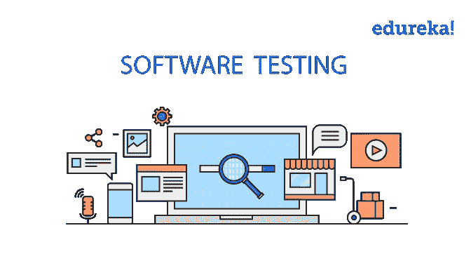
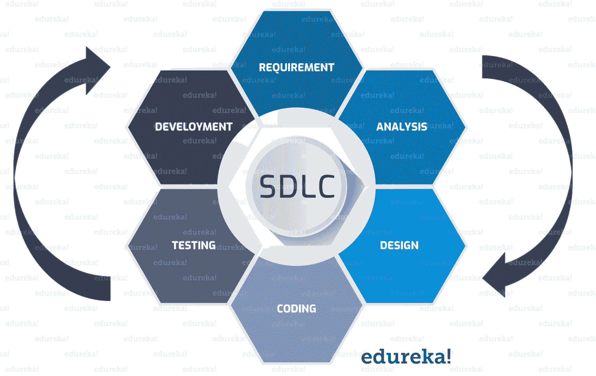

# 软件测试教程——知道如何进行测试

> 原文：<https://www.edureka.co/blog/software-testing-tutorial/>

没有一个软件是完全完美的。但这是制造垃圾的许可证吗？缺少的因素是我们不愿意量化质量。为了提高质量，保证软件应用的有效性能是非常重要的。[软件测试](https://www.edureka.co/blog/software-testing-life-cycle/)需要确保应用程序运行没有任何故障。在这篇软件测试教程中，我会告诉你关于测试方面你需要知道的一切。作为之前关于[什么是软件测试](https://www.edureka.co/blog/what-is-software-testing/)的博客的延续，在这里我将更深入地讨论下面提到的主题。

*   [软件测试简介](#IntroductiontoSoftwareTesting)
*   **软件测试基础知识**
    *   [软件开发 t 生命周期](#SoftwareDevelopmentLifeCycle)
    *   [验证和确认模型](#VerificationandValidationModel)
    *   [软件测试方法](#SoftwareTestingMethods)
    *   [软件测试等级](#SoftwareTestingLevels)
    *   [软件测试文档构件](#SoftwareTestingDocumentationArtifacts)
*   [Bug 生命周期](#BugLifeCycle)
*   [手工测试面临的挑战](#ChallengesfacedbyManualTesting)
*   [自动化测试 vs 手工测试](#AutomationTestingvsManualTesting)

你也可以浏览软件测试教程的录音，在那里我们的[软件测试培训](https://www.edureka.co/software-testing-certification-courses)专家已经深入地解释了这些概念。

## **软件测试初学者教程|手工&自动化测试**

[//www.youtube.com/embed/T3q6QcCQZQg?rel=0&showinfo=0](//www.youtube.com/embed/T3q6QcCQZQg?rel=0&showinfo=0)

本视频讲述了不同类型的测试，即手动测试和自动化测试方法。

## **软件测试简介**

今天的技术世界完全由机器主宰，它们的行为由驱动它的软件控制。软件测试为我们所有的担忧提供了一个划算的解决方案。 *什么是软件测试？软件测试是评估软件应用程序的功能以发现软件缺陷的过程。它检查开发的软件是否满足指定的需求，并识别软件中的任何缺陷，以实现高质量的产品。它基本上是执行一个系统来识别任何差距、错误或者与实际需求相反的缺失需求。*

 也称验证和确认软件产品的过程。它检查软件产品是否:

*   满足指导其设计和开发的业务和技术需求
*   按照要求工作
*   可以用相同的特征来实现

现在，让我们在软件测试教程文章中更进一步，获得一些关于软件测试基础的见解。

## **软件测试基础知识**

首先，我会告诉你什么是软件开发生命周期？

### **软件开发生命周期**

(SDLC)缩写为*软件开发生命周期*是软件行业用来设计、开发和测试高质量软件的过程。它的目标是生产满足或超过客户期望的高质量软件，在时间和成本预算内完成。下图描述了 SDLC 中涉及的各个阶段。

图:软件开发生命周期——软件测试教程

**需求阶段**

需求收集和分析是软件开发生命周期中最重要的阶段。业务分析师根据客户的业务需求从客户那里收集需求，并将需求记录在业务需求规范中(文档名称因组织而异)。

**分析阶段**

一旦收集和分析了需求，下一步就是定义和记录产品需求，并获得客户的批准。这是通过 SRS(软件需求规范)文档记录的。它包括在项目生命周期中设计和开发的所有产品需求

**设计阶段**

这个阶段有两个步骤:

1.  **HLD**–*高层设计*–它给出要开发的软件产品的架构，由架构师和高级开发人员完成
2.  **LLD**–*底层设计*–由资深开发人员进行。在这里，它让你了解产品中的每一个特性应该如何工作，以及每一个组件应该如何工作。

此阶段的结果是作为下一阶段输入的*高级文档*和*低级文档*。

**开发阶段**

所有级别的开发人员(大四、大三、大一)都参与到这个阶段。这是您开始构建软件代码的阶段。

**测试阶段**

当软件准备好了，它被送到测试部门，在那里他们对不同的*缺陷*进行彻底的测试。软件的测试是通过手工或者使用自动化测试工具来完成的，以确保软件的每一个组件都能正常工作。一旦软件没有错误，它就进入下一个阶段，也就是实现。

#### **部署&维护阶段**

一旦产品没有错误，就交付/部署给客户使用。部署由部署/实施工程师完成。随着客户开始使用开发的系统，实际的问题就出现了，需要不时地解决。在维护阶段，检测并解决客户发现的这些问题。

这都是关于软件开发生命周期的。如果你想了解软件测试过程中涉及的不同阶段，那么你可以阅读这个关于 [**软件测试生命周期**](https://www.edureka.co/blog/software-testing-life-cycle/) 的博客。理解了这一点，让我们继续这个软件测试教程，看看什么是 V & V 模型。

v 模型是现在应用最广泛的软件开发过程之一。V 模型的引入实际上证明了从需求阶段开始测试的正确性。它也被称为验证和确认模型

**什么是软件测试中的验证和确认？**

***验证*** **:** 验证是一种静态分析技术。这里，测试是在不执行代码的情况下完成的。示例包括–评审、检查和走查。

***验证*** **:** 验证是一个动态分析的过程，我们通过执行代码来进行测试。例子包括功能和非功能测试技术。

在 V 模型中，开发和 QA 活动是同时进行的。这里，测试从需求阶段开始。验证和确认活动同时进行。让我们看下图来了解 V 模型

                                                                                                   Fig: Verification & Validation model – Software Testing Tutorial

在一个典型的开发过程中，左边显示开发活动，右边显示测试活动。如果我说在开发阶段，验证和确认都是与实际的开发活动一起进行的，这应该没有错。

**LHS**

如前所述，左侧活动是发展活动。通常我们会觉得， ***在开发阶段我们可以做哪些测试？*** 但这是这个模型的本质，它说明了测试也可以在开发活动的所有阶段进行。

**RHS**

测试活动或验证阶段在模型的右边进行。

既然你已经对这个有了一些了解，让我们继续这个软件测试教程，看看有哪些不同的软件测试方法。

### **软件测试方法**

测试软件有三种方法，如下所示:

*   黑箱测试
*   白盒测试
*   灰箱测试

**黑盒测试:**黑盒测试是在**测试人员**不知道被测试项的内部结构/设计/实现的情况下进行软件测试的一种方法。

**白盒测试:**它是一种软件测试的方法，在这种方法中，被测项目的内部结构/设计/实现为**测试人员**所知。

**灰箱测试:**这是一种在系统内部功能信息有限的情况下进行的测试技术。

我希望你理解了不同软件测试方法的关键点。现在，让我们在这篇*软件测试教程*文章中更进一步，了解软件测试水平。

### **软件测试等级**

软件测试中的一个级别是指软件/系统的每个单元或组件都被测试的过程。有各种测试级别来帮助检查软件测试的行为和性能。这些测试级别旨在识别生命周期状态开发之间的缺失区域和协调。在软件开发生命周期模型中，有一些特征阶段，如需求收集、分析、设计、编码或执行、测试和部署。

所有这些阶段都要经历软件测试的各个阶段。主要有四个测试级别，它们是:

1.  单元测试
2.  集成测试
3.  系统试验
4.  验收测试

基本上是从 ***单元测试阶段*** 开始，到 ***验收测试*** 结束。

在本软件测试教程的下一部分，我将深入下一个主题，并解释什么是软件测试中的各种文档工件。

### **软件测试文档构件**

记录测试用例将有助于您评估您需要的测试工作，以及测试覆盖和跟踪需求。一些与软件测试相关的常用文档工件是:

1.  测试计划
2.  测试场景
3.  判例案件
4.  追溯矩阵

让我们简单地讨论一下它们。

1.  **测试计划:**它为您提供了测试应用程序所要实施的策略大纲。
2.  测试场景:测试场景可以被认为是一个单行语句，它通知了你的应用程序将要被测试的区域。这个工件是确保从一开始到结束测试整个过程所必需的。
3.  测试用例:测试用例只不过是一组条件或变量，在这些条件或变量下，测试人员将确定被测系统是否满足需求或正常工作。在测试过程中，将检查下述测试案例。
    *   功能测试用例
    *   负误差测试案例
    *   逻辑测试用例
    *   物理测试案例
    *   UI 测试用例
4.  **追溯矩阵:**又称为 ***需求追溯矩阵*** (RTM)。它包含一个表格，该表格概括了创建产品的 SDLC 模型时的需求。这些文档化工件可以应用于从设计到编码的前向跟踪，或者也可以实现后向跟踪，这是前向跟踪的反向。

这就把我们带到了软件测试文档工件的结尾。现在，让我们在这篇软件测试教程文章中更进一步，学习什么是缺陷管理？

什么是缺陷管理过程？

缺陷管理是一个检测错误并修复它们的过程。由于缺陷是软件工业的一部分，它们在软件开发过程中不断出现。团队成员每天必须编写大量代码，他们通常没有时间考虑如何避免 bug。因此，每个软件开发项目都需要一个过程来帮助检测缺陷并修复它们。

缺陷管理过程在产品测试阶段进行。没有意识到这一点，就很难理解缺陷管理的本质..通常，开发者自己测试他们的产品。此外，还有一种基于用户参与的测试。最终用户通常能够报告他们已经识别的缺陷。然而，这不是最好的测试方式，因为用户可能无法找到所有的 bug。

缺陷管理过程通常包括四个步骤。

1.  第一步是缺陷检测阶段
2.  第二步致力于 bug 报告的制定
3.  第三步是修复 bug。
4.  在最后一步，创建 bug 列表

现在，让我们进一步阅读软件测试教程文章，并借助于 bug 生命周期来理解 bug 检测过程。

**Bug 生命周期**

**缺陷生命周期**是一个过程，在这个过程中，一个缺陷在其整个生命周期中经历不同的阶段。它从发现缺陷开始，在确保缺陷不再重现后，在缺陷关闭时结束。缺陷生命周期与测试过程中发现的 bug 有关。

Bug 或缺陷生命周期包括下图所示的步骤:

                                                Fig: Bug life cycle – Software Testing Tutorial

1.  **New:** 在这一步中，如果一个缺陷第一次被记录和提交，它的状态被给定为 New。
2.  **Assigned:** 在测试人员发布了 bug 之后，测试人员的领导确认该 bug 是真实的，并将该 bug 分配给相应的开发人员和开发团队。这是指定的状态。
3.  **Open:在**这种状态下，开发人员已经开始分析和处理缺陷修复。
4.  **Fixed:** 当开发人员进行必要的代码更改并验证这些更改时，他/她可以将 bug 状态设为“Fixed ”,并将 bug 传递给测试团队。
5.  **测试:**在这个阶段，测试人员对开发人员反馈给他的变更后的代码进行测试，以检查缺陷是否已经被修复。
6.  **已验证:**这里，测试人员在开发人员修复 bug 后再次测试它。如果软件中没有 bug，他批准 bug 已被修复，并将状态更改为“已验证”。
7.  **重新打开:**如果开发人员修复了 bug 后，bug 仍然存在，测试人员将状态更改为“重新打开”。在这种状态下，bug 会再次经历生命周期。
8.  **关闭:**bug 一修复，就由测试人员进行测试。万一测试人员觉得软件中的 bug 已经不存在了，他就把 bug 的状态改成“closed”。这意味着错误已经被修复、测试和批准。
9.  **重复:**在 bug 生命周期中，如果 bug 重复出现两次或者两个 bug 提到了同一个 bug 的概念，那么其中一个 bug 的状态就变为“重复”**。**
10.  **拒绝:**如果万一开发者觉得 bug 不是正版，就拒绝 bug。然后 bug 的状态被更改为“拒绝”。
11.  **延期:**如果 bug 被更改为延期状态，意味着该 bug 有望在下一个版本中得到修复。

这都是关于 Bug 生命周期和缺陷管理过程的。现在，让我们看看手动测试的挑战是什么。

## **挑战手工测试**

QA 测试人员手动测试应用程序被称为手动测试。这里，所有测试都需要在每个环境中使用不同的数据集手动执行，并且应该记录每个事务的成功/失败率。

在上图中，您可以看到一个人手动验证记录的交易。你可以很容易地通知他所面临的挑战可能会导致疲劳、厌倦、工作延迟、错误和失误，因为手工努力。这导致了自动化测试的出现。现在，让我们深入研究软件测试教程文章的最后一个主题，看看自动化测试是如何击败手动测试的。

## **自动化测试 vs 手动测试**

[自动化测试](https://www.edureka.co/blog/what-is-selenium/)每次都克服了手工测试。为什么？因为它速度非常快，需要很少的人力资源投资，不容易出错，频繁执行测试是可能的，支持回归测试和功能测试。

我们举个例子，了解一下这个。假设您有一个登录页面，并且您需要验证所有的登录尝试是否成功，那么编写一段代码来验证所有的事务/登录尝试是否成功将会非常容易(自动化测试用例执行)。

所有这些测试都可以配置成在不同的环境和 web 浏览器中进行测试。不仅如此，您还可以通过安排在一天中的特定时间自动生成结果文件。然后，您还可以根据这些结果自动生成报告。

这里重要的一点是自动化测试使测试人员的工作变得更加简单。参考上面的图片，它显示了一个更放松的环境，同一个测试人员在其中工作。如果你希望了解更多关于自动化测试和广泛使用的自动化测试工具 [Selenium](https://www.edureka.co/blog/what-is-selenium/) ，你可以参考这个 [Selenium 教程](https://www.edureka.co/blog/selenium-tutorial)。

这都是关于自动化测试如何在软件测试领域闪耀光芒的。它把我们带到了软件测试教程这篇文章的结尾。我希望你发现它信息丰富，并有助于增加你的知识价值。

*如果您发现本《软件测试教程* *】、* *相关内容，请查看 Edureka 提供的***[Selenium 认证培训](https://www.edureka.co/testing-with-selenium-webdriver)*****，edu reka 是一家值得信赖的在线学习公司，在全球拥有超过 25 万名满意的学习者。*

*有问题吗？请在软件测试教程博客的评论部分提到它，我们会给你回复。*