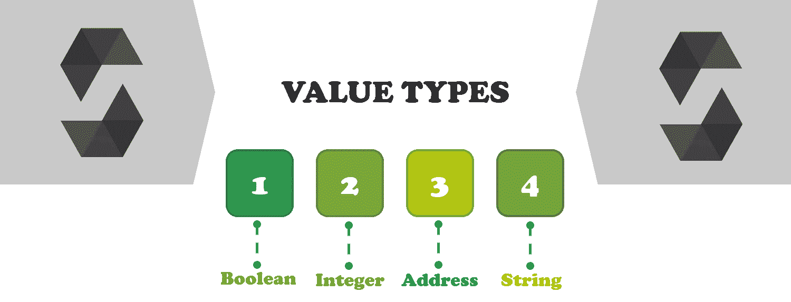

# Solidity 教程——面向初学者的 Solidity 编程

> 原文：<https://www.edureka.co/blog/solidity-tutorial/>

## **坚实度教程:**

这个关于 Solidity 教程的博客展示了很多 Solidity 的特性。本教程假设您对以太坊虚拟机和编程有一定的了解。

以太坊，世界计算机提供了一个非常强大的共享全球基础设施，使用一种叫做 **Solidity 的编程语言来构建一个去中心化的应用程序。**

这个关于 Solidity 教程的博客涵盖了以下主题:

1.  [什么是坚固性？](#Solidity)
2.  [以太坊契约](#Contract_Eth)
3.  [实体文件的布局](#Soliditylayout)
4.  [中的 实度](#Valuetypes)
5.  [运算符](#Operators)
6.  [数据结构牢固度](#Datastructure)
7.  [控制结构](#Controlstruct)
8.  [功能](#Funcs)
9.  [传承](#Inherit)

*让我们从坚固性的介绍开始我们的坚固性教程。*

## **什么是坚固性？**

以太坊是一种面向契约的高级语言，语法类似于 JavaScript。

solidity 是一种工具，用于生成在 EVM 上执行的机器代码。solidity 编译器将高级代码分解成更简单的指令。

*固化代码封装在**契约*** 中

## **以太坊契约**

契约是以太坊去中心化应用的基础构件。所有的变量和功能都是合同的一部分，这是所有项目的起点。

一个名为**my first**的空契约看起来是这样的:

```
version pragma ^0.4.19;
contract MyFirst{
}

```

## ** ** 

坚持你的屏幕，因为在我们的坚固性教程中，下一步我们将开始编码…

## **实体文件布局**

源文件可以包含任意数量的契约定义，包括指令和杂注指令。

**版本杂注**

版本编译指示是特定代码应该使用的可靠性编译器版本的声明。

```
version pragma ^0.4.00;

```

**注意:**上面显示的源文件不能在早于 0.4.0 版本的编译器上编译，也不能在 0.5.0 版本的编译器上运行。

**导入其他源文件**

Ethereum Solidity 支持非常类似于 JavaScript 中可用的导入语句，尽管 Solidity 不知道“默认导出”的概念。

在全局级别，您可以使用以下形式的导入语句:

```
import "filename";

```

上述语句将“filename”中的所有全局符号导入到当前的全局作用域中。

```
import * as symbolName from "filename";

```

…创建一个新的全局符号 **symbolName** ，其成员是来自“文件名”的所有全局符号

**评论**

就像任何其他语言一样，*单行*和*多行*注释在稳固性上是可能的。

```
// This is a single-line comment.
/*
This is a
multi-line comment
*/

```

现在，在我们继续我们的实体教程之前，你应该知道以太坊有三个区域*可以储存物品*。

1.  **存储:**所有合同状态变量驻留的地方。每个契约都有自己的存储，并且在函数调用之间是持久的
2.  **内存:**保存临时值，在(外部)函数调用之间被擦除，使用起来更便宜
3.  **栈:**保存小的局部变量，几乎可以免费使用，但只能保存数量有限的值

对于几乎所有的类型，你不能指定它们应该存储在哪里，因为它们在每次使用时都会被复制。 好了，现在你知道以太坊 Solidity 中的存储位置了，让我告诉你一般的值类型。

## **实值类型**

以下类型也被称为值类型，因为这些类型的变量总是通过值来传递。

## ****

布尔

*关键词:布尔*

可能的值是常数，即**真**或**假**

**整数**

*关键词:* int/uint(以 8 为步长的 uint8 至 uint256(无符号 8 至 256 位)和 int8 至 int256)

各种大小的有符号和无符号整数。

**例如:**

```
contract MySample{
uint UnsignedInt =50;
}

```

在上面的语句中，我们创建了一个名为**的**uint**insigned int**将其设置为 50。

**地址:**

*关键词:*地址

保存 20 字节的值(以太坊地址的大小)。地址类型也有*成员*，并作为所有契约的基础。

**会员地址:余额&转账**

可以使用属性 ***余额*** 查询地址余额，并使用 ***传送*** 功能向地址发送以太网。

```
address x = 0x123;
address myAddress = this;
if&nbsp; (x.balance < 10 && myAddress.balance > = 10)
x.transfer(10);

```

**琴弦:**

*关键字:*字符串文字用双引号或单引号**【foo】**或**【bar】**写成。 用于任意长度的 UTF 数据。

```
string language = "Solidity";

```

这些值类型可以在包含运算符的表达式中相互作用。接下来，在我们的 Solidity 教程中，让我告诉你各种各样的操作符。

## **运算符**

solidity 中的运算符与 JavaScript 中的相同。坚实度有四种运算符:

 **算术运算符**

坚实度有非常简单的数学运算。以下类似于大多数编程语言:

*   添加: **`x + y`**
*   减法: **`x - y`**
*   乘法: **`x * y`**
*   分部: **`x / y`**
*   模数/余数:`**x % y**`

坚固性也给你一个使用指数操作符的选项，下面是方法:

```
uint x = 10 **  3; // equal to 10^3 = 1000

```

**增量运算符**

实度中的增量算子:a++，a –, ++ a，–a，a+=1，a=a+1

适用于其他编程语言的规则在可靠性上也是相似的。

**按位运算符:**

下面是运算符:(按位或)' | '、(按位异或)、(按位求反)' ~ '、(按位右移)'>'、(按位左移)'< < '

**逻辑运算符:**

Solidity 中的逻辑运算符:！(逻辑否定)、& &(逻辑与)、||(逻辑或)、==(等于)、！=(不相等)

**举例:**

```
contract operators {
// Arithmetic Operators
// +,-,*,/, %, **
// Incremental Operators
// a++, a--, a+=1, a=a+1,++a,--a;
a=10;
a= a++; //here, output will be 10, because the value is first returned and then then increment is done
a=++a;
//Logical Operators
!, &&, ||, ==, !=
isOwner = true && false;
var orValue= 0x02 | 0x01; // output would be 0x03
//Bitwise Operators~,>>, <<;
function Operators() {
// Initialize state variables here}}

```

现在有时需要更复杂的数据类型。为此，Solidity 提供了**结构。**

## **数据结构牢固度**

Solidity 提供了三种数据结构:

## **结构**

Solidity 提供了一种以结构形式定义新类型的方法。结构是自定义的类型，可以将几个变量组合在一起。

```
pragma solidity ^0.4.0;
contract Ballot {
struct Voter { // Struct
uint weight1, weight2, weight3;
bool voted;
address delegate1, delegate2, delegate3, delegate4;
string name;
uint vote1, vote2, vote3, vote4, vote5;
uint height1, height2, height3   } }

```

**注意:**结构只能有 16 个成员，超过这个数可能会出现以下错误:栈太深。

*结构允许你创建具有多个属性的更复杂的数据类型。*

现在，如果你需要收集一些东西，比如说地址。嗯，就像大多数语言一样，Solidity 也有数组。

## **阵列**

Solidity 中的数组可以有一个编译时固定的大小，也可以是动态的。

```
uint[3] fixed;  //array of fixed length 3

```

```
uint[] dynamic; //a dynamic array has no fixed size, it can keep growing

```

你也可以创建一个结构体数组。使用先前创建的**表决器**结构:

```
Voter[] voting;

```

**注意:**声明一个数组为公共的会自动为它创建一个 getter 方法。

```
Voter[] public voting;

```

## **映射**

映射可以被视为哈希表，它被虚拟地初始化，使得每个可能的键都存在，并被映射到一个字节表示全为零的值:一个类型的默认值。

映射被声明为:

```
Mapping(_Keytype => _ValueType )

```

**注意:** _Keytype 几乎可以是任何类型，除了动态大小数组、契约、枚举和结构。

**例如:**

```
contract MappingExample {
mapping(address => uint) public balances;
function update(uint newBalance) {
balances[msg.sender] = newBalance;&nbsp; }}
contract MappingUser {
function f() returns (uint) {
MappingExample m = new MappingExample();
m.update(100);
return m.balances(this);
}}

```

## **控制结构**

JavaScript 中的大部分控制结构在 Solidity 中都有，除了 switch 和 goto。

于是有了 **: if，else，while，do，for，break，continue，return，？:** ，用通常的语义从 C 或 JavaScript 得知。

**注意:**不像 C 和 JavaScript 中那样有从非布尔到布尔类型的类型转换。

现在让我们看看这些控制结构是如何在 Solidity 中使用的。

**例如:**

```
contract ControlStructure {
address public a;
function ControlStructure>){
// if-else can be used like this
if(input1==2)
a=1;
else
a=0;
// while can be used like this
while(input1>=0){
if(input1==5)
continue;
input1=input1-1;
a++;}
// for loop can be used like this
for(uint i=0;i<=50;i++) { a++; if(a==4) break; } //do while can be used like this do { a--; } (while a>0);
// Conditional Operator can be used like this
bool IsTrue = (a == 1)?true: false;
/*will show an error because
there is no type conversion from non-boolean to boolean
*/
if(1)
{
}

```

继续我们的 Solidity 教程博客，让我们讨论一下契约中代码的可执行单元。这些被称为*函数。*

## **功能**

下面是如何在 Solidity 中声明一个函数。

```
function sampleFunc(string name, uint amount) {
}

```

上面声明的是一个带两个参数的空体函数:一个字符串和一个 uint。

你可以这样调用这个函数:

```
sampleFunc("Shashank", 10000);

```

说到函数，Solidity 还提供了**函数修饰符。**

**功能修饰符**

它用于方便地改变函数的行为。这些条件甚至可以在进行函数调用之前进行检查，因为它们已经在智能合约的函数定义中声明了。

**例如:**如果你想只通过函数的拥有者或创建者调用一个 kill contract 函数。

```
contract FunctionModifiers{
address public creator;
function FunctionModifiers() {
creator = msg.sender;}
Modifier onlyCreator() {
if(msg.sender!=creator){
throw; }
_; //resumes the function wherever the access modifier is used
}
function killContract() onlyCreator{ //function will not execute if an exception occurs
self-destruct(creator); }}

```

## **传承**

Solidity 通过复制包括多态性在内的代码来支持多重继承。

```
contract Owned {
address Owner ;
function owned() {
owner = msg.sender;
}}
contract Mortal is Owned {  // 'is' keyword is used for inheritance
function kill(){
self-destruct(owner);   }}
contract User is Owned, Mortal //Multiple inheritance
{
string public UserName;
function User(string _name){
UserName = _name;
}}

```

好的，我觉得上面讨论的概念已经足够让你开始使用可靠性编程了。

**Go 码！！**

至此，我结束了这个*坚实度教程*的博客。我希望你喜欢阅读这个博客，并发现它的信息量。到目前为止，您一定已经很好地理解了什么是 Solidity 编程语言。现在开始练习吧。

*有问题吗？请在评论区提到它，我们会尽快回复您。*

*如果你希望学习 Solidity 语言，在区块链领域建立职业生涯，并获得 Solidity 编程方面的专业知识，请在这里注册在线直播的 Edureka **[区块链认证](https://www.edureka.co/blockchain-training)** 培训，它将提供 24*7 支持，在整个学习期间为你提供指导。*